# 强化学习的终极初学者指南

> 原文：<https://towardsdatascience.com/the-ultimate-beginners-guide-to-reinforcement-learning-588c071af1ec?source=collection_archive---------7----------------------->

# **动机和背景**

关于机器学习，我最喜欢的一句话来自现任谷歌人工智能主管彼得·诺维格:“我们没有更好的算法，我们只是有更多的数据。”今天，人工智能真的是新的电力，并照亮了工业界和学术界的新发现。

今天人工智能的一个主要领域是强化学习，它正在开辟新的领域。与经典机器学习中向更高级逻辑(模糊逻辑)和更具适应性的算法发展的问题类似，强化学习是一个术语，用于表示一组算法，这些算法具有根据其本地环境做出高度智能决策的潜在能力。强化学习(RL)是机器学习的一个不断发展的子集，它涉及试图采取行动或行动的软件代理，希望最大化一些优先奖励。换句话说，这是一个代理和它的环境之间的迭代反馈回路。与传统的 ML 相比，RL 算法(如蒙特卡罗方法、SARSA 和 Q 学习)在行为上比传统的机器学习更加动态。

我们将首先检查特定的强化学习算法，并讨论它们与监督学习的行为比较。我们还将使用横竿问题作为演示 RL 实际操作的物理示例！本指南将涵盖 Q 学习、DQNs(深度 Q 网络)、MDPs、价值和政策迭代、蒙特卡罗方法、SARSA 和 DDGP。

# **什么是强化学习？**

强化学习(RL)是机器学习的一个不断发展的子集，它涉及试图采取行动或行动的软件代理，希望最大化一些优先奖励。有几种不同形式的反馈可以控制 RL 系统的方法。与将函数从输入映射到输出的监督学习算法相比，RL 算法通常不涉及目标输出(仅给出输入)。基本 RL 算法有 3 个元素:主体(可以选择在其当前状态下提交动作)、环境(响应动作并向主体提供新的输入)和回报(由环境返回的激励或累积机制)。RL 算法的基本模式如下所示:

一个 RL 算法的流程图(来源:【https://i.stack.imgur.com/eoeSq.png】T4)

大多数 RL 算法的广泛目标是在探索(对新数据点的训练)和利用(使用先前捕获的数据)之间实现平衡。直接的目标是通过在上述开发和探索之间交替进行试验来最大化回报。值得注意的是，RL 实现有三种类型:基于策略的、基于值的和基于模型的。基于政策的 RL 包括提出一个政策或确定性/随机策略，以最大化累积回报。基于值的 RL 试图最大化任意值函数 *V(s)* 。基于模型的 RL 基于为特定环境创建虚拟模型，并且代理学习在环境的约束内执行。

# **定义**

(注:本部分鸣谢黄公祥(Steeve)。以下是他的原创[文章](/introduction-to-various-reinforcement-learning-algorithms-i-q-learning-sarsa-dqn-ddpg-72a5e0cb6287)

1.  动作(A):代理可以采取的所有可能的动作
2.  状态:环境返回的当前情况。
3.  奖励(R):从环境中发送回来的对上次行为进行评估的即时回报。
4.  策略(π):代理用来根据当前状态确定下一步行动的策略。
5.  Value (V):贴现的预期长期回报，相对于短期回报 R. *Vπ(s)* 定义为当前状态 sunder policy 的预期长期回报π。
6.  Q-value 或 action-value (Q): Q-value 类似于 value，只是它需要一个额外的参数，即当前动作 *a* 。 *Qπ(s，a)* 指当前状态 *s* 的长期返回，在策略π下采取动作 *a* 。

# **侧翻问题**

小车极点问题是动力学和控制理论中的一个著名问题，摆的重心在支点上方。这自然会产生不稳定的系统，并且在没有施加任何摆动力或动态控制的情况下，钟摆通常会保持垂直向下。小车在其轴上有一个自由度，系统没有垂直运动。大多数横竿系统的目标是通过在枢轴点及其运动轴(水平方向)上施加各种力来有效地保持横竿平衡。

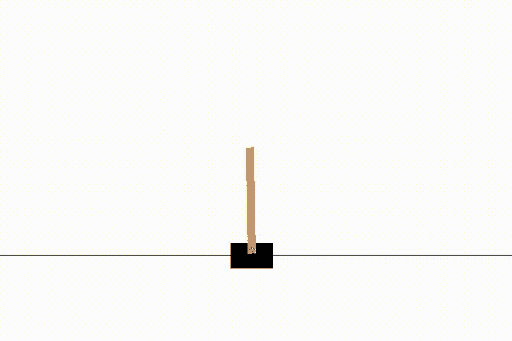

扁担被平衡的演示(来源:Mc。AI)

我们将研究横竿，并展示强化学习如何有效地平衡系统。

# **横拉杆系统的强化学习**

由于 RL 是一种学习形式，其特征在于对动作及其对环境的影响的尝试和错误响应，因此通过 RL 对 cartpole 系统进行建模是有意义的，因为 cartpole 系统在具有明确定义的主体-动作-环境-回报模式的同时，很容易受到各种参数变化的影响。代理是控制购物车移动的控制器或算法。这个动作是响应摆动阶段后的各种力和力矩的横撑的物理运动。环境是指与系统的受限区域相关的墨盒的物理设置。奖励是横翻筋斗在当前状态下实现持续平衡的能力。我们现在将识别横滚问题的具体动作和状态:

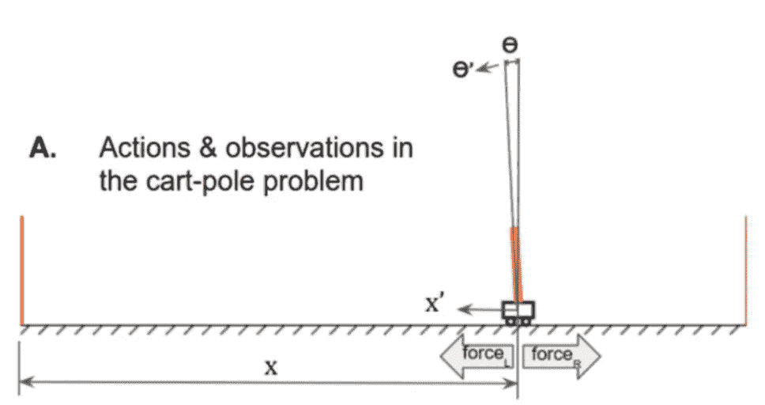

翻筋斗的动作和可能的状态(来源:LiveBook-Manning)

小车代理限于两种可能的行为:(1)在小车上施加一个向右的恒力。(2)在小车上施加一个向左的恒力。如图所示，这两个力指向水平方向。代理可能采取的这些行动将相应地改变购物车和环境的位置。小车的状态完全由小车的速度和位置、𝜃角和尖端的速度决定。所有这些参数早先都被确定为微分方程的基础，该微分方程解决了调节和控制小车系统所必需的特性。

每次控制器施加力时，控制器检查累积奖励是否达到或最大化。在小车问题中，杆相对于小车的角度和离中心的距离决定了所获得的价值/回报。如果横翻通常是直立的，并且靠近环境的中心，那么对于该序列给予奖励并且最大化。在奖励没有最大化的情况下，控制器对力和随后的位移进行必要的调整。同样重要的是要注意，有两个关键条件可能会终止或重新启动行动-环境-回报循环:

终止标准 1(资料来源:LiveBook-Manning)

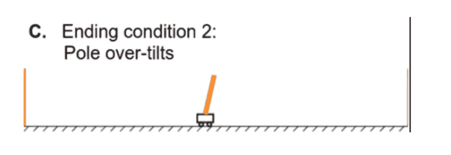

终止标准 2(资料来源:LiveBook-Manning)

在上述两个案例中，代理人的行为导致了在指定环境中没有实现报酬最大化的案例。(翻筋斗不是直立就是不在规定的范围内)这可以看作是对模特的“惩罚”。另一方面，每获得一次奖励，横翻的“分数”就增加 1。

既然我们已经讨论了横拉杆系统的物理特性、用于求解该系统的数学模型以及 RL 在横拉杆上的应用，我们可以分析两种算法，这两种算法可以实现横拉杆的有效控制和稳定性。

# **Q-学习翻筋斗问题**

根据侧翻问题的可能状态，我们知道如果我们做出正确的决定，侧翻将保持直立和平衡。因此，我们可以识别在弹弓系统中导致更高回报的动作-状态对。我们可以将每一对都建模为回报概率的函数:𝑅𝑒𝑤𝑎𝑟𝑑 = 𝑄(𝑠，𝑎).在这种情况下，奖励被称为一个*Q*-值。Q- Learning(一种 RL 算法)的目标是找到这个函数𝑄(𝑠(𝑎)，同时将它迭代地应用于𝑠′(未来状态)。换句话说，一个 q 函数代表了一个在𝑠的代理人通过执行一个特定的行动𝑎.可以得到的预期总报酬初始 Q 学习函数可以表示为:

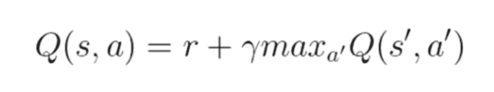

q-学习函数

在获得一些奖励后，𝑟通过做一个动作𝑎，我们可以到达下一个国家:𝑠′.在到达下一个州(𝑠′)时，代理执行一个关于奖励的新动作(𝑎′)。我们希望下一个奖励(𝑟′)的重点是𝛾.因此，我们将等式更新如下:

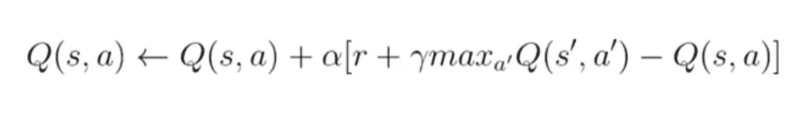

更新的 Q 函数

在我们将 Q-学习应用于 Cartpole 问题之前，重要的是要认识到 Q-学习是无模型学习的一个例子。我们稍后将讨论 MDP 以及策略和价值迭代如何与 Q-learning 相关联。

# **深度 Q 学习在小车系统中的应用**

基于对 Q-学习的元素的分析，很明显，使用 Q-学习可以有效地对 cartpole 系统建模。cartpole 问题有一个 4 维连续值(𝜃、𝑙、𝑥、𝑥2)的状态空间和一个 2 个离散值(向左或向右移动)的动作空间。然而，在典型的 Q-learning 中，我们必须改变我们的状态，以适应侧翻角度或位置的每一个微小变化，这将需要极大的记忆存储能力。此外，为了将 Q 学习应用于平衡小车系统，我们必须逼近无模型函数

𝑄(𝑠，𝑎)，其中输入是一个国家行动对(𝑠，𝑎)，输出是一些预期的回报。这种近似𝑄(𝑠(𝑎)函数的技术被称为深度 q 网络(DQN ),并且对于参数变化和状态的频繁改变更加鲁棒。这种技术遵循 Q-learning 背后的相同过程，但是基于经过训练的节点网络，利用深度神经网络来计算𝑎𝑄(𝑠:

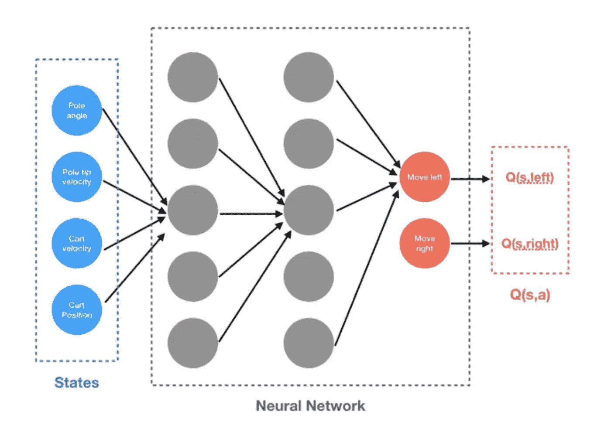

DQN 为 Cartpole 系统(从格雷格苏尔马)

如上图所示，DQN 使用横竿的当前状态来计算横竿的预期回报和下一步动作，返回向右和向左运动的𝑄(𝑠(𝑎)。DQN 很可能需要用一个损失函数来补充。我们知道更新的 Q-learning 等式已经计算出了𝑎):𝑄(𝑠的值

更新的 Q-学习方程

因此，重要的是要有一个损失函数，使 DQN 的近似值和从等式获得的真实𝑄(𝑠(𝑎)之间的误差最小化。总之，最好把 Q-learning 和 DQN 背后的整个过程想象成一个“受控试错法”,它看起来接近预期的回报:𝑄(𝑠，𝑎).Q-learning 利用更新的 Q- function 在离散的状态-动作对之间进行迭代调整。DQN 试图避免在接近无限的状态-动作对的 Q-学习中可能发生的记忆过度使用，支持一个近似来自先前连续状态-动作对的预期回报的神经网络。

# **训练 DQN 解决侧手翻问题**

DQN 通常用于横滚问题，我们现在可以理解最大化横滚回报的 DQN 的实现(回报是控制者平衡和控制横滚的能力)。首先要注意的是，我们可以将*状态-行动-奖励-状态*和环境总结为一个元组:(𝑆、𝐴、𝑅、𝑃、𝜌)，其中𝑆是状态，𝐴是行动，𝑅是奖励函数，是转移概率，而是初始状态分布。奖励函数是:

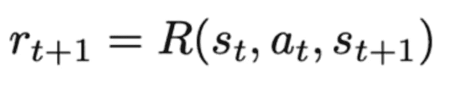

弹弓系统的奖励函数

这种将 cartpole 系统公式化为元组的方法被称为马尔可夫决策过程(MDP)。MDP 通常为我们提供了一种在给定𝑠.的情况下准确选择动作𝑎的方法然后我们根据转移概率 *P* 观察𝑎':和𝑠':。MDP 还提供了帮助代理在特定环境中找到长期优化策略的技术。dqn 的大多数实现使用批量归一化的平面卷积神经网络。这种技术使用对𝑎).𝑄(𝑠的迭代调整 DQN 实施后，需要对模型进行训练。DQN 的训练只是作为其环境中的横竿系统的一个学习阶段。任何 RL 模型的训练阶段都类似于一个孩子学习走路的普通例子。在横竿能够有效地平衡系统的角度和位置之前，它必须经历几个学习阶段:1。)学习独自平衡杆子 2。)停留在界限 3 内。)停留在界内但无法平衡杆 4。)保持在界内，同时有效地平衡杆。最终目标是尽快解决环境(以最少的步骤/集数求解)。随着该模型在状态-动作对上进行训练，它将最终改进求解之前所需的步骤数量。下图展示了一个 DQN 翻筋斗的训练样本。如图所示，cartpole 最终减少了解决环境问题所需的步骤:

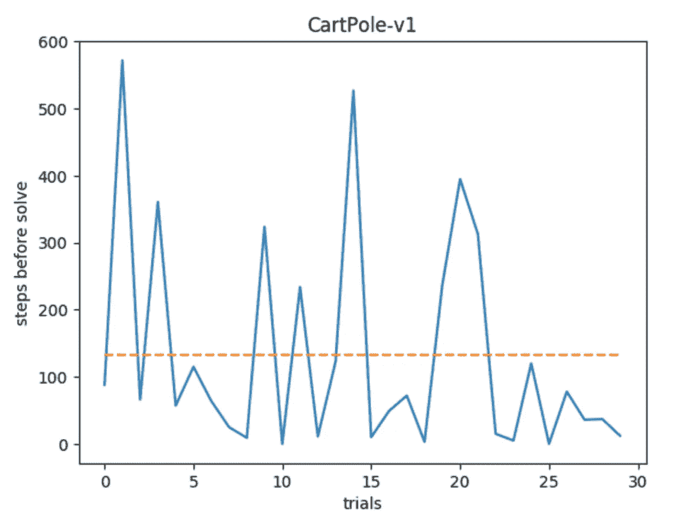

RL 横竿模拟的示例训练步骤和试验(来源:格雷·苏尔马)

既然我们已经展示了 Q 学习和 DQN 在 Cartpole 问题中的使用，我们将推广一些其他的 RL 算法并对比策略和值迭代。

# 马尔可夫决策过程

让我们讨论马尔可夫决策过程(MDP)的概念。我们在讨论如何训练 DQN 的时候提到了它。在每一个 RL 算法中，都有一个主体通过采取行动来最大化某种回报，从而与环境进行交互。MDP 是一种特殊的随机时间控制决策过程，它假设随机概率和决策者有完全的控制权。这是大多数 RL 算法的基础

MDPs 由 5 个元素的元组组成:(这些定义的所有功劳归于 Moustafa Alzantot。下面是他的[篇](https://medium.com/@m.alzantot/deep-reinforcement-learning-demysitifed-episode-2-policy-iteration-value-iteration-and-q-978f9e89ddaa)

*   `**S**`:状态集合。在每个时间步，环境的状态是一个元素`s ∈ **S**`。
*   `**A**`:一套动作。在每个时间步，代理选择一个动作`a ∈ **A**`来执行。
*   `**p(s_{t+1} | s_t, a_t)**`:状态转换模型，描述当用户根据动作`a`和当前状态 **s** 执行动作`a`时，环境状态如何变化。
*   `**p(r_{t+1} | s_t, a_t)**`:奖励模型，描述代理在执行一个动作后从环境中获得的实值奖励值。在 MDP，奖励值取决于当前状态和执行的操作。
*   **𝛾** :控制未来奖励重要性的贴现因子。

在 MDP 中，我们正在搜索代理或决策者将在下一个状态 *s* 中选择的策略函数。一旦我们指定了策略并为每个状态确定了动作，代理的行为就像一个马尔可夫链，状态只取决于以下内容:

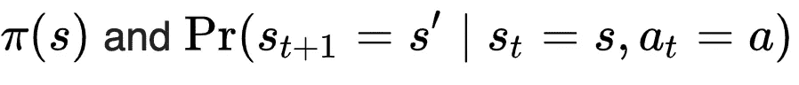

马尔可夫算子(策略、当前状态和动作)

因此，MDP 是策略迭代算法的一个示例，因为它希望实例化一个策略，并基于设置的策略对未来的动作进行采样。我们假设报酬是总的贴现报酬(也称为贴现因子):

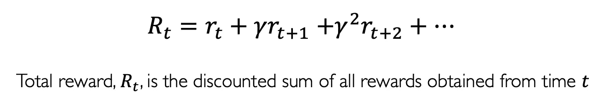

折扣系数(图片来自麻省理工学院深度学习入门)

我们使用贴现因子来防止总回报趋向无穷大(因为它在 0 和 1 之间)。折扣系数也让我们可以衡量代理人的偏好。除了贴现因子，MDP 可能存在于两种可能的环境中:确定性的和随机的

# **值对策略迭代**

价值和策略迭代是假设 MDP 特征的 RL 算法。价值迭代试图不断细化价值函数 *V* (或 Q 函数)，其将收敛于最优值，而策略迭代试图定义将收敛于最优策略的策略函数。通过一个策略梯度，我们直接优化策略。q 学习被认为是无模型的，使用值迭代。区别概述如下:

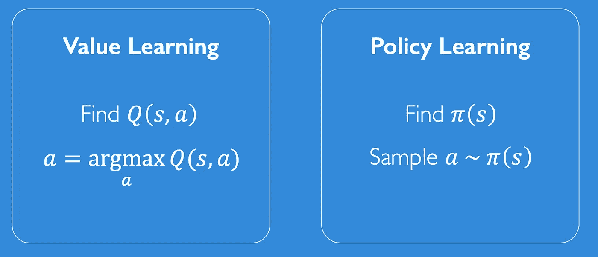

价值与政策迭代(来源:麻省理工学院[12])

总之，价值迭代寻求更新将用于计算 q 函数的价值函数，而策略迭代寻找最佳策略。下面是[穆斯塔法·阿兰兹托特](https://medium.com/@m.alzantot/deep-reinforcement-learning-demysitifed-episode-2-policy-iteration-value-iteration-and-q-978f9e89ddaa)对这两者的一些精彩解释:

> **值迭代**:*值迭代通过迭代改进****V(s)****的估计来计算最优状态值函数。该算法将****【V(s)】****初始化为任意随机值。它反复更新****【s，a】****和****【V(s)****的值，直到它们收敛。值迭代保证收敛到最优值。*
> 
> **策略迭代**::*而价值迭代算法在每次迭代中不断改进价值函数，直到价值函数收敛。由于代理只关心寻找最优策略，有时最优策略会先于价值函数收敛。因此，另一种称为策略迭代(policy-iteration)的算法不是重复改进价值函数估计，它会在每一步重新定义策略，并根据这个新策略计算价值，直到策略收敛。策略迭代也保证收敛到最优策略，并且它通常比值迭代算法花费更少的迭代来收敛。*

# 其他 RL 算法

**萨莎**

SARSA(State-Action-Reward-State-Action)是一种强化学习算法，它使用马尔可夫决策过程来根据下一个状态调整 Q 函数的值。因此，我们可以把 SARSA 看作是一种改进的 Q 学习算法，其中操纵了一个额外的动作和状态。

**蒙特卡罗方法**

蒙特卡罗 RL 与 Q-learning 相反，因为它不是无模型的。蒙特卡罗方法直接从经验和过去的动作-状态对中学习，而不需要任何 MDP 跃迁的先验知识。蒙特卡罗方法主要使用策略迭代，因为目标是从定义的策略中学习价值函数 *V* 。

**DDPG(深确定性政策梯度)**

这是策略梯度 RL 算法的扩展，并且应用深度 Q-网络来用软更新策略进行随机探索。下面给出了伪代码。[这篇文章](https://medium.com/@markus.x.buchholz/deep-reinforcement-learning-deep-deterministic-policy-gradient-ddpg-algoritm-5a823da91b43)解释得很好:

# 强化学习的应用

虽然 RL 的基本原理要求对政策或价值函数进行大量的逻辑和抽象评估，但在现实世界中 RL 有许多具体的应用。PID 或 LQR 控制器(控制理论)可以用鲁棒的 RL 算法代替。RL 在机器人和运动中也有常见的应用(其中有明确定义的环境、动作和奖励)。RL 也可以用于适用的博弈论情况。这方面的一个很好的例子是 AlphaGo 强化学习模型，它能够击败世界上最好的人类棋手。

# **参考文献**

> 这篇文章的内容主要是借用了我写的一篇简短的研究论文和一本书。

*我引用的中等文章:*

**马库斯·布赫霍尔茨**:[https://medium . com/@ Markus . x . buch holz/deep-reinforcement-learning-deep-deterministic-policy-gradient-ddpg-algoritm-5a 823 da 91 b 43](https://medium.com/@markus.x.buchholz/deep-reinforcement-learning-deep-deterministic-policy-gradient-ddpg-algoritm-5a823da91b43)

托马斯·西蒙尼尼:[https://medium . com/free-code-camp/an-introduction-to-reinforcement-learning-4339519 de 419](https://medium.com/free-code-camp/an-introduction-to-reinforcement-learning-4339519de419)

**托马斯·西蒙尼尼**:[https://medium . com/free-code-camp/diving-deep-into-reinforcement-learning-with-q-learning-c 18d 0 db 58 EFE](https://medium.com/free-code-camp/diving-deeper-into-reinforcement-learning-with-q-learning-c18d0db58efe)

**龚向，黄(Steeve)****:**[https://towardsdatascience . com/introduction-to-variable-reinforcement-learning-algorithms-I-q-learning-sarsa-dqn-ddpg-72 a5 e0cb 6287？source=search_post - 2](/introduction-to-various-reinforcement-learning-algorithms-i-q-learning-sarsa-dqn-ddpg-72a5e0cb6287?source=search_post---------2)

**Mustafa Alanztot:**[https://medium . com/@ m . alzantot/deep-reinforcement-learning-demystifed-episode-2-policy-iteration-value-iteration-and-q-978 F9 e 89 ddaa？source=search_post](https://medium.com/@m.alzantot/deep-reinforcement-learning-demysitifed-episode-2-policy-iteration-value-iteration-and-q-978f9e89ddaa?source=search_post)

**穆罕默德·阿什拉夫:**[https://towardsdatascience . com/reinforcement-learning-demystalized-Markov-decision-processes-part-1-BF 00 DDA 41690？source=search_post - 8](/reinforcement-learning-demystified-markov-decision-processes-part-1-bf00dda41690?source=search_post---------8)

**格雷戈·苏尔马**:[https://towards data science . com/cart pole-introduction-to-reinforcement-learning-ed 0 EB 5b 58288](/cartpole-introduction-to-reinforcement-learning-ed0eb5b58288)

[1] *强化学习算法应用于…(未注明)的比较。检索自*[*https://arxiv.org/pdf/1810.01940.*](https://arxiv.org/pdf/1810.01940.)

[2] *苏尔马，G. (2019 年 1 月 18 日)。cart pole——强化学习入门(DQN——深度 Q 学习)。检索自*[*https://towardsdatascience.com/cartpole-*](/cartpole-)*简介-强化-学习- ed0eb5b58288。*

[3]*Kwon，S. (2007 年)。小车系统的两种交替模糊控制器。2007 机器学习和控制论国际会议。doi:10.1109/icmlc . 2007.4370220*

[4] *(未注明)。检索自 http://ctms.engin.umich.edu/CTMS/index.php?exampl***e = inverted pendulum ion。**

*[5]*(1995 年 2 月 10 日)。检索自 http://pages.cs.wisc.edu/~finton/qcontroller***. html .***

**【6】*(2016 年 11 月 15 日)。Q 学习的车杆平衡。检索自*[*https://medium.com/@tuzzer/cart-pole-balancing-*](https://medium.com/@tuzzer/cart-pole-balancing-)*with-q-learning-b54c 6068d 947。***

**[7] *IIT 孟买毕业。(2019 年 5 月 6 日)。强化学习的深度 Q-Learning 介绍(Python 中)。检索自*[*https://www.analyticsvidhya.com/blog/2019/04/intro*](https://www.analyticsvidhya.com/blog/2019/04/intro)duction-deep-q-learning-python/。**

**[8] *Phy，v .(2019 . 11 . 4)。用 DQN 强化学习概念。检索自*[*https://towardsdatascience.com/reinforcement-*](/reinforcement-)*学概念-推车-杆子-dqn- 799105ca670。***

**[9] *罗德里格斯，J. (2017 年 8 月 31 日)。强化学习汤:MDPs，政策与价值学习，Q 学习和深度 Q 网络。检索自*[*https://medium.com/@jrodthoughts/reinforcement-*](https://medium.com/@jrodthoughts/reinforcement-)*learning-soup-mdps-policy-vs-value-learning-q-learning-and-deep-q-networks-4ac 137 ACD 07。***

**【10】*用 Keras 和 Gym 深度 Q-Learning。(2017 年 2 月 6 日)。检索自*【https://keon.io/deep-q-】**学习/。****

**[11] *布伦斯基尔，e .(未注明)。斯坦福大学的 Q 学习和蒙特卡罗模型幻灯片。斯坦福。***

**[12]亚历山大·阿米尼和艾娃·索莱马尼麻省理工学院 6。S191 深度学习简介:[IntroToDeepLearning.com](http://introtodeeplearning.com/)(幻灯片)**

**[13]Ankit Chou dary:[https://www . analyticsvidhya . com/blog/2018/11/reinforcement-learning-introduction-Monte-Carlo-learning-open ai-gym/](https://www.analyticsvidhya.com/blog/2018/11/reinforcement-learning-introduction-monte-carlo-learning-openai-gym/)**