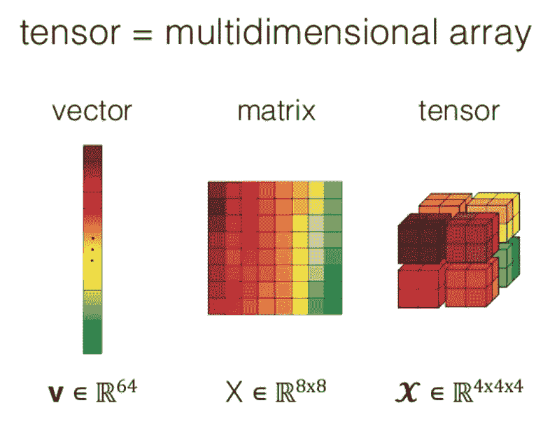
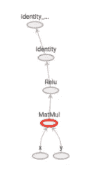
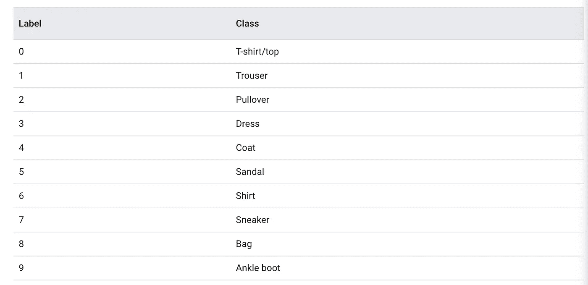
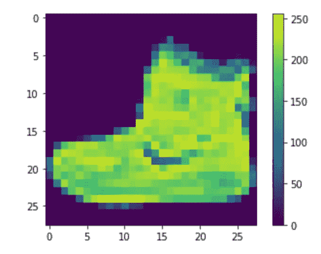
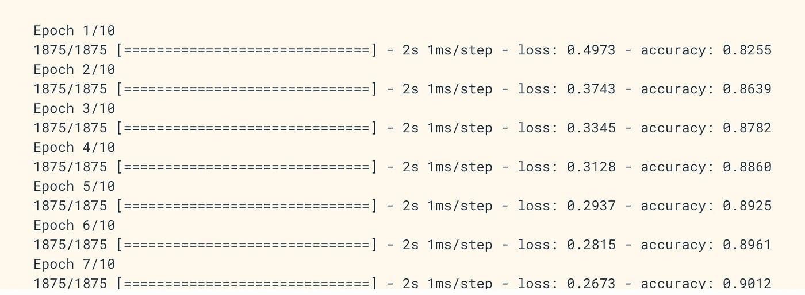

# 张量流初学者终极指南

> 原文：<https://towardsdatascience.com/the-ultimate-beginners-guide-to-tensorflow-41d3b8e7d0c7?source=collection_archive---------20----------------------->


神经艺术([来源](https://github.com/topics/neural-style-pt))

# **简介**

在本教程中，我们将足够深入地介绍 TensorFlow，以便您可以从头开始训练机器学习模型！

TensorFlow 是谷歌用于机器学习开发的旗舰库。它被商业和开发者用于构建和部署机器学习模块。TensorFlow 有两个宽泛的版本— 2。x 和 1.X 都允许类似的功能，但是 2。x 使用了更干净的 API，并做了一些小的升级。重要的是要理解 TensorFlow 已经从一个软件库发展成为一个面向所有类型机器学习的完整生态系统。像 Keras 这样的 API 使得用几行代码训练和测试深度学习网络变得极其简单。(我们将在本教程快结束时讨论这个问题)。本教程假设您对 Python 3 有基本的了解，并且对线性代数有一定程度的熟悉。

# **数学背景**

让我们从张量流背后的数学基础背景开始。张量流运算有三个主要的构造:向量、数组(矩阵)、张量。向量是一个有方向和大小的数学对象。它用于找到空间中一个点相对于另一个点的位置。数组是一种排列或一系列元素，如符号、数字或表达式。数组可以是 n 维的，所以矩阵是二维的数组。张量是描述标量、向量和其他张量之间线性关系的对象。换句话说，它是多个阵列的堆叠，以创建更高维度的结构。张量起作用的一个实际例子是图像。当处理 RGB 图像时，它是一个三维张量，在高度和宽度维度上，每种颜色都有层。希望这张图能阐明不同之处:



[来源](https://www.slideshare.net/BertonEarnshaw/a-brief-survey-of-tensors)

理解矩阵的秩也是有用的。矩阵的秩是线性独立的列或行向量的数量。在继续之前，我们假设你理解基本的线性代数——转置、求逆、矩阵乘法等。现在让我们用一些代码来定义这些概念。

```
import numpy as np a = np.array([[1,2,3], [4,5,6], np.int16)
b = np.mat([1,2,3])
```

通过这段代码，我们使用 NumPy 库来初始化 numpy.matrix 和 2D NumPy . ndarray。这两种结构有基本的区别，例如，numpy.matrix 有一个适当的矩阵乘法接口，但它们有效地实现了非常相似的目的。现在让我们讨论如何实现张量。请记住，张量是描述标量、向量和其他张量之间的线性关系的对象。零阶张量(或秩 0)可以由标量表示。一阶张量(或秩 1)可以由数组(一维向量)表示。二阶张量(或秩 2)可以由矩阵(二维阵列)表示。三阶张量(或秩 3)是三维阵列。这些示例在代码中实现，以供参考。

```
t_0 = np.array(50, dtype=np.int32)t_1 = np.array([b"apple", b"peach", b"grape"])t_2 = np.array([[True, False, False], [False, False, True]])t_3 = np.array([[ [0,0], [0,1], [0,2] ], [ [0,0], [0,1], [0,2] ],[ [0,0], [0,1], [0,2] ]])
```

张量流中的对象总是有形状的。形状描述了张量可以容纳的维数，包括每个维度的长度。TensorFlow 的形状可以是列表或元组。这个一开始可能不太容易理解，下面我们用一个例子来分解一下。列表[2，3]的形状是什么？此列表描述了第一维长度为 2、第二维长度为 3 的二维张量的形状。换句话说，这是一个 2×3 的矩阵！让我们看看代码中完成的更多形状:

```
s_1_flex = [None]s_2_flex = (None, 3)s_3_flex = [2, None, None]s_any = None
```

如果您对“None”关键字的含义感到困惑，它表示维度可以是任意大小。例如，`s_1_flex`是一个一维数组，大小为 n。

# **tensor flow 中的图形和会话**

张量流的中心是图形的概念。在讨论图表之前，我们先来谈谈急切执行。TensorFlow 中的急切执行是指每个操作都由 Python 执行，一个操作接一个操作。渴望 TensorFlow 运行在 GPU 上，易于调试。对于我们中的一些人来说，我们将很高兴保留 Python 中的 TensorFlow 项目，并且永远不会离开。然而，对于其他用户来说，急切的执行意味着阻止了“大量其他可用的加速”[1]。幸运的是，有多种方法可以启用和禁用急切执行:

```
import tensorflow as tf# to check for eager execution
tf.executing_eagerly() # to enable eager execution
tf.compat.v1.enable_eager_execution() # to disable eager execution
tf.compat.v1.disable_eager_execution() # After eager execution is enabled, operations are executed as they are defined and Tensor objects hold concrete values, which can be accessed as numpy.ndarray`s through the numpy() method.assert tf.multiply(6, 7).numpy() == 42
```

如果我们想提取我们的操作，这样我们就可以在 Python 之外访问它们，我们可以把它们做成一个图。注意，TensorFlow 更新很快，函数和定义可能会有所调整，因此请始终检查您使用的 TensorFlow 版本。这可以在下面的代码行中完成:

```
print(tf.__version__)
```

对于本教程，我们使用 Tensorflow 2.3。现在回到图表！图形是包含一组`tf.Operation`对象的数据结构。图形非常有用，因为它们可以在没有原始 Python 代码的情况下保存、运行和恢复。张量流图是一种特定类型的有向图，用于定义计算结构。在张量流图中，有三个主要对象可用于运算。首先是*常数*。这将创建一个接受值且不变的节点。下面是一个常量的例子:`tf.constant(6,tf.int32,name=’A')`。TensorFlow 中的下一个图形对象是*变量。*变量是输出其当前值的有状态节点；这意味着它们可以在图形的多次执行中保持它们的值。下面是一个变量的例子:`w = tf.Variable(, name=)`。最后一个对象是*占位符*。占位符可以在运行时在图形中输入未来值。当图表依赖于外部数据时使用。下面是一个实现的:`tf.compat.v1.placeholder(tf.int32, shape=[3], name='B')`。现在让我们开始我们的第一张图表。此示例没有显式启动图形，但它显示了我们如何在会话中运行操作:

```
# Launch the graph in a session.with tf.compat.v1.Session() as sess: # input nodes
   a = tf.constant(5, name="input_a")
   b = tf.constant(3, name="input_b") # next two nodes
   c = tf.math.multiply(a, b, name="input_c")
   d = tf.math.add(a, b, name="input_d") # final node
   e = tf.add(c, d, name="input_e") print(sess.run(e))
```

要将节点添加到我们的“图”中，我们可以添加、减去或乘以现有的节点。在上面的例子中，节点 c、d 和 e 都是先前初始化的节点的操作。为了运行这个图表，我们在所谓的`tf.Session`中运行它。当不使用急切执行时，我们需要在一个会话中运行我们的图形。在这种情况下，我们在一个称为`sess`的会话中运行它。一般来说，会话允许我们执行图形。在 TensorFlow 2 中，会话基本上消失了。一切都在一个全局运行时中运行。然而，出于本教程的目的，我们将继续复习会话。下面是一个具体图表的例子:

```
graph = tf.Graph()
with graph.as_default():
  variable = tf.Variable(42, name='foo')
  initialize = tf.global_variables_initializer()
  assign = variable.assign(13)with tf.Session(graph=graph) as sess:
  sess.run(initialize)
  sess.run(assign)
  print(sess.run(variable))
# Output: 13
```

在这段代码中，我们创建了一个图形，并初始化了一个名为“foo”的变量。然后，我们将“foo”赋给一个新值。创建图表后，我们在会话中运行它。让我们澄清一下。如果启用了快速执行，则不需要图形和会话。换句话说，就不需要`sess.run()`。

# **张量板**

既然我们已经讨论了图和会话在实践中是如何工作的，您一定想知道——我们如何检查它们？我们可以使用一种叫做 Tensorboard 的工具。这是一个与 Tensorflow 2.0 集成的工具，可以用来可视化图形。它还有其他工具来理解、调试和优化模型。后台现在是 TensorFlow 2.0 中的 tf.keras。现在让我们用 Tensorboard 来形象化一个图形。这里有一个简单的开始例子。请注意，您可以在 Google Colab 中测试这段代码:

```
%load_ext tensorboardsummary_writer = tf.summary.create_file_writer('logs/summaries')with summary_writer.as_default():
  tf.summary.scalar('scalar', 3.5, step=2)tensorboard --logdir /logs/summaries
```

这是一个简单的例子，我们将一个 tf 标量写入摘要编写器。然后我们在`logs/summaries`(我们的目录)中运行它来访问 Tensorboard。大多数情况下，Tensorboard 输出通常如下所示:



图形输出

现在让我们打开一个使用 Tensorboard 可视化和调试图形的更复杂的例子:

```
# Load the TensorBoard notebook extension
%load_ext tensorboardimport tensorflow as tf
import datetime# Clear any logs from previous runs
!rm -rf ./logs/# initialize your directory 
logdir = INSERT_DIRECTORYg = tf.compat.v1.Graph()with g.as_default():
  step = tf.Variable(0, dtype=tf.int64)
  step_update = step.assign_add(1)
  writer = tf.summary.create_file_writer(logdir)
  with writer.as_default():
    tf.summary.scalar("my_metric", 0.5, step=step)
all_summary_ops = tf.compat.v1.summary.all_v2_summary_ops()
writer_flush = writer.flush()with tf.compat.v1.Session(graph=g) as sess:
  sess.run([writer.init(), step.initializer]) for i in range(100):
    sess.run(all_summary_ops)
    sess.run(step_update)
    sess.run(writer_flush)# run in tensorboard
%tensorboard --logdir logdir
```

这个例子使用`tf.summary.create_file_writer(logdir)`来确保在 Tensorboard 中读取输出。现在我们已经看到了 Tensorboard 的运行，我们已经完成了 TensorFlow 的核心概念。然而，如果我们不将 TensorFlow 应用于机器学习，它就没有那么有用。我们现在将介绍 Keras，TensorFlow 用于训练神经网络的简单 API。

# **Keras**

简而言之，Keras 使训练和测试您的机器学习模型变得非常简单。现在让我们演示一下 Keras 的运行情况。(*全部归功于*[*tensor flow*](https://www.tensorflow.org/tutorials/keras/classification))我们首先导入库并检查我们的版本。(本教程使用 Tf 2.3):

```
# TensorFlow and tf.keras
import tensorflow as tf
from tensorflow import keras

# Helper libraries
import numpy as np
import matplotlib.pyplot as plt

print(tf.__version__)
```

现在让我们下载一个样本数据集。在这种情况下，我们将使用时尚 MNIST 数据集。下面的代码直接从`keras.datasets`下载设置:

```
fashion_mnist = keras.datasets.fashion_mnist

(train_images, train_labels), (test_images, test_labels) = fashion_mnist.load_data()
```

当我们加载这个数据集时，我们得到四个 NumPy 数组:train_images、train_labels、test_images、test_labels。如果你熟悉机器学习，那么你会知道我们需要一定数量的图像(数据)来训练和一些样本来测试。我们数据集中的每个图像都是一个 28x28 的 NumPy 数组，像素值的范围从 0 到 255。标签是一个整数数组，范围从 0 到 9。这些对应于以下内容:



每个类别的标签

由于类名不包含在集合中，我们可以将它们存储在一个列表中:

```
class_names = ['T-shirt/top', 'Trouser', 'Pullover', 'Dress', 'Coat', 'Sandal', 'Shirt', 'Sneaker', 'Bag', 'Ankle boot']
```

在训练模型之前，我们先来探索一下布景。在我们的`train_images`中，我们有 60，000 张图片，在我们的`train_labels`中，我们有 60，000 个标签。每个标签都是 0 到 9 之间的整数，如下所示:

```
train_labels
# output: array([9, 0, 0, ..., 3, 0, 5], dtype=uint8)
```

同样，测试集中有 10，000 幅图像。不出所料，也有 10000 个测试标签。每个图像都表示为 28 x 28 像素。现在让我们预处理我们的数据。我们可以从检查第一张图片开始:

```
plt.figure()
plt.imshow(train_images[0])
plt.colorbar()
plt.grid(False)
plt.show()
```



第一幅图像

在这种情况下，像素值介于 0 和 255 之间。在将它们输入神经网络之前，我们希望它们在 0 和 1 之间。为此，我们可以将训练集和测试集除以 255:

```
train_images = train_images / 255.0

test_images = test_images / 255.0
```

让我们验证一下我们的数据现在的格式是否正确。我们可以显示训练集中的前 25 幅图像，并在每幅图像下面显示类别名称:

```
plt.figure(figsize=(10,10))
for i in range(25):
    plt.subplot(5,5,i+1)
    plt.xticks([])
    plt.yticks([])
    plt.grid(False)
    plt.imshow(train_images[i], cmap=plt.cm.binary)
    plt.xlabel(class_names[train_labels[i]])
plt.show()
```


前 25 张图片

万岁，成功了！我们现在准备建立我们的深度学习模型。由于这是一个图像分类问题，我们将需要使用人工神经网络。我们首先需要配置模型的层，然后编译模型。首先，让我们配置我们的层。深度神经网络中的层从输入其中的数据中提取表示()。为了建立我们的网络，我们将链接几层。在本例中，我们将使用顺序模型:

```
model = keras.Sequential([
    keras.layers.Flatten(input_shape=(28, 28)),
    keras.layers.Dense(128, activation='relu'),
    keras.layers.Dense(10)
])
```

该网络中的第一层`tf.keras.layers.Flatten`，将图像格式从 28 x 28 转换为 784 像素的一维数组。本质上，我们是在排列像素。这一层没有学习，只有重新格式化。我们网络中的下两层是`tf.keras.layers.Dense`层。这些是完全连接的神经层，有 128 个神经元。它们返回图像是否属于十个类别之一的分数。在我们训练模型之前，我们需要添加最后一步。当我们编译刚刚构建的网络时，我们需要确保性能很高！换句话说，我们希望最小化损失/训练错误。这段代码完成了任务:

```
model.compile(optimizer='adam',
           loss=tf.keras.losses.SparseCategoricalCrossentropy(from_logits=True,
              metrics=['accuracy'])
```

为此，我们采用了一个**损失函数**来衡量我们的模型在训练过程中的精确度。目标是最小化这个函数。我们的模型还编译了一个**优化器**。这给了我们一种基于损失更新模型的方法。最后，我们用**指标**进行编译。这是在训练和测试步骤中监控准确性的一种方式。

我们现在可以训练我们的模型:

```
model.fit(train_images, train_labels, epochs=10)
```

在这里，我们将训练图像和 trining 标签作为数组输入到模型中。在训练期间，我们期望模型将图像和标签联系起来。然后，我们可以要求我们的模型对测试集进行预测。一旦我们使用上面的代码来拟合我们的模型，您可以预期如下所示的输出:



模型训练

在这一步中，我们看到我们配置的深度学习模型训练了 10 个时期(10 次训练运行)。在每个时期，它显示损失和准确性。由于随着时间的推移，该模型在识别不同标签方面变得更好，因此每个时期的损失减少，性能提高。在最后的历元(#10)，我们的模型达到大约 0.91 (91%)的精确度。现在，我们可以进行最后一步来比较模型在测试数据集上的表现了:

```
test_loss, test_acc = model.evaluate(test_images,  test_labels, verbose=2)

print('\nTest accuracy:', test_acc)
```

如果我们运行这段代码，我们发现我们的测试精度是 0.884。你可能会感到惊讶，我们的训练精度高于测试精度。原因很简单:**过拟合**。当机器学习模型由于高度特定的训练数据而在看不见的(测试)数据上表现较差时，就会发生过度拟合。换句话说，我们的模型已经记住了训练集的噪音和细节，以至于对新数据/测试数据的性能产生负面影响。

# **总结和最后的想法**

通过本教程，您能够学习和实现基本的张量流结构。我们讨论了不同的数据类型、变量、占位符、图形、会话，1。x 和 2。x，急切执行，tensorboard，Keras，过拟合等！如果你想了解更多，做更多有趣的项目/教程，一定要看看 tensorflow.org/tutorials.的如果你喜欢阅读，一定要鼓掌:)

**参考文献**

1.  [https://github.com/tensorflow/docs](https://github.com/tensorflow/docs)
2.  [https://www.tensorflow.org/tutorials/keras/classification](https://www.tensorflow.org/tutorials/keras/classification)(Keras 部分直接改编自本教程)