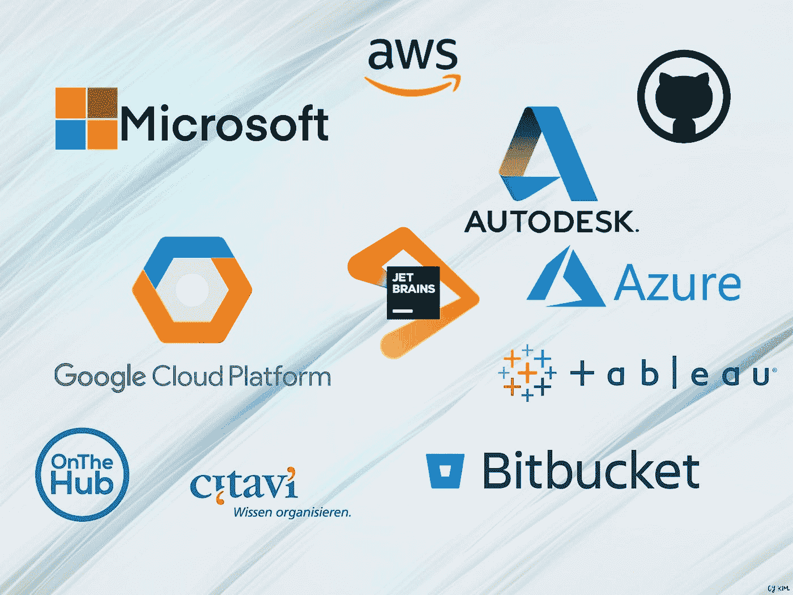
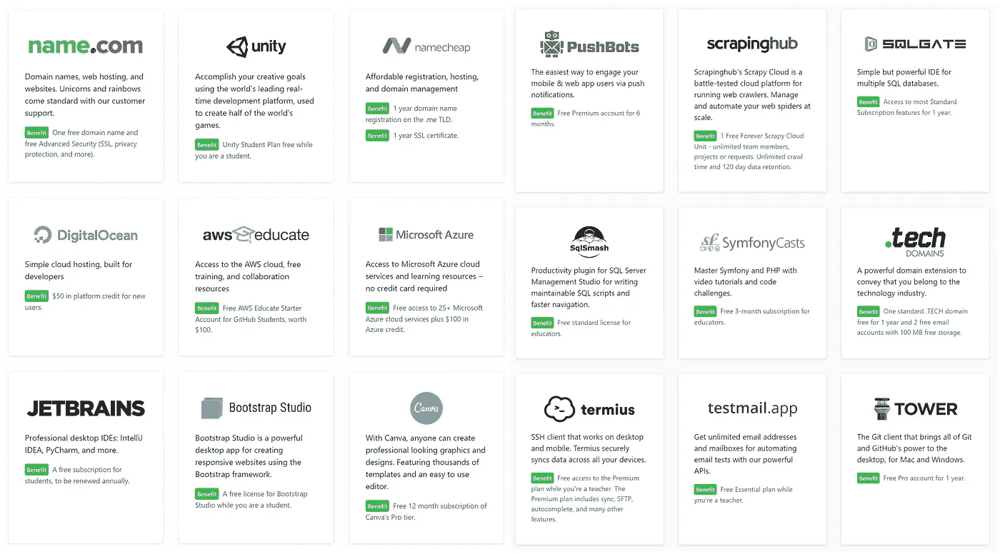
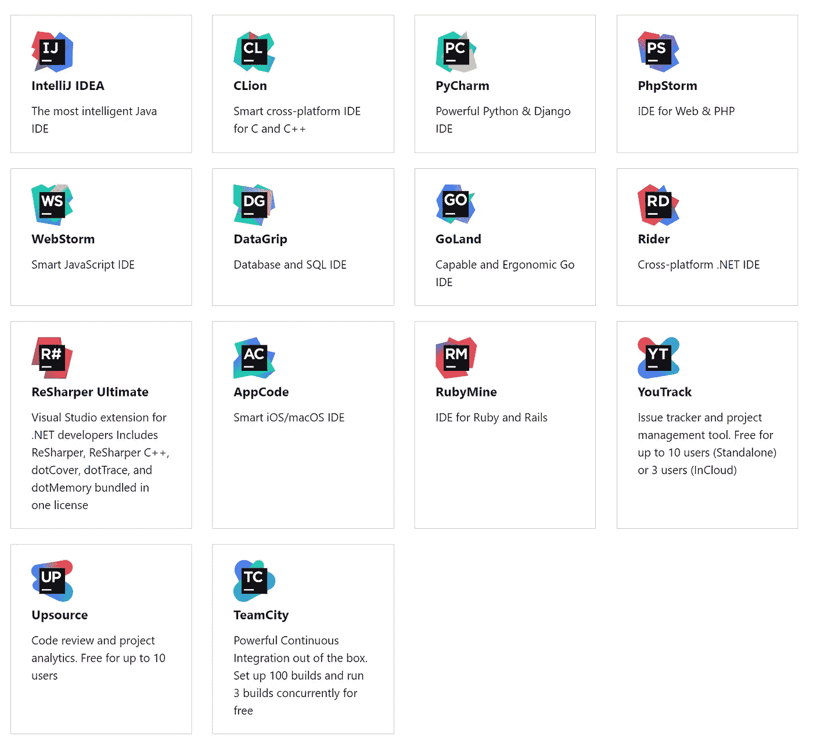
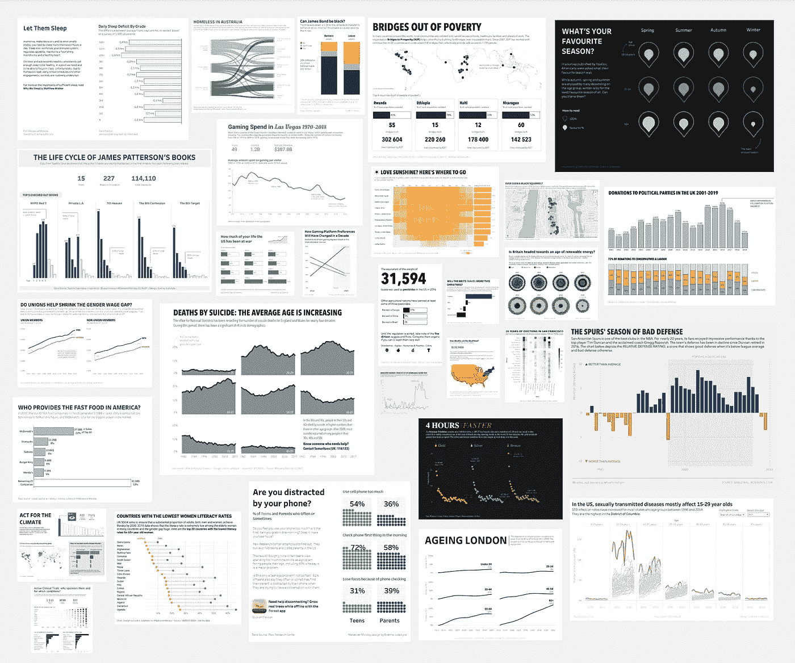
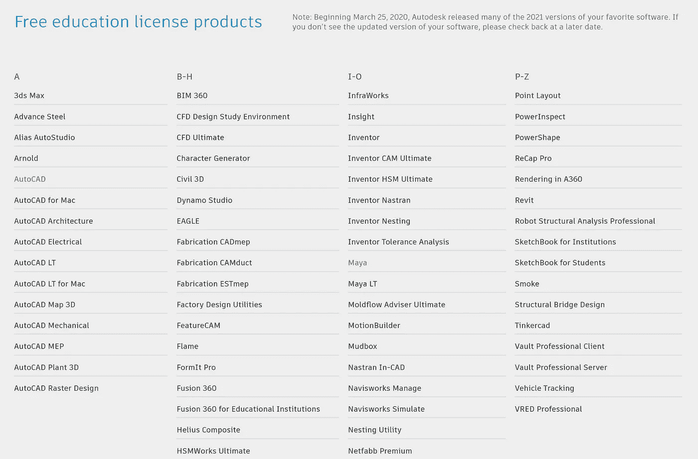

# 面向学生和教育工作者的免费数据科学工具

> 原文：<https://towardsdatascience.com/the-ultimate-best-free-softwares-for-students-and-educators-in-2020-deed53a2c18a?source=collection_archive---------26----------------------->

## 提高你的生产力

学生和教育工作者的最佳免费软件(插图由 [Chaeyun Kim](https://www.linkedin.com/in/ChaeyunKim) 提供)

在这篇文章中，我想总结一下作为学生或教育者你能得到的顶级免费软件。无论你在哪个领域学习/教学。这个指南可以帮助你找到你可能错过的新的喜爱的软件或工具。—请注意，我将只关注通常需要付费的软件/工具，跳过通常免费/开源的软件。

## 我们开始吧！

# GitHub 学生开发者包

**推荐给软件开发人员。

 [## GitHub 学生开发者包

### 没有什么可以替代实践经验。但是对于大多数学生来说，现实世界的工具可能成本过高。那是…

education.github.com](https://education.github.com/pack) 

据我所知， **Github 开发包**是开发人员最好的资源之一。你不仅可以获得 Github Pro，还可以获得大量受欢迎的产品，如免费域名、Unity Student、Digital Oceans 的一些积分、AWS、微软以及其他一些产品。

一些例子 Github 包中的产品！

如果你是教师或教职员工，你可以注册 [GitHub 教师工具箱](https://education.github.com/toolbox)，它提供的产品比学生开发包要少一些。

# 比特桶

**推荐给软件开发人员。

 [## 面向学生开发人员的 Bitbucket 教育| Bitbucket

### 非常适合学生开发人员，无论是添加小组项目成员还是让教师访问您的代码…

bitbucket.org](https://bitbucket.org/product/education) 

你可以在 **Bitbucket** 获得免费的**无限制的**私有 Git 库。如果你已经有一个 GitHub Pro，你可能会想为什么 Bitbucket…

您可以在这里检查它们的差异(通过[铲斗](https://bitbucket.org/product/comparison/bitbucket-vs-github)和[上护板](https://bitbucket.org/product/comparison/bitbucket-vs-github))。或者，你自己去查，免费的！还有，如果你是第一次接触 **Git** ，我推荐你从 [Github](https://try.github.io/) 或者 [bitbucket](https://www.atlassian.com/git/tutorials/learn-git-with-bitbucket-cloud) 那里学习。

# 云计算服务

**为软件开发者推荐！

有几家云提供商。好消息，大部分都给了一些免费学分，供学生和老师免费使用/试用！

*   [亚马逊 AWS 教育](https://aws.amazon.com/education/awseducate/)
*   [面向学生的 Azure】](https://azure.microsoft.com/en-us/free/students/)
*   [谷歌教育云](https://edu.google.com/products/google-cloud/)

如果您是云计算新手，请不要担心。在这三个巨大的技术平台上，你有足够的资源从头开始学习。或者在这里查看我关于如何创建文本到语音转换程序的文章。

# 面向学生的喷气大脑

**为软件开发者推荐！

 [## 免费教育许可证—社区支持

### 学习或教授如何使用 JetBrains 的行业最佳工具进行编码。JetBrains 工具的免费教育许可。

www.jetbrains.com](https://www.jetbrains.com/community/education/#students) 

JetBrains 是一套专业的软件开发工具，用于用 Java、Kotlin、C#、C++、Ruby、Python、PHP、JavaScript 和更多语言进行编码。如果你是学生或老师，你可以免费访问所有的 JetBrains IDEs。你可以通过几个选项来验证:你的教育电子邮件、ISIC 或 ITIC 卡、官方文件或 Github 包。

免费使用所有这些 JetBrains 软件！

# Tableau 桌面和准备生成器

**推荐给数据科学家

 [## 学生用桌子

### 学生可以通过学术计划免费下载 Tableau Desktop 和 Tableau Prep。现在试试吧。

www.tableau.com](https://www.tableau.com/academic/students) 

**Tableau** 是迄今为止最好的数据可视化工具之一！如果你有一个教育电子邮件，请点击上面的链接，免费获得这个很棒的工具！将免费获得 **Tableau Desktop** 和 **Tableau Prep** 的一年 Tableau 授权。然后，每年更新一次。

请查看这篇[文章](https://medium.com/nightingale/i-learned-data-viz-in-a-year-and-you-can-too-2b610d25946e)以获得由[Evelina judeikyt](https://medium.com/u/8ed50c9b8816?source=post_page-----deed53a2c18a--------------------------------)提供的令人惊叹的数据示例和她的示例结果。

# Autodesk 教育

**推荐给设计师、工程师和建筑师

 [## Autodesk 学生社区|免费教育软件和资源

### 如果适用，您可以查看特定国家的产品信息、优惠和…

www.autodesk.com](https://www.autodesk.com/education/home) 

**Autodesk** 提供对 100 多种产品的开放访问，面向全球的学生、教育工作者和机构。免费获得所有这些受欢迎的产品！！

Autodesk 免费教育许可产品

“嘿，太多产品了！帮我选择"

*对于建筑*:**Revit**+**AutoCAD**+**Civil 3D**+…

*产品设计师* : **发明人** + **AutoCAD** + **融合 360** + …

*对于媒体设计师* : **玛雅** + **3ds Max** + **阿诺** +…

# 微软 Office 365

**为大家推荐

 [## 面向学校和学生的免费 Microsoft Office 365 微软教育

### 符合条件的机构的学生和教育工作者可以免费注册 Office 365 Education，包括 Word、Excel…

www.microsoft.com](https://www.microsoft.com/en-us/education/products/office?ms.officeurl=getoffice365?ms.officeurl=getoffice365) 

微软产品不用多说。大家都知道。所以如果你是学生，就可以免费得到它！

# Onthehub —免费的微软 Windows 10 和更多。

**为大家推荐

 [## 学生和教师:升级到 Windows 10 教育| OnTheHub

### 学生和教师可以从 OnTheHub 上免费下载 Windows 10 教育版。找到你的学校并升级…

onthehub.com](https://onthehub.com/windows-10-education/) 

Onthehub 提供了很多软件，有些是免费的，这取决于你所在的大学。最棒的是，你还可以免费获得微软 Windows 10！

# Citavi —参考管理软件

**推荐给研究人员

 [## 制品

### 瑞士学术软件公司，地址:Florhofstrasse 2，8820 Wä denswil，瑞士

www.citavi.com](https://www.citavi.com/en/products) 

**Citavi** 是我最喜欢的参考资料管理软件(Endnote 的最佳替代品)请检查您的机构是否在此处[列出](https://www.citavi.com/en/sitelicenses)然后您可以免费使用高级(桌面)版本！

# 施普林格——封锁期间免费教科书

**推荐给研究人员

***【施普林格】Nature 制作了一套*** [***所有学科的必备教材免费提供***](https://www.springernature.com/gp/librarians/news-events/all-news-articles/industry-news-initiatives/free-access-to-textbooks-for-institutions-affected-by-coronaviru/17855960) *帮助支持全球的学生和教师。(* [*链接*](https://www.springernature.com/de/researchers/the-source/blog/blogposts-life-in-research/access-textbooks-for-free-during-the-coronavirus-lockdown/17897628) *)*

你可以免费下载 500 多本教科书。你可以一个一个手动下载。或者查看我的[文章](/download-all-free-textbooks-from-springer-using-python-bd0b10e0ccc)关于如何用 Python 脚本一次性下载它们。

## 作者消息:

我希望你能从这篇文章中了解一些新的免费软件。如果你知道其他适合学生或者老师的好软件。欢迎分享给我！

**平安健康**！😉

**感谢您的阅读。**👋