# 用熊猫数据框创建列的最终指南

> 原文：<https://towardsdatascience.com/the-ultimate-guide-for-column-creation-with-pandas-dataframes-83b8c565110e?source=collection_archive---------14----------------------->

## 用 Python 创建新列的 12 种方法


幸运的猫在 [Unsplash](https://unsplash.com?utm_source=medium&utm_medium=referral) 上的照片

**当处理一个普通的分类问题时，最重要的任务之一就是特征工程:从数据中创建新的特征。本指南展示了从现有的列或字典创建这些新特性的不同方法，因此您不必再为创建列而检查堆栈溢出！**

本指南可分为四个部分。如果您正在寻找一个特殊案例，请点击此处查看该案例的位置:

*   **第 1 部分:基本操作**
    使用操作符、处理日期和排列项目。
*   **第 2 部分:条件和函数**
    在这里，您可以看到如何使用现有的或用户定义的函数创建新列。如果您处理一个大型数据集，并希望以一种高效的方式基于条件创建列，请查看第 8 条！
*   **第 3 部分:多列创建**
    可以在一行中创建多列。
*   **第 4 部分:其他数据源**
    最后但同样重要的是，如何合并数据帧和使用字典映射值。

在代码示例中，使用了一个简单的数据帧:

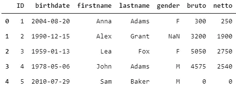

好了，开始了！

# 第 1 部分:基本操作

## **1。使用运算符**

创建新列最简单的方法是使用运算符。如果你想加、减、乘、除等等，你可以直接使用现有的运算符。

```
# multiplication with a scalar
df['netto_times_2'] = df['netto'] * 2# subtracting two columns
df['tax'] = df['bruto'] - df['netto']# this also works for text
df['fullname'] = df['firstname'] + ' ' + df['lastname']df[['firstname', 'lastname', 'bruto', 'netto', 'netto_times_2', 'tax', 'fullname']].head()
```

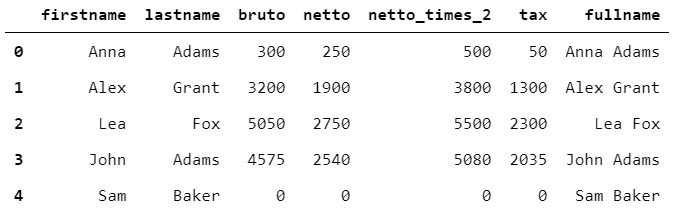

## 2.从日期列中提取信息

日期可能包含有价值的信息。在我们的示例 dataframe 中，我们可以计算一个人的年龄或提取出生年份。另一种选择是计算日期后的天数。

```
# converting the dtype
df['birthdate'] = pd.to_datetime(df.birthdate)# extracting the year from a date
df['year_of_birth'] = df['birthdate'].dt.year# calculating the age of a person
now = pd.to_datetime('now')
df['age'] = (now - df['birthdate']).astype('<m8[Y]').astype('int')# calculating days since date
now = pd.to_datetime('now')
df['days_since_birth'] = df.apply(lambda row: (now - row['birthdate']).days, axis=1)df[['birthdate', 'year_of_birth', 'age', 'days_since_birth']].head()
```

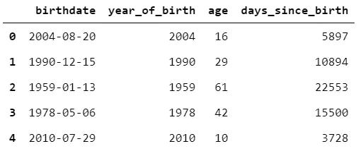

## 3.排名值

如果要将列值从 1 到 n 进行排序，可以使用 rank:

```
df['netto_ranked'] = df['netto'].rank(ascending=False)df['netto_pct_ranked'] = df['netto'].rank(pct=True)df[['netto','netto_ranked', 'netto_pct_ranked']].head()
```

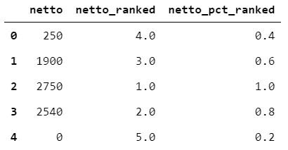

# 第 2 部分:条件和功能

## 4.条件列创建

如果有条件可以用 np.where:

```
df['child'] = np.where(df['age'] < 18, 1, 0)df['male'] = np.where(df['gender'] == 'M', 1, 0)df[['age', 'gender', 'child', 'male']].head()
```

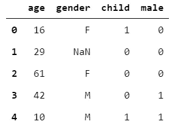

## 5.将现有函数应用于列

如果您想使用一个现有的函数并将这个函数应用于一个列，df.apply 是您的好朋友。例如，如果您想使用 np.log1p 函数转换一个数字列，您可以通过以下方式完成:

```
# applying an existing function to a column
df['log1p_bruto'] = df['bruto'].apply(np.log1p)df[['bruto', 'log1p_bruto']].head()
```

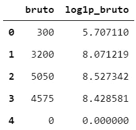

## 6.应用和 lambda 组合

在第一个示例中，我们减去了 bruto 和 netto 列的值。使用基本运算符很容易，但也可以将 apply 与 lambda 函数结合使用:

```
df['tax'] = df.apply(lambda row: row.bruto - row.netto, axis=1)df[['bruto', 'netto','tax']].head()
```

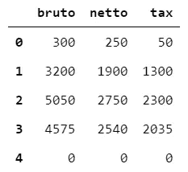

## 7.创建自定义函数(并应用)

有时，您有多个条件，并且希望同时对多个列应用一个函数。这可以通过使用一个定制的函数，并将该函数应用到您的数据帧中来实现。让我们在数据框架中创建年龄组。

```
# create a function to define age groups
def age_groups(row):
    if row['age'] < 18:
        return 0
    elif row['age'] >= 18 and row['age'] < 30:
        return 1
    elif row['age'] >= 30 and row['age'] < 60:
        return 2
    else:
        return 3# apply to dataframe, use axis=1 to apply the function to every row
df['age_groups'] = df.apply(age_groups, axis=1)df[['age', 'age_groups']].head()
```

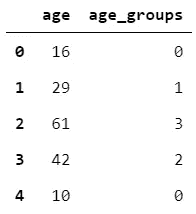

通过这种列创建方式，您可以轻松地使用多个列和多个条件。如果你想用年龄和布鲁图收入来解释薪水:

```
def age_salary(row):
    if row['bruto'] / row['age'] > 100:
        return 'high salary'
    elif row['bruto'] / row['age'] <= 100 and row['bruto'] / row['age'] > 50:
        return 'medium salary'
    elif row['bruto'] / row['age'] < 50 and row['bruto'] / row['age'] > 0:
        return 'low salary'
    else:
        return 'no salary'df['salary_age_relation'] = df.apply(age_salary, axis=1)df.head()
```

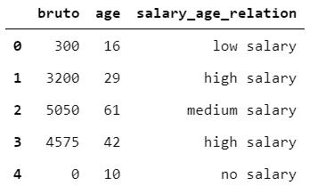

## 8.多重条件(矢量化解决方案)

前一个例子中的解决方案是可行的，但可能不是最好的。如果您正在寻找更有效的解决方案(例如，如果您处理大型数据集)，您可以在列表中指定您的条件，并使用 np.select:

```
conditions = [df['bruto'] / df['age'] > 100, 
(df['bruto'] / df['age'] <= 100) & (df['bruto'] / df['age'] > 50), (df['bruto'] / df['age'] < 50) & (df['bruto'] / df['age'] > 0)]outputs = ['high salary', 'medium salary', 'low salary']df['salary_age_relation'] = np.select(conditions, outputs, 'no salary')df.head()
```


这与前面的代码示例结果相同，但性能更好。

# 第 3 部分:多列创建

## 9.使用一个函数创建多个列

为了创建全名列，我们使用了基本操作(请看第一个例子)。如果您有一个全名列，并且希望从该列中提取名字和姓氏，该怎么办？好消息是，您可以使用 zip 在一行中完成这项工作。

```
# creating the fullname column again
df['fullname'] = df['firstname'] + ' ' + df['lastname']## method 1: define a function to split the column
# use the fullname column and split this column
def split_fullname(row):
    splitted = row['fullname'].split(' ')
    return splitted[0], splitted[1]# use zip to create the columns
df['first'], df['last'] = zip(*df.apply(split_fullname, axis=1))df[['fullname', 'first', 'last']].head()
```

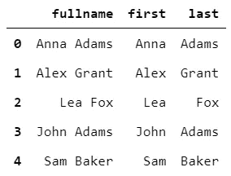

## 10.使用一行创建多列

可以用 zip、apply 和 lambda 在一行中创建相同的列(名字和姓氏):

```
## method 2: combine zip, apply and lambda for a one line solution
df['first'], df['last'] = zip(*df.apply(lambda row: row['fullname'].split(' '), axis=1))df[['fullname', 'first', 'last']].head()
```


# 第 4 部分:其他数据源

## 11.映射字典

创建列的常规方法是使用字典来映射值。您可以从另一个表中创建该词典，也可以创建自己的词典。您可以在字典中指定 nan 值，或者在映射缺少的值后调用 fillna。

```
# mapping a dictionary
genderdict = {'F': 'Female', 'M': 'Male', np.nan: 'Other'}
df['gender_meaning1'] = df['gender'].map(genderdict)# you can also use fillna after map, this yields the same column
genderdict = {'F': 'Female', 'M': 'Male'}
df['gender_meaning2'] = df['gender'].map(genderdict).fillna('Other')df.head()
```

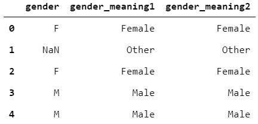

## 12.合并数据帧

当您想要组合数据帧时，可以通过在指定的键上合并它们来实现。想象一下，有些人的职业有另一个数据框架:

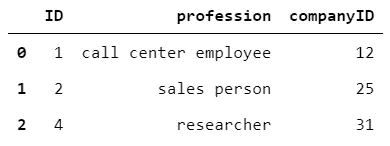

通过对原始数据帧调用 merge，将添加新列。如果数据帧有一个共同的名称，则在合并数据帧时使用该列。其他列将被添加到原始数据框架中。如果要保留第一个数据帧的记录，不要忘记指定 how='left'。您可以将这与 SQL 中的连接进行比较。

```
df.merge(df_profession, how='left')df.head()
```

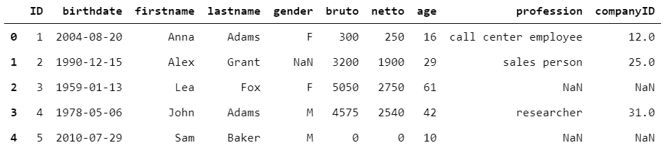

祝您的数据科学任务，尤其是专栏创建好运！

*别忘了* [*订阅*](https://hennie-de-harder.medium.com/subscribe) *如果你想在我发表新文章时收到电子邮件。* ❤