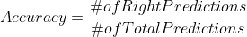
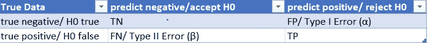
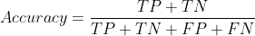
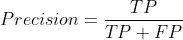
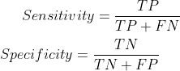
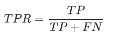
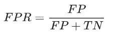
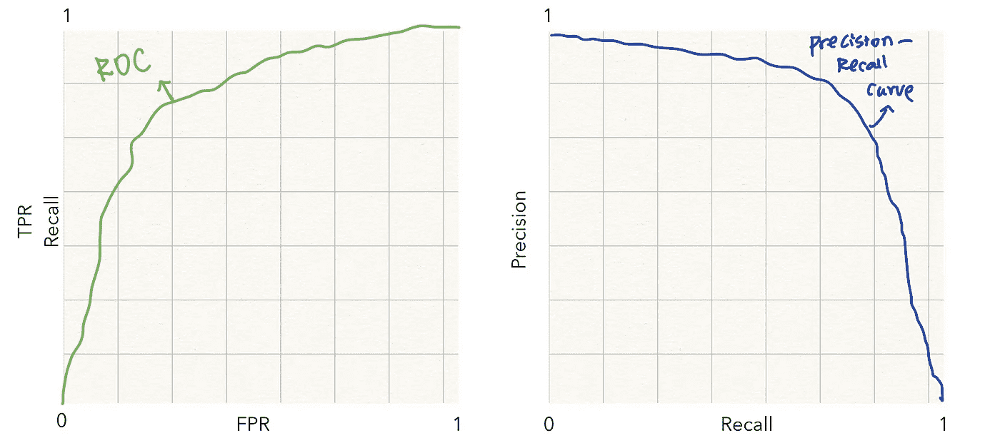

# 模型评估分类度量的最终指南

> 原文：<https://towardsdatascience.com/the-ultimate-guide-of-classification-metrics-for-model-evaluation-83e4cdf294d9?source=collection_archive---------34----------------------->

奈杰尔·塔迪亚恩多在 [Unsplash](https://unsplash.com/s/photos/confusion-matrix?utm_source=unsplash&utm_medium=referral&utm_content=creditCopyText) 上拍摄的照片

## 将机器学习模型与假设检验相结合。别扯头发了，读读这篇文章。

模型评估是机器学习的重要组成部分。在处理分类问题时，有太多的度量标准可供选择，有时会造成混乱。本文将首先讨论和比较二进制分类问题的所有常用度量，不仅通过它们的定义，还通过一些度量优于其他度量的情况。最后，本文将讨论如何调整模型以支持某些度量标准。

**二元分类问题的通用度量**

二进制分类问题是一个典型的具有二进制目标值的监督机器学习问题。我们通常把目标值称为正类和负类。评估模型的性能时，最常用和最直接的指标是**精确度。准确度**是正确预测数除以总预测数:

至少在这两种情况下，准确性是不够的:

第一，数据不平衡时。如果训练数据朝着负类不平衡，例如，我们预期 99%的数据在负类中，则任何总是预测“负”的模型将获得 99%的准确度。但是，这是否意味着这种模式是一种特殊的部署模式？显然不是。因此，除了我们可以用来处理不平衡数据集的方法之外，我们还需要能够区分正类和负类的准确性的度量。

第二，当我想知道模型在预测某一类时的表现。例如，当我更关心预测正类权利的模型而不是预测负类权利的模型时，准确性本身不会给我提供我想要的足够信息。

因此，我们需要考虑其他指标，以找到适用于不同场景的最佳模型。我们分别讨论一下位置和负类中的“准”。在本文中，我将结合机器学习模型评估和传统的统计假设检验来说明某些概念之间的联系。在假设检验中，我们通常将零假设定义为无效果或负面，同时检验替代假设的正面效果。在二进制机器学习模型中，我们测试一个数据点是在正类还是负类中。因此，我们可以说，在机器学习中，当一个数据点被预测为在否定类中时，就等于说我们在假设检验中未能拒绝零假设(接受 H0)。这是一个连接假设检验和机器学习的表格:

第 2 列和第 3 列显示模型预测的结果，无论我们使用假设检验还是机器学习模型，而第 2 行和第 3 行代表数据的真实类别。我们将真阴性(TN)定义为当数据处于阴性类别时模型预测为阴性，反之则为真阳性(TP)。我们进一步将假阳性(FP)定义为当数据处于阴性类别时模型预测为阳性，而假阴性(FN)是当数据处于阳性类别时模型预测为阴性。正确的预测是 TN+TP，而错误的预测是 FP+FN。在统计分析中，FP 是 I 型错误，因为当 H0 为真(真否定)时，你拒绝了 H0(拒绝否定)。当接受 H0(接受阴性)而 H0 是假的(真阳性)时，FN 是 II 型错误。1-I 型误差是置信水平，1-II 型误差是统计功效。

回到二进制模型指标，我们可以将准确性重新定义为:

为了测试不同类中的“准确性”，我将引入两组度量标准。它们是回忆和精确性，敏感性和特异性。

**回忆和精确:什么和什么时候**

如果我们想确定当模型预测为正时，数据很可能是真的正，那么我们可以检查精度:

也称为正预测值。

如果我们想确定当模型预测为负时，数据很可能是真的负，那么我们可以检查 recall:

这和敏感度公式是一样的。

比较 precision 和 recall，我们可以看到这两个公式是相同的，expect precision 的分母是 FP，recall 的分母是 FN。因此，为了提高精度，模型需要尽可能少的 FP，而 FN 可以忽略。相比之下，为了提高召回率，模型需要具有小的 FN，同时不关心 FP。

让我们考虑一个场景，我们试图找到目标客户来发送广告。让我们将肯定类别中的客户定义为在看到广告后会进行购买的客户。这里的目标是向积极的顾客展示广告，以便他们购买。这样，我们充分利用广告，让公司获得更多利润。如何评估模型以找到最佳模型？我们只能根据不同的业务设置来回答这个问题。

场景一，广告成本高的时候。成本可以是由雇员的时间和努力评估的发送广告的实际成本，也可以是当过于频繁地向潜在顾客展示广告时失去他们的成本。当广告成本很高时，模型需要非常精确地做出正面预测。因此，精度是最好的度量，因为您希望确保大多数正面预测都是正确的。

场景二，当广告成本低的时候，那么给实际处于负类的客户看广告是可以的。这里的目标是确保所有积极类的客户都能收到广告。我们不应该在负面类别中遗漏任何正面客户。因此，该模型需要减少假阴性，提高召回率。

**敏感性和特异性:内容和时间**

医疗环境中通常使用的另外两组指标。例如，当测试病人是否患有某种疾病时。它们是敏感性和特异性:

敏感性是评估模型正确地预测所有真正的阳性点中有多少阳性点，而特异性是评估模型正确地预测所有阴性点中有多少阴性点。在测试一个人是健康(阴性)还是患病(阳性)的例子中，灵敏度是测试在所有患者中有多少患者被成功定位。高灵敏度意味着正确识别患有疾病的患者。特异性是测试所有健康人中有多少健康人被检测为阴性。检测的特异性是指检测对未患病患者的识别程度。

**指标的组合**

在某些情况下，我们只关心降低 FP 或 FN，但在其他情况下，我们两者都关心。除了准确性，我们还有其他衡量 FP 和 FN 的指标，因此我们可以调整模型以同时降低它们。广泛使用的有 AUC(ROC 曲线下面积)、F 值等。ROC(接收器操作特征曲线)曲线是显示分类模型在所有分类阈值的性能的曲线。该曲线显示了真阳性率(TPR)和假阳性率(FPR)的组合:

TPR 也是灵敏度

FPR 是 1-特异性

更高的 AUC 总是更可取的。在 FN 和 FP 都为零的理想情况下，TPR 为 1，FPR 为零，这使得 AUC 等于 1。因此，AUC 同时评估 FN 和 FP。

同样，我们可以用精确召回曲线代替 ROC 曲线来计算精确召回曲线下的面积。不同的是在轴上使用精度和召回。图表中的差异将是:

作者图片

两条曲线都有助于同时测量 FN 和 FP。然而，ROC 曲线应该在每个类别的观察值数量大致相等的情况下使用，而精确召回曲线应该在有中度到较大类别不平衡的情况下使用。

F 分数是一个公式，它结合了等式中的召回率和精确度，因此它同时测量并帮助降低 FN 和 FP。具体公式可以在这里找到[。](https://en.wikipedia.org/wiki/F1_score)

**如何调整模型以支持特定的指标？**

人们可能会问的最后一个问题是，如果我知道我想提高召回率，精度对我来说并不重要，我应该如何调整模型。例如，当我们进行肿瘤检测的研究时，人们可能期望具有高召回率，因为我们不想让肿瘤得不到治疗。因此，当使用机器学习模型来解决这个二元分类问题时，我们希望确保假阴性尽可能小。我们要非常谨慎地预测负类。例如，如果我们使用逻辑回归，预测正类或负类的默认阈值是 0.5。如果我们想提高召回率，我们可以将这个阈值降低到低于 0.5。因此，该模型在否定类别中做出更少的预测，并且假否定也将更少。

这是二元分类模型度量的最终指南。如果你有兴趣了解更多关于如何选择机器学习模型的细节，下面的博客文章讨论了使用重采样和概率方法的有效模型选择方法，流行的模型评估方法，以及机器学习模型的权衡:

 [## 机器学习中模型评估和选择的终极指南- neptune.ai

### 在高层次上，机器学习是统计和计算的结合。机器学习的关键在于…

海王星. ai](https://neptune.ai/blog/the-ultimate-guide-to-evaluation-and-selection-of-models-in-machine-learning) 

感谢您的阅读！这是我所有博客帖子的列表。如果你感兴趣的话，可以去看看！

 [## 我的博客文章库

### 我快乐的地方

zzhu17.medium.com](https://zzhu17.medium.com/my-blog-posts-gallery-ac6e01fe5cc3)  [## 阅读朱(以及媒体上成千上万的其他作家)的每一个故事

### 作为一个媒体会员，你的会员费的一部分会给你阅读的作家，你可以完全接触到每一个故事…

zzhu17.medium.com](https://zzhu17.medium.com/membership)