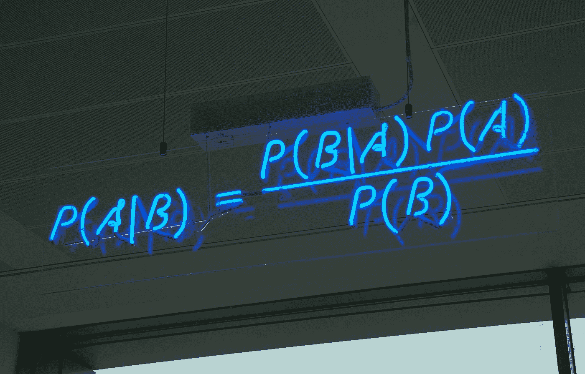
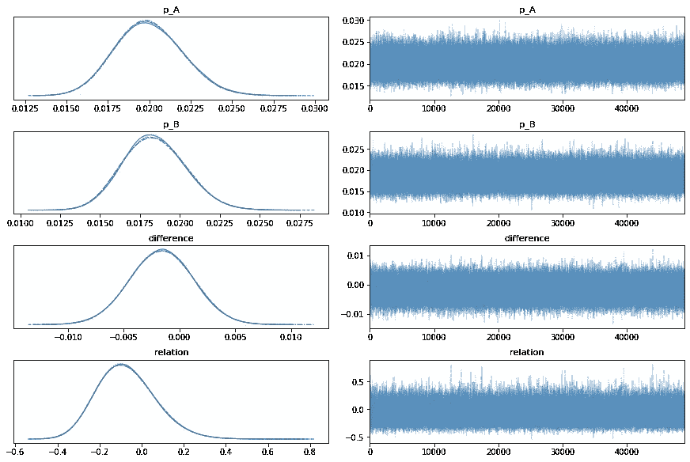

# A/B 测试终极指南。第 5 部分:贝叶斯方法(二项式变量)

> 原文：<https://towardsdatascience.com/the-ultimate-guide-to-a-b-testing-part-4-bayesian-approach-binomial-variables-aa71e25d2165?source=collection_archive---------11----------------------->

来源:[https://en . Wikipedia . org/wiki/Bayes % 27 _ Theorem #/media/File:Bayes ' _ Theorem _ MMB _ 01 . jpg](https://en.wikipedia.org/wiki/Bayes%27_theorem#/media/File:Bayes'_Theorem_MMB_01.jpg)

*A/B 测试是一种非常流行的技术，用于检查产品中的细微变化，而不会错误地考虑由外部因素引起的变化。在这一系列的文章中，我将尝试给出一个简单的关于如何设计、运行和评估 a/b 测试结果的操作手册，这样你就可以得到这些惊人的统计显著结果了！*

*在之前的文章中，我们已经讨论了 A/B 测试的频率主义方法:*

*部分* [***一个***](https://medium.com/swlh/the-ultimate-guide-to-a-b-testing-part-1-experiment-design-8315a2470c63) *和* [***两个***](/the-ultimate-guide-to-a-b-testing-part-2-data-distributions-5ed429abbce) *给出实验设计和最常见概率分布的概述。在* [***部分三***](/the-ultimate-guide-to-a-b-testing-part-3-parametric-tests-2c629e8d98f8) *和* [***四***](/the-ultimate-guide-to-a-b-testing-part-4-non-parametric-tests-4db7b4b6a974) *我们谈到了两种不同类型的测试(参数化和非参数化)以及何时以及如何使用它们。*

# 频率主义者 vs 贝叶斯方法

尽管传统的频率统计方法很好，但它也有缺点。第一点(通常也是最让从业者恼火的一点)是，你需要大量的数据才能得到有统计学意义的结果。而且你想检测的变化越小，你需要的数据就越多！例如， [**在本系列的第一篇**](https://medium.com/swlh/the-ultimate-guide-to-a-b-testing-part-1-experiment-design-8315a2470c63) 文章中，我们估计至少需要测试组和控制组的 **2305 个用户**才能发现第一天保持率有 2%的差异。

同时，这些测试的整个方法有些非黑即白:要么是*“是的！经过深思熟虑的检查，数据显示了反对零假设的有力证据，因为如果零假设是正确的“*或“*”，则测试和对照之间获得相似或更极端差异的概率小于* ***5*** *%。数据既不证实也不否认零假设。没有进一步的评论！”。如果你没有得到足够的数据，或者测试组和控制组之间的差异不够大，你基本上是扔掉所有的结果，从头开始。*

但是在这种情况下，至少有一些指示——比如说，一个可能性，不是很好吗？像这样，“有 40%的几率对照组表现更好”。也许它不会像有统计学意义的结果那样有保证，但是在许多实际情况下，概率估计比没有答案要好。这正是贝叶斯方法可以发挥作用的地方！

我甚至不敢在一篇博文中解释贝叶斯推理是如何工作的。相反，我们将像在本系列中一样关注实际的实现，看看如何使用贝叶斯方法来检查使用 Python 库 [PyMC3](https://docs.pymc.io/) 的 A/B 测试的结果。

但是对于那些有兴趣学习贝叶斯推理和统计学的人来说，我不能再推荐这些资源了:

*   "[贝叶斯统计的有趣方式](https://www.oreilly.com/library/view/bayesian-statistics-the/9781098122492/)"威尔·库尔特，奥赖利 2019
*   [黑客的贝叶斯方法:概率编程和贝叶斯推理](https://www.oreilly.com/library/view/bayesian-methods-for/9780133902914/)】作者 Cameron Davidson-Pilon，O'Reilly 2015
*   Aerin Kim 的[贝叶斯推理——直觉和例子](/bayesian-inference-intuition-and-example-148fd8fb95d6)

# 案例研究:A/B 测试结果的贝叶斯分析

让我们回忆一下[上一篇文章](/the-ultimate-guide-to-a-b-testing-part-4-non-parametric-tests-4db7b4b6a974)中的例子，Fisher 的精确测试表明转化率下降 0.3%在统计上并不显著:

> 过去几年来，我们一直在开发这款令人惊叹的街机游戏，事情似乎进展得相当顺利。但在某个时候，玩家社区开始要求合作模式。经过一些讨论后，游戏团队决定开发新的模式，并运行 A/B 测试来检查它如何影响指标。
> 
> *我们对 2500 名用户的测试组(与控制组的规模相同)进行了 A/B 测试，得到了以下结果:*
> 
> *-平均会议时间从 8 分钟增加到 9 分钟*
> 
> *-第 1 天的保留率从 40%增加到 45%*
> 
> *-与此同时，转化率从 2%下降至 1.7%*

在对所有三个指标进行统计测试后，我们发现平均会话长度和保留时间显示出统计意义上的显著增长，而转化率下降 0.3%在 Fisher 精确测试中并不显著。

这是开发团队真正的喜悦时刻！艺术家们在喝香槟，开发人员拿着啤酒，一个人一个人地聚集在笔记本电脑周围，营销部门举办了一个大型派对，用气球和品牌纸杯蛋糕发布在 Instagram 上，产品经理开始为 [GDC 2021](https://gdconf.com/) 准备一场精彩的演讲。

但是，尽管我们(和整个开发团队)很高兴，投资者仍然担心转换率的下降有可能是真的。传统的 frequentist 检验仅表明，我们的数据中没有足够的证据来拒绝测试组和对照组的转化率相等的无效假设。

因此，随着一声深呼吸，我们的数据科学家不得不离开聚会，再次查看数据，但现在是带着概率思维！

# 步骤 0。生成数据

*在现实生活中，你可以跳过这一步，因为数据来自遥测技术。*

根据测试描述，每组有 2500 个用户，控制组和测试组的转化率分别为 2%和 1.7%。

因此，让我们生成两个数组来表示观察到的数据:

# 第一步。定义先验和可能性

贝叶斯推理的核心思想是将两种不同的分布结合起来:**先验分布**(你的初始信念，数据看起来如何)和**可能性**或**证据**(又名观察数据样本的分布)成为一个**后验分布**，这将更好地描述数据的真实分布:

来源:[https://www . research gate . net/publication/330577376 _ Modeling _ Emotions _ Associated _ With _ Novelty _ at _ Variable _ Uncertainty _ Levels _ A _ Bayesian _ Approach](https://www.researchgate.net/publication/330577376_Modeling_Emotions_Associated_With_Novelty_at_Variable_Uncertainty_Levels_A_Bayesian_Approach)

所以从贝叶斯分析开始，我们需要给我们的测试组和对照组分配先验分布。或者，换句话说，决定我们认为数据可能是什么样子？

因为我们例子中的度量是转化的概率，我们将使用 [Beta 分布](https://en.wikipedia.org/wiki/Beta_distribution)来模拟先验。在这种情况下，有不同的方法来分配先验分布的参数。例如，您可以使用专家意见，使用历史数据作为基准，或者将控制组分布的参数作为估计。

对于这个例子，让我们采用最后一个选项，并根据控制组的参数对两个先验进行建模。在这种情况下，α等于 50，β= 2450。

所以我们的前科会是这样的:

请注意，我们在两种情况下使用了相同的先验知识，因为我们的零假设声称对照和测试是来自同一分布的两个样本。

接下来，对于可能性(也称为观察数据)，我们将使用二项分布，其中参数 **n** 等于每个组中的用户数量， **p** 等于每个组的先验值，**观察值**等于我们从样本中获得的实际转化率:

# 第二步。定义比较 A/B 测试用例的指标

现在，一旦我们有了先验和似然性，我们就可以定义我们感兴趣检查的指标:**控制组和测试组之间转换的** **差异**，以及**变量**之间的 **关系:**

# 第三步。MCMC 仿真

所以现在，当我们有了所有的分布和度量，是时候开始更新先验，以更接近控制和测试用例的真实分布(又名后验分布)。我们将通过**马尔可夫链蒙特卡罗** ( **MCMC** ) **模拟**来实现。

这项技术背后的思想是从一个连续的随机变量(测试组和对照组的观察数据)中创建一组样本(在我们的例子中是 50000 个)，其概率分布与我们的先验成比例。这些样本将用于评估后验分布。

为了从测试分数的分布中抽取样本，MCMC 从最初的猜测开始:只有一个值可能是从先前的分布中抽取的。假设这个最初的猜测是 0.02(或者 2%)。然后 MCMC 被用来从这个初始猜测中产生一系列新的样本。每个新样品都由两个步骤产生:

1.  通过向最近的样本添加小的随机噪声来创建新样本的建议
2.  如果新的建议比最近的样本具有更高的后验值，则它被接受为新的样本。否则，它被拒绝，并且算法从相同的样本创建新的提议

有许多方法可以添加随机噪声来创建提议，也有不同的方法来处理接受和拒绝(例如， [NUTS](http://www.stat.columbia.edu/~gelman/research/published/nuts.pdf) 或[Metropolis–Hastings 算法](https://en.wikipedia.org/wiki/Metropolis%E2%80%93Hastings_algorithm))。默认情况下，pm.sample()使用 NUTS 方法，但是可以在 step 参数中更改它:

在 MCMC 算法变得神奇之后，我们可以使用 **pm.traceplot()** 函数绘制结果。

通常，MCMC 算法的起始位置在低概率区域，并且该算法移动到可能不是来自后验的位置，但是比附近的任何其他位置都好。这意味着第一次移动不反映后一次移动，因此我们可以在绘制结果时跳过它们:

在左栏中，我们有模型中所有四个变量的分布:后验分布 p_A 和 p_B 以及两种情况之间的差异和关系的分布。在右栏，我们有每一步的采样值。

从上图中我们已经可以看出，p_B 分布的值往往低于 p_A，但是为了清楚起见，我们也可以绘制两种后验概率的直方图:

我们还可以绘制差异和关系度量的直方图。这给了我们测试用例比控制用例更差的概率:

根据贝叶斯模型，测试组的转化率实际上有 71.6%的可能性低于控制组，这可能是团队的一个警告信号！因此，也许是时候让数据科学家去 o̵n̵c̵e̵̵a̵g̵a̵i̵n̵̵s̵p̵o̵i̵l̵̵t̵h̵e̵̵p̵a̵r̵t̵y̵警告产品所有者可能的货币化风险了！

本文完整代码:[https://github.com/mariapaskevich/BayesianABTesting](https://github.com/mariapaskevich/BayesianABTesting)

这是贝叶斯方法进行 A/B 测试的用例之一，但是如果我们的数据不是二项式的呢？例如，我们如何应用这种技术来比较两种不同情况下的会话长度？这将是下一部分单独讨论的主题。敬请期待！