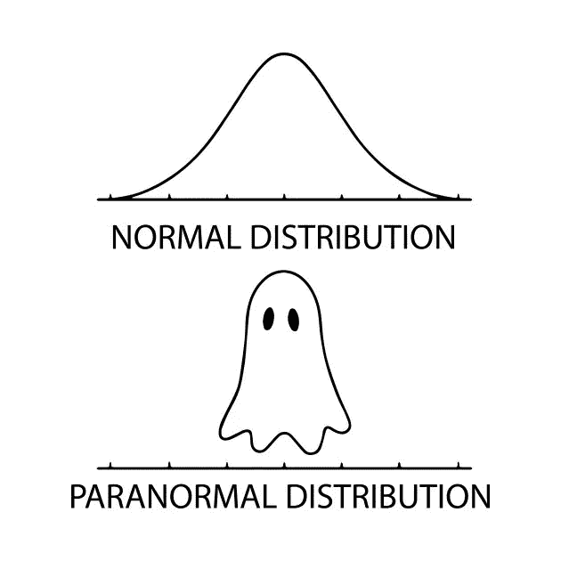
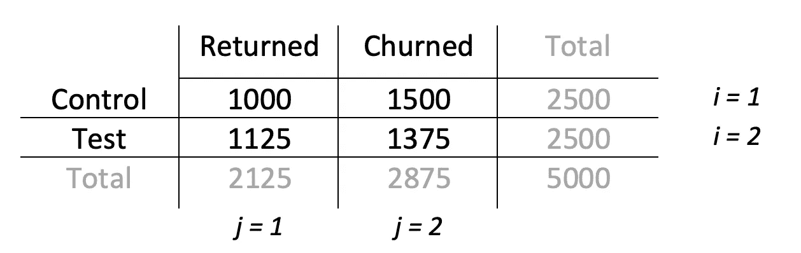
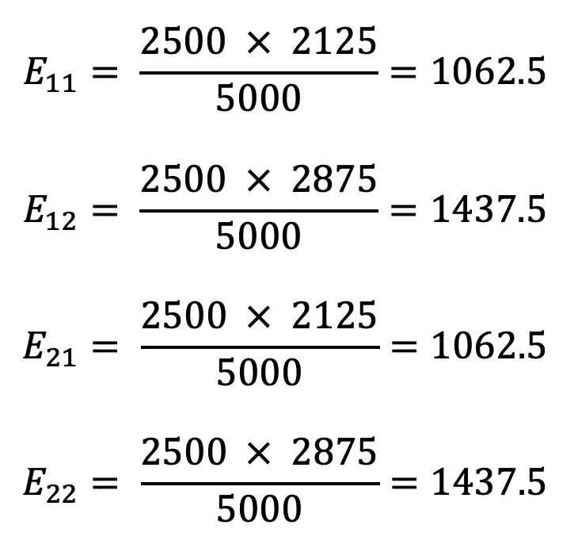
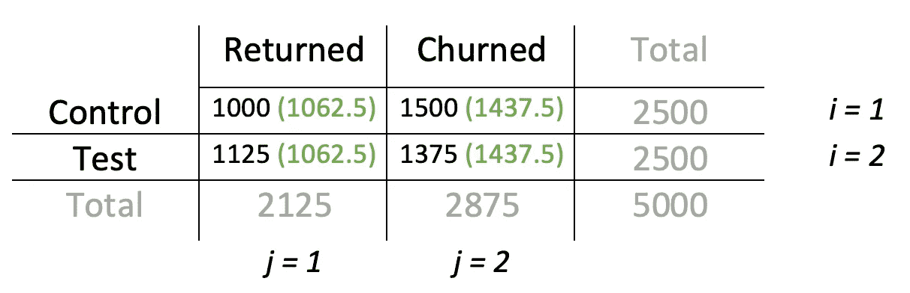
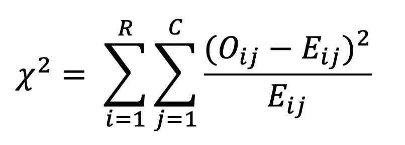
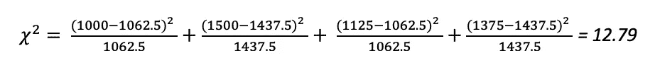
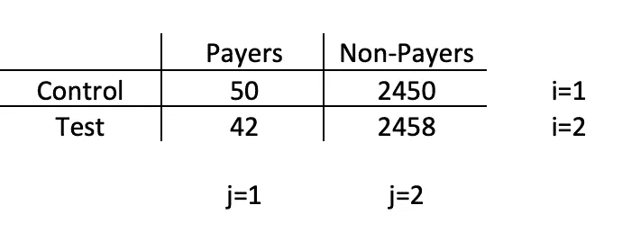
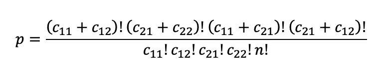
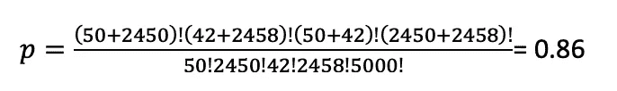

# A/B 测试终极指南。第 4 部分:非参数检验

> 原文：<https://towardsdatascience.com/the-ultimate-guide-to-a-b-testing-part-4-non-parametric-tests-4db7b4b6a974?source=collection_archive---------17----------------------->



A/B 测试是一种非常流行的技术，用于检查产品中的细微变化，而不会错误地考虑由外部因素引起的变化。在这一系列的文章中，我将尝试给出一个简单的关于如何设计、运行和评估 a/b 测试结果的操作手册，这样你就可以得到这些惊人的统计显著结果了！

*在部分* [***中，一个***](https://medium.com/swlh/the-ultimate-guide-to-a-b-testing-part-1-experiment-design-8315a2470c63) *和* [***两个***](/the-ultimate-guide-to-a-b-testing-part-2-data-distributions-5ed429abbce) *中，我们已经讨论了在运行 a/b 测试之前样本大小的估计和最常见的概率分布，它们实际上描述了您的数据是如何形成的。在* [***第三部分***](/the-ultimate-guide-to-a-b-testing-part-3-parametric-tests-2c629e8d98f8) *中，我们谈到了两种类型的测试(参数测试和非参数测试)以及何时以及如何使用参数测试。*

如果你读了上一部分( [***第三部分***](/the-ultimate-guide-to-a-b-testing-part-3-parametric-tests-2c629e8d98f8) )，你可能还记得我们在调查新的合作模式如何影响游戏的指标，并发现会话长度增加 1 分钟具有统计学意义(使用学生的 T 检验)。

因此，现在是时候检查我们的货币化指标是否有所下降，以及 5%的留存增长是否显著了？

简单提醒一下 A/B 测试的设置:

> 在过去的几年里，我们一直在开发这款令人惊叹的街机游戏，事情似乎进展得相当顺利。但在某个时候，社区开始要求合作模式。经过一些讨论后，游戏团队决定开发新的模式，并运行 A/B 测试来检查它如何影响指标。
> 
> 我们对 2500 个用户的测试组(与控制组的规模相同)进行了 A/B 测试，得到了以下结果:
> 
> -平均会话时间从 8 分钟增加到 9 分钟(具有统计学意义的结果)
> 
> -第一天的保留率从 40%增加到 45%
> 
> -与此同时，转换率从 2%降至 1.7%

因此，当团队在庆祝平均会话的增长时，是时候弄清楚我们的保留和转换是否真的发生了变化，或者这些只是数据的波动。

但是与平均会话长度不同，这两个指标不是正态分布的，因此需要使用非参数测试。

# 非参数检验

非参数统计检验用于连续数据不服从正态分布或数据离散的情况，因此我们不能应用通常的参数方法，如 T 检验或 ANOVA。

最受欢迎的非参数检验是**皮尔逊卡方检验、费希尔精确检验**T2 检验和**曼恩-惠特尼 U 检验。**

对于我们的示例，让我们使用**卡方**来检查保持率，并使用 **Fisher 精确** **测试**来进行转换(因为该指标数据非常不平衡)。

# 皮尔逊卡方检验

当您有两个或更多类别，并且想要检查它们之间是否有显著差异时，此测试仅对分类数据有效。

让我们应用这个测试来检查 5%的保留率增长是否具有统计学意义。

在我们的例子中，有两个类别:流失和回归玩家，零假设声称回归玩家的数量和新的合作模式之间没有相关性，因此回归玩家百分比的 5%差异只是一个概率问题。另一种假设更乐观:我们通过增加新的游戏模式增加了留存率。

首先，让我们将数据放在一个表格中，看看有哪些类别:



卡方检验基于表中每个单元格的观察值和期望值之间的差异:

*   **观察值**非常简单——这些是我们在表格中已经有的数字
*   **预期值**是如果关于对照组和测试组之间没有差异的零假设是正确的，我们将得到的值

因此，第二步是使用以下公式计算每个单元格的期望值:


在我们的例子中，计算看起来像这样:



***注*** *:因为在我们的例子中，对照组和测试组的总数相等(各为 2500)，期望值也相等，但当 a/b 测试组的规模稍有不同时，情况就不同了。*

让我们将结果和观察值一起放入表格中:



在计算每个单元格的期望值后，我们最终得到卡方检验的值:



这里 R -行数，C -表中的列数，Oij 和 Eij 是每个单元格的观察值和期望值。

应用该公式后，我们得到卡方等于 12.79:



最后一步是检查卡方的临界值，但是我们需要知道数据的自由度:每个卡方分布有不同数量的自由度，因此有不同的临界值。我们可以将其计算为(R-1)(C-1)，在我们的例子中是 1。

所以总而言之，α = 0.05 的临界值是 3.841，低于我们的 12.79，我们可以拒绝零假设，高兴地报告游戏性的变化让我们的留存增加了 5%！

测试用例得分多一个目标！2–0!在这一点上，我们可以得出结论，新的合作模式吸引了玩家，并对游戏产生了积极影响。

但是有了这些热情，让我们不要忘记货币化！正如我们所看到的，在测试组中，它从 2%下降到了 1.7%，这让董事会非常不安。

# **费雪精确的** **测试**

Fisher 精确检验是一种非参数检验，当数据集很小或类别不平衡时，它通常用作卡方检验的替代方法。

在我们的付费转换案例中，类别是高度不平衡的:测试组和对照组中只有 1.7-2%的付费玩家，其余 98%都是不付费的，所以我们可以应用 Fisher 的方法来检查转换从 2%下降到 1.7%是否真的有意义。

正如卡方检验一样，Fisher 检验使用表来表示所有可能的检验值，但它计算观察表中所见分布的确切概率(即 p 值)或甚至更极端的分布，这就是为什么它是一个“确切”的检验。

与之前的测试一样，我们从表格开始:



在这种情况下，零假设是测试组中玩家的付费人数与对照组相同，另一个假设是测试组中付费人数较少。

费希尔检验计算出结果至少与数据一样极端，甚至更极端的概率，这意味着测试组中的支付者甚至更少。

计算概率的公式是:



其中 Cij 是第 I 行第 j 列中的单元格，n —表格中观察值的总数。

根据我们的数据，公式将如下所示:



虽然 ***5000！*** 看起来很恐怖，使用 Python 和 Scipy 库很容易计算:

```
from scipy.stats import fisher_exactoddsratio, pvalue = fisher_exact([[50, 2450], [42, 2458]])
```

p 值等于 0.86，高于临界 0.05，因此我们不能拒绝零假设，并愉快地报告转化率下降 0.3%在统计上不显著。

我们可以得出结论，实验的结果非常好:从一个角度来看，我们的参与度有所增长，从另一个角度来看，货币化的减少并不明显，这对于业务来说是至关重要的，因此该功能可以推广到所有受众。

话虽如此，我们已经讨论了最流行的参数和非参数统计方法，是时候来点概率性的了…所以下次我们将讨论贝叶斯测试。敬请期待！