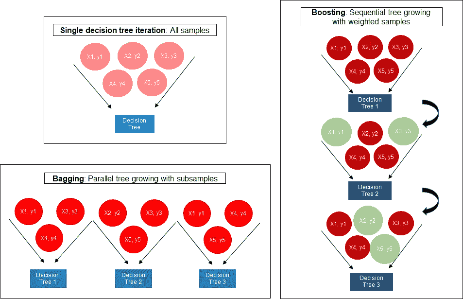
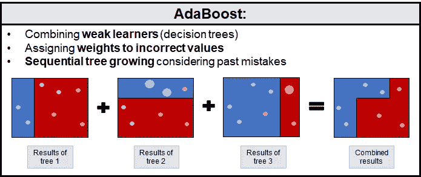
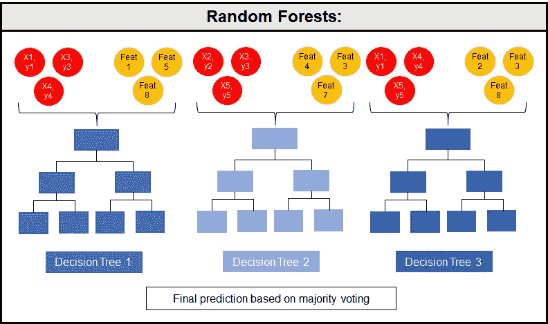
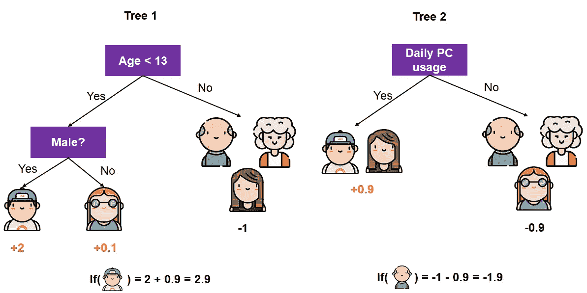
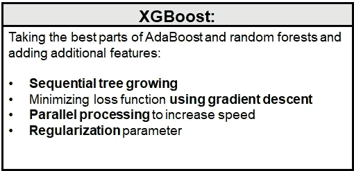

# AdaBoost、随机森林和 XGBoost 的终极指南

> 原文：<https://towardsdatascience.com/the-ultimate-guide-to-adaboost-random-forests-and-xgboost-7f9327061c4f?source=collection_archive---------0----------------------->

资料来源:朱莉娅·尼库尔斯基。

## 它们是如何工作的，有何不同，何时应该使用？

[kaggle](http://kaggle.com) 上的很多内核都使用基于树的集成算法来解决有监督的机器学习问题，比如 [AdaBoost](https://scikit-learn.org/stable/modules/generated/sklearn.ensemble.AdaBoostRegressor.html) 、[随机森林](https://scikit-learn.org/stable/modules/generated/sklearn.ensemble.RandomForestRegressor.html)、 [LightGBM](https://lightgbm.readthedocs.io/en/latest/) 、 [XGBoost](https://xgboost.readthedocs.io/en/latest/#) 或者 [CatBoost](https://catboost.ai/docs/) 。也许你以前也使用过它们，但是你能解释一下它们是如何工作的，为什么要选择它们而不是其他算法吗？以下段落将概述基于树的集成算法的一般好处，描述打包和增强的概念，并解释和对比集成算法 AdaBoost、随机森林和 XGBoost。

# 基于树的集成算法

集成算法，尤其是那些利用决策树作为弱学习器的算法，与其他算法相比具有多种优势(基于[本文](https://www.sciencedirect.com/science/article/pii/S1383762109000605)、[这一](https://link.springer.com/chapter/10.1007/3-540-45014-9_1)和[这一](https://www.researchgate.net/publication/275641579_COMPARISON_OF_MACHINE_LEARNING_ALGORITHMS_RANDOM_FOREST_ARTIFICIAL_NEURAL_NETWORK_AND_SUPPORT_VECTOR_MACHINE_TO_MAXIMUM_LIKELIHOOD_FOR_SUPERVISED_CROP_TYPE_CLASSIFICATION)):

1.  他们的算法很容易理解和可视化:描述和绘制一个决策树可以说比向你的祖母描述支持向量机更容易
2.  它们是**非参数**，不假设或要求数据遵循特定的分布:这将节省您将数据转换为正态分布的时间
3.  它们可以**处理混合数据类型**:分类变量不一定必须是热编码的
4.  **特征**的多重共线性**不影响模型的准确性**和预测性能:不需要移除特征或以其他方式设计以减少它们之间的相关性和相互作用
5.  它们对过拟合 : 具有**鲁棒性，因为它们使用许多欠拟合(高偏差)的弱学习器，并将这些预测组合成一个更强的学习器，它们减少了模型的过拟合(方差)**
6.  它们对异常值和噪声相对**稳健** : 一般来说，它们会很好地处理噪声数据(例如对目标没有影响的特征)或异常值(例如极值)，对整体性能几乎没有影响(这一点对于 AdaBoost 是有争议的；更多信息请见下文)
7.  输入**不需要缩放**:不需要使用最小最大缩放器或标准缩放器对特征进行预处理和转换
8.  它们在计算上相对便宜:与支持向量机或神经网络等算法相比，它们速度更快
9.  他们通常比他们的弱学习者表现得更好**:与 boosting 和 bagging 算法相比，决策树由于其高方差/过拟合而不太准确**

# 增压和装袋

单次迭代、打包和提升算法概述。资料来源:朱莉娅·尼库尔斯基。

boosting 和 bagging 的概念是理解这些基于树的集合模型的核心。 [**Boosting**](https://pdfs.semanticscholar.org/5fb5/f7b545a5320f2a50b30af599a9d9a92a8216.pdf) 描述了将许多弱学习者组合成一个非常精确的预测算法。弱学习者指的是只比随机预测略好的学习算法。例如，当查看基于树的集成算法时，单个*决策树*将是*弱学习器*，并且多个弱学习器的*组合*将产生 *AdaBoost* 算法。boosting 方法是一种顺序算法，它对整个训练样本的 *T* 轮进行预测，并使用来自前一轮预测准确性的信息迭代地提高 boosting 算法的性能(有关更多详细信息，请参见[本文](https://pdfs.semanticscholar.org/5fb5/f7b545a5320f2a50b30af599a9d9a92a8216.pdf)和[这篇中型博客文章](https://medium.com/greyatom/a-quick-guide-to-boosting-in-ml-acf7c1585cb5))。

[**装袋**](https://link.springer.com/content/pdf/10.1023/A:1010933404324.pdf) 另一方面是指无顺序学习。对于 *T* 轮，从训练样本中随机抽取样本子集(替换)。这些抽签中的每一次都独立于前一轮的抽签，但具有相同的分布。这些随机选择的样本然后被用于生长决策树(弱学习者)。然后选择最受欢迎的类别(或回归问题中的平均预测值)作为最终预测值。装袋方法也被称为*自举*(更多细节参见[本](https://link.springer.com/content/pdf/10.1023/A:1007607513941.pdf)和[本](https://link.springer.com/content/pdf/10.1023/A:1010933404324.pdf)论文)。

# adaboost 算法

AdaBoost 算法是 boosting 算法家族的一部分，由 [Freund & Schapire 于 1996 年](https://pdfs.semanticscholar.org/5fb5/f7b545a5320f2a50b30af599a9d9a92a8216.pdf)首次推出。它将决策树作为弱学习器连续生长，并通过在每一轮预测后给错误预测的样本分配较大的权重来惩罚它们。这样，算法正在从以前的错误中学习。最终的预测是加权多数票(或者在回归问题的情况下是加权中值)。

用于分类问题的 AdaBoost 算法的**伪代码**如下所示，改编自 1996 年[Freund&Schapire](https://pdfs.semanticscholar.org/5fb5/f7b545a5320f2a50b30af599a9d9a92a8216.pdf)(关于回归问题，请参考基础论文):

对于 *T* 回合中的 *t* :

1.  通过归一化权重向量 *w 来计算分布*p*(*第一轮的 *w* 中的初始权重为 *1/N* ，其中 *N* 表示标记的样本数)
2.  使用分布 *p* 生成弱学习器(决策树)；返回假设 *h* 以及每个示例的预测值
3.  计算 *h* 的误差项 *ε*
4.  将 *β* 与*ε/(1-*ε)赋值
5.  将权重向量更新为 *w = w*β* ，以便性能差的预测将具有较高的权重，而性能好的预测将具有较低的权重

输出:最终假设是所有 *T* 弱学习者加权多数投票的结果

用于分类问题的 AdaBoost 算法综述及可视化。较大的点表示这些样本先前被错误分类，并被赋予较高的权重。资料来源:朱莉娅·尼库尔斯基。

AdaBoost 算法固有某些**优点** **和缺点**。AdaBoost 对低噪声数据集中的过拟合相对鲁棒(参见[rt sch 等人(2001)](https://link.springer.com/content/pdf/10.1023/A:1007618119488.pdf) )。AdaBoost 只有[几个超参数](https://arxiv.org/pdf/1710.04725.pdf)需要调整以提高模型性能。此外，该算法易于理解和可视化。然而，对于有噪声的数据，AdaBoost 的性能存在争议[一些人认为](https://pdfs.semanticscholar.org/5fb5/f7b545a5320f2a50b30af599a9d9a92a8216.pdf)它概括得很好，而[其他人则表明](http://parnec.nuaa.edu.cn/%5C/pubs/songcan%20chen/journal/2016/SBKBS-2016.pdf)有噪声的数据导致性能不佳，因为算法在学习极端情况和扭曲结果上花费了太多时间。与 random forests 和 XGBoost 相比，AdaBoost 在模型中包含不相关的功能时表现更差，正如我对自行车共享需求的[时间序列分析](/go-highly-accurate-or-go-home-61828afb0b13)所示。此外，AdaBoost 没有针对速度进行优化，因此比 XGBoost 慢得多。

要调整的[相关**超参数**](https://arxiv.org/pdf/1710.04725.pdf) 限于弱学习器/决策树的*最大深度*、*学习速率*和*迭代/回合数*。学习率平衡了每个决策树对整个算法的影响，而最大深度确保了样本不会被记住，但模型会用新数据很好地概括。

以上信息表明，AdaBoost 最适合**在低噪声数据集**中使用，此时计算复杂性或结果的及时性不是主要问题，并且由于用户缺乏时间和知识，没有足够的资源进行更广泛的超参数调整。

# 随机森林

随机森林算法由 Breiman 于 2001 年开发，基于 bagging 方法。该算法通过为生长树的每次迭代随机选择子样本来引导数据。增长是并行发生的，这是 AdaBoost 和随机森林之间的[关键区别](https://www.cse.wustl.edu/~ychen/public/OAE.pdf)。随机森林通过组合许多欠适应的弱学习者来实现过适应的减少，因为它们仅利用所有训练样本的子集。AdaBoost 和随机森林的另一个区别是，后者只选择随机的特征子集包含在每棵树中，而前者包含所有树的所有特征。

根据 [Parmer et al. (2014)](https://www.researchgate.net/profile/Hitesh_Parmar6/publication/268509189_Sentiment_Mining_of_Movie_Reviews_using_Random_Forest_with_Tuned_Hyperparameters/links/546db7d50cf2a7492c55d7eb/Sentiment-Mining-of-Movie-Reviews-using-Random-Forest-with-Tuned-Hyperparameters.pdf) ，随机森林的**伪码**如下所示:

对于第 *T* 轮中的 T(其中 *T* 是生长的树的数量):

1.  从训练集中随机抽取一个替换样本 *s*
2.  递归重复以下步骤，直到树的预测不再提高:

2.1.从所有可用功能中随机选择 *f* 个功能 *F*

2.2.选择信息增益最大的特征

2.3.此功能用于拆分树的当前节点

输出:所有 *T* 树的多数投票决定最终的预测结果

随机森林算法的可视化。训练样本和特征的子样本用于生长多个弱学习器(决策树)。资料来源:朱莉娅·尼库尔斯基。

随机森林是一种非常受欢迎的算法，因为它非常准确，对噪声和异常值相对鲁棒，速度快，可以进行隐式特征选择，并且易于实现、理解和可视化(更多详细信息[此处](https://link.springer.com/content/pdf/10.1023/A:1010933404324.pdf))。与 AdaBoost 相比，随机森林的主要**优势**是它受噪声的影响更小，并且它可以更好地概括减少方差，因为随着树木数量的增加，概括误差达到极限(根据中心极限定理)。然而，随机森林的一个**缺点**是因为相关参数的数量更多，所以需要[更多的超参数调整](https://arxiv.org/pdf/1706.09865.pdf)。此外，随机森林将随机性引入到训练和测试数据中，这并不适合所有数据集(更多细节见下文)。

要考虑的**超参数**包括*特征数量*、*树数量*、*树的最大深度*、是否*引导*样本、分割前节点中剩余的*最小样本数量以及*最后叶节点中剩余的*最小样本数量(基于[此](https://arxiv.org/pdf/1706.09865.pdf)、[此](https://www.researchgate.net/profile/Hitesh_Parmar6/publication/268509189_Sentiment_Mining_of_Movie_Reviews_using_Random_Forest_with_Tuned_Hyperparameters/links/546db7d50cf2a7492c55d7eb/Sentiment-Mining-of-Movie-Reviews-using-Random-Forest-with-Tuned-Hyperparameters.pdf)[一般来说，训练阶段过于复杂会导致过度拟合。因此，应选择较少数量的特征(大约三分之一)。较大数量的树倾向于产生较好的性能，而分裂前每个叶片的最大深度和最小样本数量应该相对较低。](https://www.researchgate.net/profile/Hitesh_Parmar6/publication/268509189_Sentiment_Mining_of_Movie_Reviews_using_Random_Forest_with_Tuned_Hyperparameters/links/546db7d50cf2a7492c55d7eb/Sentiment-Mining-of-Movie-Reviews-using-Random-Forest-with-Tuned-Hyperparameters.pdf)*

在处理时间序列数据或任何其他应避免前瞻偏差且需要确保样本顺序和连续性的数据时，不应使用随机森林**(参考我的 [TDS 帖子](/go-highly-accurate-or-go-home-61828afb0b13)关于 AdaBoost、随机森林和 XGBoost 的时间序列分析)。这种算法可以相对较好地处理噪声，但与 AdaBoost 相比，需要用户掌握更多知识才能充分调整算法。**

# **XGBoost**

**XGBoost(e**X**treme**G**radient**Boost**ing)是一个相对较新的算法，由[陈& Guestrin 在 2016](https://dl.acm.org/doi/abs/10.1145/2939672.2939785) 年推出，利用了梯度树 boosting 的概念。开发 XGBoost 是为了提高速度和性能，同时引入正则化参数来减少过拟合。梯度增强树在顺序学习过程中使用回归树(或 [CART](https://machinelearningmastery.com/classification-and-regression-trees-for-machine-learning/) )作为弱学习器。这些回归树类似于决策树，然而，它们使用分配给每个叶子(即，树完成生长后的最后一个节点)的连续分数，该分数被累加并提供最终预测。对于生成树 *t* 的每次迭代 *i* ，计算预测某个结果 *y* 的得分 *w* 。学习过程的目标是[最小化总得分](https://medium.com/greyatom/a-quick-guide-to-boosting-in-ml-acf7c1585cb5)，总得分由 *i-1* 处的损失函数和 *t* 的新树结构组成。这允许算法顺序地生长树并从先前的迭代中学习。然后使用梯度下降来计算每片叶子的最优值和树 *t* 的总得分。分数也被称为树的预测的杂质。**

****

**使用连续分数提供最终预测的树集合模型的可视化。来源:茱莉亚·尼库尔斯基根据[陈&guest rin(2016)](https://dl.acm.org/doi/abs/10.1145/2939672.2939785)；由 [Freepik](https://www.flaticon.com/authors/freepik) 从 [Flaticon](https://www.flaticon.com) 制作的图标。**

**上述算法中的损失函数包含正则化或惩罚项ω，其目标是降低回归树函数的复杂性。该参数可以调整，可以取等于或大于 0 的值。如果设置为 0，那么梯度增强树和 XGBoost 的预测结果没有区别。此外，Chen & Guestrin 将收缩(即学习率)和列子采样(随机选择特征子集)引入到这种梯度树提升算法中，这允许进一步减少过拟合。因此，它将 AdaBoost(学习率)和随机森林(列或特征子采样)中引入的处理过拟合的方法添加到随机梯度下降模型中的正则化参数中。**

****

**XGBoost 算法的最相关功能概述。资料来源:朱莉娅·尼库尔斯基。**

**与 AdaBoost 等其他算法相比，XGBoost 的主要**优势**是其闪电般的速度，以及其成功减少方差的正则化参数。但即使不考虑正则化参数，该算法也利用了学习率(收缩)和来自随机森林等特征的子样本，这增加了它进一步推广的能力。**然而**，与 AdaBoost 和 random forests 相比，XGBoost 更难理解、可视化和调优。有许多超参数可以通过调整来提高性能。**

**举几个相关的**超参数**:已经提到了*学习率*、*列子采样*和*正则化率*。此外，*子样本*(引导训练样本)*树的最大深度*、用于分裂的*子注释中的最小权重*以及*估计器数量*(树)也经常用于解决偏差-方差-权衡。虽然子音符中的估计器、正则化和权重的数量的较高值与减少的过拟合相关联，但是学习速率、最大深度、子采样和列子采样需要具有较低值以实现减少的过拟合。然而，极值将导致[模型](https://arxiv.org/ftp/arxiv/papers/1901/1901.08433.pdf)的欠拟合。**

**当速度和高精度至关重要时，XGBoost 是一个特别有趣的算法。然而，需要更多的资源来训练模型，因为模型调整需要用户更多的时间和专业知识来实现有意义的结果。**

# ****结论****

**何时使用哪种算法取决于您的数据集、资源和知识。我希望这篇概述能更清楚地说明基于树的集成算法的一般优势，AdaBoost、随机森林和 XGBoost 之间的区别，以及何时实现它们中的每一个。**

**注意:这篇博文是基于我写的一篇未发表的关于基于树的集成算法的研究论文的一部分。**

**你想在媒体上阅读更多高质量的故事吗？考虑注册一个支持我和其他媒体作者的会员。**

** [## 通过我的推荐链接加入 Medium-Julia Nikulski

### 作为一个媒体会员，你的会员费的一部分会给你阅读的作家，你可以完全接触到每一个故事…

medium.com](https://medium.com/@julia.nikulski/membership)** 

**你有没有想过是什么决定了一部电影的成功？看看我用 AdaBoost、XGBoost 和 LightGBM 预测电影收入的项目**。****

** [## 使用 AdaBoost、XGBoost 和 LightGBM 预测电影收入

### 哪些指标决定了电影的成功？

towardsdatascience.com](/predicting-movie-revenue-with-adaboost-xgboost-and-lightgbm-262eadee6daa)**