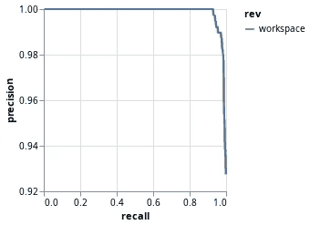
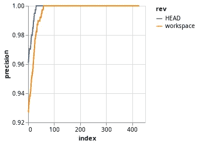

# 使用 DVC 构建可维护机器学习管道的最终指南

> 原文：<https://towardsdatascience.com/the-ultimate-guide-to-building-maintainable-machine-learning-pipelines-using-dvc-a976907b2a1b?source=collection_archive---------13----------------------->

## [视频教程](https://towardsdatascience.com/tagged/video-tutorial)

## 学习使用 DVC 构建可维护的机器学习管道的原则

视频教程

当我的 ML 项目开始发展时，我通常会感到焦虑，因为:**一切都开始变得混乱**、**和*我知道它变得一团糟*、**但是**我不知道如何改进它**。我喜欢使用开源工具和框架，因为随着项目的发展，贡献者的知识会“嵌入”其中。对我来说，这意味着如果我在构建可复制的机器学习管道方面没有太多经验，如果**我使用一个由拥有丰富构建经验的人创造的工具**，我实际上是在我的项目中使用他们的原则**(以及学习)。**

[DVC](https://dvc.org/) 是一个**机器学习项目**的开源版本控制系统。起初，我以为它只是一个大文件的 Git，但是这个系统实际上满足了我对实验和管道管理的所有需求。他们最近发布了 [DVC 1.0](https://dvc.org/blog/dvc-1-0-release) 以及新的[入门指南](https://github.com/iterative/example-get-started)，我用它作为本教程的起点。

今天我将向你展示如何使用 DVC 构建可复制的机器学习管道。你可以在这里查看最终代码[。说够了，我们开始吧！](https://github.com/dmesquita/dvc_pipelines_and_experiments_tutorial)


感谢 [@realaxer](https://unsplash.com/@realaxer) 这张[酷图](https://unsplash.com/photos/9AxFJaNySB8)！；)

# 我们将要建造的东西

让我们**建立一个模型来** **对 20 个新闻组数据集**进行分类。为了简化评估阶段，我们将只使用两个类别。这是完成该任务的主要脚本:

训练分类器的主脚本

编写干净且可维护的代码的一个好的工作流程是**总是不断提高代码的质量**。可以做实验看看是否有效(就像我们在上面`main.py`做的那样)。既然我们知道我们要构建什么，我们可以采取下一步，让代码更易于维护。

# 💡利用 DVC 建造管道的原理

如果我们仔细看看`main.py`，我们可以将脚本分解成那些著名的机器学习步骤:

> 1-收集数据
> 
> 2-生成特征
> 
> 3-训练模型
> 
> 4 —评估模型

现在我们有了步骤，**这些是使用 DVC** 构建可维护管道的原则:

*   **为每个步骤编写一个 python 脚本**
*   **将每个脚本使用的参数**保存在`yaml`文件中
*   指定每个脚本**依赖的文件**
*   指定文件每个脚本**生成**

让我们安装 DVC，看看如何实现这些步骤。

# 🔨安装 DVC

我使用的是 Linux，我们将**安装 DVC 作为 Python 库**。为了跟进，您应该在您的环境中安装 **Python 3、pip** 和 **Git** 。我们将为项目创建一个虚拟环境(提示:如果你关心管理你的项目，你应该总是这样做)。DVC 在 Git 存储库中工作得最好，所以我们将在启动 DVC 项目之前初始化一个:

```
$ mkdir dvc_tutorial
$ cd dvc_tutorial$ python3 -m venv .env
$ source .env/bin/activate
(.env)$ pip3 install dvc
(.env)$ **git init**
(.env)$ **dvc init**
```

我们准备好出发了。现在让我们实现每一步。

# 📍1—“收集数据”步骤

我们使用 Scikit 的`fetch_20newsgroups()`方法将数据加载到内存中，但是我想将它保存到一个文件中，这样我就可以将它作为管道下一步的依赖项。因此，在这个脚本中，我将**收集数据并将其保存到 csv 文件**。

我们将此阶段的名称设为**准备**。

一开始我使用了三个类别(`['comp.graphics', 'sci.space', 'rec.sport.basecball']`)，但是当我到了评估阶段，我想如果我只使用两个类别，这个教程会更简单。然后我不得不**再次构建数据集**，**用这些类别指定新列表**。这向我展示了使用**类别**作为这个脚本的参数是一个好主意。DVC 使用一个`params.yam`文件作为默认参数文件，所以让我们创建一个并在那里定义类别:

```
# file params.yaml**prepare:**
 **categories:**
        - comp.graphics
        - sci.space
```

`prepare`是阶段的名称，`categories`是参数的名称，为了使用`yaml`创建一个列表，我们在每个项目前添加一个`-`。

我想把数据保存到一个`data/prepared`文件夹中，所以我们将使用脚本来完成这个任务。下面是最终的`prepare.py`文件:

为了执行这一阶段的管道，我们只依赖于**脚本代码文件**，我们将**将脚本生成的文件**保存在`data/prepared`文件夹中。现在我们有了构建这一步的所有组件:

*   **写一个 python 脚本:** `prepare.py`
*   **保存参数:`params.yaml`内的** `categories`
*   指定脚本**依赖的文件:**
*   指定脚本**生成的文件**:**文件夹`data/prepared`**

**为了保持有序，我们将脚本保存在一个`src`文件夹中，所以让我们创建一个:**

```
(.env)$ mkdir src
(.env)$ cd src **# now save the prepare.py file here**
```

**您的`dvc_tutorial`文件夹的内容应该如下所示:**

```
├── params.yaml
└── src
    └── prepare.py
```

**所有设置，现在让我们学习如何使用 DVC 建立这个阶段。**

## **⏺ dvc 运行——使用 dvc 构建阶段**

**DVC 将管道阶段保存在一个`dvc.yaml`文件(人类可读)和一个`dvc.lock`(这仅用于 DVC)。我们使用`**dvc run**`命令创建一个流水线阶段。这些是主要选项:**

```
**-n <stage>**: specify a name for the stage generated by this command**-p [<path>:]<params_list>**: specify a set of [parameter dependencies](https://dvc.org/doc/command-reference/params) the stage depends on**-d <path>**: specify a file or a directory the stage depends on**-o <path>**: specify a file or directory that is the result of running the command
```

**设置完这些选项后，我们添加一个命令参数，指定**如何实际运行管道**的这一步。在该步骤中，命令将是`python3 src/prepare.py`。让我们首先安装`prepare.py`需要的依赖项:**

```
(.env)$ pip install pyyaml scikit-learn pandas
```

**现在让我们运行`**dvc run**`命令来生成阶段:**

```
(.env)$ **dvc run -n prepare -p prepare.categories -d src/prepare.py -o data/prepared python3 src/prepare.py***Running stage 'prepare' with command:                                           
        python3 src/prepare.py
Creating 'dvc.yaml'                                                                                                                                
Adding stage 'prepare' in 'dvc.yaml'
Generating lock file 'dvc.lock'**To track the changes with git, run:**git add dvc.yaml data/.gitignore dvc.lock*
```

**现在你的文件夹显示如下:**

```
**├── data
│   └── prepared
│       ├── test.csv
│       └── train.csv**
**├── dvc.lock
├── dvc.yaml**
├── params.yaml
└── src
    └── prepare.py
```

**以下是 DVC 自动生成的`dvc.yaml`文件的内容:**

```
**stages:**
 **prepare:**
 **cmd:** python3 src/prepare.py
 **deps:**
    - src/prepare.py
 **params:**
    - prepare.categories
 **outs:**
    - data/prepared
```

**很简单，对吧？**

## **🔬dvc dag 使用 dvc 可视化管道**

**`**dvc dag**`命令显示流水线的阶段。到目前为止，我们只有一个阶段，但让我们看看:**

```
(.env)$ **dvc dag** *+---------+  
| prepare |  
+---------+  
~
~
/tmp/tmpixsrsfo0 (END)*
```

**您可以点击`**q**`隐藏可视化效果。**

## **⏯dvc 再现——使用 DVC 再现管道**

**`**dvc repro**`命令通过执行在[阶段](https://dvc.org/doc/command-reference/run)中定义的命令来复制全部或部分[管道](https://dvc.org/doc/command-reference/dag)。正如医生所说:**

> **DVC **高速缓存沿途的相关数据工件**并在流水线阶段递归搜索以**确定哪些已经改变**。然后它执行相应的命令。在执行生成输出的 stages 命令之前，输出会从工作区中删除。— [再现文件](https://dvc.org/doc/command-reference/repro)**

**酷，那我们测试一下吧(我还没做什么改动):**

```
(.env)$ **dvc repro***Stage 'prepare' didn't change, skipping                                         
Data and pipelines are up to date.*
```

**如果我更改了类别的名称会怎样？**

```
# file params.yamlprepare:
    categories:
        - comp.graphics
 **- rec.sport.baseball** # it was 'sci.space'
```

**然后再次运行该命令？**

```
(.env)$ **dvc repro***Running stage 'prepare' with command:                                           
        python3 src/prepare.py
Updating lock file 'dvc.lock'**To track the changes with git, run:**git add dvc.lock*
```

****它再次运行阶段**，因为我们添加了`**-p prepare.categories**` 作为这个阶段的参数。DVC 然后看到**我们改变了这个参数**和**再次跑台**。`dvc.yaml`文件仍然是一样的，但是如果你检查`dvc.lock`文件，你会看到那里的参数改变了。很神奇吧？**

**这些是**创建、运行和可视化**管道阶段的基础:**

*   **`**dvc run**`**
*   **`**dvc dag**`**
*   **`**dvc repro**`**

**现在让我们进入下一个管道步骤。**

# **📍2-“生成要素”步骤**

**我们将这个阶段的名称设置为**特征**。**

**在这一步，我们将使用 Scikit 的`TfidfVectorizer`并将转换后的矩阵保存到`data/features`文件夹中的 pickle 文件中。我们将依赖脚本文件和`data/prepared`文件夹，所以这是我们的配方:**

*   ****写一个 python 脚本:** `featurize.py`**
*   ****保存参数:** *【我们不需要任何】***
*   **指定脚本**依赖的文件:** `featurize.py`和`data/prepared`**
*   **指定脚本**生成的文件**:**文件夹`data/features`****

****这是最终的`featurize.py`文件:****

****你应该把它保存在`/src`文件夹中，然后像这样用 DVC 创建舞台:****

```
**(.env)$ **dvc run** -n featurize -d src/featurize.py -d data/prepared -o data/features python3 src/featurize.py data/prepared data/features**
```

****继续运行`**dvc dag**`命令来检查管道的新步骤。****

# ****📍3 —“训练模型”步骤****

****在这一阶段，我们将最终训练模型并将其保存到 pickle 文件中。我们将使用朴素贝叶斯分类器，并且只设置 alpha 参数。这是食谱:****

*   ******写一个 python 脚本:** `train.py`****
*   ******保存参数:`params.yaml`内的** `alpha`****
*   ****指定脚本**依赖的文件:** `train.py`和`data/features`****
*   ****指定脚本**生成的文件**:**文件`model.pkl`******

****首先，让我们添加新的`alpha`参数:****

```
**# file params.yamlprepare:
    categories:
        - comp.graphics
        - sci.space
**train:
    alpha: 0.1****
```

****然后将`train.py`脚本保存在`/src`中:****

****最后，用 DVC 创造舞台:****

```
**(.env)$ **dvc run** -n train -p train.alpha -d src/train.py -d data/features -o model.pkl python3 src/train.py data/features model.pkl**
```

# ****📍4 —“评估模型”步骤****

****在这一步中，我们将了解两个新的`**dvc run**`参数:`--metrics`和`--plots`:****

```
****-m <path>****:** specify a metrics file produced by this stage. This option behaves like -o but registers the file in a metrics field inside the dvc.yaml stage**--plots <path>:** specify a plot metrics file produces by this stage. This option behaves like -o but registers the file in a plots field inside the dvc.yaml stage**
```

****我们将使用曲线下的**面积(AUC)** 度量，并计算不同概率阈值的**精确召回对**来绘制图形。为此，我们将创建一个脚本来保存带有 AUC 分数的`scores.json`文件和带有精度/召回/阈值对的`plots.json`文件:****

****继续将这个`evaluate.py`脚本保存在`/src`文件夹中。****

****关于度量和绘图文件，我们有两个选项:****

*   ******让 DVC 跟踪度量/图表**文件或****
*   ******使用 Git** 跟踪指标/图表文件****

****由于在本教程中我们没有看到如何使用 DVC 来跟踪文件，我们将使用第二个选项，并使用 Git 来跟踪文件。为此，我们将使用`--metrics-no-cache`和`--plots-no-cache`命令。这是这个阶段的秘诀:****

*   ******写一个 python 脚本:******
*   ******保存参数:** *(我们不需要任何)*****
*   ****指定**脚本依赖的文件:** `evaluate.py`、`model.pkl`和`data/features`****
*   ****指定脚本**生成的文件:** *(无)*****
*   ******(新)**指定度量和绘图文件:`scores.json`和`plots.json`****

****好了，现在让我们创建最后一步:****

```
**(.env)$ **dvc run** -n evaluate -d src/evaluate.py -d model.pkl -d data/features **--metrics-no-cache** scores.json **--plots-no-cache** plots.json python3 src/evaluate.py model.pkl data/features scores.json plots.json**
```

## ****🏋🏿dvc 指标—使用 DVC 比较指标****

****`**dvc metrics**`命令让我们显示和比较指标。`**dvc metrics show**`打印度量值，而`**dvc metrics diff**`显示度量文件发生变化时度量值之间的差异(在用 Git 提交之前)。让我们来看看实际情况。****

****`**dvc metrics show**`允许我们查看当前得分:****

```
**(.env)$ **dvc metrics show**scores.json:                                                            
        auc: 0.9993366236676577**
```

****(☕️嗯，那股过度拟合的味道……但那不是今天的重点，所以我们继续😜)****

****让我们检查一下我们目前使用的参数:****

```
**# file params.yamlprepare:
    categories:
        - comp.graphics
        - rec.sport.baseball
train:
    alpha: 0.1**
```

****`**dvc metrics diff**`命令是在前一次提交和当前状态之间计算的，所以让我们首先提交这个实验:****

```
**(.env)$ git add src/ params.yaml dvc.yaml dvc.lock scores.json plots.json
(.env)$ git commit -m "exp: alpha=0.1"**
```

****现在，让我们首先更改 alpha 参数:****

```
**# file params.yamlprepare:
    categories:
        - comp.graphics
        - rec.sport.baseball
train:
    **alpha: 0.9****
```

****然后再次运行所有操作:****

```
**(.env)$ **dvc repro***Stage 'prepare' didn't change, skipping                                         
Stage 'featurize' didn't change, skipping
Restored stage 'train' from run-cache
Skipping run, checking out outputs
Updating lock file 'dvc.lock'**Restored stage 'evaluate' from run-cache
Skipping run, checking out outputs
Updating lock file 'dvc.lock'**To track the changes with git, run:**git add dvc.lock***
```

****我们可以通过`**dvc params diff**`看到参数差异:****

```
**(.env)$ **dvc params diff***Path         Param        Old    New                                            
params.yaml  train.alpha  0.1    0.9***
```

****最后，看看分数如何随`**dvc metrics diff**`变化:****

```
**(.env)$ **dvc metrics diff***Path         Metric    Value    Change                                          
scores.json  auc       0.99869  -0.00064***
```

## ****📊dvc 图—使用 DVC 可视化并比较*指标*****

****`**dvc plots**`命令将图形生成为 HTML 文件，可通过网络浏览器打开。这些 HTML 文件使用的是 [Vega-Lite](https://vega.github.io/vega-lite/) 。让我们画一条精确回忆曲线。`plots.json`文件如下所示:****

```
**# file plots.json{
  "proc": [
    {
      "precision": 0.927570093457944,
      "recall": 1.0,
      "threshold": 0.4513363759032511
    },
    {
      "precision": 0.927400468384075,
      "recall": 0.9974811083123426,
      "threshold": 0.45201756623495926
    },
    # [...]
  ]
}**
```

****我们想要一个在 y 轴上有精度，在 y 轴上有回忆的图，所以让我们建立一个:****

```
**(.env)$ **dvc plots show** -y precision -x recall plots.json**
```

********

****精确回忆曲线****

****我们甚至可以画出 alpha=0.1 和 alpha=0.9 的精度分数之间的差异****

```
**(.env)$ **dvc plots diff** --targets plots.json -y precision**
```

********

****不同的 alpha 值有不同的精度分数****

****我们的旅行到此结束。你可以在这里查看更多剧情选项和配置:【https://dvc.org/doc/command-reference/plots[。](https://dvc.org/doc/command-reference/plots)****

****本教程的最终代码是[这里](https://github.com/dmesquita/dvc_pipelines_and_experiments_tutorial)****

# ****结束语****

****使用 DVC 跟踪实验和管理机器学习管道真的可以让我们的项目更上一层楼。让你的 ML 项目可复制的关键是**为每个步骤和**创建单个 Python 脚本**指定每个脚本使用的参数、输入**和输出**。您可以通过一个简单的`**dvc run**`命令来实现，并使用`**dvc repro**`来运行您喜欢的管道。******

****除了实验和管道管理，DVC 还提供**版本控制和**部署和协作功能。你可以在这里和[这里](https://dvc.org/doc/use-cases/sharing-data-and-model-files)了解更多。****

****今天就到这里，感谢阅读！😁****