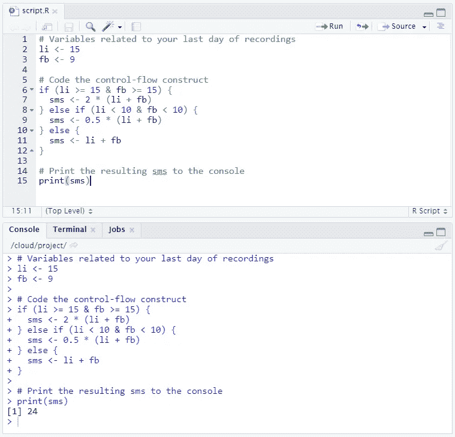

# R 语言中条件语句的最终指南

> 原文：<https://towardsdatascience.com/the-ultimate-guide-to-conditional-statements-in-r-25fee0a3e435?source=collection_archive---------9----------------------->

## 开始构建和使用条件语句所需了解的一切。


关系运算符告诉我们 R 对象是如何关联的，逻辑运算符允许我们组合逻辑值。R 提供了一种方法来使用这些操作符的结果来改变我们自己的 R 脚本的行为。这是通过`if`和`else`语句完成的。

# 如果语句

`if`语句需要一个条件；如果条件评估为`TRUE`，则执行与`if`语句相关的 R 代码。

```
if (condition) {
  expr
}
```

要检查的条件出现在括号内，而如果条件是`TRUE`，则必须执行的 R 代码跟随在花括号内(`expr`)。

这里有一个例子:

```
x <- -3
if (x < 0) {
  print("x is a negative number")
}
```

假设我们有一个变量`x`等于-3。如果这个`x`小于零，我们希望 R 打印出`“x is a negative number”`。我们可以通过使用`if`语句来做到这一点。我们先给变量`x`赋值，然后写`if`条件。

在这种情况下，将-3 赋给`x`，如果`x`小于 0 ( `x < 0`)，则将`if`条件设置为真。

如果我们运行示例代码，我们确实会看到字符串“x 是负数”被打印出来。


-3 < 0 为真，所以执行 print 语句。

但是，如果我们将`x`改为 5，并重新运行代码，则条件将为`FALSE`，并且不会执行 print 语句。


5 < 0 不成立，所以不执行 print 语句。

## 让你试试

假设给你以下变量:

*   `medium` —关于社交网站的信息
*   `num_views` —特定`medium`在您记录的社交简档查看量的最后一天的实际查看量

```
# Variables related to your last day of recordings
medium <- "LinkedIn"
num_views <- 14
```

编写一个`if`语句，如果`num_views`变量超过 15，则打印`"You are popular"`。

## 暗示

回想一下`if`语句的语法:

```
if (condition) {
  expr
}
```

下面是一个关于`medium`的 if 语句的例子，它打印出显示的是哪个社交网站:

```
if (medium == "LinkedIn") {
  print("Showing LinkedIn information")
}
```

## 解决办法

```
# Write the if statement for num_views
if (num_views > 15) {
  print("You are popular!")
}
```


在这种情况下，不会打印任何内容，因为视图数 14 没有超过 15。

# else 语句

`else`语句不需要显式条件；相反，它必须与一个`if`语句一起使用。每当`if`条件不为`TRUE`时，就会执行与`else`语句相关的代码。

```
if (condition) {
  expr1
} else {
  expr2
}
```

假设我们想为以下场景打印输出:

*   如果`x`小于 0，打印`“x is a negative number”`
*   如果`x`大于或等于 0，打印`“x is either a positive number or zero”`

每当不满足`x < 0`时，就会出现第二个条件。所以，我们可以简单地添加一个`else`语句。

```
x <- -3
if (x < 0) {
  print("x is a negative number")
} else {
  print ("x is either a positive number or zero")
}
```

如果我们运行`x`等于-3 的代码，我们将得到打印输出`“x is a negative number”`。


-3 < 0 is true, so the code inside the if statement is executed.

However, if 【 was 5 instead, then we would get the printout 【 . The 【 condition is not satisfied, so R turns to the expression in the else statement.


5 < 0 is not true, so the code inside the else statement is executed.

## For you to try

For this for you to try, you’ll be using the same variables as the previous for you to try.

```
# Variables related to your last day of recordings
medium <- "LinkedIn"
num_views <- 14
```

Code control structures using an 【 and 【 statement that accomplishes the following:

*   If 【 is LinkedIn, print 【 , otherwise, print 【 ".
*   If 【 exceeds 15 views, print 【 . If the 【 condition is not met, print 【 .

## Hint

Recall that you can only use an 【 statement in combination with an 【 statement. The 【 statement does not require a condition; its corresponding code is simply run if all the preceding conditions in the control structure are 【 . Here is the syntax for its usage:

```
if (condition) {
  expr1 
} else {
  expr2
}
```

*重要的是* `*else*` *关键字与* `*if*` *部分的右括号在同一行！*

## 解决办法

```
# Variables related to your last day of recordings
medium <- "LinkedIn"
num_views <- 14# Control structure for medium
if (medium == "LinkedIn") {
  print("Showing LinkedIn information")
} else {
  print("Unknown medium")
}# Control structure for num_views
if (num_views > 15) {
  print("You're popular!")
} else {
  print("Try to be more visible!")
}
```


# else if 语句

还有一些情况下，你想进一步定制你的程序。`else if`语句位于`if`和`else`语句之间。如果不满足第一个条件，则检查`else if`条件。如果满足第二个条件，那么就执行其中的代码。

```
if (condition1) {
  expr1
} else if (condition2) {
  expr2
} else {
  expr3
}
```

假设我们想要另一个打印输出，如果`x`正好等于 0。对于前面的代码块，这是不可能的。相反，我们将需要另一个条件检查。我们可以通过使用`else if`语句来实现这一点。

假设我们现在要打印出以下条件:

*   如果`x`小于 0，打印`“x is a negative number”`
*   如果`x`等于 0，打印`“x is zero”`
*   否则，打印出`“x is a positive number”`

我们可以通过添加`else if`和一个新的 print 语句来实现这一点，并修改我们在 else 语句上打印的消息。

```
x <- -3
if (x < 0) {
  print("x is a negative number")
} else if (x == 0) {
  print("x is zero")
} else {
  print("x is a positive number")
}
```

r 根据满足的条件处理这个控制结构。

在`x`为-3 的情况下，`if`语句的条件评估为`TRUE`，因此`“x is a negative number”`被打印出来，R 忽略其余语句。

如果`x`等于 0，R 将首先检查`if`条件，看到它是`FALSE`，然后将转向`else if`条件。这个条件`x==0`的计算结果是`TRUE`，所以`“x is zero”`被打印出来，R 完全忽略`else`语句。

如果`x`等于 5，则`if`条件评估为`FALSE`，并且`else if`条件也是如此，因此 R 执行`else`语句，打印`“x is a positive number”`。


一旦 R 偶然发现一个评估为`TRUE`的条件，R 就执行相应的代码，然后忽略控制结构的其余部分。如果您列出的条件不是相互排斥的，这就变得很重要。

考虑下面的例子，看看一个数是否能被 2 或 3 整除。

```
x <- -6
if (x %% 2 == 0) {
  print("divisible by 2")
} else if (x %% 3 == 0) {
  print("divisible by 3")
} else {
  print("not divisible by 2 nor by 3...")
}
```

当`x`等于 6 时，第一个条件求值为`TRUE`，所以 R 打印出`“divisible by 2”`。

然后，r 退出控制结构，不再查看其余的语句。因此，尽管第二个条件，对于`else if`部分，将计算为`TRUE`，但没有任何东西被打印出来。

## 让你试试

使用前面的代码进行尝试，将代码添加到两个控制结构中，这样:

*   如果`medium`等于“脸书”，r 打印出`"Showing Facebook information"`。请记住，R 区分大小写。
*   如果`num_views`在 15(含)和 10(不含)之间，打印出`"Your number of views is average"`。

## 暗示

`else if`语句允许您进一步定制您的控制结构。您可以添加任意多的`else if`语句。请记住，一旦发现条件`TRUE`并且执行了相应的表达式，R 将忽略剩余的控制结构。下面是语法的概述:

```
if (condition1) {
  expr1
} else if (condition2) {
  expr2
} else if (condition3) {
  expr3
} else {
  expr4
}
```

*同样，重要的是* `*else if*` *关键字出现在与控制结构的前一部分的结束括号相同的行上。*

## 解决办法

```
# Variables related to your last day of recordings
medium <- "LinkedIn"
num_views <- 14# Control structure for medium
if (medium == "LinkedIn") {
  print("Showing LinkedIn information")
} else if (medium == "Facebook") {
  print("Showing Facebook information")
} else {
  print("Unknown medium")
}# Control structure for num_views
if (num_views > 15) {
  print("You're popular!")
} else if (num_views <= 15 & num_views > 10) {
  print("Your number of views is average")
} else {
  print("Try to be more visible!")
}
```


注意，因为 R 一找到满足的条件就放弃控制流，所以如果第二个中的部分导致 num_views > 10，您可以简化 else 的条件。

## 给你尝试(2)

您可以在 if-else 构造中做任何想做的事情。你甚至可以放入另一组条件语句。

检查以下代码:

```
if (number < 10) {
  if (number < 5) {
    result <- "extra small"
  } else {
    result <- "small"
  }
} else if (number < 100) {
  result <- "medium"
} else {
  result <- "large"
}
print(result)
```

考虑以下陈述:

1.  如果`number`设置为 6，则`“small”` 被打印。
2.  如果`number`设置为 100，则`"medium"`被打印。
3.  如果`number`设置为 4，则`"extra small"`被打印。
4.  如果`number`设置为 2500，R 会产生错误，因为`result`不会被定义。

确定哪些陈述是正确的。

## 解决办法

1.  假设`number`是 6。`if`块(`number < 10`)的条件满足，所以我们进入第二个 if-else 流程。不满足第二流程(`number < 5`)的`if`条件，所以执行`else`代码(`result <- "small"`)。因此，语句“如果`number`设置为 6，`“small”` 将被打印”为**真**。
2.  假设`number`是 100。if 语句中的第一个条件(`number < 10`)和 else if 条件中的第二个条件(`number < 100`)不成立。因此，`else`块内的代码被执行，并且`"large"`被打印。“如果`number`设置为 100，则`"medium"`被打印”的陈述为**假**。
3.  假设`number`为 4。满足`if`块(`number < 10`)的条件，因此进入第二个 if-else 控制。满足第二个 if-else 控制(`number < 5`)的`if`条件，执行代码`return <- "extra small"`。因此，语句“如果`number`设置为 4，`"extra small"`将被打印”为**真**。
4.  假设`number`是 2500。这个数字既不小于 10，也不小于 100。因此，它不满足任何一个条件，而是执行`else`代码(`result <- “large”`)。因此,“如果`number`设置为 2500，R 将产生一个错误，因为`result`将不会被定义”的陈述为**假**。

# 挑战:条件和控制流

这个挑战结合了[关系操作符](/the-ultimate-guide-to-relational-operators-in-r-6d8489d9d947)、[逻辑操作符](/the-complete-guide-to-logical-operators-in-r-9eacb5fd9abd)和控制结构。

考虑两个变量:`li`和`fb`，表示你的 LinkedIn 和脸书个人资料昨天的浏览量。

```
# Variables related to yesterday's profile views.
li <- 15
fb <- 9
```

根据以下行为，基于`li`和`fb`的值生成一个“社交媒体分数”`sms`:

*   如果`li`和`fb`都是 15 或更大，设置`sms`等于`li`和`fb`之和的两倍。
*   如果`li`和`fb`都严格小于 10，则设置`sms`等于`li`和`fb`之和的一半。
*   在所有其他情况下，将`sms`设置为等于`li + fb`。

打印产生的`sms`变量。

## 暗示

```
# Code the control-flow construct
if (___ & ___) {
  sms <- 2 * (li + fb)
} ___ (___) {
  sms <- 0.5 * (li + fb)
} else {
  sms <- ___
}
```

## 解决办法

```
# Variables related to your last day of recordings
li <- 15
fb <- 9# Code the control-flow construct
if (li >= 15 & fb >= 15) {
  sms <- 2 * (li + fb)
} else if (li < 10 & fb < 10) {
  sms <- 0.5 * (li + fb)
} else {
  sms <- li + fb
}# Print the resulting sms to the console
print(sms)
```



执行 else 语句。

# 笔记

所有图片，除非特别注明，均归作者所有。横幅图像是使用 [Canva](https://www.canva.com/) 创建的。