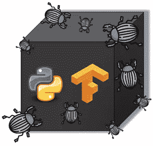
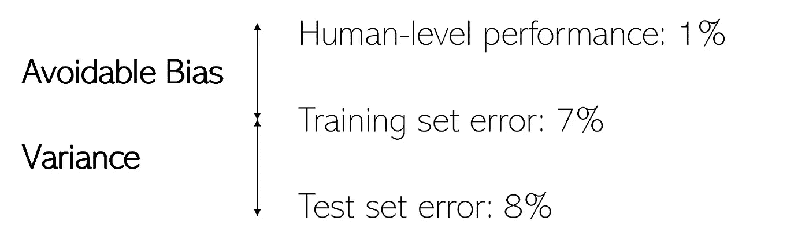
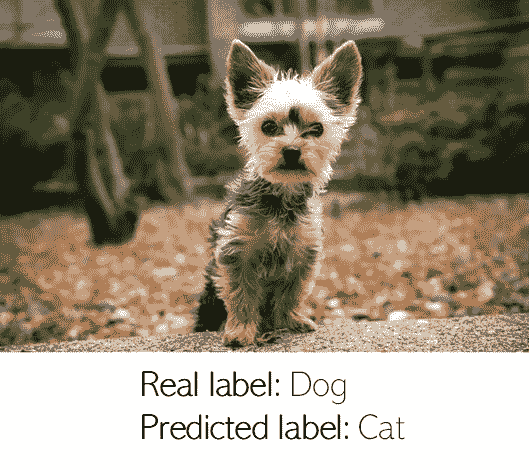

# 调试机器学习模型的终极指南

> 原文：<https://towardsdatascience.com/the-ultimate-guide-to-debugging-your-machine-learning-models-103dc0f9e421?source=collection_archive---------40----------------------->

## 如何评估结果并提高机器学习模型的性能

作者图片

您已经将数据分成了训练集、开发集和测试集，每个数据块中的样本百分比都正确，并且您还确保了所有这些数据块(特别是开发集和测试集)都来自相同的分布。

你已经做了一些探索性的数据分析，从这些数据中收集见解，T2 为手头的任务选择了最好的特性。您还选择了非常适合您的问题的评估指标。使用该指标，您将能够迭代和更改模型的超参数和配置，以获得最佳性能。

做完这一切，你预处理数据，准备数据，最后训练一个模型(比方说一个[支持向量机](/support-vector-machines-explained-25a685e4d228))。你耐心地等待，一旦它完成训练，你就可以评估结果，如下所示:

> 训练集误差:8%
> 
> 开发集误差:10%

我们应该如何看待这些结果？我们可以用什么来比较它们？我们如何改进它们？有可能做到吗？

在本帖中，我们将以简单易懂的方式回答所有这些问题。本指南不是关于在代码中设置断点或查看训练如何发展的调试指南。它是关于知道当你的模型被训练和建立时该做什么，如何正确地评估它的性能，以及如何改进它。

我们开始吧！

# 我们的模型与什么进行比较？

当我们构建第一个模型并获得第一轮结果时，总是希望将这个模型与一些已经存在的指标进行比较，以快速评估它做得有多好。为此，我们有两个主要策略:基线模型和人类水平的性能。

## 基线模型

基线模型是一个非常简单的模型，通常在某种任务中产生可接受的结果。这些由基线给出的结果，是你应该尝试用你的新的闪亮的机器学习模型来改进的。

简而言之，基线是解决问题的一种简单方法，可以给出足够好的结果，但它应该作为性能的起点。如果您构建的模型在某些数据上没有超过基线模型性能，那么您可能应该重新考虑您正在做的事情。

**让我们看一个例子来更好地了解这是如何工作的:**在自然语言处理(NLP)中，最常见的问题之一是情感分析:检测某个句子的情绪、感觉或情感，可能是积极的、中性的或消极的。可以做到这一点的一个非常简单的模型是[朴素贝叶斯](/probability-learning-v-naive-bayes-7f1d0466f5f1):它非常透明，训练速度快，通常会给出可接受的结果，然而，这些远不是最佳的。

想象一下，你收集[一些用于情感分析的标签数据](https://analyticsindiamag.com/10-popular-datasets-for-sentiment-analysis/)，预处理数据，训练一个朴素贝叶斯模型，得到 65%的准确率。因为我们将朴素贝叶斯作为这项任务的基线模型，所以我们构建的每一个进一步的模型，都应该以超过 65%的准确率为目标。如果我们训练一个[逻辑回归](/logistic-regression-explained-9ee73cede081)并获得 55%的性能，那么我们可能应该重新思考我们在做什么。

我们可能会得出结论，非神经模型不适合这项任务，训练一个初始的[递归神经网络](/deep-learning-for-nlp-anns-rnns-and-lstms-explained-95866c1db2e4)，得到 70%。现在，我们已经超越了基线，我们可以尝试不断提高这个 RNN，以获得越来越好的表现。

## 人类水平的表现

近年来，机器学习算法不仅在许多领域产生出色的结果，而且在这些特定领域取得甚至比人类专家更好的结果已经变得很常见。正因为如此，比较算法在某个任务上的性能的一个有用的指标是同一任务上**人类水平的性能。**

**让我们来看一个例子，这样你可以快速掌握它是如何工作的。**想象一下，一名心血管医生可以查看患者的健康参数，并且在每一百名患者中只有三名错误地诊断出患者是否患有某种疾病。

现在，我们建立了一个机器学习模型来查看这些相同的参数，并诊断这种先前疾病的存在与否。如果我们的模型每 100 个诊断中有 10 个错误，那么就有很大的改进空间，(专家每 100 个病人少犯 7 个错误；他的错误率低了 7%)，然而，如果我们的模型在 100 次预测中有 1 次失败，它就超过了人类水平的表现，因此做得相当好。

> 人的水平性能:3%误差
> 
> 模型测试数据性能:10%误差

好了，现在我们已经理解了这两个指标，让我们继续分析我们的机器学习模型的结果，将人类水平的表现作为比较的指标。

# 与人类水平的性能相比

了解人类在一项任务中的表现可以指导我们如何减少偏差和差异。如果你不知道什么是偏差或方差，你可以在下面的帖子中了解它:

 [## 快速偏差/方差权衡

### 偏差/方差的权衡很容易解释

towardsdatascience.com](/quick-bias-variance-trade-off-d4895b126b08) 

尽管人类在某些任务上令人敬畏，正如我们所说的，机器甚至可以变得比他们更好，超越人类水平的表现。但是，有一个无论是人类还是机器学习模型都无法超越的阈值:**贝叶斯最优误差。**

Bayes 最优误差是对某项任务所能得到的最佳理论结果，任何一种函数，无论是自然的还是人工的，都无法提高。

想象一个由交通灯图像组成的数据集，其中一些图像具有这样的方向，并且如此模糊，以至于即使人类也不可能从这些图像中获得所有正确的光颜色。

模糊图像(左)和高质量图像(右)。图片来自 [Unsplash](https://unsplash.com/photos/YN33ook6s6U) 。

对于这个数据集，贝叶斯最优性能将是我们实际上可以正确分类的图像的最大数量，因为其中一些图像对于人类和机器来说都是不可能的。

对于许多任务，人的水平性能接近贝叶斯最优误差，所以我们倾向于**使用人的水平性能作为贝叶斯最优误差的代理或近似**。

让我们看一个更具体的例子，用数字来完全掌握人类水平的表现、贝叶斯最优误差和我们的模型结果之间的关系。

## 理解人的水平性能和贝叶斯最优误差

想象一个医学图像诊断任务，其中一个典型的医生实现了 1%的误差。正因为如此，如果我们将人类水平的表现作为贝叶斯的代理，我们可以说贝叶斯误差低于或等于 1%。

重要的是要注意，必须根据机器学习系统将要部署的环境来定义人类水平的性能。

现在想象一下，我们建立了一个机器学习模型，并在这个诊断任务中获得了以下结果:

> 训练集误差:7%
> 
> 测试集误差:8%

现在，如果我们人类水平的表现(贝叶斯误差的代表)是 1%，**你认为我们应该重点改进什么？**贝叶斯最优误差(1%)和我们训练集误差(7%)的误差差或者训练和测试集误差的误差差？我们将这两个差异中的第一个称为**可避免的偏差**(人类和训练集误差之间)，第二个称为**方差**(训练和测试误差之间)。

可避免的偏差和差异。图片作者。

一旦我们知道在哪里优化，我们应该怎么做？请继续阅读，寻找答案！

# 哪里以及如何改进我们的机器学习模型

根据这两个误差差异(可避免的偏差和方差)的大小，我们应该采用不同的策略来减少这些误差，并从我们的模型中获得最佳结果。

在前面的例子中，人的水平表现和训练集误差(6%)之间的差异比训练和测试集误差(1%)之间的差异大得多，因此我们将专注于减少可避免的偏差。然而，如果训练集误差为 2%，那么偏差将为 1%，方差将为 6%，我们将专注于减少方差。

如果偏差和方差非常相似，并且两者都有改进的空间，那么我们就必须看看哪个成本最低或者更容易减少。

最后，如果人类水平的表现、训练和测试误差都是相似的和可接受的，我们会让我们的令人敬畏的模型保持原样。

我们如何缩小这些差距？让我们先看看如何减少可避免的偏见。

## 改善模型性能:如何减少可避免的偏差？

在我们寻找可能的最佳机器学习模型时，我们必须使训练集真正适合，而不产生过度适合。

我们将马上研究如何量化和减少这种过度拟合，但我们首先要努力实现的是训练集的可接受性能，使人类水平的性能或贝叶斯误差与训练集误差之间的差距尽可能小。

为此，我们可以采取多种策略:

*   **如果我们训练一个经典的机器学习模型**，如决策树、线性或逻辑回归，我们可以尝试训练一些更复杂的模型，如 SVM，或[助推模型](/what-is-boosting-in-machine-learning-2244aa196682)。
*   如果在此之后，我们仍然得到不好的结果，也许我们的任务需要一个更复杂或更具体的架构，比如递归或卷积神经网络。
*   当人工神经网络仍然不够时，我们可以训练这些网络更长时间，使它们更深入或改变优化算法。
*   在这一切之后，如果仍然有很大的改进空间，我们可以尝试**获得更多由人类**标记的数据，看看我们的初始数据集是否存在某种问题。
*   **最后，我们可以进行人工错误分析**:查看我们的算法表现不佳的具体例子。回到一个图像分类的例子，也许通过这个分析我们可以看到小狗被归类为猫，我们可以通过获得更多小狗的标签图像来解决这个问题。在我们的交通灯示例中，我们可以发现图像模糊的问题，并为数据集设置预处理步骤，以丢弃任何不符合特定质量阈值的图像。

我们可怜的小狗被误认为是猫了。图片来自 [Unsplash。](https://unsplash.com/photos/Ku3igYrMhD4)

通过使用这些策略，我们可以使可避免的偏差变得越来越低。既然我们知道如何做到这一点，让我们看看如何减少方差。

## 改进模型性能:如何减少方差？

当我们的模型具有高方差时，我们说它是过度拟合的:它对训练数据适应得太好，但对以前没有见过的数据概括得很差。为了减少这种差异，我们可以采用各种策略，这些策略与我们刚刚看到的减少偏差的策略大不相同。这些战略是:

*   **获得更多标记数据:**如果我们的模型在某些情况下不能很好地概括，可能是因为它在训练中从未见过这种数据实例，因此获得更多的训练数据对模型改进有很大的用处。
*   **尝试数据扩充:**如果获取更多数据是不可能的，那么我们可以尝试数据扩充技术。对于图像，这是一个非常标准的过程，通过旋转，裁剪，RGB 转换和其他类似的策略来完成。
*   **使用正则化:**有一些技术是专门为减少过度拟合而设计的，比如 L1 和 L2 正则化，或者在人工神经网络的情况下减少丢失。

在此之后，我们还会设法减少我们的方差！太棒了，现在我们已经优化了我们的机器学习模型，充分发挥了它的潜力。

# 结论和额外资源

就是这样！一如既往，我希望你**喜欢这篇文章**，并且我设法帮助你理解如何调试和提高你的机器学习模型的性能。

*如果你想了解更多关于机器学习和人工智能的知识* [***关注我上媒***](https://medium.com/@jaimezornoza) *，敬请关注我的下期帖子！另外，你可以查看* [***这个资源库***](https://howtolearnmachinelearning.com/) *来获得更多关于机器学习和人工智能的资源！*

 [## 如何学习机器学习——进入 ML 的资源库

### lost 试图发现如何学习机器学习？现在是学习这项技术的大好时机，但是…

howtolearnmachinelearning.com](https://howtolearnmachinelearning.com/)