# 线性回归终极指南

> 原文：<https://towardsdatascience.com/the-ultimate-guide-to-linear-regression-4f31ae937a86?source=collection_archive---------29----------------------->


由[蓝菊·福托雷菲](https://unsplash.com/@lanju_fotografie?utm_source=medium&utm_medium=referral)在 [Unsplash](https://unsplash.com?utm_source=medium&utm_medium=referral) 拍摄的照片

在这篇文章中，我们将讨论机器学习中使用的线性回归模型。这篇文章的建模将意味着使用机器学习技术从数据中学习一组特征和我们希望预测的之间的关系。让我们引入一些数据来使这个想法更加具体。

```
from sklearn.datasets import load_boston 
import pandas as pd 
import seaborn as sns 
import matplotlib.pyplot as plt 
import numpy as np from sklearn.model_selection 
import learning_curve from sklearn.metrics 
import make_scorer 
%matplotlib inlinenp.random.seed(42)boston_data = load_boston() boston_df = pd.DataFrame(boston_data.data, columns=boston_data.feature_names) 
```

`target = boston_data.target`

以下是我们数据的一些描述:

*   CRIM——城镇人均犯罪率
*   ZN——面积超过 25，000 平方英尺的住宅用地比例
*   印度河——每个城镇非零售商业用地的比例。
*   CHAS——查尔斯河虚拟变量(1 如果区域边界为河流；否则为 0)
*   NOX——氮氧化物浓度(百万分之一)
*   RM——每个住宅的平均房间数
*   年龄——1940 年之前建造的业主自用单元的比例
*   到五个波士顿就业中心的 DIS 加权距离
*   RAD——放射状公路可达性指数
*   税收—每 10，000 美元的全价值财产税税率
*   pt ratio——按城镇分列的学生-教师比率
*   B — 1000(Bk — 0.63)，其中 Bk 是按城镇划分的黑人比例
*   LSTAT——人口的低地位百分比
*   目标——以千美元为单位的自有住房的中值

此数据集的目标是使用要素(除目标之外的所有要素)来预测目标(房屋中值)。

# 线性回归

**我们如何做到这一点？**

对于我们的第一遍，让我们简化问题。假设我们只想用 LSAT 来预测目标。

```
plt.scatter(boston_df['LSTAT'], target)
```

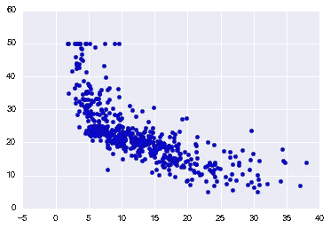

在 x 轴上，我们有 LSTAT 和 y 轴目标。单看它，似乎有一个负的关系:随着 LSTAT 上升，TARGET 下降。

# 成本/评估功能

如何解决从 LSTAT 预测目标的问题？开始思考的一个好地方是:假设我们开发了许多模型来预测我们的目标，我们将如何选择最好的一个？一旦我们确定了这一点，我们的目标就是最小化/最大化这个价值。

如果您能够将您的问题简化为一个**单一的评估度量**，这将是非常有用的，因为这样可以非常容易地迭代模型开发。然而，在工业领域，这可能会很棘手。有时候你并不十分清楚你想要你的模型最大化/最小化什么。但这是另一个帖子面临的挑战。

所以对于这个问题，我会提出以下评价指标:**均方误差(MSE)** 。为了理解 MSE，让我们定义一些术语:

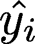

*   这是我们对第 I 个数据点的预测值

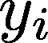

*   这是第 I 个数据点的实际值
*   **n** —数据点的数量

因此，MSE 为:


在英语中，对于每个点，我们从实际值中减去预测值。然后，因为我们不关心误差的方向，所以我们求差的平方。最后，我们取所有这些值的平均值。基本上，我们是说我们希望我们的预测和实际之间的平均距离小一些。

你可能会奇怪，为什么我们平方这个值，而不是取绝对值。事实证明，对于下面的一些数学运算来说，平方这个值效果很好。而且，它是最大似然估计。不过，这确实有在我们的平均值中增加大误差权重的效果，因为我们在平方所有的差异。

# 我们的模型

现在我们有了成本函数，如何找到最小化它的方法呢？在本帖中，我们将回顾线性回归模型。该模型如下:

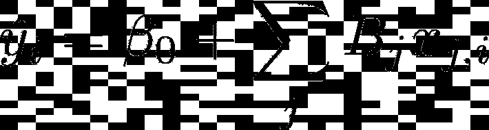

其中 **j** 是我们拥有的预测值的数量，**β**值是我们的系数，**β0**是截距。基本上，我们的模型是预测值和截距的线性组合。

现在我们有了一个模型和一个成本函数，我们的挑战变成为我们的模型找到最小化我们数据的 MSE 的 **beta** 值。对于线性回归，实际上有一个封闭形式的解决方案，称为正常方程。然而，在这篇文章中，我们将使用一种在机器学习中更常见的不同技术——梯度下降。

# 梯度下降

梯度下降是我们从最优化中借用的一种技术。这是一个非常简单，但功能强大的算法，可用于寻找一个函数的最小值。

1.  选择一个随机的起始值
2.  在当前点采取与梯度负值成比例的步长
3.  重复直到你收敛

如果一个函数是凸的，这种技术将找到全局最小值，如果不是，我们只能证明它将找到局部最小值。

我们需要回答的第一个问题是:我们的成本函数是凸的吗？让我们来看看:

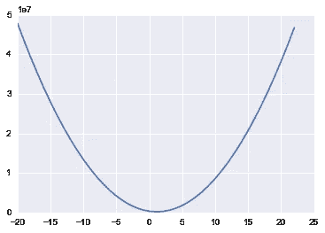

我们上面所做的是为 LSTAT 取一系列系数值，并根据我们的数据计算每个系数值的 MSE。如果我们画出这些，我们会得到上面的曲线——看起来很凸！事实上，我们的线性回归模型的 MSE 函数总是凸的！这意味着我们可以使用梯度下降来找到我们的模型的最佳系数！

梯度下降比机器学习的正常方程更常见的一个原因是，随着我们增加特征的数量，它的规模更大。它也是一种普遍的优化技术，在机器学习中随处可见，因此了解它的工作原理是非常有价值的。

# 梯度

如果你再看一下梯度下降的伪代码，你会发现我们真正需要做的就是计算梯度。那么，什么是渐变呢？它们只是关于系数的偏导数。对于每个系数，我们需要计算 MSE 对该系数的导数。我们开始吧！

让我们扩展我们的成本，以一个截距和一个变量 LSTAT 为例:

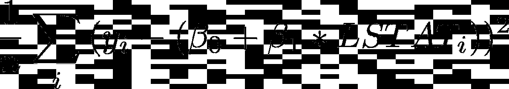

现在，对于这个相对于**β0**的导数，我们得到(乘以-1):

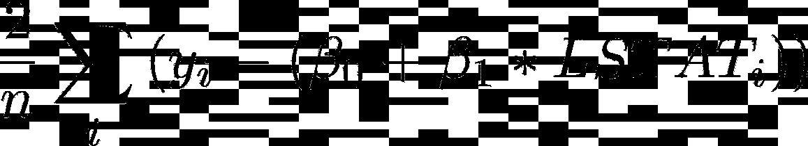

而对于 **beta 1** :

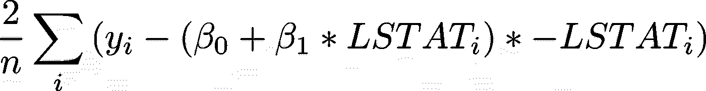

现在，让我们运行梯度下降算法，确认 MSE 确实在下降:

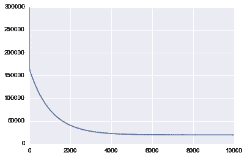

```
beta_0: 34.553840879456807beta_1: -0.95004935376241229
```

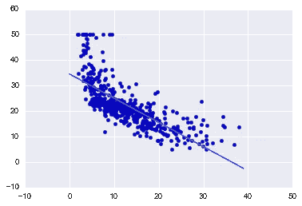

上面打印的第一张图显示了我们运行梯度下降时的 MSE 值。正如我们期望看到的，随着算法的运行，MSE 随着时间的推移而降低，这意味着我们不断接近最优解。

您还可以从图表中看到，我们本可以更早停止，因为 MSE 在大约 4000 次迭代时基本持平。

运行梯度下降发现最佳截距为 34.55，最佳斜率为-0.95。

上面的图显示了我们的数据上面的那条线，事实上它看起来是最佳拟合的线。

# 学习率

我们尚未讨论的一个参数是学习率。该速率是一个超参数，用于确定我们离梯度方向有多远。你怎么知道选择什么值？通常，可以尝试许多值，这里有一些我认为是吴恩达建议的值:. 001，. 003，. 01，. 03，. 1，. 3，1，3

选择一个太小的值会导致收敛速度变慢。选择太大的值会导致超过最小值和发散。

也有其他梯度下降优化，更复杂，适应学习率超时为您服务。这也是你可以自己做的事情，随着时间的推移，你会慢慢降低学习速度。

# 什么时候停止迭代？

在我的代码中，我简单地选择运行循环 10，000 次。为什么是一万？没有真正的原因，除了我很确定它足够长的时间来收敛。这通常不是最佳实践。一些更好的想法是:

1.  在每一次循环后监控你的成本，当它的下降小于某个容差时——比如 0.001——停止。
2.  使用一个验证集，并在其上跟踪损失，例如，MSE。当它停止减少时，停止。

# 标准化数据

使用梯度下降时，您希望所有数据都进行归一化。减去平均值，然后除以所有训练特征的标准差。如果您的成本函数不是凸的，这通常会使训练更快，并减少陷入局部最优的机会。

# 其他类型的梯度下降

我们这里展示的梯度下降是一种普通形式，这意味着每次系数更新都使用所有数据来计算梯度。还有**随机梯度下降**只使用 1 行数据来更新每个循环中的系数。这更具可伸缩性，因为在更新前您只需一次查看一个数据行，但也更具随机性，因为您试图使用仅在单个数据点上计算的梯度进行导航。

另一种类型的梯度下降是**小批量梯度下降**。这种形式是两者之间的一种折衷，您可以选择一个批处理大小，比如说 32(或者更好的是一个批处理时间表，它从小批处理开始，随着历元数的增加而增加)，并且梯度下降的每次迭代将使用 32 个随机数据行来计算梯度(它使用所有行，然后再次对相同的行进行重新采样)。这提供了一些可伸缩性和一些随机性。这种随机性实际上对于非凸的成本函数(深度学习)是有用的，因为它可以帮助模型摆脱局部最小值。这是非凸成本函数最常用的方法。

# 我们模型的假设

每当你处理一个模型时，了解它所做的假设是有好处的。我本打算在这里就此写一篇文章，但是杜克已经做得很好了:【http://people.duke.edu/~rnau/testing.htm。

# 使用 Scikit-Learn

现在我们已经了解了一些理论和实现，让我们转向一个软件库，对我们的数据进行线性回归。这对于学习从头开始编写模型非常有用，但是在实践中，使用一个经过测试并广泛使用的库通常会好得多。

```
from sklearn.linear_model import SGDRegressor
from sklearn.metrics import mean_squared_error
from sklearn.preprocessing import StandardScaler
```

请记住扩展您的数据，这非常重要！

```
scaler = StandardScaler()
scaler.fit(boston_df) 
scaled_df = scaler.transform(boston_df)
```

Scikit-learn 有一个非常好的 API。它提供了许多模型，并且它们都具有拟合和预测功能。您调用**对 X 和 y 数据进行拟合**来训练模型，然后**对新特征进行预测**来获得预测值。Scikit-learn 还提供了许多可用于评估的指标，如 MSE。这里我输出根 MSE (RMSE ),因为这让我们回到目标的原始比例，我觉得这更容易理解。

使用我们的 SGDRegressor(使用梯度下降运行线性回归)， **tol** 告诉模型何时停止迭代， **eta0** 是我们的初始学习率。

```
linear_regression_model = SGDRegressor(tol=.0001, eta0=.01) linear_regression_model.fit(scaled_df, target)
predictions = linear_regression_model.predict(scaled_df)
mse = mean_squared_error(target, predictions) 
print("RMSE: {}".format(np.sqrt(mse)))RMSE: 4.721352143256387
```

对于使用 scikit-learn 的训练集，我们的 RMSE 最终为 4.72。

# 多项式变量

如果你记得我们的 LSTAT 对我们的目标的图，看起来有一个多项式关系。线性回归适合线性关系，但是如果添加多项式要素，例如 LSTAT，则可以适合更复杂的关系。SKLearn 让这变得简单:

```
from sklearn.preprocessing import PolynomialFeaturespoly = PolynomialFeatures(2, include_bias=False)
poly_df = poly.fit_transform(boston_df) 
scaled_poly_df = scaler.fit_transform(poly_df) print(scaled_poly_df.shape)(506, 104)linear_regression_model.fit(scaled_poly_df, target)
predictions = linear_regression_model.predict(scaled_poly_df) 
mse = mean_squared_error(target, predictions) 
print("RMSE: {}".format(np.sqrt(mse)))RMSE: 3.77419484950651
```

多项式要素命令生成了一个新的要素矩阵，该矩阵由阶数小于或等于指定阶数的要素的所有多项式组合组成(在我们的示例 2 中)。然后，我们对这些数据进行缩放，并将其输入到我们的模型中。我们得到了一个更好的训练 RMSE——3.77。不过，请注意，这些结果只是出于说明的目的，基于我们的训练数据。

# 分类变量

当您有分类数据时，线性回归是您需要小心使用的模型之一。如果您有一个值为 1、2 和 3 的要素，它们实际上表示男性、女性、无响应，那么即使它们是数字，您也不希望以这种方式将其提供给模型。如果你这样做了，模型会给这个特征分配一个系数——可能是 0.1。这就意味着，女性会将预测提高 0.1%，而无反应会提高 0.2%。但是也许女性应该把分数提高 1.2，而没有反应的分数只提高 0.001。考虑到这一点，您应该将这些值转换为虚拟变量，以便每个值都有自己的权重。你可以看到如何用 scikit 实现这一点——点击了解[。](https://scikit-learn.org/stable/modules/generated/sklearn.preprocessing.OneHotEncoder.html)

# 解释你的模型

线性回归是一个伟大的统计模型，已经存在很长时间了。有许多统计技术可以用来评估和解释它。我们不会涵盖所有这些，事实上，我们将主要关注非常简单的方法，这些方法在机器学习中可能比统计学更常见。为了更好地掌握统计技术，请阅读[统计学习简介](http://www-bcf.usc.edu/~gareth/ISL/)的第 3 章，并看看 [statsmodels](http://www.statsmodels.org/stable/index.html) 包。

首先，让我们看看我们的模型已经学习的系数(从所有的特征):

```
linear_regression_model.fit(scaled_df, target) sorted(list(zip(boston_df.columns, linear_regression_model.coef_)), key=lambda x: abs(x[1]))[('AGE', -0.15579031087838216), ('INDUS', -0.36890070005440012), ('ZN', 0.61249837977769284), ('TAX', -0.6639660631363058), ('CRIM', -0.7135059713991182), ('CHAS', 0.73578321065548924), ('B', 0.87494012630072004), ('RAD', 1.1142142863056546), ('NOX', -1.2452942744431366), ('PTRATIO', -1.9425283730193659), ('DIS', -2.2549312823672696), ('RM', 3.0623224309690911), ('LSTAT', -3.4699728921831285)]
```

这些系数是什么？它们表示在保持模型中其他特征不变的情况下，特征变化一个单位的住房价格的平均变化。例如，保持所有其他因素不变，LSTAT 每增加一个单位，我们的目标(房价)就会减少 3.469，RM 每增加一个单位，我们的目标就会增加 3.062。

这真是太好了！我们也许可以说，如果你想增加房子的价值，增加 RM 和减少 LSTAT 可能是一个开始。我说可能是因为线性回归着眼于相关性。在我们的数据中，情况确实如此，但这本身并不意味着这些特征有因果关系。不过，这可能是寻找因果关系的好地方，并且确实代表了数据中出现的关系。

# 置信区间

通常在机器学习中，在你的估计值周围有一个置信区间是非常有用的。有不同的方法可以做到这一点，但是一个相当通用的方法是使用 **bootstrap。**

bootstrap 是替换我们数据的随机样本，该样本与原始数据大小相同。这是生成同一数据的多个视图的一种方式。让我们创建 1000 个数据引导。

```
from sklearn.utils import resample 
n_bootstraps = 1000 
bootstrap_X = [] 
bootstrap_y = [] 
for _ in range(n_bootstraps): 
    sample_X, sample_y = resample(scaled_df, target)
    bootstrap_X.append(sample_X) bootstrap_y.append(sample_y)
```

然后在每个数据集上，我们可以拟合我们的模型并得到我们的系数:

```
linear_regression_model = SGDRegressor(tol=.0001, eta0=.01)
coeffs = [] 
for i, data in enumerate(bootstrap_X):
    linear_regression_model.fit(data, bootstrap_y[i])
    coeffs.append(linear_regression_model.coef_)coef_df = pd.DataFrame(coeffs, columns=boston_df.columns) coef_df.plot(kind='box') plt.xticks(rotation=90)
```

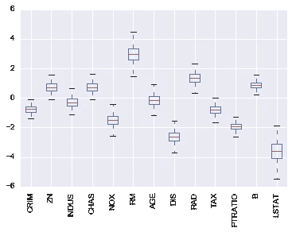

该图显示了我们为所有训练模型的每个特征获得的系数值范围。年龄是一个特别有趣的特征，因为系数值既有正的也有负的，这是一个好迹象，表明年龄和我们的目标之间可能没有关系。

此外，我们可以看到 LSTAT 的系数值方差很大，而 PTRATIO 的方差相对较小，这增加了我们对系数估计的信心。

我们甚至可以进一步挖掘 LSTAT 系数:

```
coef_df['LSTAT'].plot(kind='hist')
```

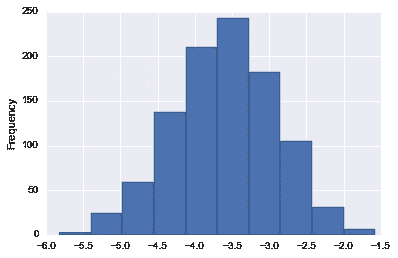

```
coef_df['LSTAT'].describe()count 1000.000000 mean -3.599465 std 0.687444 min -5.825069 25% -4.058086 50% -3.592409 75% -3.120958 max -1.575822 Name: LSTAT, dtype: float64
```

这太好了！现在我们可以很有信心地说，LSTAT 上的实际系数是负的，几乎肯定在-1.2 到-5.5 之间。

# 训练/测试分割和交叉验证

到目前为止，我们一直在根据现有的所有数据进行训练。这可能是有意义的，因为我们希望通过使用尽可能多的数据进行训练来最大化数据的效用。然而，另一方面，这使得我们很难评估我们的模型做得有多好。其原因是，如果我们只是使用模型训练的数据来计算我们的 MSE 分数，我们可能会发现，当我们引入未经训练的数据时，它的表现相当差。

这个想法叫做**过拟合**。基本上，当一个模型在它被训练的数据上比在新数据上表现得更好时，它就过度适应了训练数据所特有的东西，而不是一般化。

这种情况的另一面叫做**偏见。**当一个模型不能很好地拟合数据时，它就有很大的偏差。在这种情况下，对于训练数据和在训练期间没有看到的数据，MSE 都将是高的。

在机器学习中，偏差和方差之间总是有一个权衡。随着模型变得越来越复杂，过度适应训练数据的风险也越来越大。

既然我们知道只看训练数据的 MSE 有问题，我们能做什么来更好地判断概化？以及诊断过度拟合和偏差？通常，我们将数据分成两组:训练集和测试集。

```
from sklearn.model_selection import train_test_split
X_train, X_test, y_train, y_test = train_test_split(scaled_df, target, test_size=0.33, random_state=42)
```

现在我们有了两组独立的数据，我们可以根据我们的训练数据进行训练，并为我们的训练和测试数据计算指标(最佳做法是在调整模型后只使用您的测试数据):

```
linear_regression_model = SGDRegressor(tol=.0001, eta0=.01) linear_regression_model.fit(X_train, y_train)
train_predictions = linear_regression_model.predict(X_train) test_predictions = linear_regression_model.predict(X_test)
train_mse = mean_squared_error(y_train, train_predictions)
test_mse = mean_squared_error(y_test, test_predictions)
print("Train MSE: {}".format(train_mse))
print("Test MSE: {}".format(test_mse))Train MSE: 23.33856804462054 Test MSE: 21.820947809040835
```

太棒了。现在我们有了 RMSE 的训练和测试数据。两者都非常接近，这表明我们没有过度拟合的问题。不过，它们都很低吗？这表明有很大的偏见。

研究这个问题的一个方法是绘制学习曲线。学习曲线描绘了我们的误差函数(MSE ),以及用于训练的各种数据量。这是我们的情节:

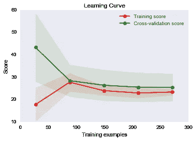

您可以看到，在不到 50 个训练示例的情况下，训练 MSE 相当好，交叉验证相当差(我们还没有谈到交叉验证，所以暂时把它当作测试)。如果我们那时只有那么多数据，它看起来就像一个高方差问题。

随着我们数据的增加，我们开始提高我们的分数，它们变得非常接近，这表明我们没有高方差问题。通常，在高方差的情况下，该图中的两条线相距较远，如果我们继续添加更多的数据，它们可能会收敛。

这张图看起来更像是我们有一个高偏差问题，因为我们的两条曲线非常接近，并趋于平缓。不过，这很难说，因为我们可能刚刚达到了可能的最佳 MSE。在这种情况下，这不会是一个高偏差问题。如果我们的曲线变得平坦，并且 MSE 高于最优值，这将是一个问题。在现实生活中，你不知道最优的 MSE 是多少，所以你必须从理论上说明你是否认为减少偏差会提高你的分数——或者只是尝试一下！

# 修复高偏差/高方差问题

那么，现在你已经诊断出了你的偏差或方差问题，你如何解决它们呢？

对于**高差异**:

*   获取更多培训数据
*   尝试一组较小的功能
*   尝试不太复杂的模型
*   添加正则化

对于**高偏置**:

*   尝试添加功能
*   尝试更复杂的模型

# 交叉验证和调整超参数

之前我们提到过这个短语:交叉验证。让我们现在谈论那个。到目前为止，我们已经了解到，将数据分成训练集和测试集是一个好主意，这样可以更好地了解模型的实际运行情况。这很好，但是想象一下我们想要测试多个不同的模型或者测试我们模型的不同参数——例如，不同的学习率或者容忍度。我们如何决定哪个模型或哪个参数是最好的？我们会用训练数据训练一切，用测试数据测试一切吗？希望你能看到这是没有意义的，因为那样的话，我们将基本上处于以前的同一位置，没有办法测试我们对以前从未见过的数据做得有多好。所以——我们希望保持我们的测试集不受污染，也就是说，在一个完美的世界中，我们只会在完成所有实验并认为我们找到了最佳模型之后，才在它上面运行我们的测试。

听起来我们需要第三组数据——验证组。基本上，我们可以做的是将我们的训练数据分成两组:一组训练数据和一组验证数据。所有模型将在训练集上训练，然后在我们的验证集上测试。然后，我们选择验证效果最好的模型，看看它在测试中表现如何。我们的测试结果代表了我们认为我们的模型对看不见的数据有多好——然后我们就完成了。

注意:这里的假设是我们的测试和验证设定了我们总体的代表性样本。例如，如果验证集中的平均房价是 100 万英镑，但总体房价是 30 万英镑，则样本不良。通常，我们随机地将可用的数据分成三组，但是确认这些组是好的表示总是好的。否则，您会发现在验证和测试中运行良好的模型在实践中表现不佳。

在实践中，我们经常使用 k-fold 交叉验证，而不是创建一个单一的验证集。这里我们选择一个 k 值，比如说 3。然后，我们将训练数据分成三份。我们随机选择 2 个折叠进行训练，然后使用剩余的进行测试。然后，我们再重复 2 次，总共 3 次，这样所有的观察结果都用于训练和验证，并且每个观察结果只用于验证一次。然后，我们将所有三个分数(在我们的例子中是 MSE)进行平均，以获得特定模型的分数。然后，我们可以对多个模型重复这一过程，以找到最佳模型。

这里有一个视频更形象地描述了这个过程:[https://www.youtube.com/watch?v=TIgfjmp-4BA](https://www.youtube.com/watch?v=TIgfjmp-4BA)

使用 sklearn，这个过程非常简单:

```
from sklearn.model_selection import RandomizedSearchCV
param_dist = {"eta0": [ .001, .003, .01, .03, .1, .3, 1, 3]} linear_regression_model = SGDRegressor(tol=.0001) 
n_iter_search = 8 
random_search = RandomizedSearchCV(linear_regression_model, param_distributions=param_dist, n_iter=n_iter_search, cv=3, scoring='neg_mean_squared_error') 
random_search.fit(X_train, y_train) 
print("Best Parameters: {}".format(random_search.best_params_)) print("Best Negative MSE: {}".format(random_search.best_score_))Best Parameters: {'eta0': 0.01} Best Negative MSE: -25.322156767075665
```

这里我们实际上使用了随机搜索，这通常比搜索所有可能的值要好。通常，你想为许多不同的旋钮尝试许多不同的参数，而网格搜索(尝试每一种可能的组合)不是很有效。通常，你会像我们上面做的那样使用随机搜索(随机选择组合)。但是，因为我们只有少量的值，所以我们通过将 n_iter_search 设置为我们想要尝试的值的数量来强制进行网格搜索。

我们还将 cv=3 设置为 3 倍，并使用负 MSE，因为 scikit-learn 中的 cv 函数试图最大化一个值。

你可以在这里了解更多关于随机搜索和网格搜索:【http://scikit-learn.org/stable/modules/grid_search.html

此外，scikit-learn 还有许多其他 CV 函数，特别是如果您想要测试具有相同折叠的不同模型时，这些函数非常有用。以下是一些文档:[http://sci kit-learn . org/stable/modules/cross _ validation . html](http://scikit-learn.org/stable/modules/cross_validation.html)

# 正规化

作为解释高方差模型的一种方法，我提到了正则化。您可以将正则化视为一种用于惩罚学习复杂关系的模型的方法。对于线性回归，有三种流行的方法。所有这些方法都围绕着限制我们的特征的系数可以有多大的思想。这个想法是，如果我们高估了一个预测因子(一个大的系数)的影响，很可能我们是过度拟合了。注意:我们仍然可以有大的系数。正则化只是说，MSE 的减少必须证明系数幅度的增加是合理的。

*   L1 正则化(Lasso):将系数的绝对值之和添加到成本函数中。这种方法可以将系数强制为零，这可以作为特征选择的一种手段。
*   L2 正则化(岭):你把系数的平方和加到成本函数中。
*   弹性网:你将两者相加，并选择它们的重量。

这些方法中的每一种都采用了一个加权因子，该因子告诉您应该对成本函数中的正则化项进行多少加权。在 scikit-learn 中，它被称为 alpha。alpha 值为零不会增加任何损失，而高 alpha 值会因为模型系数大而对模型造成很大损失。您可以使用交叉验证来发现 alpha 的一个好值。

Sklearn 让这变得简单:

```
from sklearn.linear_model import ElasticNetCV 
# l1 ratio of zero is l2 and visa-versa 
# alphas are how much to weight regularization 
clf = ElasticNetCV(l1_ratio=[.1, .5, .7, .9, .95, .99, 1], alphas=[.1, 1, 10]) 
clf.fit(X_train, y_train) 
train_predictions = clf.predict(X_train) 
test_predictions = clf.predict(X_test) 
print("Train MSE: {}".format(mean_squared_error(y_train, train_predictions)))
print("Test MSE: {}".format(mean_squared_error(y_test, test_predictions)))Train MSE: 23.500345265727802 Test MSE: 21.60819303537859
```

这里我们使用了具有内置交叉验证的 ElasticNetCV 函数，以便为 alpha 选择最佳值。l1_ratio 是给予 l1 正则化的权重。剩余的重量应用于 L2。

# 恭喜你！

如果你能走到这一步，恭喜你！这是一个**吨**的信息，但我保证，如果你花时间去吸收它，你会有一个非常坚实的了解线性回归和它可以做的许多事情！

此外，你可以在这里找到代码[的更好的渲染版本。](https://learningwithdata.com/posts/tylerfolkman/the-ultimate-guide-to-linear-regression/)

[免费获得掌握数据科学的 11 种极其有用的资源](https://datascienceleadership.substack.com/)