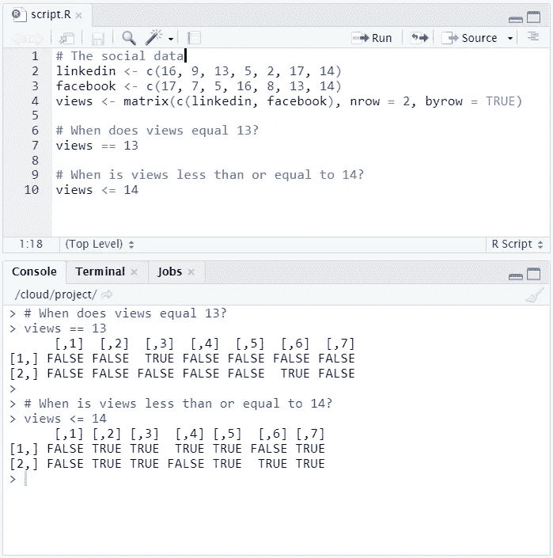

# R 中关系运算符的最终指南

> 原文：<https://towardsdatascience.com/the-ultimate-guide-to-relational-operators-in-r-6d8489d9d947?source=collection_archive---------5----------------------->

## 关系运算符帮助我们了解对象之间的关系。学习你需要知道的一切来征服他们！


# 相等运算符==

关系操作符，或称比较符，是帮助我们了解一个 R 对象如何与另一个相关的操作符。

例如，您可以使用双等号`==`来检查两个对象是否相等(**相等**)。

通过使用这个查询`TRUE == TRUE`，我们可以看到`TRUE`的逻辑值是否等于`TRUE`的逻辑值。等式查询的结果是一个逻辑值(`TRUE or FALSE`)。这种情况下是`TRUE`，因为`TRUE`等于`TRUE`。

反之，`TRUE == FALSE`会给我们`FALSE`。

除了逻辑变量，我们还可以检查其他类型的相等性，比如字符串和数字。

```
# Comparing the equality of two strings
"hello" == "goodbye"# Comparing the equality of two numbers
3 == 2
```

这两个输出都是`FALSE`。


## 让你试试

最基本的比较形式是平等。回想一下，它是由双方程语法表示的，`==`。以下是一些等式语句的示例:

```
3 == (2 + 1)
"ultimate guide" == "r"
TRUE == FALSE
"Rchitect" == "rchitect"
```


从最后一个表达式注意到 R 是**区分大小写**:“R”不等于“R”。

尝试以下比较:

*   写 R 代码看`TRUE`是否等于`FALSE`。
*   检查`-6 * 14`是否等于`17 — 101`。
*   看字符串`"useR"`和`"user"`在 r 中是否相等。
*   如果将`TRUE`与数字 1 进行比较，看看会发生什么。

确保不要混淆`==`(比较)和`=`(赋值)，`==`用于检查 R 对象的相等性。

## 解决办法

```
# Comparison of logicals
TRUE == FALSE# Comparison of numerics
(-6 * 14) == (17 - 101)# Comparison of character strings
"useR" == "user"# Comparison of a logical with a numeric
TRUE == 1
```


回想一下，真正的胁迫在引擎盖下 1。因此，逻辑真与数字 1 的比较结果为真。

# 不等式运算符！=

相等运算符的反义词是不等运算符，写为感叹号后跟等号(`!=`)。

例如，句子`"hello" != "goodbye"`读作:“你好”不等于“再见”。因为这个说法是正确的，所以 R 会输出`TRUE`。

不等式运算符也可用于数字、逻辑和其他 R 对象。

```
# Output FALSE
TRUE != TRUE# Output TRUE
TRUE != FALSE# Output TRUE
"hello" != "goodbye"# Output TRUE
3 != 2
```

相等运算符的结果与不等运算符的结果相反。


## 让你试试

不平等比较器只是平等的反义词。以下语句都评估为`TRUE`:

```
3 == (2 + 1)
"intermediate" != "r"
TRUE != FALSE
"Rchitect" != "rchitect"
```

写出执行以下操作的表达式:

*   检查`TRUE`是否等于`FALSE`。
*   检查`— 6 * 14`是否等于*而不是*等于`17 — 101`。
*   检查琴弦`“useR”`和`“user”`是否不同。
*   检查`TRUE`和 1 是否相等。

## 解决办法

```
# Comparison of logicals
TRUE == FALSE# Comparison of numerics
(-6 * 14) != (17-101)# Comparison of character strings
"useR" != "user"# Compare a logical with a numeric
TRUE == 1
```


# 小于和大于运算符< and >

有些情况下，我们需要的不仅仅是等式和不等式运算符。例如，如何检查一个 R 对象是“小于”还是“大于”另一个 R 对象呢？在这种情况下，我们可以使用小于`<`和大于`>`符号。

在数值的情况下，这是非常简单的。比如 3 小于 5，那么`3 < 5`会求值为`TRUE`，而 3 大于 5 ( `3 > 5`)会求值为`FALSE`。

对于数字来说，这是有意义的。但是这对于字符串和逻辑值是如何工作的呢？

对于字符串，R 使用字母表来排序。因此，`"Hello" > "Goodbye"`将计算为`TRUE`，因为在字母表中“H”在“G”之后，R 认为它更大。

对于逻辑值，`TRUE`对应 1，`FALSE`对应 0。那么`TRUE`是不是小于`FALSE`？不会，因为 1 不小于 0，所以有了`FALSE`的结果。


# 小于等于和大于等于运算符<= and > =

我们还可以检查一个 R 对象是否大于或等于(或者小于或等于)另一个 R 对象。为此，我们可以使用小于号或大于号以及等号。

因此，大于或等于 3 的 5 个`5 >= 3`，以及大于或等于 3 的 3 个`3 >= 3`将被评估为`TRUE`。


## 让你试试

除了等式运算符(`==`和`!=`，我们还学习了小于的*和大于*的*运算符:`<`和`>`。我们还可以加一个等号分别表示*小于等于*或者*大于等于*。例如，以下所有对`FALSE`的评价:*

```
(1+2) > 4
"dog" < "Cats"
TRUE <= FALSE
```

请记住，对于字符串比较，R 根据字母顺序确定*大于*的关系。还要记住`TRUE`在算术上被当作`1`，而`FALSE`被当作`0`。所以`FALSE < TRUE`就是`TRUE`。

写 R 表达式检查是否:

*   `-6 * 5 + 2`大于等于`-10 + 1`。
*   `“raining”`小于或等于`“raining dogs”`
*   `TRUE`大于`FALSE`。

## 解决办法

```
# Comparison of numerics
(-6 * 5 + 2) >= (-10 + 1)# Comparison of character strings
"raining" <= "raining dogs"# Comparison of logicals
TRUE > FALSE
```


# 关系运算符和向量

从[对矢量的介绍到](/introduction-to-vectors-in-r-6ccae4748f2e)后，我们已经知道 R 非常适合矢量。无需对语法做任何修改，R 的关系运算符也适用于向量。

假设您已经记录了 LinkedIn 个人资料在之前的链接中每天的浏览量，并将它们存储在一个 vector 中，`linkedin`。

```
linkedin <- c(16, 9, 13, 5, 2, 17, 14)
```

如果我们想知道哪一天的浏览次数超过了 10 次，我们可以直接使用大于号。

```
linkedin > 10
```


对于向量中的第一、第三、第六和第七个元素，视图的数量大于 10，因此对于这些元素，结果将是`TRUE`。

我们也可以比较矢量和矢量。假设你还记录了你的脸书个人资料在上周的浏览量，并将它们保存在另一个 vector 中`facebook`。

```
facebook <- c(17, 7, 5, 16, 8, 13, 14)
```

什么时候脸书的浏览量小于或等于 LinkedIn 的浏览量？我们可以用下面的表达式来计算。

```
facebook <= linkedin
```

在这种情况下，对向量的每个元素逐一进行比较。例如，在第三天，脸书的浏览量是 5，LinkedIn 的浏览量是 13。比较结果为`TRUE`，因为 5 小于或等于 13。这意味着第三天脸书的浏览量小于或等于 LinkedIn 的浏览量。


## 让你试试

使用上面相同的社交媒体向量，`linkedin`和`facebook`，包含过去七天的个人资料浏览量，使用关系运算符为以下问题找到逻辑答案(`TRUE`或`FALSE`):

*   LinkedIn 个人资料浏览量在哪些日子超过了 15 次？
*   什么时候你的 LinkedIn 个人资料只被浏览了 5 次或更少？
*   什么时候你的 LinkedIn 个人资料比你的脸书个人资料被访问的次数多？

```
# The linkedin and facebook vectors
linkedin <- c(16, 9, 13, 5, 2, 17, 14)
facebook <- c(17, 7, 5, 16, 8, 13, 14)
```

## 解决办法

```
# The linkedin and facebook vectors
linkedin <- c(16, 9, 13, 5, 2, 17, 14)
facebook <- c(17, 7, 5, 16, 8, 13, 14)# Popular days
linkedin > 15# Quiet days
linkedin <= 5# LinkedIn more popular than Facebook
linkedin > facebook
```


你的 LinkedIn 个人资料在第六天非常受欢迎，但在第四天和第五天就没那么受欢迎了。

从输出中，我们可以确定以下内容:

*   在第一天和第六天，你的 LinkedIn 个人资料浏览量超过了 15。
*   在第四天和第五天，你的 LinkedIn 个人资料仅被浏览了 5 次或更少。
*   在第二、第三和第六天，你的 LinkedIn 个人资料的访问量超过了你的脸书个人资料。

# 挑战:比较矩阵

到目前为止，我们已经学习并比较了逻辑、数字、字符串和向量。然而，R 处理不同数据结构进行比较的能力并不仅限于矩阵。矩阵和关系运算符也可以无缝地协同工作！

假设，LinkedIn 和脸书的数据存储在一个名为`views`的矩阵中，而不是存储在 vectors 中(就像前面给你尝试的那样)。第一行包含 LinkedIn 信息；第二行是脸书的信息。

```
# The social data stored in a matrix
linkedin <- c(16, 9, 13, 5, 2, 17, 14)
facebook <- c(17, 7, 5, 16, 8, 13, 14)
views <- matrix(c(linkedin, facebook), nrow = 2, byrow = TRUE)
```

使用您所学的关系运算符，尝试确定以下内容:

*   什么时候视图正好等于 13？使用`views`矩阵返回一个逻辑矩阵。
*   哪几天的浏览量小于或等于 14？同样，让 R 返回一个逻辑矩阵。

## 解决办法

```
# The social data
linkedin <- c(16, 9, 13, 5, 2, 17, 14)
facebook <- c(17, 7, 5, 16, 8, 13, 14)
views <- matrix(c(linkedin, facebook), nrow = 2, byrow = TRUE)# When does views equal 13?
views == 13# When is views less than or equal to 14?
views <= 14
```



本练习总结了关于比较器的指南。你知道如何查询 R 对象之间的关系！

根据输出，我们可以确定:

*   第三天，LinkedIn 有 13 次浏览。在第 6 天，有 13 个脸书视图。
*   在第 2、3、4、5 和 7 天，LinkedIn 的浏览量少于或等于 14 次。在第 2、3、5、6 和 7 天，有少于或等于 14 个脸书视图。

# 笔记

所有图片，除非特别注明，均归作者所有。横幅图像是使用 [Canva](https://www.canva.com/) 创建的。