# SMS 终极指南:使用 Python 的垃圾邮件或火腿分类器

> 原文：<https://towardsdatascience.com/the-ultimate-guide-to-sms-spam-or-ham-detector-67c179bc94dc?source=collection_archive---------44----------------------->

## 人工智能概念的方法

## 开发垃圾邮件或火腿分类器的详细报告:第 2 部分

用 [Canva 设计。](https://www.canva.com/templates/EADaoQ4RN_g-city-buildings-facebook-cover/)插图来自[未画](https://undraw.co/)。

**TL；博士**从人工智能概念的角度理解垃圾邮件或火腿分类器，使用各种分类算法，选择高精度产生算法，开发 Python Flask 应用。

> **该博客是博文**的系列，如果您还没有阅读垃圾邮件或火腿分类器的理论人工智能概念，请花**十分钟阅读**,网址:

 [## 短信终极指南:垃圾邮件还是火腿探测器

### 开发垃圾邮件或火腿分类器的详细报告:第 1 部分

towardsdatascience.com](/the-ultimate-guide-to-sms-spam-or-ham-detector-aec467aecd85) 

**我们已经在** [**第一部分**](/the-ultimate-guide-to-sms-spam-or-ham-detector-aec467aecd85) 中介绍过

*   关于垃圾邮件或火腿分类器的理论人工智能概念
*   分类算法

**我们将在第 2 部分**对此进行介绍

*   探索数据源
*   数据准备
*   探索性数据分析

**我们将在接下来的** [**中覆盖第三部分**](/the-ultimate-guide-to-sms-spam-or-ham-detector-85f3c824e55a)

*   垃圾邮件或火腿背后的朴素贝叶斯
*   绩效衡量标准
*   垃圾邮件检测器的开发

## 探索数据源

该数据集最初来自巴西圣保罗的圣卡洛斯联邦大学(ufscar)索罗卡巴计算机科学系的 Tiago a . Almeida(talmeida UFSCar . br)，并取自 [UCI 机器学习](https://archive.ics.uci.edu/ml/datasets/sms+spam+collection)【15】。

集合仅由一个文本文件组成，其中每一行都有正确的类，后跟原始消息。

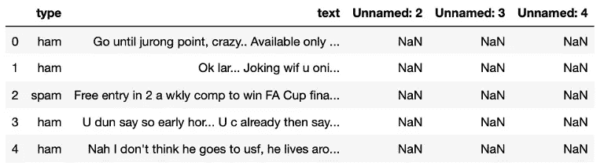

*属性存在于原始数据集中* ***。*** 图片作者。

数据集有 5 列和 5572 行。在这 5572 个数据点中，747 个中的*类型*被标记为垃圾邮件，4825 个被标记为“ham ”,并包含 3 个额外的列作为未命名的*: 2/3/4*,这是多余的。如果*类型*具有值 ham，则意味着该文本或消息不是垃圾邮件，但是如果*类型*的值是垃圾邮件，则意味着*文本*是垃圾邮件，并且*文本*没有按时间顺序排列。

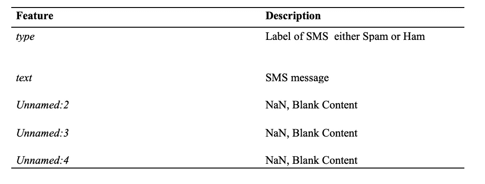

原始数据集中的要素描述。图片作者。

查看原始数据集，很明显，为了开发高精度模型，应该进行一些预处理。

## 设置

我们将在 Jupyter 笔记本上完成这项工作，我假设您已经对使用 Jupyter 笔记本有了基本的了解。如果没有，请查看我以前的博客，在那里我分享了关于设置和探索性数据分析的初学者指南。

 [## 初学者的探索性数据分析

### 第一次做 EDA！

medium.com](https://medium.com/analytics-vidhya/exploratory-data-analysis-for-beginner-7488d587f1ec) 

## 数据预处理

该数据集已经过预处理并被很好地标记。然而，在研究数据时，该项目发现数据可以进一步清理。我们选择省略未命名的列:2、未命名的列:3、未命名的列:4，因为它们不包含任何值，只会对模型产生干扰。

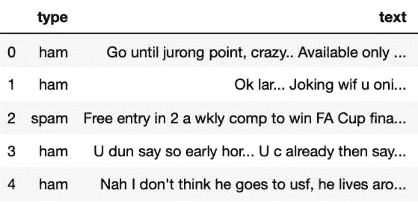

原始数据集预处理后出现的属性。图片作者。

> 在这个博客上，我将强调这个发现并解释重要的主题，但不会解释每一行代码。
> 
> 你可以在 [GitHub](https://github.com/maladeep/sms-spam-ham-detector/blob/master/notebookEDA.ipynb) 上探索代码细节。

## 数据准备

因为分类算法需要某种数字特征向量来执行分类任务。实际上有许多方法可以将语料库转换为矢量格式。最简单的是单词袋方法。词袋是对象分类中最流行的表示方法之一。其核心思想是将每个提取的关键点量化为一个视觉单词，然后用视觉单词的直方图来表示每幅图像。[16].即文本中的每个唯一单词将由一个相应的数字来表示。为了实现单词袋，该项目需要删除非常常见的单词，如(' the '，' a '等..).并通过使用标记化概念将文本分割成单独的单词。

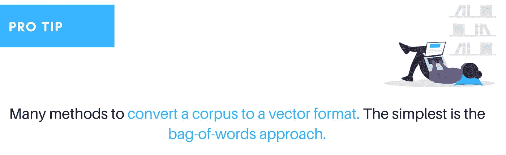

由作者设计。来自 [unDraw](https://undraw.co/) 的插图。

## 标记化

将字符串转换或分解为单词和标点符号[17]的过程，即，将正常的文本字符串转换为标记列表，也称为词条。

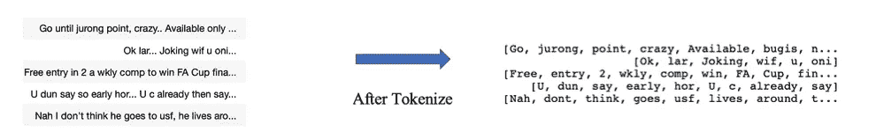

标记化前后。图片作者。

## …向量化…

将每个单词拆分后，需要将每个单词(词条)转换为 SciKit 学习算法模型可以使用单词袋模型的向量。为此，该项目使用词袋模型遵循两个步骤:

1.通过 CountVectorizer 计算一个单词在每条消息中出现的次数(称为词频)。

2.对计数进行加权，以使频繁出现的标记获得较低的权重(逆文档频率),并使用 TF-IDF 对术语进行加权和归一化。

**计数矢量器**

这个模型将把一个文本文档集合转换成一个令牌计数的二维矩阵。其中一维是整个词汇表(每个单词一行)，另一维是实际的文档，在本例中是每个文本消息一列

**TF-IDF**

TF-IDF 代表词频-逆文档频率，而 TF-IDF 权重是信息检索和文本挖掘中经常使用的两个主要关注的权重。

1.用于评估一个单词对集合中的文档有多重要

2.重要性随着单词出现的次数成比例增加

**TF-IDF 背后的两个想法:**

词频(TF)，又名。一个单词在文档中出现的次数，除以该文档中的总单词数，即它衡量一个术语在文档中出现的频率

逆文档频率(IDF)，计算为语料库中文档数量的对数除以特定术语出现的文档数量，即它衡量术语的重要性[13]。

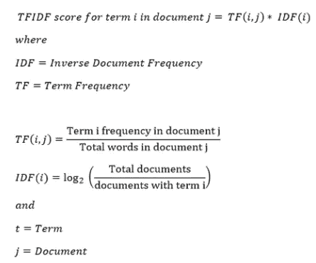

TF-IDF 的公式。

在计算 TF 时，所有项都被认为是同等重要的。然而，众所周知，某些术语，如“是”、“的”和“那个”，可能会出现很多次，但并不重要。

## 探索性数据分析

在探索性数据分析(EDA)周期中，我们看到了数字和非数字的长度特征和分布，还绘制了垃圾邮件和垃圾邮件的前 30 个单词。

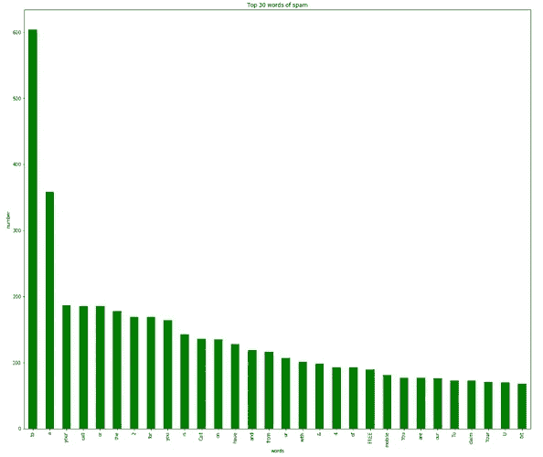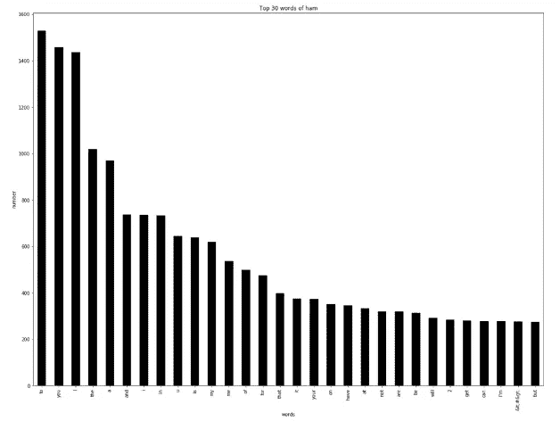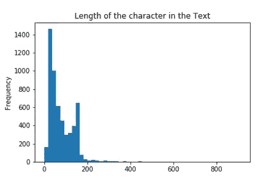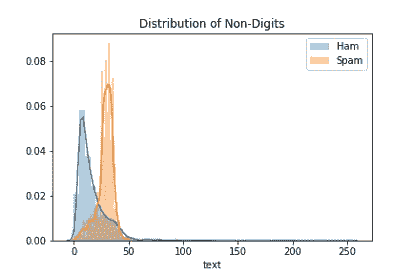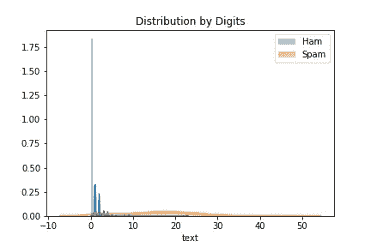

EDA 循环一瞥。图片作者。

在预处理、矢量化并从 EDA 中获得一些见解后，该项目开始训练一个模型并使用七种不同的分类算法。

从博客的第一部分开始，我们对算法有了基本的了解，并在笔记本上使用它们，这里是从每个算法中获得的精度。

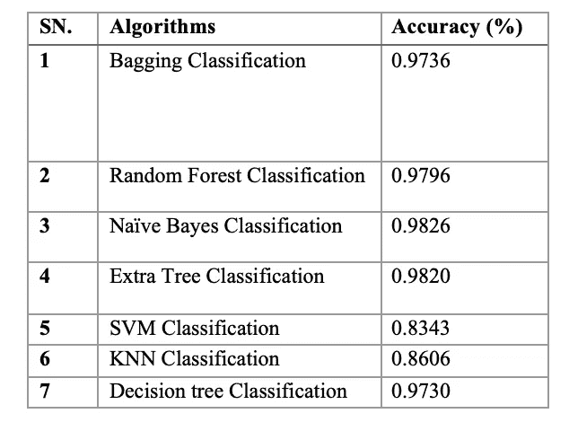

垃圾短信/垃圾短信分类算法及其准确性。图片作者。

通过使用七种算法，该项目发现朴素贝叶斯分类优于所有算法，因此该项目使用了朴素贝叶斯分类，该分类经验证具有简单性和高准确性[14]。

> [第三部](/the-ultimate-guide-to-sms-spam-or-ham-detector-85f3c824e55a)
> 
> 在下一篇博客文章中，我们将深入探讨垃圾邮件或业余爱好者分类器背后的朴素贝叶斯理论，并研究垃圾邮件或业余爱好者检测器的 python flask 代码。

**直接想玩代码**，那就请检查 [GitHub](https://github.com/maladeep/sms-spam-ham-detector) 。

**与最终产品互动**

 [## 垃圾短信|火腿

### 这个项目的数据集取自 UCI 机器学习行动执行的 EDA 算法使用 Bagging…

sms-spam-ham-detector.herokuapp.com](https://sms-spam-ham-detector.herokuapp.com/) 

> *如果你对这篇文章有任何疑问，或者想在你的下一个数据科学项目上合作，请在* [*LinkedIn*](https://www.linkedin.com/in/maladeep/) *上 ping 我。*

# 推荐读物

*   [使用 TF-IDF 从噪声中识别信号](https://mungingdata.wordpress.com/2017/11/25/episode-1-using-tf-idf-to-identify-the-signal-from-the-noise/)
*   [初学者探索性数据分析](https://medium.com/analytics-vidhya/exploratory-data-analysis-for-beginner-7488d587f1ec)
*   [文本矢量化入门](/getting-started-with-text-vectorization-2f2efbec6685)

参考

[13]洛克，E.K.( 2017 年 11 月 25 日)。第 1 集:使用 TF-IDF 从噪声中识别信号。检索于 2020 年 2 月 21 日，来自[https://mungingdata . WordPress . com/2017/11/25/episode-1-using-TF-IDF-to-identify-the-signal-from-the-noise/](https://mungingdata.wordpress.com/2017/11/25/episode-1-using-tf-idf-to-identify-the-signal-from-the-noise/)

[14] Taufiq Nuruzzaman，m .，Lee，c .，Abdullah，M.F.A.b .和 Choi，D. (2012)，独立移动电话上的简单垃圾短信过滤。安全通信网络，5:1209–1220。doi:10.1002/秒 577

[15]阿尔梅达，T. A .，&伊达尔戈，J. M. G. (2012 年 6 月 22 日)。垃圾短信收集数据集。检索于 2020 年 2 月 19 日，来自[https://archive.ics.uci.edu/ml/datasets/sms](https://archive.ics.uci.edu/ml/datasets/sms)垃圾邮件收集#

[16]张，杨，金，周，周志华(2010).理解词袋模型:一个统计框架。国际机器学习和控制论杂志，1(1–4)，43–52。

[17]史蒂文，b .，克莱因，E. &洛珀，E .(2019 年 9 月 4 日)。用 Python 进行自然语言处理。检索于 2020 年 2 月 21 日，来自[https://www.nltk.org/book/ch03.html](https://www.nltk.org/book/ch03.html)