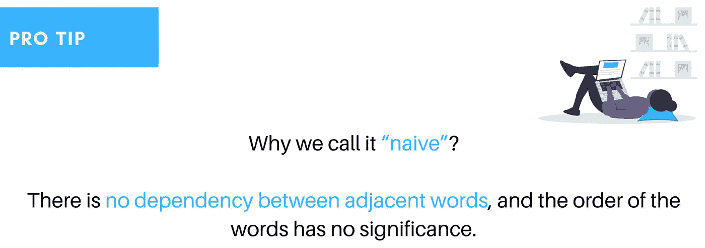
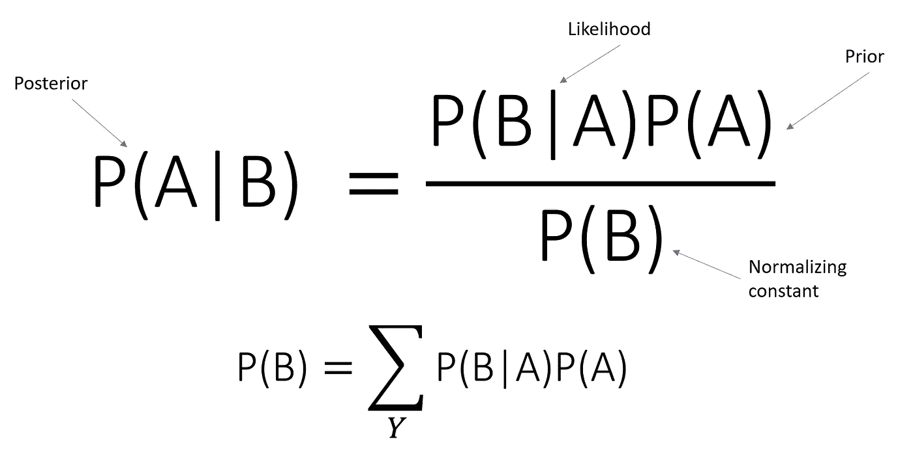
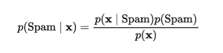
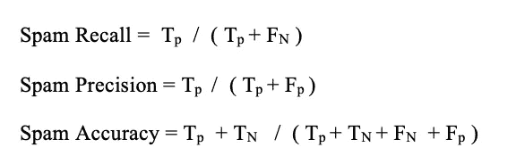
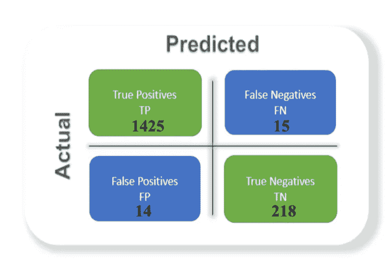
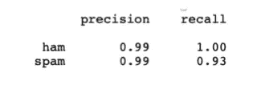
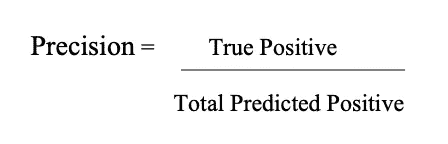
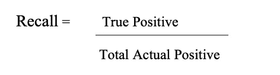

# SMS 终极指南:使用 Python 的垃圾邮件或火腿分类器

> 原文：<https://towardsdatascience.com/the-ultimate-guide-to-sms-spam-or-ham-detector-85f3c824e55a?source=collection_archive---------27----------------------->

## 人工智能概念的方法

## 开发垃圾邮件或火腿分类器的详细报告:第 3 部分

用 [Canva 设计。](https://www.canva.com/templates/EADaoQ4RN_g-city-buildings-facebook-cover/)插图来自[未画](https://undraw.co/)。

**TL；博士**从人工智能概念的角度理解垃圾邮件或火腿分类器，使用各种分类算法，选择高精度产生算法，开发 Python Flask 应用。

> **该博客是博文**的一个系列，如果您没有读过垃圾邮件或火腿分类器的理论人工智能概念，也没有在 jupyter notebook 中使用过算法，请访问:

 [## 短信终极指南:垃圾邮件还是火腿探测器

### 开发垃圾邮件或火腿分类器的详细报告:第 1 部分

towardsdatascience.com](/the-ultimate-guide-to-sms-spam-or-ham-detector-aec467aecd85)  [## 短信终极指南:垃圾邮件还是火腿探测器

### 开发垃圾邮件或火腿分类器的详细报告:第 2 部分

towardsdatascience.com](/the-ultimate-guide-to-sms-spam-or-ham-detector-67c179bc94dc) 

**我们已经在第 1 部分& 2** 中介绍过

*   关于垃圾邮件或火腿分类器的理论人工智能概念
*   分类算法
*   探索数据源
*   数据准备
*   探索性数据分析

**我们将在第 3 部分**对此进行介绍

*   垃圾邮件或火腿背后的朴素贝叶斯
*   绩效衡量标准
*   垃圾邮件检测器的开发

由作者设计。从[展开](https://undraw.co/)的图示。

## 垃圾邮件或火腿背后的朴素贝叶斯

> 贝叶斯规则最有用的应用之一是所谓的朴素贝叶斯分类器。

朴素贝叶斯算法为 SMS 消息的分类创建了一个概率模型。尽管所有特征都对分类的总体概率有贡献，但朴素贝叶斯算法假设这些特征在统计上彼此独立[10]。虽然这种假设可能并不适用于所有情况，但与其他众所周知的分类算法相比，朴素贝叶斯算法已经显示出有希望的结果。朴素贝叶斯的一个优点是，它只需要少量的训练数据来估计分类所需的参数，并且由于数据集较小，朴素贝叶斯分类器可以胜过更强大的备选方案[18]。因为假设了独立变量，所以只需要确定每类变量的方差，而不是整个协方差矩阵。

贝叶斯法则。图片由[尼尔斯雅各布沙](https://www.norwegiancreations.com/2018/09/artificial-intelligence-bayes-network/)

因此，对于垃圾邮件或 ham 中的 SMS 分类，项目想要计算的概率是:

图片由塞巴斯蒂安·拉什卡提供。

其中 x 是包含来自垃圾(或 Ham) SMS 文本的单词的特征向量[11]。

Prior(spam) =“任何新消息是垃圾消息的概率”

火腿 **:** P(火腿)**= 1p(垃圾)**

## **绩效衡量标准**

**它是正确分类的邮件的相对数量，正确分类的邮件的百分比用作评估过滤器性能的附加度量。然而，已经强调指出，使用准确性作为唯一的性能指标是不够的。必须考虑其他性能指标，如召回率、精确度、ROC 曲线下面积(AUC)和信息检索领域中使用的派生度量，决策理论中使用的假阳性和假阴性也是如此[12]。ROC 曲线及其相关曲线对于探索不同分类器在一系列成本上的权衡非常有用。粗略地说，曲线下的面积越大，性能越好。为了确定其他三个标准，首先项目应该定义一些术语:**

****真阳性(TP):** 被正确分类的合法短信的比率。**

****误报(FP):** 垃圾短信被正确分类的比率。**

****真阴性(TN):** 合法短信被错误分类为垃圾短信的比率。**

****误报(FN):** 垃圾短信被误认为合法短信的比率。**

**误报错误，它将合法的 SMS 转移为垃圾邮件，通常被认为比误报更严重。**

**现在，所谓的性能测量标准可以定义为:**

****

***模型的性能标准。图片作者。***

**实际上，召回决定了正确分类的合法消息(文本)的比例，精度决定了所有正确分类的合法消息(文本)的比例，准确性决定了所有正确分类的消息(文本)的比例。**

**从项目([见代码](https://github.com/maladeep/sms-spam-ham-detector/blob/master/notebookEDA.ipynb))上看使用朴素贝叶斯混淆矩阵是:**

****

**混淆矩阵值。图片作者。**

**这表明该项目确实有对称数据集，其中假阳性(14)和假阴性(15)的值几乎相同。因此，该项目不需要查看其他参数来评估模型的性能[19]。然而，出于研究目的，该项目计算了以下矩阵。**

****

***模型的性能矩阵。图片作者。***

****精度**:精度是正确预测的正观测值与总预测正观测值之比。这个指标回答的问题是，在所有被标记为垃圾邮件的文本中，有多少实际上是垃圾邮件？高精度与低假阳性率相关。这个模型有 0.99 的精度，相当不错。**

****

***精密公式。图片作者。***

****召回(灵敏度)**:召回是正确预测的正面观察值与实际类中所有观察值的比率——是的。回忆回答的问题是:在所有真正垃圾的文本中，模型标记了多少？该模型的召回率为 0.93，这对该模型来说是好的，因为它高于 0.5。**

****

**回忆公式。图片作者。**

> **从代理、环境、PEAS 等人工智能概念开始，探索七种二进制分类算法，执行矢量化、TF-IDF、EDA，实现算法并从混淆矩阵、精确度、召回率评估性能，我们创建了基于 web 的 SMS:Spam 或 Ham 检测器。**

# **结论**

**朴素贝叶斯分类算法是处理分类数据的有效方法。它使用的基本理论是贝叶斯条件概率模型，用于在给定特定条件下寻找后验概率。之所以称之为“天真”，是因为假设数据集中的所有特征(单词集合)都是同等重要和独立的。使用朴素贝叶斯分类算法，该项目根据垃圾邮件包含的单词预测垃圾邮件的准确率超过 98%。为了使预测更加准确，项目需要增加数据集中的数据数量。**

**我们的工作就此结束。现在，如果你想**自己实现代码**，那么请访问我的 [GitHub](https://github.com/maladeep/sms-spam-ham-detector) 并克隆这本书并玩它。**

****与最终产品互动****

 **[## 垃圾短信|火腿

### 这个项目的数据集取自 UCI 机器学习行动执行的 EDA 算法使用 Bagging…

sms-spam-ham-detector.herokuapp.com](https://sms-spam-ham-detector.herokuapp.com/)** 

> ***如果你对这篇文章有任何疑问，或者想在你的下一个数据科学项目上合作，请在*[*LinkedIn*](https://www.linkedin.com/in/maladeep/)*上 ping 我。***

# **推荐读物**

*   **[朴素贝叶斯和文本分类](https://sebastianraschka.com/Articles/2014_naive_bayes_1.html#References)**
*   **[准确度、精确度、召回率& F1 分数:性能测量的解释](https://blog.exsilio.com/all/accuracy-precision-recall-f1-score-interpretation-of-performance-measures/)**
*   **[机器学习分类器](/machine-learning-classifiers-a5cc4e1b0623)**

****参考文献****

**[10] Androutsopoulos，I .，Koutsias，j .，Chandrinos，K. V .，Paliouras，g .，和斯皮罗普洛斯特区(2000 年)。对朴素贝叶斯反垃圾邮件过滤的评估。arXiv 预印本 cs/0006013。**

**[11] Chávez，G.(2019 年 2 月 28 日)“用五个步骤实现用于文本分类的朴素贝叶斯分类器”。检索于 2020 年 2 月 21 日，来自 https://towards data science . com/implementing-a-nave-Bayes-classifier-for-text-categorization-in-five-steps-f 9192 cdd 54 c 3**

**[12] Dada，例如 Bassi，J. S .，Chiroma，h .，Adetunmbi，A. O .，& Ajibuwa，O. E. (2019 年)。垃圾邮件过滤的机器学习:综述、方法和开放研究问题。Heliyon，5(6)，e01802。**

**[16] P. Domingos 和 M. Pazzani，“零一损失下简单贝叶斯分类器的最优性”，机器学习，第 29 卷，第 2-3 期，第 103-130 页，1997 年**

**[19] Joshi，R.(2016 年 9 月 9 日)。“准确度、精确度、召回率和 F1 分数:性能指标的解释”。2020 年 3 月 5 日检索，来自[https://blog . ex silio . com/all/accuracy-precision-recall-f1-score-interpretation-of-performance-measures/](https://blog.exsilio.com/all/accuracy-precision-recall-f1-score-interpretation-of-performance-measures/)**