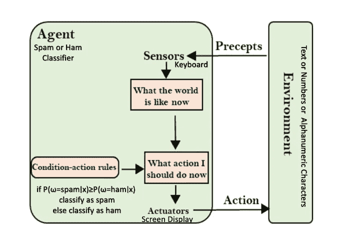
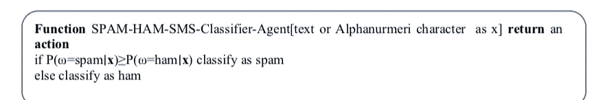
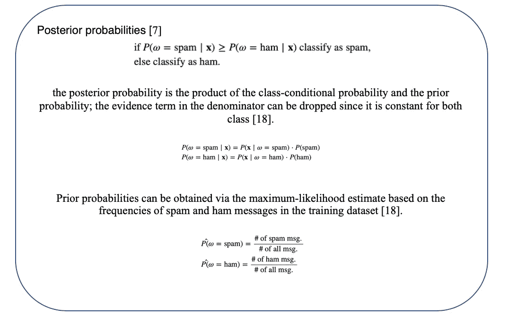
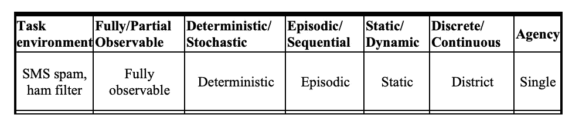
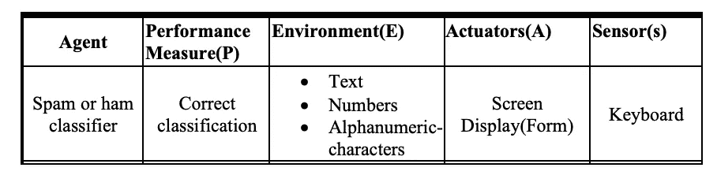
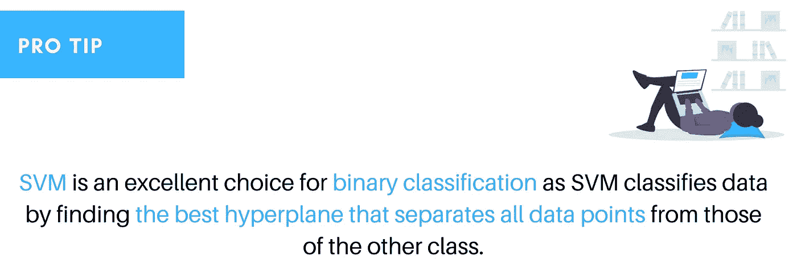

# SMS 终极指南:使用 Python 的垃圾邮件或火腿分类器

> 原文：<https://towardsdatascience.com/the-ultimate-guide-to-sms-spam-or-ham-detector-aec467aecd85?source=collection_archive---------27----------------------->

## 人工智能概念的方法

## 开发垃圾邮件或火腿分类器的详细报告:第 1 部分

用 [Canva 设计。](https://www.canva.com/templates/EADaoQ4RN_g-city-buildings-facebook-cover/)插图来自[未画](https://undraw.co/)。

**TL；DR** 从人工智能概念的角度理解 spam 或 ham 分类器，使用各种分类算法，选择高精度的产生算法并开发 Python Flask 应用程序用于 SMS: spam 或 ham 检测器。

最终产品。作者 Gif。

短信息服务(SMS)不仅仅是一种聊天技术。短信技术是从全球移动通信系统标准演变而来的，这是一个国际公认的标准[1]。垃圾邮件是对电子信息系统的滥用，不加选择地大量发送未经请求的消息[2]。虽然最广泛认可的垃圾邮件形式是电子邮件垃圾邮件，但该术语也适用于其他媒体和媒介中的类似滥用。在这种情况下，垃圾短信与电子邮件非常相似，通常是不请自来的带有某种商业利益的群发消息。垃圾短信被用于商业广告和传播钓鱼链接。商业垃圾邮件发送者使用恶意软件发送垃圾短信，因为发送垃圾短信在大多数国家是非法的。从受损机器发送垃圾邮件降低了垃圾邮件发送者的风险，因为它掩盖了垃圾邮件的来源。SMS 可以包含有限数量的字符，包括字母、数字和一些符号。浏览这些信息会发现一个清晰的模式。几乎所有的垃圾短信都要求用户拨打某个号码、回复短信或访问某个网址。通过对垃圾邮件语料库进行简单的 SQL 查询获得的结果可以观察到这种模式[3]。短信网络的低价格和高带宽吸引了大量的垃圾短信[4]。

> 人们将垃圾短信分为令人讨厌(32.3%)、浪费时间(24.8%)、侵犯个人隐私(21.3%)[5]。

每次垃圾短信到达用户的收件箱时，手机都会提醒用户有新消息。当用户意识到这条信息是不想要的，他或她会感到失望，而且垃圾短信会占用手机的一些存储空间。

垃圾短信检测是识别和过滤垃圾短信的一项重要任务。随着每天传送的 SMS 消息数量越来越多，用户很难记住在上下文中接收的较新的 SMS 消息并将其与先前接收的 SMS 相关联。因此，使用人工智能的知识与机器学习和数据挖掘的融合，我们将尝试开发基于 web 的 SMS 文本垃圾邮件或 ham 检测器。

> **这是博客系列**的三个部分，我们将从人工智能概念的角度来理解垃圾邮件或火腿分类器的进出，并使用 jupyter notebook 中的各种分类算法，并根据性能标准选择一种算法。然后，我们将开发基于 Python web 的 SMS 文本垃圾邮件或 ham 检测器。

**我们将在这里讨论什么内容**

*   关于垃圾邮件或火腿分类器的理论人工智能概念
*   分类算法
*   探索数据源
*   数据准备
*   探索性数据分析
*   垃圾邮件或火腿背后的朴素贝叶斯
*   绩效衡量标准
*   垃圾邮件检测器的开发

## 代理描述

正如已经提到的，我们将从人工智能课程概念方面来做这个项目，所以，让我们来理解代理。

由于该项目设计简单，即代理可以根据代理类型将传入的文本(消息)分类为垃圾邮件或垃圾邮件[6]；该项目代理属于简单反射代理，因为它仅基于当前环境情况采取行动，即，它将当前感知映射到适当的行动，而忽略感知的历史。映射过程是简单的基于规则的匹配算法，这里是朴素贝叶斯🤭。

垃圾邮件或火腿分类器的简单反射代理。图片作者。

## 代理功能

一种功能，它规定了代理响应每一个可能的感知序列的动作，即代理功能将感知映射为动作，代理程序与机器体系结构相结合，实现代理功能。

双态分类器中简单反射代理的代理程序功能。图片作者。

## 垃圾邮件分类代理的决策规则

代理函数**的决策规则。**图片作者。

## 代理环境

环境是围绕代理的一切，而不是代理本身的一部分。这是代理“生活”或操作的地方，并为代理提供感知的东西和移动的地方。环境类似于现实生活中的世界，具有它的一些特性。环境可以具有来自代理的各种属性[8]。

## 任务环境

任务环境也被称为 AI 代理的高级描述，可以用助记符 PEAS *(性能、环境、执行器* ***、*** *【传感器】*【9】)来记忆。任务环境及其属性特征对于垃圾短信或火腿分类器给出如下。

垃圾短信或垃圾邮件过滤器任务环境及其特征。图片作者。

**完全可观察:**在这里，代理不需要维护任何内部状态来跟踪世界，因为它基于朴素贝叶斯，假设数据集中的特征是相互独立的，并且不需要维护任何，并且代理传感器使其能够访问环境在任何时间点的完整状态。

**确定性:**因为我们可以预测代理(分类器)的行为，即当我们提供确定无疑的垃圾邮件文本(消息)时，代理的输出将是什么。

**情节性:**许多分类任务是情节性的[6]。代理可以基于每个当前的决定来分类垃圾邮件或 ham，而不管先前的选择，即，当前的决定不影响下一个文本是否是垃圾邮件，并且比顺序的简单得多，因为环境不需要提前考虑。

**静态环境:**作为项目，当代理(分类器)正在考虑动作(垃圾邮件或 ham)时，环境不会发生变化。

**离散:**由于智能体有固定(有限)数量的感知和动作。

**代理:**单个，因为环境中没有任何其他代理进行交互。

## 豌豆

*   **性能指标**:人工智能如何知道它正在做它应该做的事情？
*   **环境**:代理与什么环境交互？
*   **致动器**:AI 如何影响它的环境？
*   **传感器**:人工智能如何从环境中获取信息？

分类器的任务环境描述如下:

对垃圾邮件或 Ham 分类器的任务环境的描述。图片作者。

现在，我们对各种人工智能概念有了足够的理解，这些概念有助于我们创建一个机器学习产品。现在，让我们了解不同的分类器算法。

## 算法描述

机器学习算法可用于识别垃圾邮件或垃圾邮件，方法是为系统配备相应的标签，并使用训练好的模型进行预测或分类，因为项目目标是对垃圾邮件或垃圾邮件中的文本进行分类，这是二进制分类问题，因此项目将使用七种最适合二进制分类的算法[4]。

## 制袋材料

Bagging 使用了一种简单的方法，这种方法在统计分析中反复出现——通过合并多个估计值来改进一个估计值。Bagging 使用训练数据的引导抽样构建 n 个分类树，然后组合它们的预测以产生最终的元预测。

## 随机森林

随机森林或随机决策森林是一种用于分类、回归和其他任务的集成学习方法，该方法通过在训练时构建大量决策树并输出作为单个树的类(分类)或均值预测(回归)模式的类来操作[10] [11]。随机决策树纠正了决策树过度适应训练集的习惯[12]。

## 朴素贝叶斯

顾名思义，该算法假设数据集中的所有变量都是“天真的”，即彼此不相关。它被称为朴素贝叶斯或白痴贝叶斯，因为每个假设的概率计算都被简化了，使它们的计算易于处理[5]。朴素贝叶斯是一种病毒分类算法，主要用于获得数据集的基本准确性[2]。尽管这种算法很简单，但根据概率而不是大量的数据集来对短信信息进行分类要快得多。这有助于减少人工智能系统的负荷，并保持输出的可管理性和有效性。由于朴素贝叶斯分类器不需要经过训练的模型，因此实现起来简单快捷。这允许在真实数据上进行测试，而无需花费大量时间和金钱来开发模型。当它们被应用时，它们就可以做预测了。

## 额外树分类器

这就像随机森林。它构建了多个树，并使用随机的特征子集来分割节点，但有两个关键区别:它不引导观察值(意味着它在没有替换的情况下采样)，并且节点是在随机分割而不是最佳分割时分割的。

## 支持向量机(SVM)

支持向量机(SVMs，也称为支持向量网络)是具有相关学习算法的监督学习模型，这些算法分析用于分类和回归分析的数据。给定一组训练样本，每个样本被标记为属于两个类别中的一个或另一个，SVM 训练算法建立一个模型，将新样本分配给一个类别或另一个类别，使其成为非概率二元线性分类器[13]。SVM 是二元分类的绝佳选择，因为 SVM 通过寻找将所有数据点与其他类的数据点分开的最佳超平面来对数据进行分类[3]。

由作者设计。从[展开](https://undraw.co/)的插图。

## KNN

基于 k-最近邻的分类是一种懒惰学习，因为它不试图构建一般的内部模型，而是仅存储训练数据的实例。根据每个点的 k 个最近邻的简单多数投票来计算分类。该算法实现简单，对噪声训练数据具有鲁棒性，并且如果训练数据是大量的，则该算法是有用的。然而，缺点是它需要确定 K 的值，并且计算成本高，因为它需要计算每个实例到所有训练样本的距离。

## 决策树分类

分裂标准的原则是任何决策树分类器智能的基础。决策树类似于具有树形结构的流程图，其中实例根据其特征值进行分类。决策树中的一个节点代表一个实例，测试结果由分支描述，叶节点代表类标签。

因此，我们从人工智能的角度对垃圾邮件或业余爱好者分类器有了一个基本而健康的了解，并了解了不同的二进制分类算法。

> 第二部 | [第三部](/the-ultimate-guide-to-sms-spam-or-ham-detector-85f3c824e55a)
> 
> 在下一篇博客中，我们将进入数据集，选择最佳算法来制作基于 web 的垃圾邮件或 ham 分类器。

**直接想玩代码**，那就请检查 [GitHub](https://github.com/maladeep/sms-spam-ham-detector) 。

**与最终产品互动**

 [## 垃圾短信|火腿

### 这个项目的数据集取自 UCI 机器学习行动执行的 EDA 算法使用 Bagging…

sms-spam-ham-detector.herokuapp.com](https://sms-spam-ham-detector.herokuapp.com/) 

> *如果你对这篇文章有任何疑问，或者想在你的下一个数据科学项目上合作，请在*[*LinkedIn*](https://www.linkedin.com/in/maladeep/)*上 ping 我。*

# 推荐读物

*   [第 5 章:随机森林分类器](https://medium.com/machine-learning-101/chapter-5-random-forest-classifier-56dc7425c3e1)
*   [Python 中名字匹配出奇有效的方法](/surprisingly-effective-way-to-name-matching-in-python-1a67328e670e)
*   [人工智能中的智能体](https://www.educba.com/agents-in-artificial-intelligence/)

**参考文献**

[1] J. Brown，B. Shipman 和 R. Vetter，“SMS:短消息服务”，载于《计算机》，第 40 卷，第 12 期，第 106-110 页，2007 年 12 月。

[2] B .惠特沃思和 e .惠特沃思，“垃圾邮件和社会技术差距”，《计算机》，第 37 卷，第 38-45 页，2004 年。

[3] Hedieh Sajedi，Golazin Zarghami Parast，Fatemeh Akbari。基于机器学习技术的垃圾短信过滤:综述。机器学习研究。第 1 卷，2016 年第 1 期，第 1–14 页。doi:10.11648/j . MLR 2016 01.11

[4] Yoon J，Kim H，Huh J .用于移动通信的混合垃圾邮件过滤。计算机与安全杂志 2010；29(4):446–459.DOI:10.1016/j.cose

[5] Joe I，Shim H .一个使用支持向量机的垃圾短信过滤系统。《未来一代信息技术学报》, 2010 年 12 月；577–584，DOI:[10.1007/978‐3‐642‐17569‐5 _ 56](https://doi.org/10.1007/978-3-642-17569-5_56)。

[6]拉塞尔、斯图尔特·J 和彼得·诺维格。人工智能:现代方法。新泽西州恩格尔伍德克利夫斯出版社，1995 年。打印。

[7] Raschka，S.(2014)，朴素贝叶斯和文本分类——介绍和理论，2020 年 2 月 5 日检索自[https://sebastianraschka . com/Articles/2014 _ nave _ Bayes _ 1 . html # References](https://sebastianraschka.com/Articles/2014_naive_bayes_1.html#References)

[8]智能代理。(2008).2020 年 3 月 1 日从 http://en.wikipedia.org/wiki/Intelligent_agents[检索](http://en.wikipedia.org/wiki/Intelligent_agents)

[9]人工智能/AI 代理及其环境。2020 年 3 月 1 日检索，来自[https://en . wikibooks . org/wiki/Artificial _ Intelligence/AI _ Agents _ and _ their _ Environments](https://en.wikibooks.org/wiki/Artificial_Intelligence/AI_Agents_and_their_Environments)

[10] Androutsopoulos，I .，Koutsias，j .，Chandrinos，K. V .，Paliouras，g .，和斯皮罗普洛斯特区(2000 年)。对朴素贝叶斯反垃圾邮件过滤的评估。arXiv 预印本 cs/0006013。

[11] Chávez，G.(2019 年 2 月 28 日)“用五个步骤实现用于文本分类的朴素贝叶斯分类器”。检索于 2020 年 2 月 21 日，来自 https://towards data science . com/implementing-a-nave-Bayes-classifier-for-text-categorization-in-five-steps-f 9192 cdd 54 c 3

[12] Dada，例如 Bassi，J. S .，Chiroma，h .，Adetunmbi，A. O .，& Ajibuwa，O. E. (2019 年)。垃圾邮件过滤的机器学习:综述、方法和开放研究问题。Heliyon，5(6)，e01802。

[13]洛克，E.K.( 2017 年 11 月 25 日)。第 1 集:使用 TF-IDF 从噪声中识别信号。2020 年 2 月 21 日检索，来自[https://mungingdata . WordPress . com/2017/11/25/episode-1-using-TF-IDF-to-identify-the-signal-from-the-noise/](https://mungingdata.wordpress.com/2017/11/25/episode-1-using-tf-idf-to-identify-the-signal-from-the-noise/)