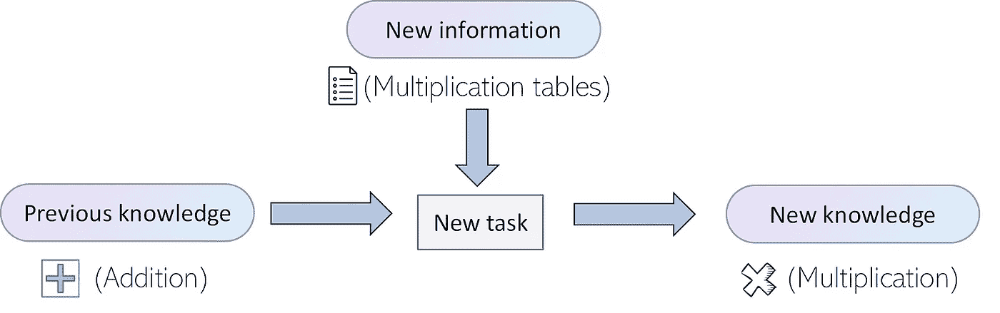
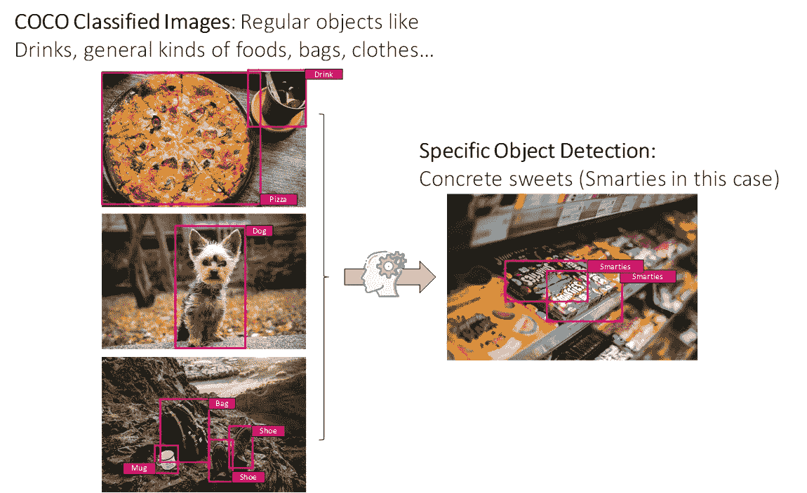
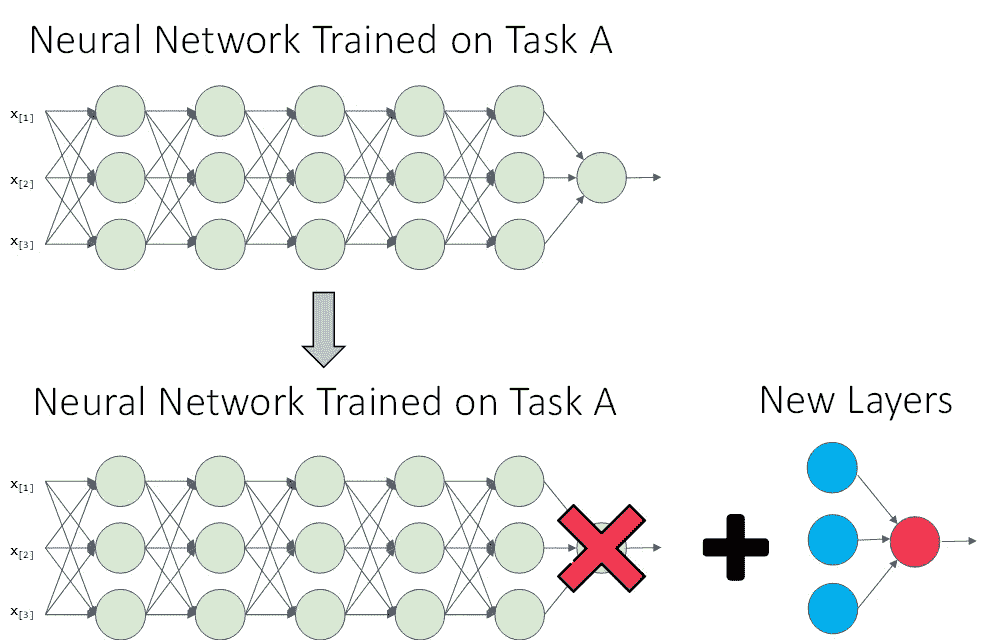

# 迁移学习的终极指南

> 原文：<https://towardsdatascience.com/the-ultimate-guide-to-transfer-learning-ebf83b655391?source=collection_archive---------41----------------------->

## 什么是迁移学习？我能在哪里使用它？我为什么要用它？怎么用？请继续阅读，寻找答案！

图片来自 [Unsplash](https://howtolearnmachinelearning.com/books/artificial-intelligence-books/)

# 介绍

迁移学习是机器学习领域中广泛使用的技术，主要用于计算机视觉和自然语言处理。

在本帖中，我们将详细解释它是什么，什么时候应该使用它，为什么它是相关的，并展示如何在自己的项目中使用它。

一旦你准备好了，躺下，放松，让我们开始吧！

## TL；博士！

1.  什么是迁移学习？
2.  为什么迁移学习很牛逼？
3.  什么时候应该使用迁移学习？
4.  如何使用迁移学习？
5.  结论和更多资源。

# 1)什么是迁移学习？

我们将看到该技术的各种定义，从不同的角度阐明它是什么，并便于理解。

从底层开始，仅从名字我们就可以大致了解迁移学习可能是什么:它是指从一些已经学过的先前知识出发，对某项任务的学习。这个先前的知识已经被*从第一个任务*转移到第二个任务。

还记得你学乘法的时候吗？你的老师可能会说类似“M *乘就是 X 乘以*相加”这样的话。

因为你已经知道如何加法，你可以很容易地通过思考'*2 乘以 3 就是把 2 乘以 3 相加。二加二等于四。用前面的结果再重复一次，得到三个加法。四加二等于六。这意味着二乘三等于六！我是天才！*’

可能不完全是这样，但心理过程可能是相似的。除了学习乘法之外，你还转移了你所学的知识。

与此同时，你可能学过乘法表，这使得你以后可以轻松地进行乘法运算，而不必经历整个加法过程。然而，开始是知道如何求和。

迁移学习的直觉和一个简单的例子。图片作者。

在 Ian Goodfellow 等人的名著 [*深度学习*中，迁移学习是这样描述的。你可以在这里找到这本巨著的精彩评论。](https://amzn.to/3jnDCgW)

> 迁移学习和领域适应指的是这样一种情况，即在一种环境中所学的知识被用来提高在另一种环境中的概括能力

正如你所看到的，最后一个解释更加精确，但仍然适用于我们简单的、最初的解释:在一种设置(加法)中学习的一些技能可以用于在另一种设置(乘法)中提高性能或速度。

最后，在我们看到迁移学习为什么如此强大之前，让我们来看一个更正式的定义，关于**域( *D* )** 、**任务( *T*** )和一个**特征空间 *X*** 以及一个**边际概率分布 *P(X)*** *。*事情是这样的:

> *给定一个特定的域* **D = {X，P(X)}** *，一个任务由两部分组成:一个标签空间* **Y** *和一个目标预测函数****，它是从带标签的数据对* **{xi，易】** *中学习得到的，可以用来预测相应的标签***f(t)因此任务可以表示为 **T = {y，f(·)}***。*****
> 
> ***然后，给定一个源域* **Ds** *，和一个学习任务* **Ts** *，一个目标域* **Dt** *，和一个学习任务***【TT***，迁移学习旨在帮助提高目标预测函数***ft()**[1]**

****牛逼！**现在，我们已经看到了 3 个不同的定义，按复杂程度递增。让我们看一个快速的例子来完成对什么是迁移学习的理解。**

## **计算机视觉中的迁移学习**

**计算机视觉是迁移学习使用最广泛的领域之一，因为 CNN 算法如何学习拾取图像的低级特征，这些特征可用于不同范围的任务视觉，还因为训练这些类型的模型在计算上是多么昂贵。**

**正如我们将在后面看到的，在这个领域有很强的理由使用迁移学习，但让我们先看一个例子。想象一个卷积神经网络，它已经被训练用于对不同的常见对象进行分类，例如上下文中的[常见对象(COCO)数据集](https://cocodataset.org/#home)。想象一下，我们想要建立一个分类器来执行一个更加具体和狭窄的任务，比如识别不同类型的糖果(Kit-Kats，Mars Bars，Skittles，Smarties)，对于这些我们只有很少的图像。**

**然后，我们最有可能采用在 COCO 数据集上训练的网络，使用迁移学习，使用我们的小型糖果数据集对其进行微调，并实现相当好的性能。**

****

**使用在 COCO 数据集上训练的网络上的迁移学习来检测不同的糖果。图片来源于 [Unsplash](https://unsplash.com/) 。**

**好了，在这个简单的例子之后，让我们看看为什么我们要使用迁移学习。**

# **2)为什么迁移学习很牛逼？**

**在前面的例子中，我们看到了迁移学习的一些好处。许多问题非常具体，很难找到大量数据来解决它们，并取得中等程度的成功。**

**此外，软件开发中有一个基本概念，我认为如果采用得当，可以节省我们很多时间:**

> **我们不必重新发明轮子！**

**人工智能社区如此之大，而且有如此多的公共工作、数据集和预先训练的模型，从头开始构建一切几乎没有意义。说到这里，这是我们应该使用迁移学习的两个主要原因:**

*   **训练一些机器学习模型，特别是处理图像或文本的人工神经网络，会占用大量时间，并且计算量非常大。迁移学习可以减轻这种负担，它给我们一个已经训练好的网络，只需要一些后期微调。**
*   **获取某些任务的数据集(例如分类糖果图像的数据集，或者自然语言处理问题的特定数据集)是非常昂贵的。迁移学习允许我们在这些狭窄的任务中获得非常好的结果，使用的数据集比我们在没有它的情况下面对问题时所需的数据集要小得多。**

**不要忘记，迁移学习是一种优化:节省培训时间的捷径，解决一个你无法用现有数据解决的问题，或者只是为了达到更好的表现。**

# **3)什么时候应该使用迁移学习？**

****好的，好的！**既然我们知道了什么是迁移学习，以及为什么要使用它，那么我们来看看什么时候应该使用 TL！**

****首先**，要使用迁移学习，数据的特征必须是通用的，这意味着它们必须适合源任务和目标任务。这通常发生在计算机视觉中，其中用于训练的算法的输入是图像的像素值，以及它们的特定标签(用于检测的类或边界框)。很多时候这也是自然语言处理中发生的事情。**

**如果这两个问题没有共同的特征，那么应用迁移学习就会变得更加复杂。这就是为什么具有结构化数据的任务在迁移学习中更难找到，因为特征必须总是匹配。**

****其次**，正如我们之前看到的，当我们有大量数据用于源任务，而很少数据用于后验或目标任务时，迁移学习是有意义的。如果我们在两个任务中有相同数量的数据，那么迁移学习就没有太大的意义。**

****第三个也是最后一个**，初始任务的低级特征必须有助于学习目标任务。如果你试图从一组云数据中使用迁移学习来学习对动物图像进行分类，结果可能不会太好。**

**简而言之，如果你有一个源任务 A 和一个你想做好的目标任务 B，在下列情况下考虑使用迁移学习:**

*   **任务 A 和 B 有相同的输入 x。**
*   **任务 A 的数据比任务 b 多得多。**
*   **来自任务 A 的低级特征必须对学习任务 b 有帮助。**

**好吧！既然我们现在知道了什么、为什么和什么时候，那就让我们以如何结束吧。**

# **4)如何使用迁移学习？**

**使用迁移学习有两个主要的选择:使用预先训练的模型，或者使用初始任务的大量可用数据集建立源模型，然后使用该模型作为第二个感兴趣的任务的起点。**

**许多研究机构发布大型和挑战性数据集上的模型，这些数据集可能包含在候选模型池中以供选择。正因为如此，网上有很多预先训练好的模型，所以很有可能有一个适合你具体问题的。**

**如果没有，您可以获取一个可能与您的数据集相似的数据集，使用它来训练初始源模型，然后使用您可用于第二个任务的数据来微调该模型。**

**无论哪种方式，都需要使用我们的特定数据进行第二个训练阶段，以将第一个模型调整到我们想要执行的确切任务。让我们看看这是如何在人工神经网络环境中发生的:**

1.  **我们用网络的结构和预先训练的权重。**
2.  **我们移除最后一层(输出层)。**
3.  **我们用不同的输出层或不同层的组合来替换该层。**
4.  **我们用第二个任务的数据进行训练。第二次训练可以仅修改新添加的层的权重(如果我们只有非常少的数据，则推荐)或整个网络的权重。**

****

**用新的头层替换输出层。来源网络来自 dair.ai**

**在实践中，我们很少需要手动完成这项工作，因为大多数允许使用迁移学习的框架为我们透明地处理这项工作。如果你想在任何项目中使用迁移学习，这里有一些很棒的资源供你参考:**

*   **[Darknet 计算机视觉库](https://pjreddie.com/darknet/)。**
*   **许多使用单词嵌入的 NLP 项目，如 [GloVe](https://nlp.stanford.edu/projects/glove/) 和 Word2Vec，允许对特定词汇的嵌入进行微调，这实际上是一种迁移学习的形式。如果你不知道什么是单词嵌入，你可以查看这里的[了解它们。](/deep-learning-for-nlp-word-embeddings-4f5c90bcdab5?source=your_stories_page---------------------------)**
*   **[用于对象分割的掩模 R-CNN](https://github.com/matterport/Mask_RCNN) 也使用来自 COCO 数据集的迁移学习。**

# **5)结论和额外资源**

**就是这样！一如既往，我希望你喜欢这篇文章，并且我设法帮助你理解什么是迁移学习，它是如何工作的，以及它为什么如此强大。**

***如果你想了解更多关于机器学习和人工智能的知识，可以查看* [***本资源库***](https://howtolearnmachinelearning.com/) *了解更多关于机器学习和 AI 的资源！***

**如果您想了解有关该主题的更多信息，您可以在这里找到一些附加资源:**

*   **[**Cafe model Zoo**](https://github.com/BVLC/caffe/wiki/Model-Zoo):GitHub 储存库，拥有大量预先训练好的模型。**
*   **[Andrews Ng **关于迁移学习的视频**。](https://www.youtube.com/watch?v=yofjFQddwHE)**
*   **[论文:**深度迁移学习综述**。](https://arxiv.org/pdf/1808.01974.pdf)**
*   **[**另一个资源库**](https://howtolearnmachinelearning.com/books/artificial-intelligence-books/) 有很多关于机器学习和人工智能的进一步资源。**

**感谢您的阅读，祝您度过美好的一天！**

**[1] [维基百科:迁移学习](https://en.wikipedia.org/wiki/Transfer_learning)**