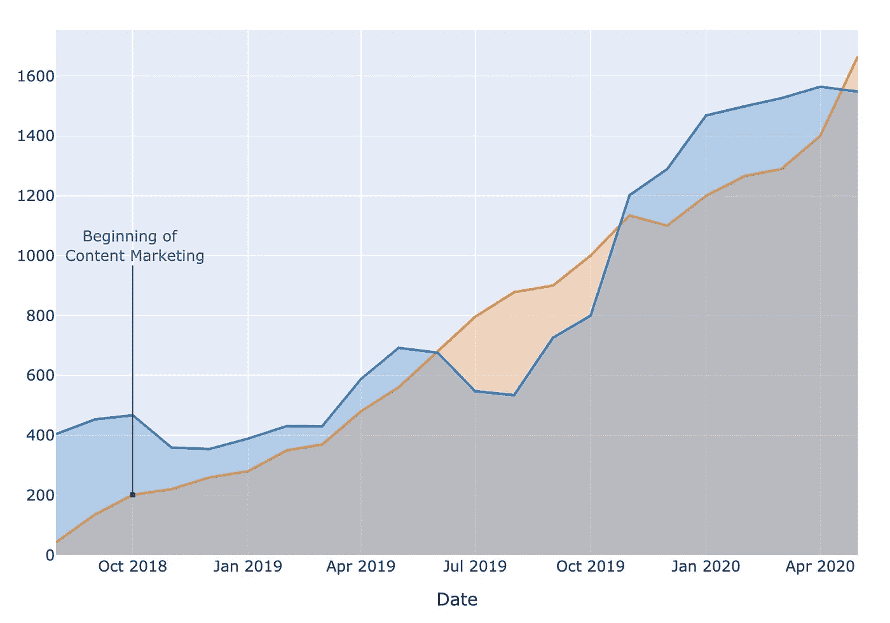
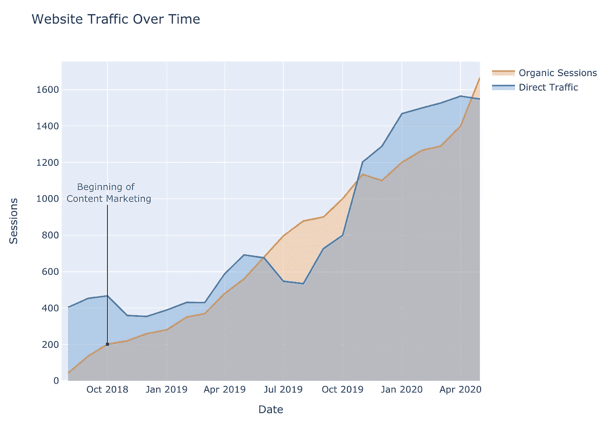

# 撰写基于数据的报告的终极指南

> 原文：<https://towardsdatascience.com/the-ultimate-guide-to-writing-a-data-based-report-6e9703dcc095?source=collection_archive---------25----------------------->

有效地交流您的数据见解。

## 数据探索和分析仅仅是开始，真正的业务影响来自交流结果的能力。

# 介绍

在 Kyso ,我们正在建立一个中央知识中心，数据科学家可以在这里发布报告，这样每个人——我们指的绝对是每个人——都可以从中学习，并将这些见解应用到整个组织中他们各自的角色中。我们以一种所有人都能理解的方式呈现数据团队使用的工具，从而在技术利益相关者和公司其他人之间架起了一座桥梁。

但是，尽管我们为数据工程师、科学家和分析师提供了一个空间来发布他们的报告并在内部传阅，但这些报告是否会转化为商业行动，取决于产生的见解如何呈现并传达给读者。任何数据团队都可以创建分析报告，但并非所有团队都在创建可操作的报告。

本文将讨论任何数据分析报告的最重要的目标，并带您了解在撰写每份报告时需要记住的一些最重要的提示。

# 报告目标

任何数据探索和分析的最终目标都不是从公司数据中生成有趣但任意的信息，而是发现可操作的见解，并在报告中有效传达，这些报告可随时用于企业，以做出更多基于数据的决策。

为了实现这一点，在编写基于数据的报告时，有三个基本准则需要遵循和不断参考:

*   **意图:**这是你对项目的总体目标，你进行分析的原因，并且应该表明你期望分析如何有助于决策。
*   **目标:**目标是你为实现上述目标正在采取或已经采取的具体步骤。这些应该很可能构成报告的目录。
*   **影响:**您的分析结果必须是可用的——它必须为导致分析的问题提供解决方案，以影响业务行动。任何不会引发行动的信息，不管多小，都是无用的。

现在让我们深入了解细节—如何实际构建和编写最终报告，该报告将在整个企业内共享，供技术和非技术受众使用。

# 构建报告

与任何其他类型的内容一样，你的报告应该遵循特定的结构，这将有助于读者构建报告的内容&从而便于阅读。该结构应该类似于:

*   **介绍:**每一份报告都需要一个强有力的介绍。这是你向读者介绍项目的地方，进行分析的原因&你期望通过这样做达到什么目的。这也应该是你布置目录的地方。
*   **方法论:**这不需要技术。简单描述您使用的数据和您进行的分析类型&为什么。
*   **结果:**这是报告的主体，可能会根据报告试图回答的各种业务问题分成几个部分&每个问题生成的结果。
*   **决策建议**:好了，你已经完成了项目，运行分析&生成你的结果。基于这些见解，推荐的业务行动是什么？客观一点。
*   **结论:**从项目的起始目标到推荐的决策结果，将整个报告联系起来(如果可能的话，用一个单独的段落)。在这最后一部分，你可以添加自己的个人风格——从你的角度来看，这些结果意味着什么&也许是你对该主题未来分析的建议。

# 写报告

## 1.考虑你的目标受众

你的报告是写给谁的？如果是销售线索，强调他们部门评估业绩的核心指标。如果是给首席执行官的，一般来说最好是展示商业亮点，而不是一页页的表格和数字。

记住他们要求报告的原因&尽量不要偏离这个原因。

## **2。有明确的目标**

如前所述，在文章开头就要清楚地解释你的文章将会是关于什么的，以及你所使用的数据。如有必要，提供一些相关主题的背景&解释你为什么要写这篇文章。

## 3.组织你的写作

确定你的论点的逻辑结构。有开头，有中间，有结尾。提供一个目录，相应地使用标题和副标题，这给读者一个概述，并有助于他们在阅读文章时定位——如果你的内容很复杂，这尤其重要。

通过适当的章节、段落和句子，力求通篇逻辑流畅。保持句子简洁明了。最好在每一段中只阐述一个概念，这个概念可以包含主要观点和支持信息，这样读者的注意力可以立即集中在最重要的东西上。

不要在结论中引入报告中未分析或讨论过的内容。

## 4.强势开始

写一个强有力的介绍会使报告更容易保持良好的结构。你的介绍应该列出目标、问题定义和采用的方法。

强有力的介绍也会吸引读者的注意力，并诱使他们进一步阅读。

## 5.客观一点

你报告中的事实和数字应该不言自明，不需要任何夸张。尽可能保持语言的清晰和简洁。

客观的风格有助于你将你发现的见解保持在争论的中心。

## 6.不要过度

最好是让你的报告尽可能清晰简洁。如果包含更多有用的信息，而这些信息对报告的核心目标来说是不必要的，那么你最核心的论点就会丢失。

如果绝对有必要，附上一个支持附录，或者你甚至可以发表一个系列，每个报告都有自己的核心目标。

## 7.绘图库

交互式绘图库— Altair、Plotly 和 Bokeh

有许多观想工具可供你使用。对于静态绘图或非常独特或定制的绘图，您可能需要构建自己的解决方案， [matplotlib](https://matplotlib.org/) 和 [seaborn](https://seaborn.pydata.org/) 是您的答案。

然而，如果你真的想讲述一个故事，并让读者沉浸在你的分析中，互动是一条出路。你的两个主要选项是[散景](https://docs.bokeh.org/en/latest/index.html)和 [plotly](https://plotly.com/python/) 。两者都是非常强大的声明库，值得考虑。

不管你选择哪一个，我们建议选择一个库并坚持使用它，直到有一个令人信服的理由改变。

Altair 是另一个(更新的)声明式轻量级绘图库，值得考虑。点击查看其图库[。](https://altair-viz.github.io/gallery/index.html)

虽然 Plotly 已成为交互式可视化的领导者，但由于它存储了用户浏览器会话中生成的每个绘图的数据，并呈现了每个交互式数据点，因此如果您正在处理多个绘图或非常大的数据集，它确实会减慢您的报告的加载时间，这会对读者的体验产生负面影响。

如果您正在生成大量的图表或正在处理非常大的数据集，但希望保持交互性，请使用散景或 Altair。

## 8.避免过度使用图形

图表、图形和表格是将数据总结成易于记忆的视觉效果的好方法。尽量不要用太多本质上显示同一事物的图形来打断报告的流程。选择最符合该段落的图表、图形或表格，然后继续下一点。

## 9.记录您的图表！！！

绘制图表时，确保图表上方或下方有说明性文字——向读者解释他们在看什么，并带他们浏览从每次观想中得出的见解和结论。

没有图表标题，没有图例或 y 轴标题。

标记图表中的所有内容，包括轴和色阶。如有必要，创建一个图例。

好的文档带来的不同！

## 10.隐藏您的代码

当你写一份报告给整个组织中的非技术业务代理使用时，隐藏你的代码。对于这些用户来说，你如何生成你的图表并不重要，重要的是他们展示的视觉效果和洞察力。

代码隐藏。

自然地，如果你正在为你的数据科学家和分析师同事写一个指南或者一个特别的技术文章，其中你经常提到代码，你应该默认显示它。

显示代码。

# 最后的想法

我们做到了！每次写基于数据的报告时都要遵循的 10 条建议。关于结论的一个注意事项——不要只是在文章的结尾逐渐减少，或者在正文中以最后一点结束。向读者快速总结他们所学到的内容，解释这些见解如何对业务产生影响，以及他们如何在工作中应用这些知识。

确保您的分析对整个公司的其他创建者也是可重复的-在开发数据科学项目或发布研究时，遵循编码最佳实践总是一个好主意，包括使用正确的目录结构、语法、说明性文本(或代码单元格中的注释)、版本控制，最重要的是，确保所有相关文件和数据集都附加到帖子中。号召行动——也许是扩展分析的建议。

最后，同样重要的是，添加适当的标题、描述、标签和预览图片。无论你使用哪种策展系统，这对于组织团队的工作都很重要——展示是关键。

*标题照片由* [*达斯汀·李*](https://unsplash.com/@dustinlee?utm_source=unsplash&utm_medium=referral&utm_content=creditCopyText) *上* [*下*](https://unsplash.com/search/photos/communication?utm_source=unsplash&utm_medium=referral&utm_content=creditCopyText)