# 终端改造的终极指南

> 原文：<https://towardsdatascience.com/the-ultimate-guide-to-your-terminal-makeover-e11f9b87ac99?source=collection_archive---------0----------------------->

## 编程；编排

## 今天你将度过的最好的 16 分钟:程序员的终端提示


背景图片由来自 Unsplash 的 [Jackson Hendry 拍摄。使用](https://unsplash.com/photos/eodA_8CTOFo) [teffects new-neon 创建的图像。](https://medium.com/mkdir-awesome/amazing-animated-text-effects-from-terminal-adc2935bc075#cc4c)

【最新更新 2021–12–17，星舰和书呆子字体。]

```
**Table of Contents**
· [Introduction](#c406)
  ∘ [Homebrew](#0afc)
· [iTerm2](#8455)
· [Zsh](#35a6)
· [Oh-My-Zsh](#367b)
  ∘ [Errors](#bdee)
  ∘ [Shortcut for toggling hidden files](#45d7)
· [Themes](#cf6e)
  ∘ [Starship (Updated)](#4b05)
  ∘ [iTerm2 Theme](#2944)
· [Oh-My-Zsh and plugins](#7c2d)
  ∘ [1\. git plugin](#a84b)
  ∘ [2\. alias](#597a)
  ∘ [3\. alias dirs and cd -](#9f2a)
  ∘ [4\. autojump plugin](#4abb)
  ∘ [5\. brew plugin](#74b2)
  ∘ [6\. zsh-syntax-highlighting plugin](#282f)
  ∘ [7\. zsh-autosuggestions plugin](#1646)
· [Duplicate a tab](#52d9)
· [Shaping up terminal command history](#1d56)
· [Creating aliases](#4d8f)
· [Useful commands](#c7bd)
· [Terminal Shortcuts](#0020)
· [Task management](#09aa)
· [Fun with Terminal](#b787)
  ∘ [Screensaver](#6474)
  ∘ [FIGlet](#0918)
  ∘ [Colors](#0cff)
  ∘ [Fonts](#2681)
· [Weather reports on your terminal](#5695)
· [macOS/Linux commands](#0d56)
  ∘ [Terminal calendars](#772c)
  ∘ [date](#b6b9)
  ∘ [ditto](#113e)
  ∘ [Common terminal commands](#b9e2)
· [Conclusion](#2a58)
· [Update Log](#c3ba)
· [Newsletter](#43ce)
```

# 介绍

你整天使用你的终端吗？终端是你重启电脑后启动的第一个 app 吗？在本文中，您将发现如何改进您的终端外观和日常工作的实用命令。

**【更新】**你可以用一行代码安装本文中的所有包，见[本文](/automate-your-terminal-makeover-f3c152958d85)。

[](/automate-your-terminal-makeover-f3c152958d85) [## 自动化您的终端改造

### 安装终端是你用新电脑做的第一件事吗？如果是，那么这是给你的。

towardsdatascience.com](/automate-your-terminal-makeover-f3c152958d85) 

## 公司自产自用


公司自产自用

你需要安装[自制软件](https://brew.sh/)。如果您没有它，您可以通过在终端中运行以下命令来安装它。

```
$ /bin/bash -c "$(curl -fsSL https://raw.githubusercontent.com/Homebrew/install/master/install.sh)"
```

家酿需要 Xcode 的命令行工具。但是如果你没有，安装会帮你安装。

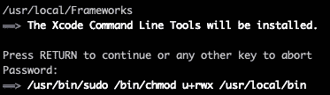

Xcode 命令行工具

使用文本编辑器(Vim/VSCode/TextEdit)添加以下内容:

```
# ~/.zshrc 
export PATH=$(brew --prefix)/bin:$PATH 
```

然后来源`~/.zshrc`:

```
$ . ~/.zshrc
```

这将加载`~/.zshrc`。

运行`brew help`看看是否安装了。

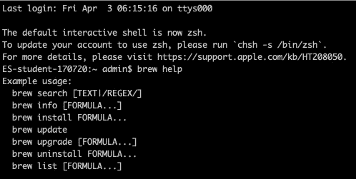

brew 帮助

[](/awesome-rust-powered-command-line-utilities-b5359c38692) [## 7 个强大的 Rust 驱动的命令行工具

### 适合每个开发人员的现代 Linux 命令

towardsdatascience.com](/awesome-rust-powered-command-line-utilities-b5359c38692) [](/rust-powered-command-line-utilities-to-increase-your-productivity-eea03a4cf83a) [## Rust-Powered 命令行实用程序可提高您的工作效率

### 您腰带下的现代快速工具

towardsdatascience.com](/rust-powered-command-line-utilities-to-increase-your-productivity-eea03a4cf83a) 

# iTerm2

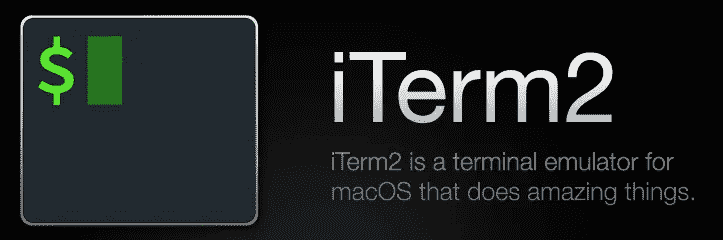

iTerm2

iTerm2 是终端的替代品，可以在 MAC 上运行。iTerm2 为终端带来了极具特色的现代外观。

你可以下载 [iterm2](https://www.iterm2.com/downloads.html) 或者用自制软件安装 [iTerm2。](https://formulae.brew.sh/cask/iterm2)

```
$ brew install iterm2
```

# Zsh

Zsh 是一个为交互使用而设计的 shell，也是一种强大的脚本语言。

你可以找到你的壳。

```
$ echo $SHELL
/bin/zsh
```

找到你的 zsh 版本。

```
$ zsh --version
zsh 5.8 (x86_64-apple-darwin20.0)
```

如果你没有，那就用自制软件安装。

```
$ brew install zsh
```

如果您的 shell 不是 zsh，运行下面的代码。

```
$ chsh -s /bin/zsh
```

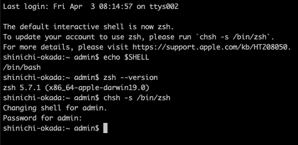

echo $SHELL

然后重启 iTerm2 或在 iTerm2 中打开一个新标签。

```
$ echo $SHELL
```

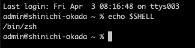

/bin/zsh

# 哦，我的天


哦，我的天

Oh-My-Zsh 是一个开源的、社区驱动的框架，用于管理您的 Zsh 配置。它捆绑了大量有用的功能，助手，插件，主题。

您可以通过在 iTerm 中运行以下命令之一来安装 Oh-My-Zsh。您可以通过命令行用 curl 或 wget 安装它。

经由卷曲

```
$ sh -c "$(curl -fsSL https://raw.githubusercontent.com/ohmyzsh/ohmyzsh/master/tools/install.sh)"
```

via wget

```
$ sh -c "$(wget -O- https://raw.githubusercontent.com/ohmyzsh/ohmyzsh/master/tools/install.sh)"
```

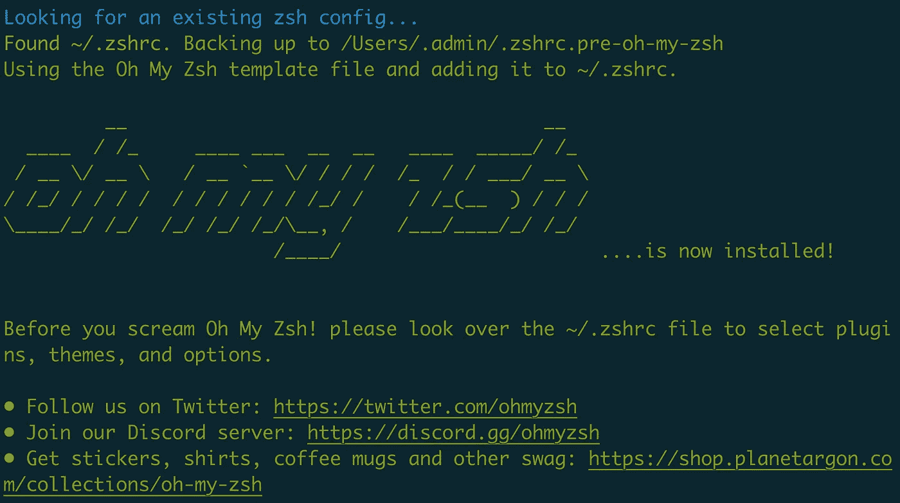

安装天啊。图片作者。

可以看到终端提示变为`~`。

更新 Oh-My-Zsh:

```
$ omz update
```

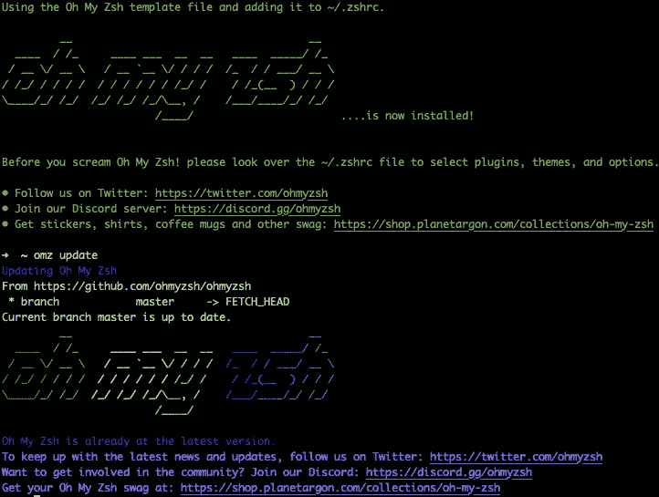

运行 omz 更新。图片作者。

啊呀 Zsh 可能会覆盖`~/.zshrc`，你需要添加到`brew`的路径。这个时候需要在`plugins`之前添加。

使用文本编辑器(Vim/VSCode/TextEdit):

```
# ~/.zshrc 
export PATH=$(brew --prefix)/bin:$PATH 
plugins=(git)
```

## 错误

你有以下错误吗？

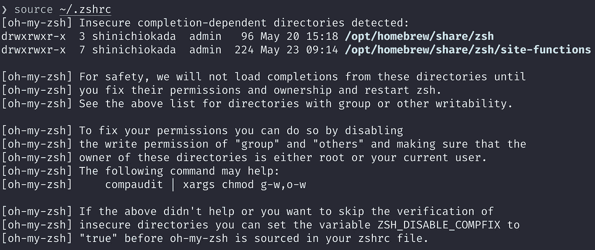

或者

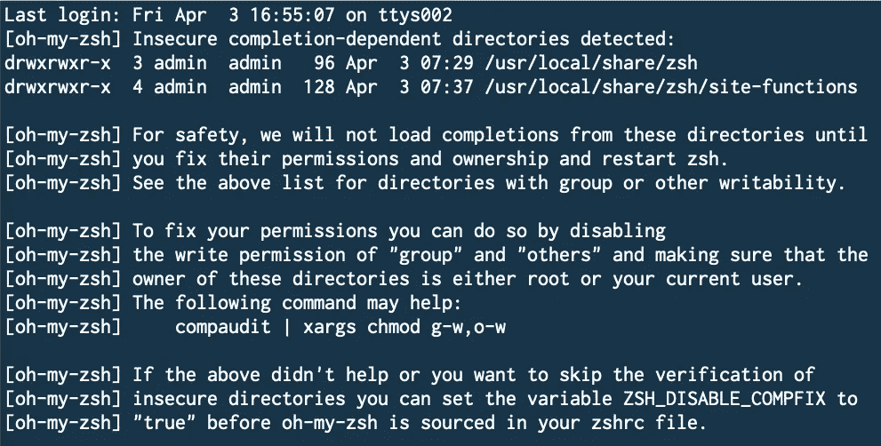

zsh 误差

您需要更改这些文件的访问权限。这些命令将修复它们。

在您的终端上运行以下程序:

```
$ chmod 755 $(brew --prefix)/share/zsh
$ chmod 755 $(brew --prefix)/share/zsh/site-functions
```

**并打开另一个标签页。**

## 切换隐藏文件的快捷方式

您可以通过 Command + Shift +句点在 Finder 中切换显示隐藏文件。


在 Mac 中切换隐藏文件的快捷方式

[](https://betterprogramming.pub/9-terminal-commands-you-can-start-using-today-7b9b0e273894) [## 您今天就可以开始使用的 9 个终端命令

### 提高效率的终端命令

better 编程. pub](https://betterprogramming.pub/9-terminal-commands-you-can-start-using-today-7b9b0e273894) [](https://betterprogramming.pub/master-mac-linux-terminal-shortcuts-like-a-ninja-7a36f32752a6) [## 像忍者一样掌握 Mac/Linux 终端快捷键

### 学习终端忍者的秘密，以提高生产力

better 编程. pub](https://betterprogramming.pub/master-mac-linux-terminal-shortcuts-like-a-ninja-7a36f32752a6) 

# 主题

在这一部分，你会发现星际飞船和物品 2 的主题。你只需要用其中的一个。以前用 iTerm2 主题，现在用 Starship。

## 星际飞船(更新)

我开始使用[星际飞船](https://starship.rs/)，我非常喜欢它。星际飞船是一个最小的，超快的，无限可定制的提示。

在安装 iTerm2，Zsh，哦，我的-Zsh 之后，正如我在你[安装](https://starship.rs/#quick-install)星际飞船之前所解释的。

例如，如果您是自制软件用户:

```
$ brew install starship
```

在`~/.zshrc`的结尾增加以下内容:

从您的终端:

```
$ echo 'eval "$(starship init zsh)"' >> ~/.zshrc
```

或者如果你懂 Vim(或者初学的 TextEdit):

```
eval "$(starship init zsh)"
```

我们将 iTerm2 主题更改为 Minimal。

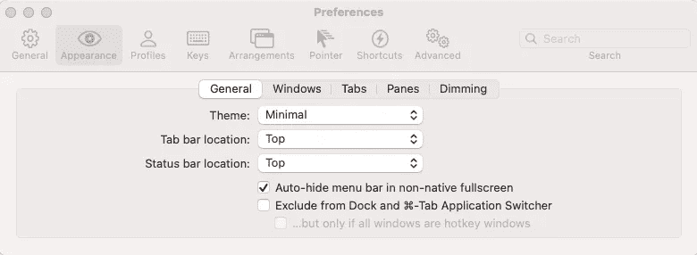

iTerm2 首选项外观常规中的最小主题。

我们将颜色预设更改为[时髦的](https://github.com/sindresorhus/iterm2-snazzy):

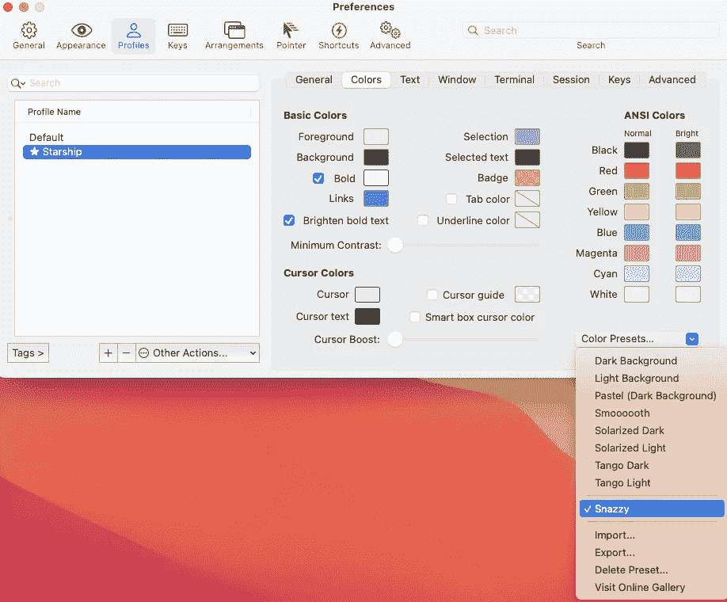

在 iTerm2 首选项颜色预设中选择时髦

[星舰推荐](https://starship.rs/faq/#why-don-t-i-see-a-glyph-symbol-in-my-prompt)使用[书呆子字体](https://www.nerdfonts.com/)。可以用`brew`安装:

```
$ brew tap homebrew/cask-fonts
$ brew install --cask font-hack-nerd-font
```

或者您可以使用`brew`安装 [Fira 代码](https://www.nerdfonts.com/font-downloads):

```
$ brew tap homebrew/cask-fonts && [brew install --cask font-fira-code-nerd-font](https://medium.com/@gerrit.vanderlugt/i-had-to-install-the-fira-code-nerd-font-instead-its-working-now-9e0d3681c91d?source=email-a262a804b78f-1637406995986-activity.response_created)
```

在 iTerm2 首选项>个人资料>文本下选择黑客呆子字体 Mono:

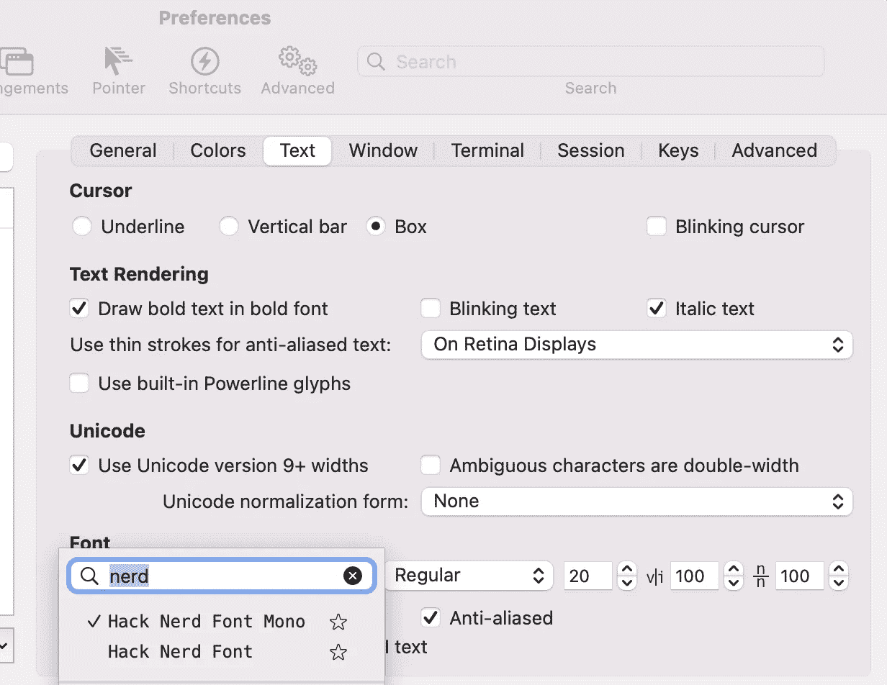

在 iTerm2 首选项文本字体中选择 Hack Nerd 字体 Mono。

或者选择 FiraCode Nerd 字体 Mono:

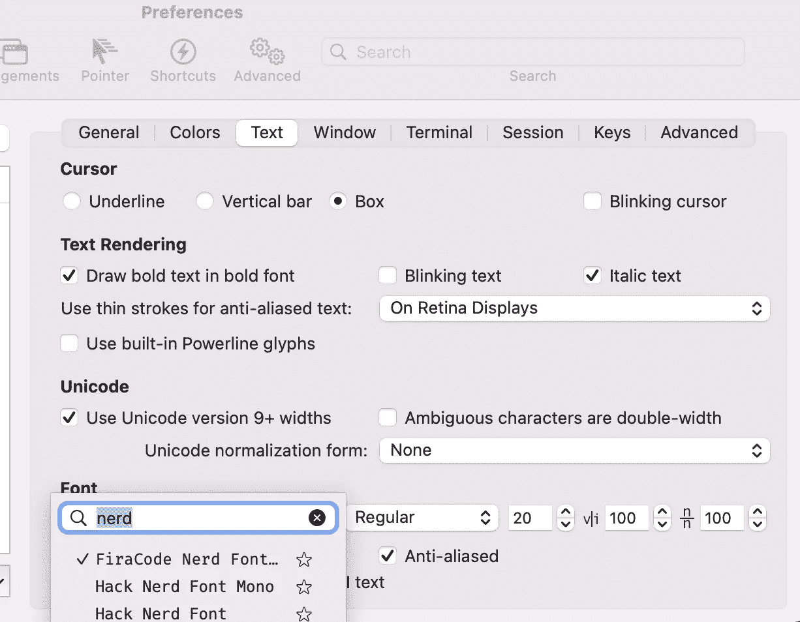

在 iTerm2 首选项文本字体中选择 FiraCode Nerd 字体。

在我的一个 npm 包目录中，它用图标显示 Git 状态、repo 版本和节点版本。

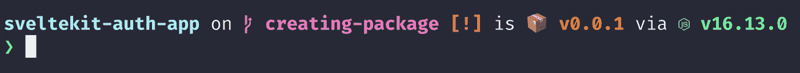

显示 Git 状态、repo 版本和节点版本的 Starship。

`[!]`是星际飞船 [Git 状态](https://starship.rs/config/#git-status)选项之一，它告诉你目录被修改了。

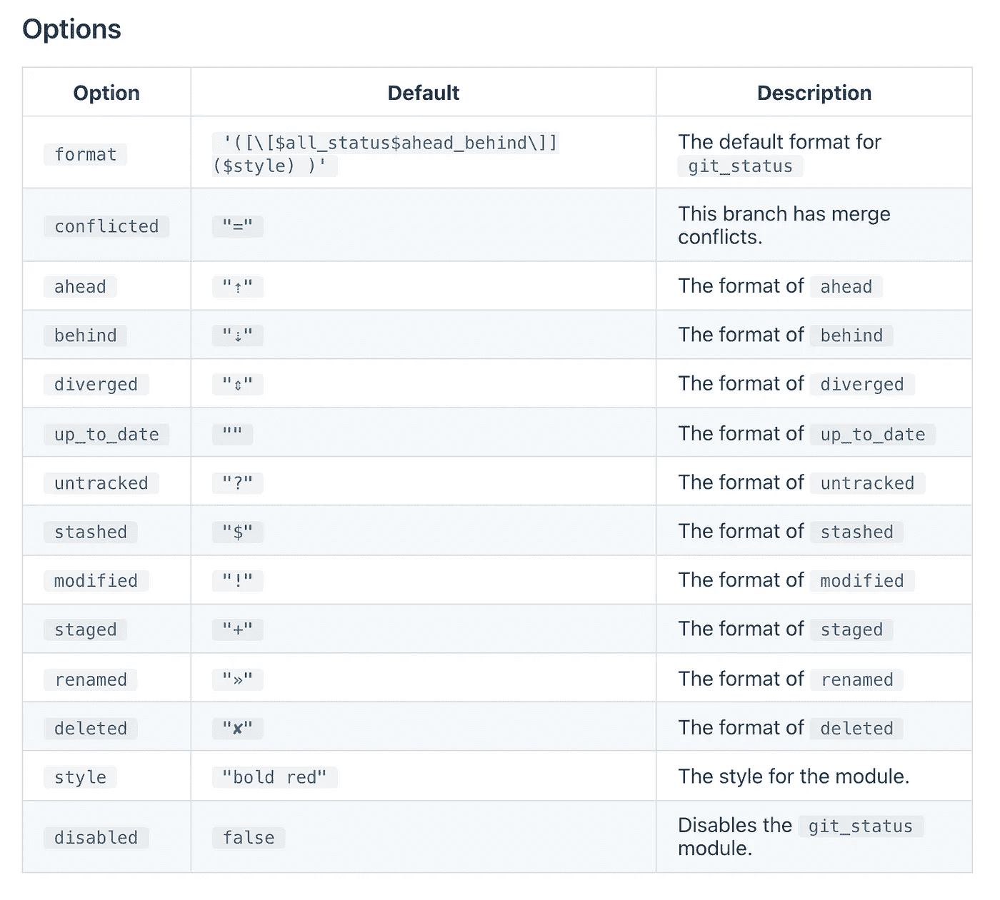

星舰[的 Git 状态](https://starship.rs/config/#git-status)选项。

如果您想知道状态栏中发生了什么，请使用`starship explain`命令:

```
$ starship explain
```

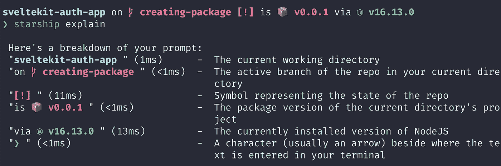

指挥星舰 explain 的输出解释道

你可以使用[星际飞船配置](https://starship.rs/config/#prompt)来改变提示。

## iTerm2 主题

**电力线**

iTerm 有 200 多个[主题](https://iterm2colorschemes.com/)。我最喜欢的主题是[钴 2](https://github.com/wesbos/Cobalt2-iterm) 和[大洋下一个](https://github.com/mhartington/oceanic-next-iterm)。

让我们安装钴 2。

1.  下载[这个 repo](https://github.com/wesbos/Cobalt2-iterm) 并将 cobalt2.zsh-theme 文件放到~/中。我的天啊/主题/目录。Command + C 复制文件，Command + Option + V 剪切粘贴。
2.  在~/上打开您的 ZSH 偏好设置。并将主题变量改为 ZSH 主题=钴 2。

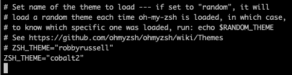

ZSH_THEME= "钴 2 "

3.安装电力线和必要的字体-一种方法是使用画中画

```
$ pip3 install --user powerline-status
```

您可能需要升级 PIP。

```
$ pip3 install --upgrade pip
```

4.通过下载或克隆 git 库来安装所有必需的字体。

```
$ git clone https://github.com/powerline/fonts
$ cd fonts
$ ./install.sh
```

如果你想删除字体目录。

```
$ ..
$ rm -rf fonts
```

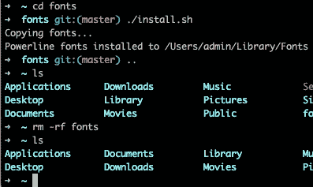

电力线字体

5.在 iTerm2 中，访问 Profiles 选项卡上的 Preferences 窗格。

6.在颜色选项卡下，通过颜色预设下拉菜单导入 cobalt2.itermcolors 文件。

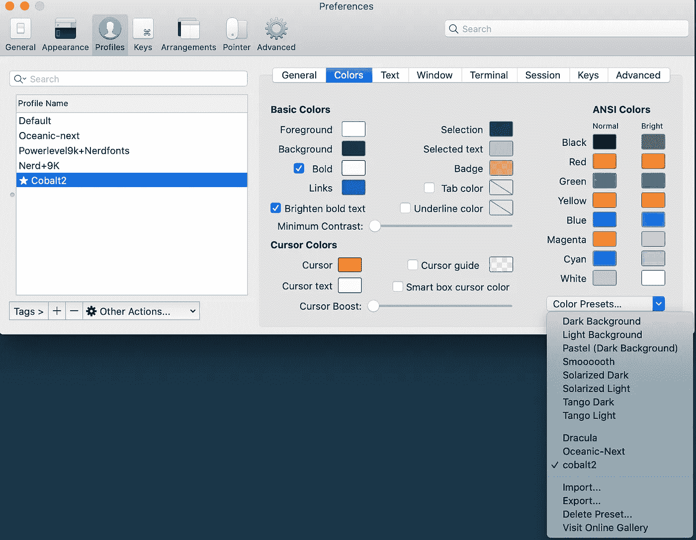

iTerm2 配置文件颜色

7.在文本选项卡下，将每种类型(常规和非 ASCII)的字体更改为“电力线的不连续字体”。

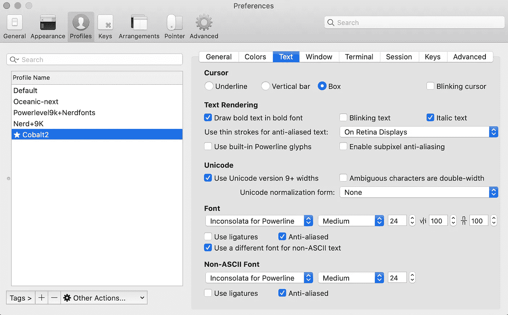

iTerm2 首选文本

8.键入 source ~/刷新 ZSH。命令行上的 zshrc。

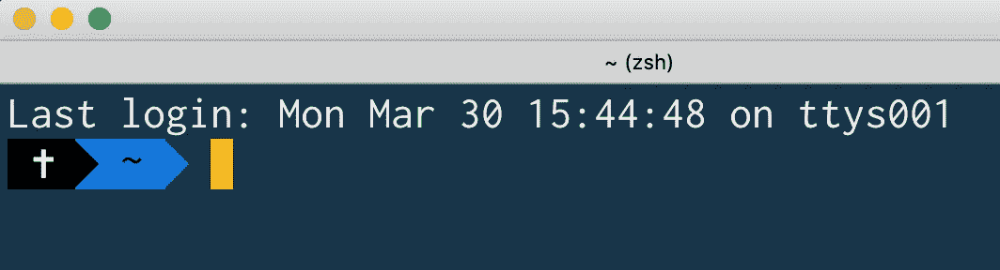

iTerm2 +电力线字体

**VS 代码端子**

对于您的 VS 代码终端，您需要在 Setting(JSON)中添加以下内容。

```
{
    "terminal.integrated.fontFamily":"Inconsolata for Powerline",
}
```

如果你觉得有点冒险，试试 [powerlevel10k](https://github.com/romkatv/powerlevel10k#oh-my-zsh) 主题。

# 我的天啊和插件

Oh-My-Zsh 有[内置命令](https://github.com/ohmyzsh/ohmyzsh/wiki/Cheatsheet)。

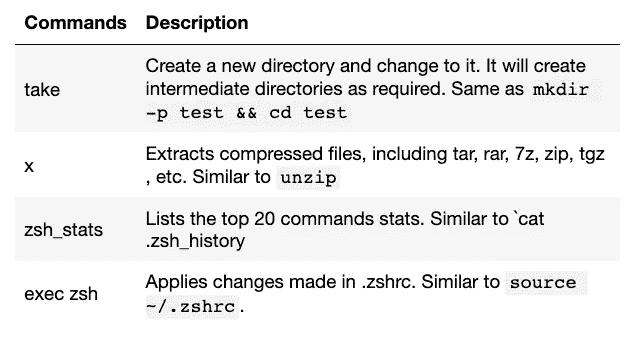

作者图片

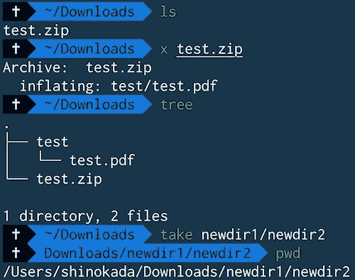

哦，我的 Zsh 内置命令在起作用，x 和 take 命令

Oh-My-Zsh 的强大来自它的[插件](https://github.com/ohmyzsh/ohmyzsh/tree/master/plugins)。有超过 260 个插件可用。

## 1.git 插件

zsh git 插件提供了许多别名和一些有用的函数。要安装它，将`git`添加到您的。zshrc 文件。用文本编辑器打开`.zshrc`:

```
plugins=(git)
```

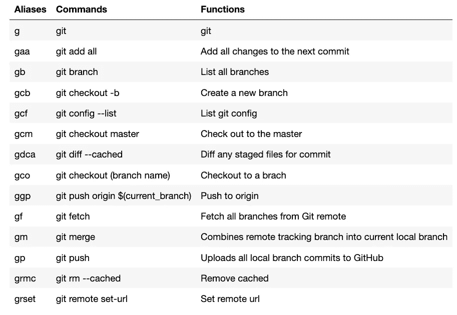

git 插件别名。作者图片

下面是一个使用 git 插件的示例工作流。

```
# make a directory and cd into it
$ mkdir -p Datascience/terminal-article && cd $_# create a new git repo
$ git init
Initialized empty Git repository in /Users/shinokada/DataScience/terminal-article/.git/# Add a README.md
$ echo "# Terminal-article" >> README.md# git add .
$ ga .# git commit -m 
$ gcmsg "First commit"
[master (root-commit) 128f2b9] First commit
1 file changed, 1 insertion(+)
create mode 100644 README.md# git remote add
$ gra origin git@github.com:shinokada/terminal-article.git
```

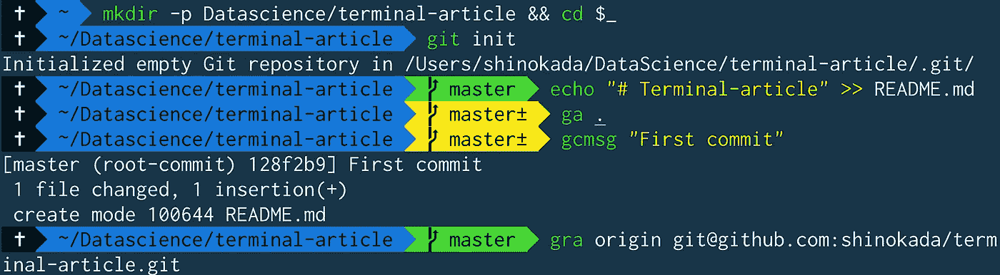

git 插件

```
# modify a file
$ echo "more fix" >> README.md# git status
$ gst# git add .
$ ga .# git commit and message
$ gcmsg "Update"# git push origin
$ ggp
```

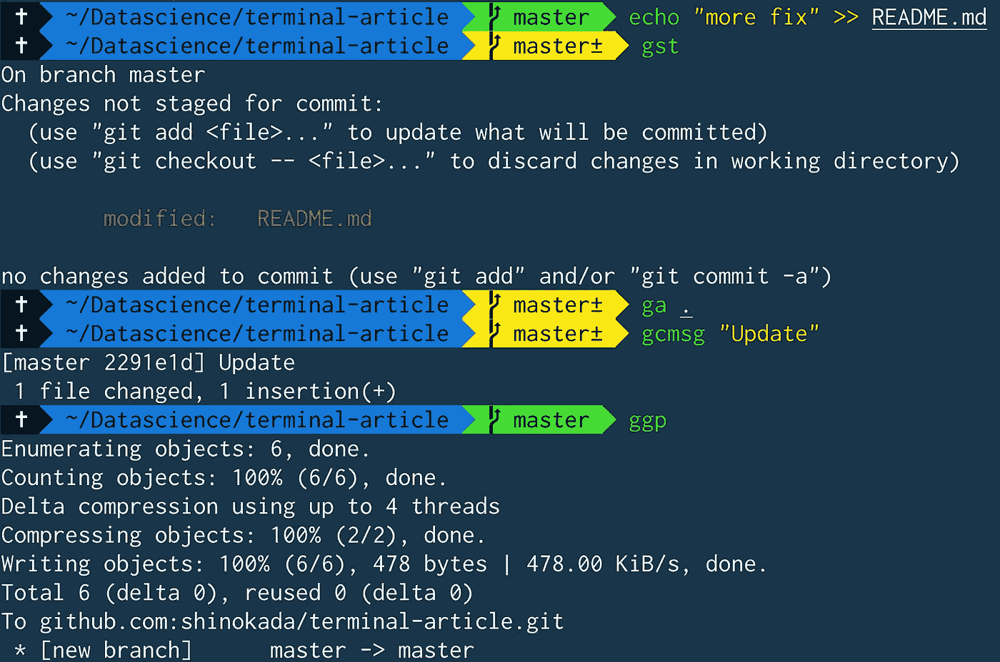

git 插件在运行

## 2.别名

你可以使用`alias`来查看你所有的别名命令。更多别名请见[本页](https://github.com/ohmyzsh/ohmyzsh/wiki/Cheatsheet)。

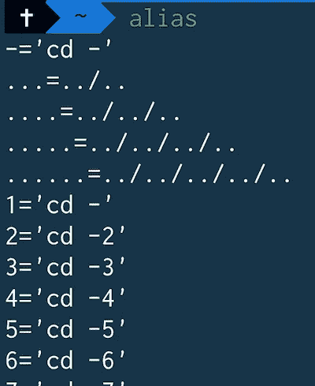

## 3.别名 dirs 和 cd -

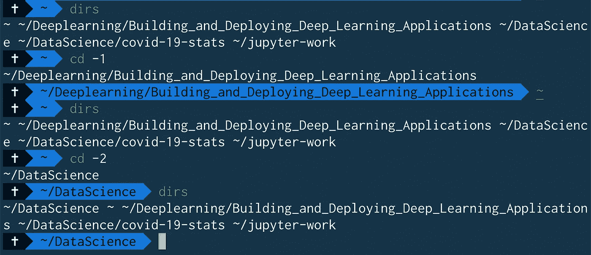

dirs 和 cd -，cd -2

你用化名`cd -`、`cd -2`等。使用`dirs`命令，如上图所示。`dirs`显示目录堆栈的内容。当前目录总是目录堆栈的“顶部”。`cd -2`将目录更改为目录堆栈中的第二个目录。

## 4.自动跳转插件

`[autojump](https://github.com/ohmyzsh/ohmyzsh/tree/master/plugins/autojump)`插件加载[自动跳转导航工具](https://github.com/wting/autojump)。`autojump`是导航文件系统的一种更快的方式。它的工作原理是通过命令行维护一个包含您最常用的目录的数据库。

首先，在你的 Mac OS 上安装它。

```
$ brew install autojump
# or for port user
$ port install autojump
```

要使用它，将`autojump`添加到您的。zshrc 文件:

```
# no comma between plugins required 
plugins=(git autojump)
```

将以下内容添加到`~/.zshrc`(英特尔 x86_64 或 arm64)的末尾:

```
[ -f $(brew --prefix)/etc/profile.d/autojump.sh ] && . $(brew --prefix)/etc/profile.d/autojump.sh
```

重新装弹。在你的终端上通过【zshrc 或者打开一个新的标签页。

通过改变你的目录，`autojump`记录目录。你输入目录的前几个字母。例如`j Data`。

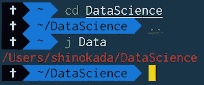

## 5.brew 插件

[brew](https://github.com/ohmyzsh/ohmyzsh/tree/master/plugins/brew) 插件为常用的 brew 命令添加了几个别名。

要使用它，请将 brew 添加到。zshrc 文件:

```
plugins=(git autojump brew)
```

将`brew`添加到插件后，会出现以下消息。

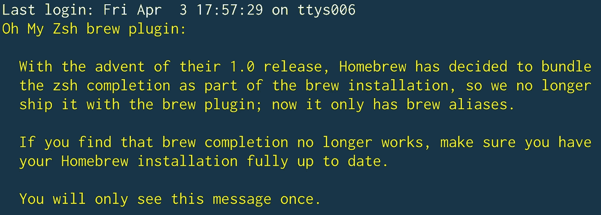

brew 插件消息

可以开始用了。

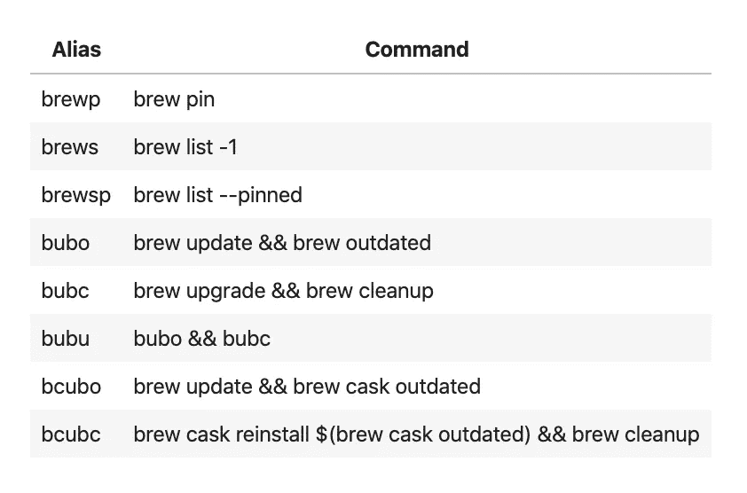

brew 命令图表。作者图片

**创建您自己的别名**

英寸 zshrc 添加以下内容。`buou`会更新，显示过时和升级。

```
# brew update && brew outdated && brew upgrade ➡️  buou
alias buou="brew update && brew outdated && brew upgrade && brew cleanup"
```

## 6.zsh-语法高亮插件

通过在 oh-my-zsh 的插件目录中克隆存储库来安装[zsh-syntax-highlighting](https://github.com/zsh-users/zsh-syntax-highlighting/blob/master/INSTALL.md):

```
$ git clone https://github.com/zsh-users/zsh-syntax-highlighting.git ${ZSH_CUSTOM:-~/.oh-my-zsh/custom}/plugins/zsh-syntax-highlighting
```

注意，zsh-syntax-highlighting 必须是最后一个来源于的**插件。激活`~/.zshrc`中的插件:**

```
plugins=(some other plugins **zsh-syntax-highlighting**)
```

重启 iTerm2，打开一个新标签，或者运行`source .zshrc`。

之前:

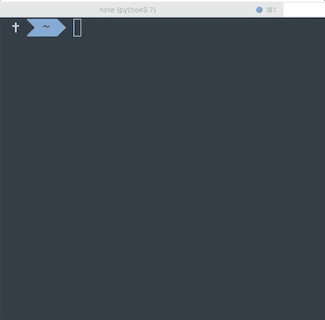

之后:

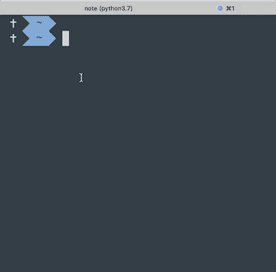

## 7.zsh-自动建议插件

zsh 自我暗示是鱼一样的 zsh 自我暗示。

1.  [将仓库](https://github.com/zsh-users/zsh-autosuggestions/blob/master/INSTALL.md)克隆到`$ZSH_CUSTOM/plugins`(默认为`~/.oh-my-zsh/custom/plugins`):

```
$ git clone [https://github.com/zsh-users/zsh-autosuggestions](https://github.com/zsh-users/zsh-autosuggestions) ${ZSH_CUSTOM:-~/.oh-my-zsh/custom}/plugins/zsh-autosuggestions
```

2.将插件添加到`~/.zshrc`的插件列表中:

```
plugins=(git brew zsh-syntax-highlighting zsh-autosuggestions)
```

3.启动新的终端会话或打开新的终端标签。

```
$ source ~/.zshrc
```


行动中的自动建议

# 复制选项卡

当你按下`CMD+T`时，iTerm 会打开一个新的标签页，位置是`~`或`home`目录。我想用相同的目录复制一个标签。

在 iTerm 上，按`CMD+,`打开设置。按键并选择按键绑定。点击左下角的+号，选择你的快捷键，比如`Shift+CMD+T`。在操作中选择复制选项卡。

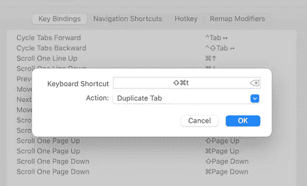

将 Shift+CMD+T 绑定到复制制表符。图片作者。

# 塑造终端命令历史

历史存储在~/中。zsh_history 或者~/。bash_history 或者~/。历史取决于你的外壳。根据您的系统，历史记录可存储 1000 或 2000 行。你可以找到历史的数字:

```
$ echo $HISTSIZE 
50000
$ echo $HISTFILE
/Users/shinokada/.zsh_history
$ echo $SAVEHIST
10000
```

`HISTSIZE`是会话中保留的最大行数，而`SAVEHIST`是历史文件中保留的最大行数。`HISTFILE`是系统保存历史的文件名。

您可以通过在. zshrc 中添加以下内容来更改这些数字。

```
HISTSIZE=5000
SAVEHIST=5000
```

**反向搜索**允许你从历史文件中搜索命令。按下`CTRL+r`启动它，键入你记得要搜索的任何内容。如果您一直按下`CTRL+r`，终端会在历史文件中搜索下一条命令。


反向搜索在起作用。图片作者。

您可以使用 bash 命令`history`查看所有的命令历史。

```
# shows all command history
$ history# shows first 10 commands
$ history | head# shows last 10 commands
$ hisotry | tail# shows less history
$ history | less# Use grep to search your command history
$ history | grep Search-word# Use grep to do a case-insensitive search of your command history
$ hisotry | grep -i search-word
```

为了从您的历史列表中删除命令，您将以下命令添加到您的`.zshrc`:

```
setopt HIST_IGNORE_SPACE
```

当命令行的第一个字符是空格时，这将从历史列表中删除命令行。

```
# This won't work
$ cd ~
# This will work because there is a space before the command
$  cd ~
```

您可能不希望命令历史中包含常用命令。将以下内容添加到命令历史中的`zshrc`阻止`ll ls la cd man scp vim nvim less ping open file which whois drill uname md5sum traceroute`命令。

```
zshaddhistory() {
    local line=${1%%$'\n'}
    local cmd=${line%% *} # Only those that satisfy all of the following conditions are added to the history
    [[ ${#line} -ge 5
       && ${cmd} != ll
       && ${cmd} != ls
       && ${cmd} != la
       && ${cmd} != cd
       && ${cmd} != man
       && ${cmd} != scp
       && ${cmd} != vim
       && ${cmd} != nvim
       && ${cmd} != less
       && ${cmd} != ping
       && ${cmd} != open
       && ${cmd} != file
       && ${cmd} != which
       && ${cmd} != whois
       && ${cmd} != drill
       && ${cmd} != uname
       && ${cmd} != md5sum
       && ${cmd} != pacman
       && ${cmd} != xdg-open
       && ${cmd} != traceroute
       && ${cmd} != speedtest-cli
    ]]
}zshaddhistory
```

# 创建别名

正如我之前用`buou`展示的，你可以给`.zshrc`文件添加你自己的别名。

```
# brew update && brew outdated && brew upgrade
alias buou="brew update && brew outdated && brew upgrade && brew cleanup"# npm outdated -g --depth=0 && npm update -g
alias npmou="npm outdated -g --depth=0 && npm update -g"
```

我已经安装了`virtualenv`和`virtualenvwrapper`。并且下面的别名允许我使用`note`启动一个 Jupyter 环境和 Jupyter 笔记本。`lab`将启动环境和 Jupyterlab。

```
# start jupyter environment
alias wj='workon jupyter'# start jupyter notebook
alias note='workon jupyter && jupyter notebook'# start jupyterlab
alias lab='workon jupyter && jupyter lab'
```

# 有用的命令

```
# Repeat the last command
$ !!
# Clear the screen
$ clear 
# Or you can clear the screen with CTRL+l, as well
```

不使用`rm`命令，我建议使用`rmtrash`。这将移动文件到 OS X 的垃圾桶，而不是永久删除。您可以使用`brew`进行安装:

```
$ brew install rmtrash
```

并在您的`~/.zshrc`文件中创建一个别名:

```
alias   del="rmtrash"
```

正在删除下载目录中的文件:

```
# Using [autojump](#4e7b)
$ j Down
$ del ./*
```

# 终端快捷方式


一些 Mac 终端快捷键

你可以在这里找到更多 Mac 的键盘快捷键[。](https://support.apple.com/guide/terminal/keyboard-shortcuts-trmlshtcts/mac)

# 任务管理

你可以从命令行使用[任务编辑器](https://taskwarrior.org/)来管理你的待办事项列表。

如果你是自制软件用户:

```
$ brew install task
```

你可以在本页找到其他操作系统安装。

你可以在[文档](https://taskwarrior.org/docs/)中找到[快速演示](https://taskwarrior.org/docs/30second.html)、[最佳实践](https://taskwarrior.org/docs/best-practices.html)和[示例命令](https://taskwarrior.org/docs/examples.html)。

```
$ task add Buy milk
Created task 1.$ task list
ID Description
-- -----------
1  Buy milk
```

使用`+` / `-`添加/删除标签。

```
$ task add Buy cake +shopping -lunch
```

使用`project:`添加项目。

```
$ task add Update a file project: 'Medium article A'
```

使用`task ID modify`修改列表。

```
$ task modify 1 Buy milk and bread
```

完成任务时使用`task ID done`。

```
$ task 1 done
```

# 终端的乐趣

## 屏幕保护程序

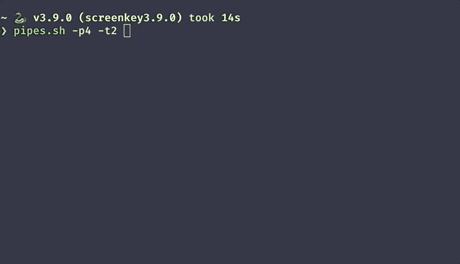

运行管道 sh -p4 -t2。图片作者。

`[pipes.sh](https://github.com/pipeseroni/pipes.sh#contents)`是一个动画终端屏保。你可以用自制软件安装它:

```
$ brew install pipes-sh
```

找出选项:

```
$ pipes.sh -h
Usage: pipes.sh [OPTION]...
Animated pipes terminal screensaver. -p [1-] number of pipes (D=1).
 -t [0-9] type of pipes, can be used more than once (D=0).
 -c [0-7] color of pipes, can be used more than once (D=1 2 3 4 5 6 7 0).
 -t c[16 chars] custom type of pipes.
 -f [20-100] framerate (D=75).
 -s [5-15] probability of a straight fitting (D=13).
 -r LIMIT reset after x characters, 0 if no limit (D=2000).
 -R   randomize starting position and direction.
 -B   no bold effect.
 -C   no color.
 -K   pipes keep their color and type when hitting the screen edge.
 -h  help (this screen).
 -v  print version number.
```

您可以使用`-p`选项改变管道数量，使用`-t`选项改变管道类型，等等。

```
$ pipes.sh -p4 -t2
```

当你按下任何一个键，它就会停止。

如果你是黑客帝国电影的爱好者，可以安装`cmatrix`。

```
$ brew install cmatrix# run cmatrix
$ cmatrix
```

你需要按`Ctrl-c`来停止屏保。

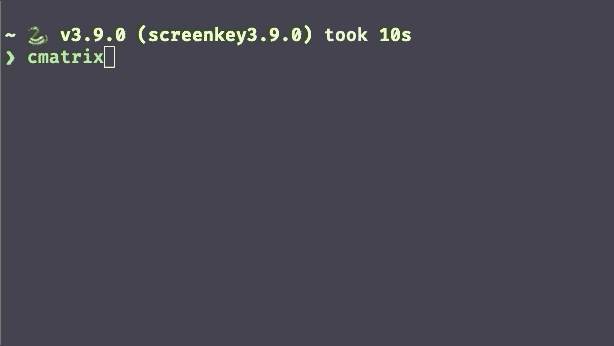

运行矩阵屏幕保护程序。图片作者。

## 菲戈莱特

我用[小图](http://www.figlet.org/)创建了标题图像。FIGlet 是一个把普通文本变成大字母的程序。

```
$ brew install figlet
$ printf "\e[92m" && figlet -f standard "Terminal Tips"
```

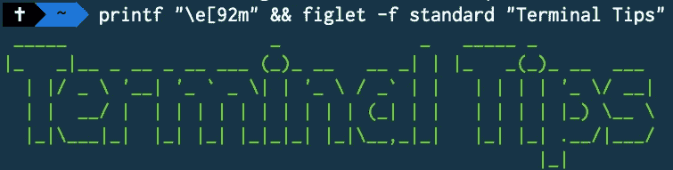

用 FIGlet 创建的图像

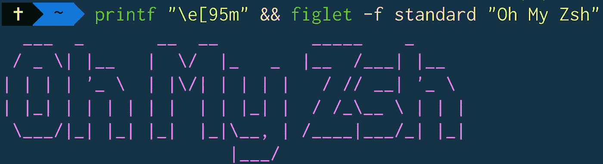

另一个例子

## 颜色；色彩；色调

`printf "\e[92m"`设置输出颜色。您可以[打印](http://jafrog.com/2013/11/23/colors-in-terminal.html)您的终端颜色代码。

```
$ for code in {30..37}; do \
echo -en "\e[${code}m"'\\e['"$code"'m'"\e[0m"; \
echo -en "  \e[$code;1m"'\\e['"$code"';1m'"\e[0m"; \
echo -en "  \e[$code;3m"'\\e['"$code"';3m'"\e[0m"; \
echo -en "  \e[$code;4m"'\\e['"$code"';4m'"\e[0m"; \
echo -e "  \e[$((code+60))m"'\\e['"$((code+60))"'m'"\e[0m"; \
done
```

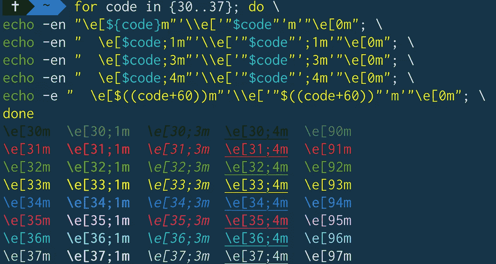

终端颜色

现在，您可以使用其中一种颜色来更改颜色。

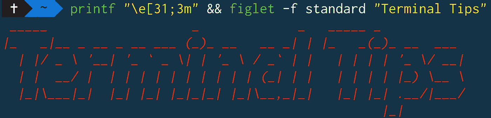

使用红色

## 字体

`-f standard`设置字体。您可以选择[多种字体](http://www.figlet.org/examples.html)。

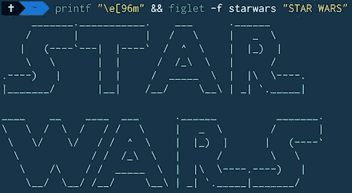

使用“星球大战”字体的小图

# 你终端上的天气报告

您可以使用`[wttr.in](https://github.com/chubin/wttr.in)`在终端上打印天气报告。

```
$ curl wttr.in/CityName
```

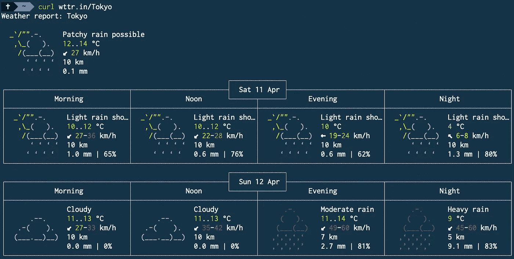

科尔·wttr.in/Tokyo

如果您想查找您当前位置的天气，请运行`curl wttr.in`。

您可以找到更多选项:

```
$ curl wttr.in/:help
```

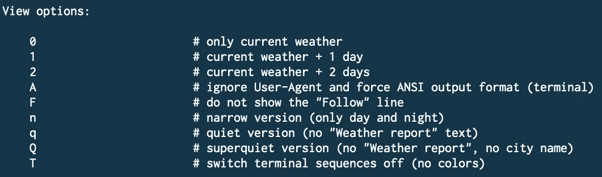

科尔·wttr.in/:help

您可以在您的. zshrc 中添加一个别名。对于 ZSH，您需要添加`\`来转义像`?`这样的特殊字符。

```
# weather
alias we='curl wttr.in/Tokyo' #current, narrow, quiet, no Follow
alias we1='curl wttr.in/Tokyo\?1nqF' #+1day, narrow, quiet, no Follow
alias we2='curl wttr.in/Tokyo\?2nqF' #+2days, same as above
```

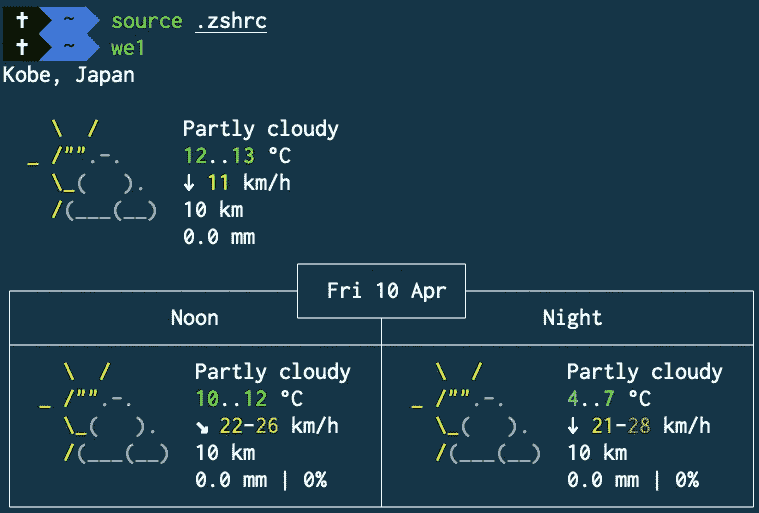

we1

# macOS/Linux 命令

macOS 基于 Unix 操作系统，拥有与 Linux 几乎相同的命令。我之前已经提到过`dir`命令。让我列出更多你经常使用的命令。

## 终端日历

您可以在终端上显示日历。

```
# Current month calendar
$ cal# Yearly calendar
$ cal 2020# Current month + 2 months
$ cal -A 2
```

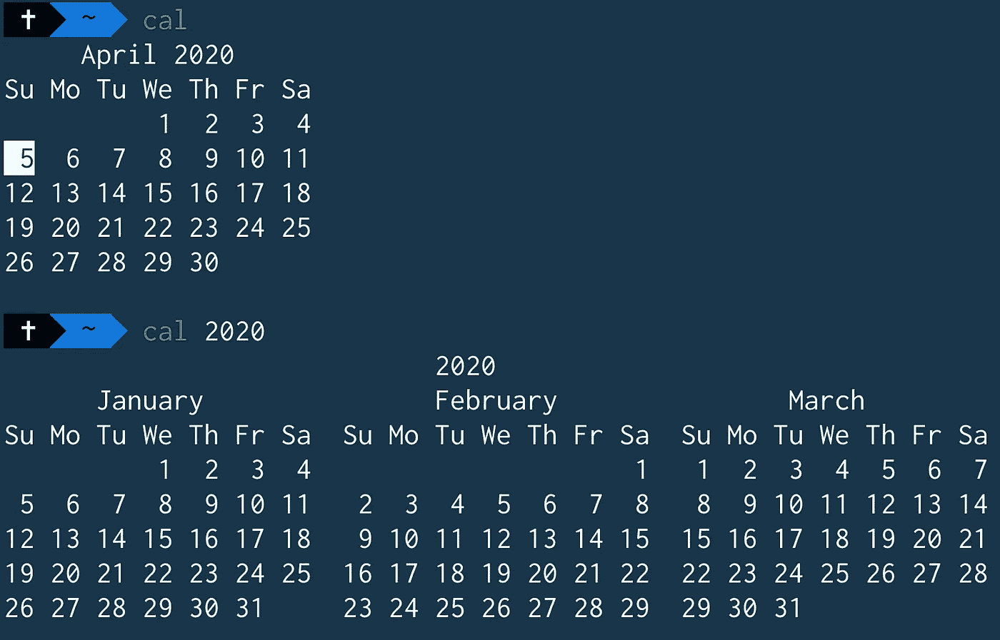

终端日历

## 日期

尝试`date`显示时间。


日期

## 同上

`ditto`复制文件和文件夹。

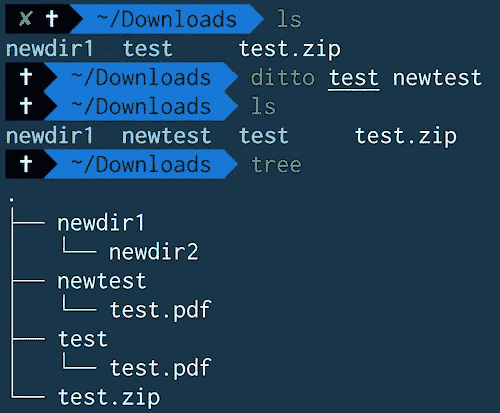

## 常见终端命令

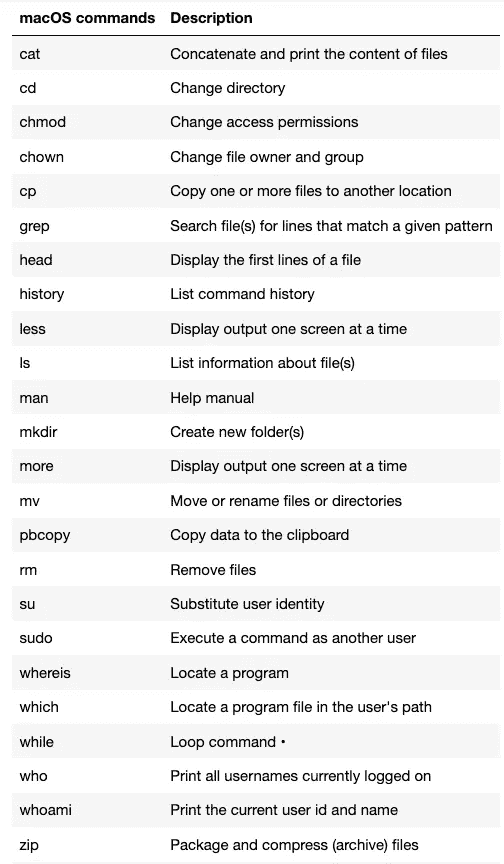

常见的终端命令。作者图片

# 结论

现在，你知道如何增强你的终端。我希望这篇文章能提高你在终端工作时的效率。你可以玩你的终端或者查看天气预报和日历。

找出你最喜欢的[主题](https://iterm2colorschemes.com/)和[插件](https://github.com/ohmyzsh/ohmyzsh/wiki/Plugins)来满足你的需求。

你的包里有什么？zshrc 文件？请分享你的 GitHub 链接。

# 更新日志

*   2021–12–17，星舰和书呆子字体。
*   2021–011–20，M1 专业芯片和 fira-code-nerd-font
*   2021 年 6 月 11 日，M1 芯片，自动跳转
*   2021–5–23，我的天啊错误，M1 芯片，重复标签
*   2021 年 3 月 30 日，2021 版
*   2021 年 2 月 22 日，终端带来乐趣
*   2021 年 2 月 15 日，天气

**通过** [**成为**](https://blog.codewithshin.com/membership) **会员，可以完全访问媒体上的每个故事。**


[请订阅。](https://blog.codewithshin.com/subscribe)

[](/hands-on-jupyter-notebook-hacks-f59f313df12b) [## 手把手的 Jupyter 笔记本黑客

### 您应该使用的技巧、提示和快捷方式

towardsdatascience.com](/hands-on-jupyter-notebook-hacks-f59f313df12b) [](/7-essential-tips-for-writing-with-jupyter-notebook-60972a1a8901) [## 用 Jupyter 笔记本写作的 7 个基本技巧

### 第一篇数据科学文章指南

towardsdatascience.com](/7-essential-tips-for-writing-with-jupyter-notebook-60972a1a8901) [](/version-control-with-jupyter-notebook-b9630bc5996e) [## 使用 Jupyter 笔记本进行版本控制

### Jupytext 分步指南

towardsdatascience.com](/version-control-with-jupyter-notebook-b9630bc5996e) [](/stepping-into-intermediate-with-jupyter-f6647aeb1184) [## Jupyter 用户的生产力提示

### 使用 Jupyter 笔记本和 JupyterLab 让您的工作流程更加高效

towardsdatascience.com](/stepping-into-intermediate-with-jupyter-f6647aeb1184)