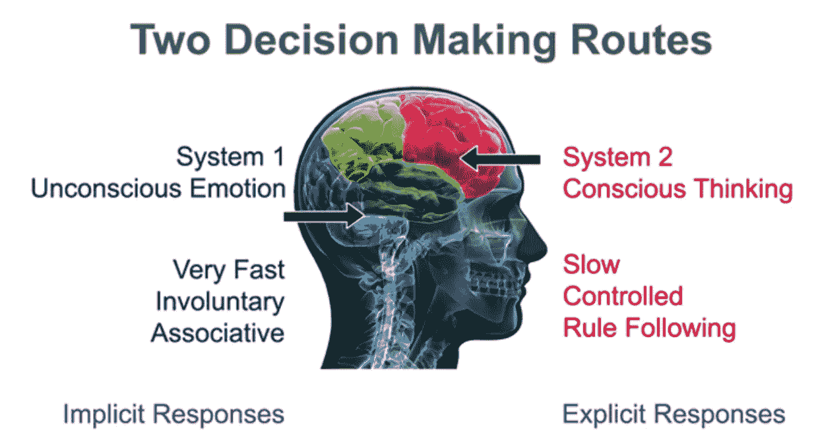
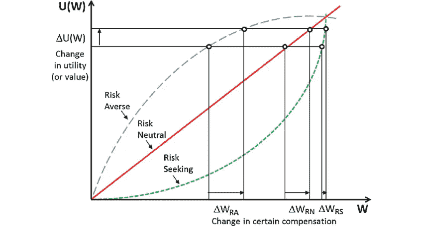
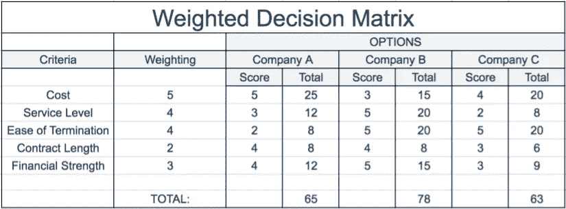
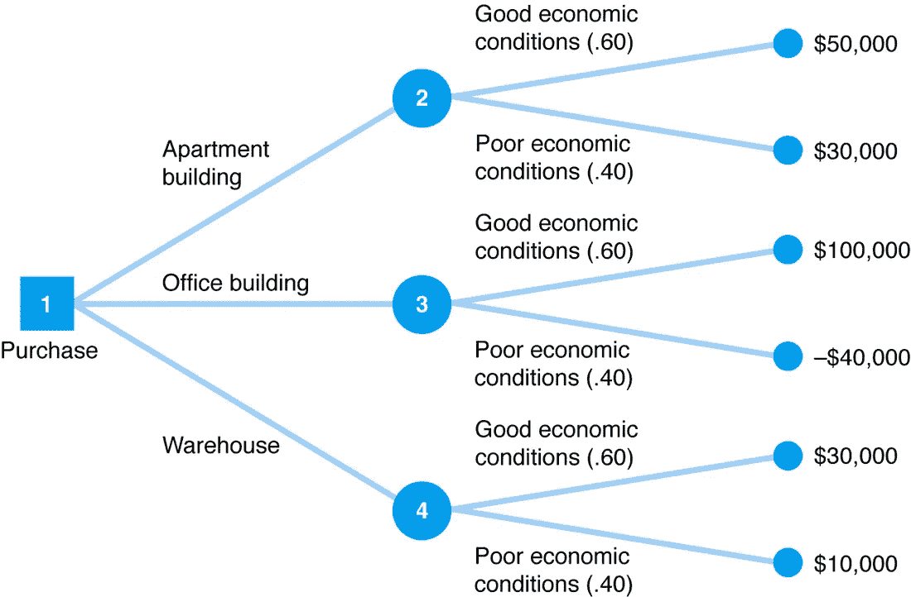
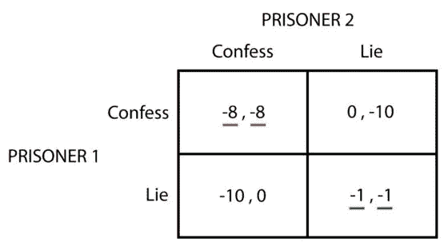
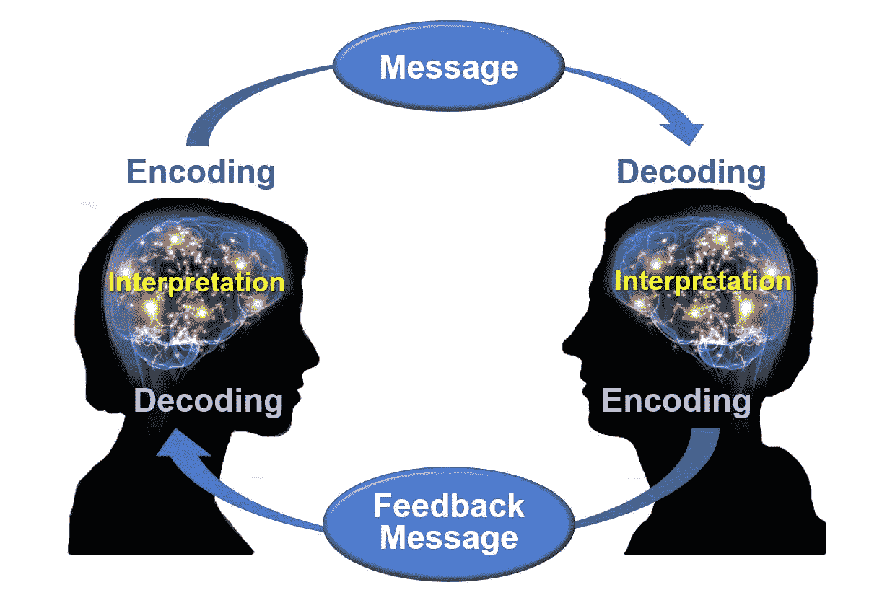
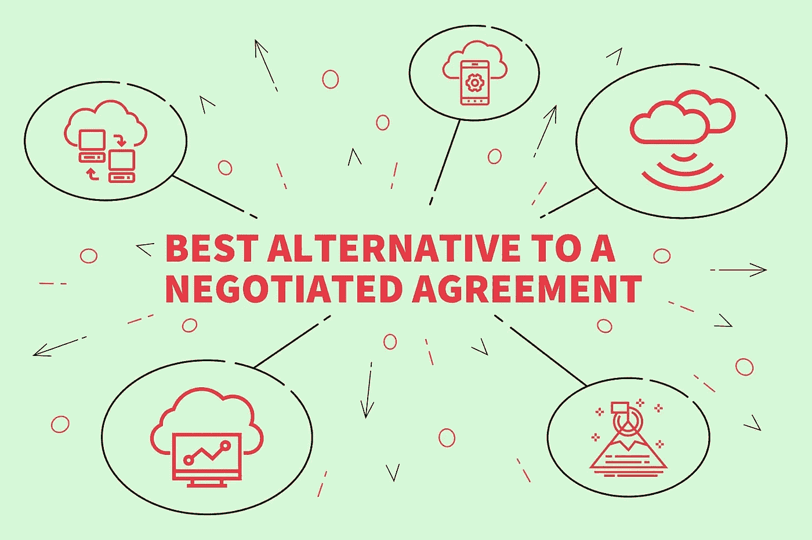
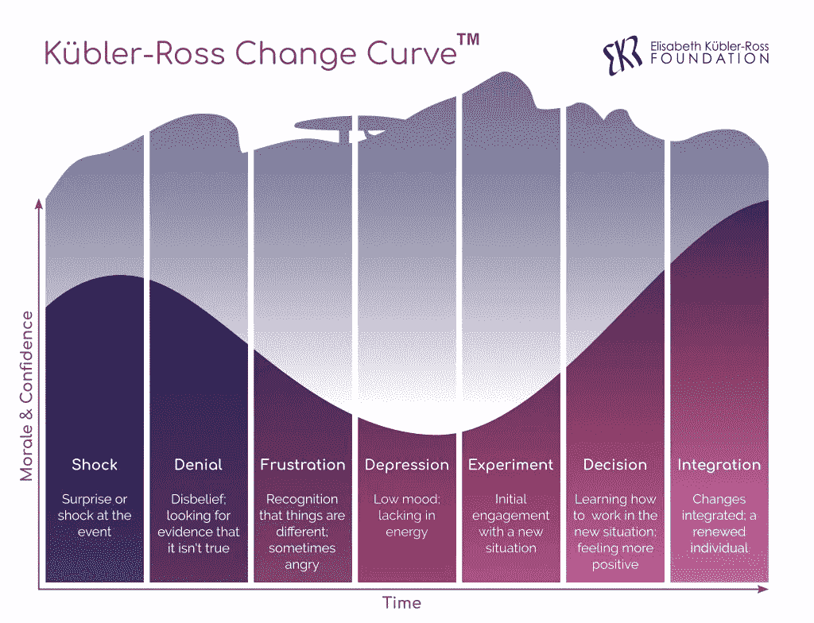

# 数据科学家的终极使命:支持决策

> 原文：<https://towardsdatascience.com/the-ultimate-mission-of-a-data-scientist-support-decision-making-824f870aa386?source=collection_archive---------47----------------------->

由[德姆卡特](https://www.freepik.com/demkat)在 [Freepik](https://www.freepik.com/premium-photo/self-confident-woman-red-cape-super-hero_5411043.htm) 上拍摄的照片

## 破解决策的一系列技巧和诀窍。

## 数据科学家的基本职责是支持基于数据的决策。要实现这一目标，必须培育一种数据驱动的文化，并挑战现状。

无论你是否生活在混凝土丛林中，你都在不断地做决定。在许多情况下，它们可能根深蒂固，以至于你甚至不会去想它们。你的大脑只是推动你通过它，甚至没有推理。我们称之为“*体验*”的东西在这里可以发挥重要作用:具体来说，是针对决策的最佳结果；尤其是在“*体验*没有给考虑数据腾出空间的时候。

数据科学家的基本职责是支持基于数据的决策。要实现这一目标，必须培育一种数据驱动的文化，并挑战现状。从“*”型文化(*系统 1* )成功过渡到 ***数据驱动*** 型方法(*系统 2* )的障碍是人。*

*有经验的经理和主管往往相信他们的“T20”直觉，经常做出高风险的决定。这与许多不同类型的*偏差*有很大关系，我们将在这里讨论，但不限于此。但是，基于情绪的决策也是如此，研究证明这是不推荐的。*

*澄清一下，我们所说的主管和经理实际上是指任何负责做决策的人，不管他/她在名片上的头衔是什么。*

## ***五种最危险的偏见***

**

*图片由 [Freepik](https://www.freepik.com/premium-photo/exclamation-mark_7354654.htm#page=1&query=exclamation%20mark&position=24) 上的 [georgejmclittle](https://www.freepik.com/georgejmclittle) 拍摄*

*偏见可以被定义为“一种特定的倾向、趋势、倾向、感觉或观点，尤其是一种先入为主或不合理的倾向”。在对我们所有人产生负面影响的诸多偏见中， ***过度自信*** 是最糟糕的。很明显，当涉及到决策过程时。*

> *“我们的直觉让我们更容易受到过度自信等认知偏见的影响”——马克斯·h·巴泽曼*

*决策者必须承认他们在某些类型的偏见下运作。没有这种认识，就很难打破做出糟糕决策的车轮。当事情走下坡路时，经理们倾向于指责其他一切，但当他们成功时，却获得巨大的荣誉。*

*在这里，我将介绍一些可能影响决策的主要偏见类型。*

1.  ***过度自信:**研究称，“过度自信可能是所有决策偏差之母”[2]。“过分相信自己知道真相是一种过度自信”[2]。如果你太确定你正在做最好的决定，你最好是有数据支持的。记住，*“垃圾进，垃圾出”*。仅仅因为你可能使用数据，并不意味着你每次都会成功。*
2.  ***确认偏差:**这是一种为选择性的事情寻找正当理由的努力。在这里，我们将寻找任何可以支持和确认我们的信念和价值观的东西。也就是说，我们总是寻找借口来解释我们的失败，却不为失败承担责任。*
3.  *对自我不切实际的积极看法:通常，这可以被视为与过度自信密切相关。在这种偏见中，这个人对他/她自己有着非常积极的看法。特别是，依靠经验做决定的人往往对自己有非常积极的看法。在这里，每天早上吃一粒谦逊丸可能是一种有效的补救措施。*
4.  ***控制错觉:**通常，这种偏见伴随着高度迷信的心态。人们倾向于相信他/她可以依靠他们能做的事情来控制随机事件。就像，“如果我穿靴子，就不会下雨”。*
5.  *自私的归因:我之前已经提到过，但现在让我们重新定义一下:当我们成功时，我们倾向于获得很多荣誉，而当我们失败时，我们很少受到责备。一般来说，主管会将失败归咎于决策者无法控制的失败或其他因素，但将他们的成功归功于他们的技能或经验。*

*还有许多其他类型的偏见，但我想让你感受一下我们认为在专业环境下做决策时的主要偏见。本质上，人们倾向于根据情绪而不是理性做出决定，这让我们直接进入了一条分叉的道路。*

## *永不结束的战争:系统 1 和系统 2*

**

*图 1——两条决策路线。原文[此处](https://brainhealthnorthwest.com/tag/decision-making/)。*

*总而言之，*系统 1* 靠的是情感，*系统 2* 靠的是理性。作为人类，我们都有这两种思想体系。*

****系统 1*** 基于经验，需要很少的认知努力就可以利用。一个经典的例子就是 2 + 2 的答案=？。你看，你甚至不需要想太多就能找到正确的答案。这是一个自动的非常快速的过程。*

*同样地， ***系统 2*** 要求更多的认知努力被利用。一个例子是找到 16 x 23 =的答案。。对绝大多数人来说，找到正确答案需要更多的时间和努力。它不再是自动的了。*

***为什么这与决策相关？**事实证明，在做出重要决策时，我们希望使用*系统 2、*并避免*系统 1 的缺陷。*因为，*系统 1* 不断地在我们的大脑中运行，从不停止——它潜意识地运行——如果*系统 2* 碰巧超负荷运转——需要做出很多很多重要的决定——系统 1 会控制并引导你做出一个常常不是最佳的决定。当这种情况发生时，我们最终做出了“足够好”的决定，增加了失败的几率。*

## *风险厌恶、风险寻求和风险中性*

**

*图 2 —效用函数。原文[此处](https://www.researchgate.net/publication/271918241_Using_tri-reference_point_theory_to_evaluate_risk_attitude_and_the_effects_of_financial_incentives_in_a_gamified_crowdsourcing_task)。*

*上图显示了风险管理的三种不同类型的方法。这在经济学和金融学中是广为人知的。*

*嗯，这和决策有什么关系呢？一切！*

*人们做决定不仅基于金钱价值(X 轴)，还基于*偏好* (Y 轴)，比如需要付出的努力和/或快乐。这个偏好单位被称为“*效用*”，显示一个人对结果的偏好。*

*公用事业很重要，因为它们对人们的决策有影响，也有助于我们更好地理解他们对风险的态度。在经济学中，我们将风险视为平均值或期望值附近的*方差*。在这一点上，我们可以将人们分为三类:风险厌恶型、风险寻求型和风险中性型。*

*我们中的许多人都在寻找损失的风险，并厌恶收益的风险。也就是说，我们要拿肯定的东西，但要避免肯定的损失。因为损失比收益的快乐更痛苦，所以我们想减轻损失。因此，通常，高管们看待“风险”的方式是损失的可能性和程度，而不是*方差*。因此，他们很可能会关注风险的负面影响，而忽略机会。你认为这会如何影响决策？我把那个留给你。*

## *一些设计更好决策过程的工具*

**

*[用户 16172657](https://www.freepik.com/user16172657) 在 [Freepik](https://www.freepik.com/premium-photo/man-with-tools_5907081.htm#page=1&query=tools+belt&position=0) 上的照片*

*好吧，当你被召集去参加一个你自己都没有意识到的会议时，你必须在你的腰带上带一些工具来帮助你。*

*让我们了解一下你应该知道的三个基本工具。请记住，这不是一个详尽的列表。*

1.  ***决策表或决策矩阵***

**

*图 3 —加权决策矩阵。原文[此处](https://expertprogrammanagement.com/2017/09/decision-matrix-analysis/)。*

*根据我们的*偏好*(还记得效用函数吗？).虽然决策表或矩阵非常基本，但在指导决策者时非常有用。*

***2。决策树***

**

*图 4 —决策树。原文[此处](http://amsdecisiontreeanalysis.weebly.com/how-to-solve-problems.html)。*

*决策树对于直观地了解我们将要走的道路、我们决策的复杂性以及风险和潜在结果非常有用。机器学习工程师和数据科学家对决策树很熟悉，特别是因为决策树算法可以用于许多解决方案中。查看原文[此处](http://amsdecisiontreeanalysis.weebly.com/how-to-solve-problems.html)了解更多。*

***3。博弈论:纳什均衡***

**

*图 5——囚徒困境。原文[此处](https://policonomics.com/lp-game-theory2-nash-equilibrium/)。*

*做生意就是要在一场 ***的不合作*** 的博弈下进行。从商业角度来看，*垄断*将是梦想成真，这意味着没有竞争。然而，在许多行业，竞争是激烈的。所以当公司不得不做决定时，假设是他们不知道他们的竞争对手会做什么。本质上，公司在争夺市场份额的时候是没有合作的。因为纳什均衡是一个很好的工具。更多[此处](https://policonomics.com/lp-game-theory2-nash-equilibrium/)。*

## *数据科学家需要掌握的技能*

**

*照片由[七十四](https://www.freepik.com/seventyfour)在 [Freepik](https://www.freepik.com/premium-photo/coded-stuff-screen_8879244.htm#page=1&query=data%20analyst&position=30) 上拍摄*

*没有。作为一个 DS，你的主要目标不是争论 Python 是否比 r 更好或更差，这是没有意义的，也是浪费时间。*

*相反，你的最终使命是通过培养一种数据驱动的文化来支持决策，这种文化允许减少不确定性，并减少直觉决策的重复。*

*记住这一点，如果你想在试图改变一种文化时打破阻力之墙，我将在这里介绍你必须努力的三个软技能。*

1.  ***通信***

**

*图 6——奥斯古-施拉姆沟通模式。原文[此处](https://ecampusontario.pressbooks.pub/communicationatwork/chapter/1-3-the-communication-process/)。*

*商业人士实际上并不关心你用哪种算法得出你的分析。不要试图让自己看起来很聪明，也不要让事情变得过于复杂。强调你为他们的问题找到的解决方案，而不是你使用的工具。*

*通过简化事情，你有机会被听到，你的信息被正确地解码。这对建立信任和融洽关系很重要，因为一般来说，我们喜欢和自己长相相似的人。*

*作为数据倡导者，我们希望为依赖数据的决策过程打开大门。为此，一个伟大的沟通模式是至关重要的。*

***2。谈判建模***

**

*图 7 —巴特纳。原文[此处](https://corporatefinanceinstitute.com/resources/knowledge/deals/what-is-batna/)。*

*现在，你已经成功地表达了你的观点。但是，你发现自己在原地打转，尽你所能去实现它，对吗？！这就是掌握谈判知识的方便之处。*

*然而，不要把太多的精力放在赢得每一场战斗上。关注战争。如果以赢得战争为最终目标，打几场败仗也没什么。如果你只是想表达你的观点，并证明你是坐在桌子上的那个更聪明的人，从长远来看，你可能会悲惨地失败。*

*一个很好的方法是有一个“双赢”的态度。我的朋友，真的可以打开大门。如果事情变得紧张，你可能想要准备一份好的 BATNA(协商协议的最佳替代方案)，它可以帮助你得到你需要的东西，而不会对关系造成太大的损害。*

***3。管理变更***

**

*图 8 —库伯勒-罗斯变化曲线。更多[此处](https://www.ekrfoundation.org/5-stages-of-grief/change-curve/)。*

*归根结底，一切都是为了改变。这可能非常具有挑战性，更有可能来自自上而下的决策。也就是说，一些高级管理人员有一种数据驱动的文化，并希望在整个公司实施这种文化。*

*一般来说，人们倾向于抵制改变。理解应对变化的步骤至关重要。请记住，创建数据驱动的文化是一个过程，需要时间。真的是马拉松，不是短跑。在你走向基于数据的决策民主化的过程中，要有韧性，并不断尝试转化和影响他人。坚持是你需要练习才能达到的**。***

> **“受到喜爱的数据往往会保留下来。”库尔特·博拉克**

## **大数据和物联网(IoT)**

****

**照片由[biancomblue](https://www.freepik.com/biancoblue)在 [Freepik](https://www.freepik.com/premium-photo/internet-things-communication-technology_5116843.htm#page=2&query=big+data&position=14) 上拍摄**

**为什么决策者需要数据科学？原因很简单，现在我们可用的数据(大数据)的*容量*和*结构*是巨大的，为了做出合理的决策，我们需要具备*数据挖掘*能力来提取和分析重要的东西。**

**请想一想，今天，我们有数十亿台设备全天候连接到互联网。这每秒钟都会产生大量的数据。这种现象就是我们所说的“物联网”(IoT)。这与我们在“大数据”世界中转储的数据量直接正相关。**

**事实上，如果没有机器，人类是不可能成功分析所有这些的。硬件和软件方面的最新进展为数据科学家在为公司问题建模解决方案时的发展和成功打开了机会之窗。**

**高管和一般领导层不能对眼下发生的事情视而不见。他们必须投资构建可靠的数据结构和数据仓库，以便分析师能够完成他们的工作，并带来竞争优势。**

**根据什么时候和/或风吹向哪里来做决定，这在鳄龙是不可接受的。**

## **最后的想法**

**总的来说，还有很多其他的话题我们没有机会在这里讨论。本文旨在提供高水平的知识，并对一些资源和信息进行分组，以帮助您理解决策过程的复杂性。**

**技术技能是数据科学家完成工作所必需的，但当归结为培养公司文化向数据驱动的民主化转变时，业务知识和软技能会改变游戏规则。**

**在这里，我们看到了决策方式的主要偏见、系统 1 和系统 2 的工作方式、支持决策的一些工具，以及数据科学家在对抗现状时取得成功所需的一些技能。**

**我希望这能激励你学习更多。下次见。**

****参考文献:****

**[1]理查德·帕卡德。为什么我总是做错误的决定？！BHNW 佛。**

**[2]摩尔，D. A .，坦尼，E. R .，&哈兰，u .(出版中)。判断过于精确。在 g .吴和 g .克伦(编辑。)，判断与决策手册。纽约:威利**

**[3]哈里斯，克里斯托弗&吴，陈.(2014).使用三参考点理论评估游戏化众包任务中的风险态度和财务激励的效果。商业经济学杂志。84.281–302.10.1007/s 11573–014–0718–4。**