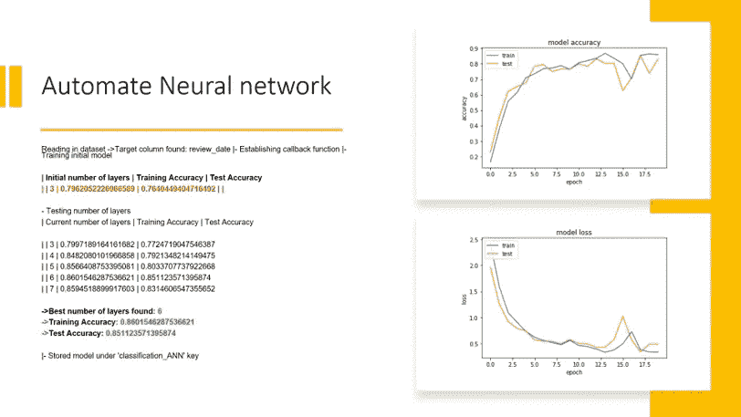
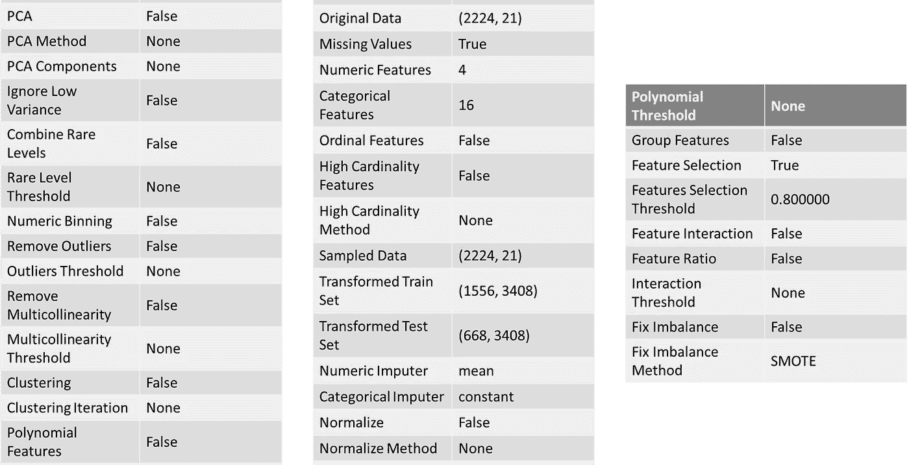
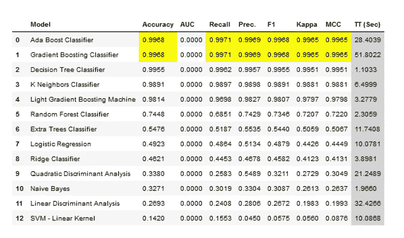
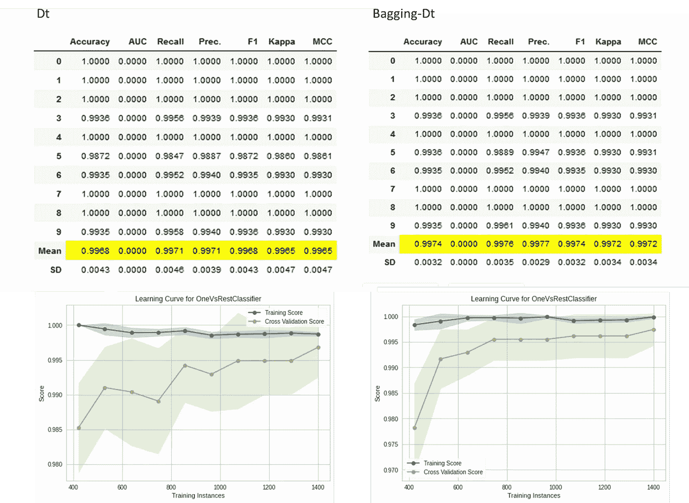
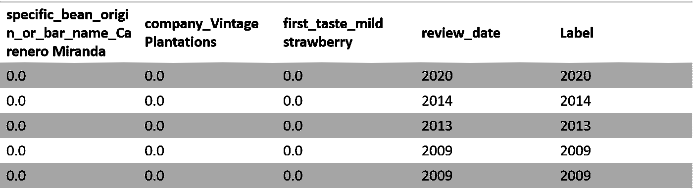

# 终极开箱即用的自动化 Python 模型选择方法

> 原文：<https://towardsdatascience.com/the-ultimate-out-of-the-box-automated-python-model-selection-methods-f2188472d2a?source=collection_archive---------25----------------------->

## 或者说如何在不过度拟合的情况下得到最佳的机器学习模型？


在 [Unsplash](https://unsplash.com/?utm_source=unsplash&utm_medium=referral&utm_content=creditCopyText) 上由 [Franck V.](https://unsplash.com/@franckinjapan?utm_source=unsplash&utm_medium=referral&utm_content=creditCopyText) 拍摄的照片

在任何数据科学项目中，选择最佳模型是特征选择之后的关键步骤。该过程包括使用最佳算法(监督的、非监督的)来获得最佳预测。高维数据集自动模型选择方法一般包括**天秤座**和 **Pycaret** 。一个 unicorn 数据科学家需要掌握最先进的自动化模型选择方法。在本文中，我们将回顾两个最佳 Kaggle 获奖者的自动化模型选择方法，它们可以用简短的 python 代码实现。

在本文中，我们将分析巧克力棒评级数据集样本，您可以在这里找到。


照片由 [Klara Avsenik](https://unsplash.com/@curryandlove?utm_source=unsplash&utm_medium=referral&utm_content=creditCopyText) 在 [Unsplash](https://unsplash.com/?utm_source=unsplash&utm_medium=referral&utm_content=creditCopyText) 上拍摄

一个具有挑战性的数据集，在特征选择后包含 3400 个特征中的 20 个，与目标特征“审查日期”相关。

1.  **天秤座**

面临的挑战是找到最佳的技术组合，以便您可以将预测中的误差降至最低。 *Libra* 提供开箱即用的自动化监督机器学习，优化机器(或深度)学习管道，在几秒钟内自动搜索最佳学习算法(神经网络、SVM、决策树、KNN 等)和最佳超参数。[点击此处](https://github.com/Palashio/libra)查看 Libra 中可用的评估者/模型的完整列表。

这是一个预测巧克力评级数据集 review_date 特征的示例，该数据集是一个复杂的多类分类(标签:2006–2020)。

```
**#import libraries** !pip install libra
from libra import client**#open the dataset** a_client = client('../input/preprocess-choc/dfn.csv')
print(a_client)**#choose the model** a_client.neural_network_query('review_date', epochs=20)
a_client.analyze()
```



使用 Libra **(** 图片由作者提供)自动神经网络

Libra 使神经网络在优化前的精度为 0.796，在优化后的精度为 0.860，减少了从训练/测试= 0.796–0.764(0.35)到训练/测试= 0.860–0.851(0.009)的过拟合，从而使神经网络的最佳层数为 3 到 6。


尼克·卡沃尼迪斯在 [Unsplash](https://unsplash.com/s/photos/arcade-game-machine-neon?utm_source=unsplash&utm_medium=referral&utm_content=creditCopyText) 上拍摄的照片

2. **Pycaret**

PyCaret 是一个简单易用的顺序流水线，包括一个集成了超参数调整和训练模型集成的预处理功能。

```
**#import libraries** !pip install pycaret
from pycaret.classification import ***#open the dataset** dfn = pd.read_csv('../input/preprocess-choc/dfn.csv')**#define target label and parameters** exp1 = setup(dfn, target = 'review_date', feature_selection = True)
```



Pycaret 预处理函数 **(** 图片由作者提供)

所有预处理步骤都在 setup()中应用。有超过 40 个特征为机器学习准备数据，包括缺失值插补、分类变量编码、标签编码(将是或否转换为 1 或 0)和训练-测试-分割，在初始化 setup()时自动执行。关于 PyCaret 预处理能力的更多细节[点击这里](https://www.pycaret.org/preprocessing)。


托比·奥蒂在 [Unsplash](https://unsplash.com/s/photos/arcade-game-machine?utm_source=unsplash&utm_medium=referral&utm_content=creditCopyText) 上拍摄的照片

Pycaret 在一行中进行模型比较，返回一个包含 k 倍交叉验证得分和算法得分指标的表。

```
compare_models(fold = 5, turbo = True)
```



最佳比较分类器 **(** 图片由作者提供)

PyCaret 拥有超过 60 种开源的现成算法。[点击此处](https://www.pycaret.org/create-model)查看 PyCaret 中可用的评估者/模型的完整列表。

**tune_model** 函数用于自动调整机器学习模型**的超参数。** PyCaret 在预定义的搜索空间内使用**随机网格搜索**。该函数返回一个包含 k 倍交叉验证分数的表。

**ensemble_model** 函数用于集合训练好的模型。它只需要经过训练的模型对象返回一个具有 k 倍交叉验证分数的表。

```
**# creating a decision tree model** dt = create_model(dt)**# ensembling a trained dt model** dt_bagged = ensemble_model(dt)**#plot_model dt** plot_model(estimator = dt, plot = 'learning')**# plot_model dt_bagged** plot_model(estimator = dt_bagged, plot = 'learning')
```



简单和 bagging 决策树评估指标**(作者提供**图片)

可以使用 **plot_model** 函数对经过训练的机器学习模型进行性能评估和诊断。

```
**#hyperparameters tunning**tuned_dt = tune_model(dt,optimize = "Accuracy", n_iter = 500)**#evaluate model**evaluate_model(estimator=tuned_dt)**#plot tuned dt confusion matrix**plot_model(tuned_dt, plot = 'confusion_matrix')
```


使用 Pycaret **的决策树分类器评估方法**

最后， **predict_model** 函数可用于预测未知数据集。

```
**#predicting label on a new dataset**predictions = **predict_model**(dt)
```



使用决策树**进行日期预测**

****

**照片由 [Element5 数码](https://unsplash.com/@element5digital?utm_source=unsplash&utm_medium=referral&utm_content=creditCopyText)在 [Unsplash](https://unsplash.com/s/photos/arcade-game-machine-neon?utm_source=unsplash&utm_medium=referral&utm_content=creditCopyText) 上拍摄**

**如果你有空闲时间，我建议你看看这个:**

**[](https://medium.com/swlh/algorithm-selection-65814f477d6a) [## 算法选择

### 从一系列算法中选择最佳算法的指南。

medium.com](https://medium.com/swlh/algorithm-selection-65814f477d6a) 

**总结一下**

请参考以下链接:

[https://jovian.ml/yeonathan/libra](https://jovian.ml/yeonathan/libra)

[https://jovian.ml/yeonathan/pycaret](https://jovian.ml/yeonathan/pycaret)

对于选择巧克力棒的完整算法，请使用这两种方法评估日期。

这个简短的概述提醒我们在数据科学中使用正确的算法选择方法的重要性。这篇文章涵盖了高维数据集的两个最好的 Python 自动算法选择方法，并分享了有用的文档。


照片由[英格玛](https://unsplash.com/@ingmarr?utm_source=unsplash&utm_medium=referral&utm_content=creditCopyText)在 [Unsplash](https://unsplash.com/?utm_source=unsplash&utm_medium=referral&utm_content=creditCopyText) 上拍摄

**希望你喜欢，继续探索！****