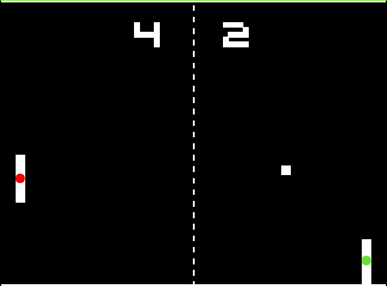
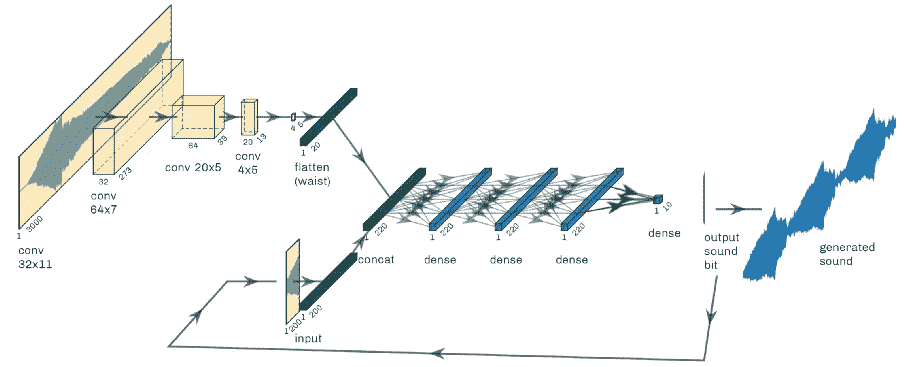

# 终极 pong AI(带计算机视觉！)

> 原文：<https://towardsdatascience.com/the-ultimate-pong-ai-with-computer-vision-3c253578cd00?source=collection_archive---------56----------------------->

## [计算机视觉和终极乒乓人工智能](/computer-vision-and-the-ultimate-pong-ai-e6d70153fc45)

作者:[罗宾·怀特](https://medium.com/u/c5eb85d3a614?source=post_page-----3c253578cd00--------------------------------) — 7 分钟阅读

我最喜欢的 YouTuber 之一， [CodeBullet](https://www.youtube.com/channel/UC0e3QhIYukixgh5VVpKHH9Q) ，曾经试图创造一个 pong AI 来统治他们。可悲的是，他遇到了麻烦，不是因为他没有能力，而是我不认为他当时的经验在计算机视觉方面有什么作用。

照片由 Glenn Carstens-Peters 在 Unsplash 上拍摄

## [因子分析&国家分类聚类分析](/factor-analysis-cluster-analysis-on-countries-classification-1bdb3d8aa096)

由[张志祥](https://medium.com/u/e5fbdb0ef98?source=post_page-----3c253578cd00--------------------------------) — 9 分钟读完

最近，我被一则新闻所吸引，根据世界银行的分类，坦桑尼亚已经达到较低的中等收入水平，比预测提前了五年。出于对他们如何做出判断的好奇，我在这里浏览了一下世界银行的官方网站。

## [用神经网络生成啁啾声](/generating-chirps-with-neural-networks-41628e72efb2)

由杰森·詹森[—6 分钟阅读](https://medium.com/u/76b25870b7c9?source=post_page-----3c253578cd00--------------------------------)

鸟鸣的声音变化多样，优美，令人放松。在前 Covid 时代，我制作了一个专注计时器，它会在休息时播放一些记录的鸟类声音，我总是想知道是否可以产生这样的声音。经过反复试验，我找到了一个概念验证架构，它既能成功再现单一啁啾声，又能调整参数以改变生成的声音。