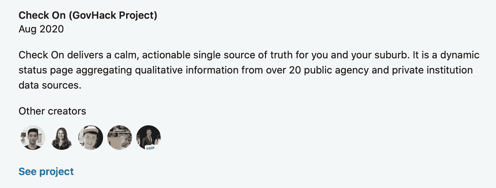

# 终极后黑客马拉松指南

> 原文：<https://towardsdatascience.com/the-ultimate-post-hackathon-guide-12a1fb5d1b46?source=collection_archive---------39----------------------->


由 [Unsplash](https://unsplash.com?utm_source=medium&utm_medium=referral) 上的[absolute vision](https://unsplash.com/@freegraphictoday?utm_source=medium&utm_medium=referral)拍摄

## 结束或发展你的想法的 10 个实用技巧和诀窍

**场景:**你参加了一次黑客马拉松，也许是你的第一次，也许是你的第*次*。活动进展顺利，您的问题和解决方案切中要点，赢得了评委的心，并为您的团队赢得了排行榜上的一席之地。

活动正式结束了，但现在你已经睡了一个好觉，在笔记本电脑上添加了更多的贴纸，吃了足够吃一周的免费食物(前提是你没有被锁起来)，你突然想到:“现在怎么办？”

# 介绍

作为一个自我诊断为黑客马拉松爱好者的人，我经常问自己(也经常被问到)这个问题！它启发我写了这篇文章，其中写道:

> 我想为你和你的团队提供一份实用的建议清单，告诉他们在黑客马拉松后该做些什么。

面对现实吧，没有对错之分。你常常是为了接触新技术或行业关系，这可能会成为你实习、研究生角色的“敲门砖”，或者只是通过制作一些很酷的东西向周围的人展示你的技能的机会。如果是你，最终的结果可能不是创业，而是不断增长的 GitHub 组合。

最后，归结为一个问题:

> 我们的团队是否想继续这个项目？

# #1:必备:README.md

这个文件需要说明一切，不管你对上述问题的回答！这是你项目的求职信，可能比你创建的任何登陆页面都更重要。用它告诉每个人这个想法和实现它的技术。如果有人想了解您团队的流程或知识，他们应该在这里找到..就在你的代码旁边。

以我的经验，这是最简单的加法，影响最大。不管你的项目有多酷，或者你对自己的代码有多了解，都要让它对每个人都简单明了。


作者图片

## 你可能包括什么？

1.  **一张图**道尽千言万语，用首页的横幅或截图捕捉大家的注意力。
2.  **如果您在个人回购中托管代码，徽标**是一个很好的补充，否则将其放在您组织的个人资料图片中。
3.  陈述你的**项目名称**并更新回购的**描述**用一句话总结解决方案。
4.  将已实现库或技术的**关键字**添加到您的 repo 中。
5.  包括一个**链接**到您部署的解决方案(如果适用)。
6.  从您的主机提供商或 CI 工具添加**状态徽章**，以指示您的项目或实时网站的状态。
7.  如果你因为你的想法赢得了任何**奖项**，也要提及它们，并在它们前面加上表情符号(如果你觉得这样做合适的话)。
8.  简要告诉我们**为什么** **我们应该关心**你的团队正在处理的黑客马拉松的问题/主题。
9.  简要告诉我们**你的团队如何解决上述**和**问题，为什么你的项目是这项工作的最佳**解决方案。
10.  给我们**截图**！*提示:*可以在自述文件中使用 HTML 和 CSS 来布局(或者使用表格)。
11.  给我们一张**团队照**！你一定玩得很开心，把那一刻记录在你的自述文件里，让所有人都看到！
12.  不要太复杂，告诉我们**我们如何让你的代码在本地运行**(不要忘记链接任何相关网站，我们可能需要在那里申请 API 密匙)。

## ✨专家提示:添加为 LinkedIn 项目

现在您已经有了一个漂亮的自述文件。为什么不在你的 LinkedIn 个人资料上链接到它呢？转到项目部分，添加 GitHub URL 以及项目名称和简短描述。为了显示你是一个团队成员，将你的团队成员添加为贡献者。



当人们查看您的个人资料时，他们可以查看您的项目。图片作者。

# #2:最低限度:清理

在完成了这一工作之后，你可能还在 GitHub 上纠结于混乱的代码库。虽然大多数黑客马拉松不会评判你的代码是否干净，但你可能想帮你的投资组合一个忙…

1.  花几分钟时间查看整个代码，并自动格式化每个文件，删除不需要的空格，并修复任何令人困惑的变量名。现在可能也是对您的函数的使用提供一些意见的好时机。
2.  确保您没有在 repo 中泄漏环境变量(即添加您的。`env`文件到一个`.gitignore`文件中，这样它就不会被签入到你的版本控制中),并且任何这样的键在事件结束后都会被旋转。如果适用，提供一个`.env.example`文件来记录所需的环境变量(当然没有它们的值)。
3.  如果你已经将你的应用程序部署到云上，比如说 [Heroku](https://heroku.com) 或 [Vercel](https://vercel.com) (黑客马拉松中快速部署的流行选择)，你可能已经建立了管道或审查应用程序，随着时间的推移，这可能会花费你的钱。只留下生产应用程序，并更改其设置，以自动部署您的回购的*主*分支。这将确保 GitHub 中的依赖警告/安全补丁也能自动部署。

# 做出选择！

很简单:

```
if (you_want_to_grow_this_idea) { **Read On!** In the next section we dive a little deeper.} else { **Congrats!** 🥳 You’ve attended a hackathon, built a cool solution,
  make new connections, and added the new project to your GitHub /
  LinkedIn portfolio to talk about in the future!
  Ready for the next hackathon??}
```

# 下一步:我们希望继续前进(和成长)

**好消息！黑客马拉松是#创新的巨大催化剂。如果你的团队看到了这个想法的潜力，或者有将它推向市场的愿望，那么为自己已经走了这么远而感到欣慰。👏🏼👏🏼**

下一部分是给你的！

# #3: R **联合部队！是回顾的时候了！**

既然你们已经见过面并一起工作了，你必须找到一个对你们都合适的地点(最好是一个物理空间)。它可能是你的大学校园，当地的咖啡馆，或者某人的房子。


由 [Startaê Team](https://unsplash.com/@startaeteam?utm_source=medium&utm_medium=referral) 在 [Unsplash](https://unsplash.com?utm_source=medium&utm_medium=referral) 上拍摄的照片

聚在一起谈论活动的成功，听对方说完，并做笔记，你可以在接下来的步骤中使用反馈和新想法(可能评委有你没有想到的很棒的建议)。

*   哪些工作做得很好/本可以做得更好？
*   每个人都认为这个想法会走向何方？
*   在黑客马拉松中，每个人都希望实现的一件事是什么？
*   事件发生后，你有什么新想法？

# #4:确定你的管理层支持者

一些黑客马拉松是私人公司范围的创新活动。与他们的上市公司相比，这些公司通常期望建立一些东西来增加公司现有产品或服务的价值。


由 [Austin Distel](https://unsplash.com/@austindistel?utm_source=medium&utm_medium=referral) 在 [Unsplash](https://unsplash.com?utm_source=medium&utm_medium=referral) 上拍摄的照片

然而，这些活动有一个项目赞助商。这通常是高层领导团队中的某个人，他是项目团队的利益相关者。你要它们做什么？当然是拥护！我们希望尽可能产生最大的影响，但如果我们没有从那些有影响力的人那里获得情感(也许还有财务)投资，那说起来容易做起来难。

获得高管支持的第一个技巧是展示项目发起人的关键利益(如与成功的项目或充满激情的人/事业相关联)可以被反复证明。

*   尽早与他们会面，了解你的项目如何与公司的更大目标保持一致，无论是可持续性、多样性和包容性，还是类似的价值观。
*   请他们定期向公司汇报你们的共同努力。这是一个获得免费曝光、动力和被认真对待的好方法。

# #5:确定一个领导者

面对现实吧，我们都经历过..有时候，在一场累人的比赛后，很难重新获得动力。一个清晰的领导者的想法可能会给项目增加不必要的层级，但是对于保持团队的责任性是必要的(特别是在偏远地区)！


蒂莫西·埃伯利在 [Unsplash](https://unsplash.com?utm_source=medium&utm_medium=referral) 上的照片

我无权告诉你如何识别团队中的领导者..所以，想想谁能最好地阐述问题和解决方案，谁能感同身受并在比赛中让评委们微笑，谁擅长人员管理。一句名言很好地总结了这一点:“培养领导力的唯一途径是尝试领导力。”

有趣的见解:[如何成为创业公司的伟大领导者](https://medium.com/swlh/how-to-be-a-great-leader-in-a-startup-779e397d4c3b)和[像真正的领导者一样经营创业公司的 8 个技巧](https://www.entrepreneur.com/article/346876)

# #6:制定产品路线图

作为一个团队，让我们创造一些清晰度和方向感。这里有一个启动产品路线图的例子，请看一下[完整指南](https://spin.atomicobject.com/2018/09/04/startup-product-roadmap/)中更详细的解释。


来源:[原子对象](https://spin.atomicobject.com/2018/09/04/startup-product-roadmap/)(有权限)

通常情况下，黑客马拉松非常擅长以足够的细节掩盖前 4 个步骤，为你推销的解决方案的需求提供令人信服的理由。你现在的任务是在继续前进之前回去重温最初的步骤。

*   我们的解决方案真的有市场吗？
*   我们的解决方案真的解决了核心问题吗？
*   现在谁愿意付费使用原型？(提示:这是你的第一个客户，所以现在就获得他们！)

# #7:保持精益:使用这些积分！

假设你的团队成员继续免费工作(当然是在业余时间)；我质疑这么早就筹款的必要性。相反，我相信在预算有限的情况下使用免费试用来实现你的 MVP。

像 Azure、AWS 或 Google Cloud 这样的云平台从来没有这么便宜过，他们组织中的一些人经常与黑客马拉松有联系，并且非常乐意向你提供一些免费积分。使用它们，如果用完了，就要求更多！

# #8:开发功能路线图

我敢肯定，您想到的大多数特性在黑客马拉松期间都无法被团队实现。

在 MVP 中包括什么:大多数团队都很难定义什么是紧急的，什么会在早期产生最大的影响。让下面的图表成为你无情地优先处理 MVP 待办事项的指南。


优先级矩阵:影响与紧迫性

# #9:获得你的第一个付费客户

在最方便的时候引入早期采用者总是好的。尽快和他们签约，让他们觉得相信你是有价值的！


[乔丹·罗兰](https://unsplash.com/@yakimadesign?utm_source=medium&utm_medium=referral)在 [Unsplash](https://unsplash.com?utm_source=medium&utm_medium=referral) 上的照片

早些时候，我们问自己*“谁愿意为原型买单？”现在，我们希望锁定他们的承诺。这是我们的第一个付费客户。*

> 如果他们看到我们的解决方案有好处，我敢打赌他们知道他们愿意推荐的其他人！

选择适合您的解决方案的支付模式，并专注于收集经常性(如每月)收入。我见过许多早期创业公司向他们的初始客户群提供免费试用，但我建议你考虑折扣价格。原价的 50%，甚至 25%还是比完全没有收入好。

> 我们正在创业，所以不要害怕在 MVP 上贴上价格标签！

最后，通过与第一批顾客交谈并听取他们的反馈，让他们感受到自己的价值。要求举例说明您的解决方案如何解决他们的问题。也问他们哪里可以改进，然后发送他们的一个反馈项目(当然是总体影响最大的一个)。

# #10:玩得开心！

不言而喻..总有学习的空间(说“我不知道”也没什么损失)所以不要太把自己当回事。你能行的！


照片由 [sydney Rae](https://unsplash.com/@srz?utm_source=medium&utm_medium=referral) 在 [Unsplash](https://unsplash.com?utm_source=medium&utm_medium=referral) 上拍摄

## **你对黑客马拉松有什么建议？**

认识到所有的黑客马拉松都是不同的，这绝不是一个全面的列表，而是帮助重获动力的实际行动。也就是说，我很想听听你在黑客马拉松后的建议。

祝你和你的团队好运！