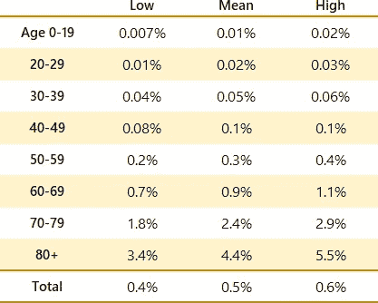
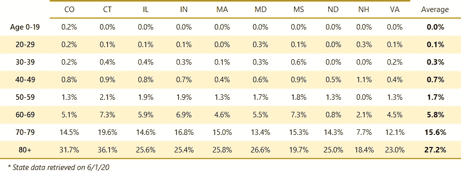
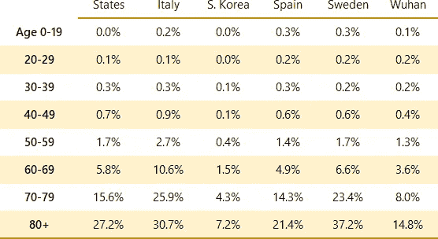
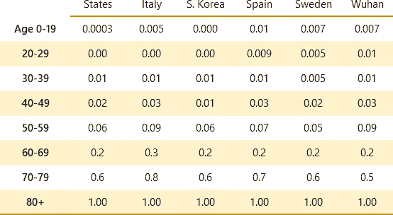
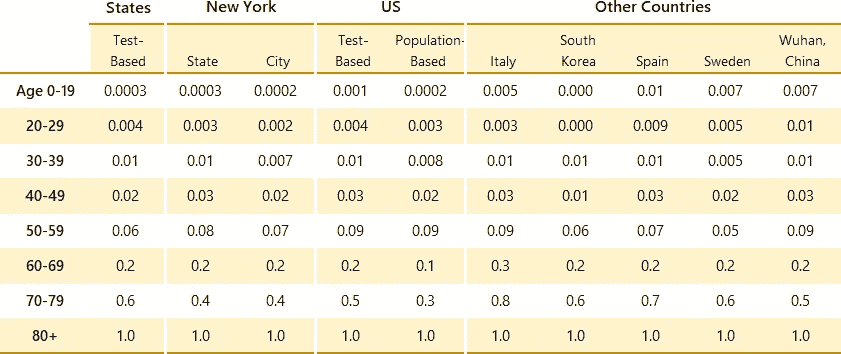
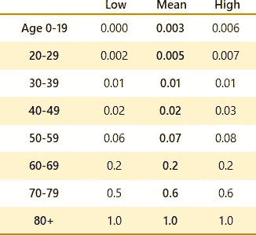

# 新冠肺炎基于年龄的死亡数据惊人的一致

> 原文：<https://towardsdatascience.com/the-uncanny-consistency-of-covid-19-age-based-fatality-data-e2abe37b570?source=collection_archive---------39----------------------->

## 在新冠肺炎基于年龄的死亡数据中有很深的潜在一致性——但是你必须做一些数学运算才能看出来

你可能知道新冠肺炎对老年人比对年轻人更致命。对这一总体模式的报道是一致的，但具体情况却大相径庭:对于 80 岁以上的人，韩国报告的死亡率为 7%，中国为 15%，西班牙为 21%，瑞典为 36%。

死亡率怎么会有这么大的差别？

我想了解新冠肺炎在年龄死亡率上的真正差异。在我的调查中，我发现来自美国各州和其他国家的数据显示，年龄对死亡率的影响具有显著的一致性。但是你必须以正确的方式看待数据，才能看到一致性。

塞尔久·vălenaș在 [Unsplash](https://unsplash.com/s/photos/grandmother?utm_source=unsplash&utm_medium=referral&utm_content=creditCopyText) 上拍摄的照片

# 简短版，给对数学不感兴趣的人

虽然以百分比形式报告的绝对死亡率差异很大，但不同年龄段的死亡率比率非常一致。

应用我在[之前的一篇文章](/new-data-shows-a-lower-covid-19-fatality-rate-1d69361a50af)中描述的总感染死亡率(IFR)，你最终会得到下表中显示的基于年龄的死亡率。

表 A——新冠肺炎基于年龄的感染死亡率(IFRs )( 95%置信区间)。

因为与年龄相关的比率如此一致，所以即使考虑到总死亡率的可变性(表格底部的 0.4%、0.5%和 0.6%的数字)，每个年龄段的死亡率也几乎没有可变性。这使得人们能够准确地确定他们个人的风险水平和他们所关心的其他人的风险水平。

> 80 岁以上人群的死亡风险是 30-39 岁人群的 100 倍，20-29 岁人群的 200 倍，0-19 岁人群的 400 倍。

# 长版本——有很多数学

为了了解基于年龄的死亡率，我需要按年龄划分的阳性检测数和按年龄划分的死亡率的数据。

纽约州是新冠肺炎死亡人数最多的州。为了获得最可靠的基于年龄的死亡率数据，我最初想使用人数最多的州。

纽约按年龄公布死亡人数，但不幸的是，它没有按年龄公布阳性检测人数。所以我不得不去别处看看。

# 小国出手相救

我搜索了按年龄公布阳性检测和死亡人数的州。我查看了所有 50 个州和哥伦比亚特区的新冠肺炎网站——这是一项令人沮丧的工作。许多州公布死亡率的年龄数据，但不公布阳性试验。许多机构公布测试的年龄数据，但不公布死亡率。一对夫妇公布了两者，但使用的年龄范围与其他州和国家使用的 10 岁年龄范围不一致(例如，加利福尼亚州使用的年龄范围是 0-4、5-17、18-34、35-49，而不是 0-19、20-29、30-39、40-49)。

10 个州公布了按年龄划分的阳性检测数据和死亡数据，以及有意义的年龄段。

表 1 总结了为这些州计算的基于年龄的*CFR*(病死率)。这些是 T2 的原始死亡率，因为它们是用死亡总数除以阳性检测总数计算出来的。结果是近似的——因为阳性检测并不是一个非常一致的感染指标，也因为这些死亡率不包括与最近阳性检测相关的未来死亡。

表 1——适用于“小”国家的粗 CFR

各州死亡率的变化类似于全国死亡率的变化。80 岁以上人群的死亡率从新罕布什尔州的 18%到康涅狄格州的 36%不等，与韩国的 7%到瑞典的 36%差不多。

因为这些州没有一个记录的死亡人数接近纽约，有些州记录的死亡人数不到 100 人，所以我认为最准确的方法是将各州的数据汇总成一个加权平均值，根据死亡人数进行加权。合并的结果显示在表 1 的最右栏中。

> 除了出于统计目的，谈论新冠肺炎的总体死亡率基本上没有意义。年轻人和老年人的死亡率相差 400 倍，总死亡率大大高估了年轻人的风险，而低估了老年人的风险。

# 美国死亡率与其他国家的比较

我想看看美国基于年龄的死亡率与其他国家报道的死亡率相比如何。表 2 显示了对比，也是基于粗 CFR。

表 2 —美国“小”州和选定国家基于年龄的粗 CFR。

由于不同国家的检测实践存在显著差异，我没有想到死亡率会有直接的可比性，事实上表 2 显示了显著的差异。当数据以这种方式呈现时，任何基于年龄的死亡率模式都被很好地隐藏了。

# 揭示基于年龄的死亡率惊人的一致性

为了便于比较，并潜在地显示数据中的模式，我将死亡率标准化。(归一化是将不同的数据集放在同一尺度上的过程。)我将每个地区 80 岁以上人群的死亡率视为 1.0，然后将其他死亡率与此成比例。结果如表 3 所示。

表 3 —美国“小”州和选定国家按年龄划分的标准化死亡率。

随着数据在 80 岁以上标准化，比率变得非常有趣:

*   在 20-29 岁之间，不同地区的*总差异*为 0.00 到 0.01。
*   在 30 岁至 39 岁之间，*每个地区*报告的比率都接近 0.01。
*   对于 40-49 岁的人，总的变化范围在 0.01 和 0.03 之间。

不管数据来源如何，所有年龄段的死亡率都惊人地一致*。*

# *为什么基于年龄的比率的一致性很重要*

*我数不清有多少报告表达了对不同国家死亡率差异的困惑。人们推测这种病毒在不同的地方有不同程度的致命性。*

*这些比率惊人的一致性表明情况并非如此。它支持了病毒行为一致的观点。报告死亡率的差异是由不同水平的检测造成的，而不是由病毒行为的差异造成的。这很容易让人相信，因为我们已经知道在测试实践中有巨大的可变性。*

# *重新审视纽约州基于年龄的死亡率*

*标准化计算取决于每个年龄段中阳性检测的比率，但不取决于检测的绝对次数。*

*因为纽约州不提供按年龄分类的测试数据，我想知道那里的感染水平是否足够高，以至于可以用该州的总人口来计算死亡率。这相当于假设纽约的人口在各个年龄段都被感染了。考虑到疫情在纽约的传播范围，这似乎是合理的。*

*我通过计算如表 4 所示的标准化比率来测试这个理论，纽约州被添加到最右边的一列。*

*纽约基于年龄的死亡率确实在除了 70-79 岁以外的每个年龄段的既定范围内，这表明基于人口的计算方法是有效的。*

**

*表 4——添加纽约州后按年龄划分的标准化死亡率。*

# *从其他区域取样进行分析*

*我对纽约市基于人口的比率以及整个美国基于测试和基于人口的比率进行了类似的分析。(当我开始分析时，美国的数据还不可用，但在写这篇文章之前，美国的数据变得可用。表 5 列出了全部结果。*

**

*表 5 —按年龄划分的标准化死亡率扩展集。*

*额外的数据点并没有使整体情况发生很大变化。大多数额外点数仍在最初的“小国+选定国家”分析所确定的范围内。唯一超出初始范围的点是基于美国人口的 60-69 岁和 70-79 岁年龄段的点。*

*基于测试的数据和基于人群的数据之间的密切跟踪的一个有趣的含义是，它表明人群正在被成比例地测试。有人猜测，年轻人接受的测试更多，或者更少。如果这是真的，你会看到这反映在基于人口的数字(美国和纽约)和基于测试的数字(所有其他)之间的差异。在一定程度上，每个美国基于测试的数字都高于相应的基于人口的数字，数据支持的唯一不成比例的结论是，与 80 岁以上的群体相比，每个 80 岁以上的群体都没有得到充分测试。*

# *基于年龄的最终死亡率*

*几个数据样本的可用性为计算置信区间提供了基础，这简化了情况并缩小了结果。95%的置信区间如表 6 所示。*

**

*表 6–基于年龄的死亡率的 95%置信区间。*

*置信区间很窄，这是当数据点有如此多的一致性时，你直觉上所期望的。*

*表中的数据支持有趣的结论，包括:*

*   *每个年龄段的死亡风险大致翻倍。*
*   *80 岁以上人群的死亡风险是 30-39 岁人群的 100 倍，20-29 岁人群的 200 倍，0-19 岁人群的 400 倍。(由于表 6 中的舍入，最后一个因素看起来应该是 300，但实际上是 400。)*

# *最后一步:从比率到有意义的基于年龄的死亡率*

*将这些死亡率与我在“[新数据显示新冠肺炎死亡率更低](/new-data-shows-a-lower-covid-19-fatality-rate-1d69361a50af)中所写的总体死亡率分析结合起来，我们可以计算出有意义的基于年龄的死亡率，并有置信区间。正如我在那篇文章中所说的，美国的总死亡率在 0.4%到 0.6%之间，平均值为 0.5%。我使用蒙特卡罗模拟来说明基于年龄的计算和总死亡率中可变性的相互影响。*

*蒙特卡洛模拟的结果显示在表 A 中(本文开头的同一个表)。*

**

*重温表 A——基于年龄的新冠肺炎死亡率变异性和新冠肺炎总体死亡率变异性之间相互作用的蒙特卡罗模拟结果。显示的范围是 95%的置信区间。*

*我通过直接计算两个独立样本的置信区间来验证蒙特卡洛模拟的结果。产生了非常相似的结果。*

*从表中可以看出，对于青少年和 10 岁以下的儿童，即使在最坏的情况下，死亡率的上限也不超过 0.02%。另一方面，对于 80 岁以上的人，即使是最好的假设，致死率范围的下限至少是 3.4%。*

*这些数据显示了为什么谈论新冠肺炎的总体死亡率毫无意义，除非是出于统计目的。年轻人和老年人的死亡率相差 400 倍，总死亡率大大高估了年轻人的风险，而低估了老年人的风险。*

# *结论*

*不同地区的新冠肺炎年龄相关死亡率数据最初看起来差异很大。经过更仔细的研究，这些数据实际上显示出高度的一致性。这种趋同使得对新冠肺炎狭窄的基于年龄的死亡率的计算更有把握。*

*对基于年龄的死亡率有一个清晰的了解，可以为人们提供他们所需要的信息，为他们自己、他们的家人和他们关心的其他人做出明智的个人风险决策，无论他们是处于风险谱的高端还是低端。*

**这是关于新冠肺炎死亡率的 5 集系列报道的第 2 集:**

*   *[*第一部分*](/new-data-shows-a-lower-covid-19-fatality-rate-1d69361a50af) *:为美国建立一个总体基础 IFR**
*   **第二部分:基于年龄的国际财务报告准则**
*   **第 3 部分:基于人口统计的各州和各国 IFRs 的差异**
*   **第 4 部分:有和无共病的 IFRs**
*   **第 5 部分:按年龄和共病状况分列的 IFRs**

# *更多详情请访问新冠肺炎信息网站*

*更多美国和州级数据，请查看我的新冠肺炎信息网站。*

**

# *我的背景*

*20 年来，我一直专注于理解软件开发的数据分析，包括质量、生产率和评估。我从处理噪音数据、坏数据、不确定性和预测中学到的技术都适用于新冠肺炎。*

# *参考*

*韩国[死亡率](https://www.businessinsider.com/coronavirus-death-rates-by-age-south-korea)。*

*中国、西班牙和瑞典的死亡率。*

*科罗拉多州[数据](https://covid19.colorado.gov/case-data)。*

*康涅狄格州[数据](https://data.ct.gov/coronavirus)。*

*伊利诺伊州[数据](http://www.dph.illinois.gov/topics-services/diseases-and-conditions/diseases-a-z-list/coronavirus)。*

*印第安纳州[数据](https://www.in.gov/isdh/28470.htm)。*

*马里兰州[数据](https://coronavirus.maryland.gov/)。*

*马萨诸塞州[数据](https://www.mass.gov/info-details/covid-19-cases-quarantine-and-monitoring)。*

*密西西比州[数据](https://msdh.ms.gov/msdhsite/_static/14,0,420.html)。*

*新罕布什尔州[数据](https://www.dhhs.nh.gov/dphs/cdcs/2019-ncov.htm)。*

*纽约州[数据](https://coronavirus.health.ny.gov/county-county-breakdown-positive-cases)。*

*北达科他州[数据](https://www.health.nd.gov/diseases-conditions/coronavirus/north-dakota-coronavirus-cases)。*

*美国基于年龄的阳性检测和死亡率[图表](https://www.cdc.gov/covid-data-tracker/index.html#demographics)和[报告](https://www.cdc.gov/coronavirus/2019-ncov/cases-updates/index.html)和[链接到疾病预防控制中心](https://www.cdc.gov/nchs/nvss/vsrr/covid_weekly/index.htm)的数据下载。*

*弗吉尼亚州[数据](https://public.tableau.com/views/VirginiaCOVID-19Dashboard/VirginiaCOVID-19Dashboard?:embed=yes&:display_count=yes&:showVizHome=no&:toolbar=no)。*