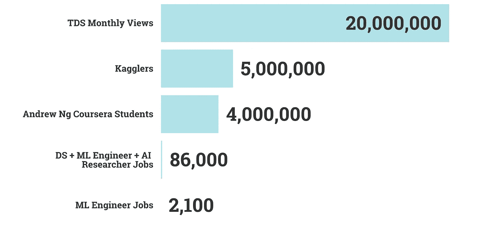

# 不常见的数据科学工作指南

> 原文：<https://towardsdatascience.com/the-uncommon-data-science-job-guide-3e215ba552bf?source=collection_archive---------9----------------------->

## 数据科学竞争异常激烈。以下是如何用“蓝海”策略取胜。

杰克·科科特在 [Unsplash](https://unsplash.com?utm_source=medium&utm_medium=referral) 上拍摄的照片

获得一份数据科学的工作就像学习 Python 和 Jupyter 这样的技能一样简单，参加 Kaggle 比赛，获得认证，并在工作门户网站上提交简历，对吗？

**错了。**

最近 Kaggle 冲击[500 万](https://www.kaggle.com/general/164795)独立用户。看看其他社区，走向数据科学获得[2000 万](/questions-96667b06af5)月浏览量。人工智能研究员吴恩达在他的 Coursera 课程中拥有 400 万学习者。

与此同时，全球仅有[17100 名](https://app.apteo.co/workspaces/2300510291097552329) ML 工程师。截至撰写本文时，全球范围内，LinkedIn 上有[2100 个](https://www.linkedin.com/jobs/search/?geoId=92000000&keywords=%22machine%20learning%20engineer%22&location=Worldwide&start=975) *开放*机器学习工程师职位。其中，大约 80 人在 FAANGs。

Apteo 的[“数据科学职业趋势”仪表板](https://app.apteo.co/workspaces/2300510291097552329)的“开放数据科学角色”。

公平地说，如果我们包括通用数据科学和人工智能研究员角色，全球共有 [86，000](https://app.apteo.co/workspaces/2300510291097552329) 个职位空缺。尽管如此，称数据科学为“竞争性”仍是今年的轻描淡写。

数据科学社区与数据科学工作机会。由作者可视化。

# 红海与蓝海战略

在商业中，竞争领域被称为“红海”，鲨鱼在拥挤的空间里一决雌雄。相比之下，“蓝海”指的是未开发的、没有竞争对手的市场空间。

来自 flaticon.com[的](http://www.flaticon.com/) [Freepik](https://www.flaticon.com/authors/freepik) 的图标。由作者编辑。

作为一名未来的数据科学家，你的目标是在蓝海中竞争。这里有四种方法。

红海 vs 蓝海战略。由作者创建。

# 1.使用利基平台和社区

我是 LinkedIn 超级粉丝。事实上，在参加了 100+ LinkedIn 学习课程后，我已经被 LinkedIn 精选过[，我发布过](https://www.linkedin.com/feed/update/urn:li:activity:6649046413223309312/)[超过 10，000 条评论](https://www.linkedin.com/posts/frederikbussler_datascience-activity-6513590438765563904-CPMf)，我有超过 [20，000 个连接](https://www.linkedin.com/in/frederikbussler/)。也就是说，仅仅依靠 LinkedIn 是一个红海战略(⚠️).

LinkedIn 帖子，由 LinkedIn 发布。

LinkedIn 自诩拥有大约 2/3 的 10 亿用户。这意味着如果你只在 LinkedIn 上建立关系网，并通过 LinkedIn 申请工作，你就在与数量惊人的人竞争。

作为一个使用 LinkedIn 招聘人员的人，好的职位发布会被如此多的申请人淹没，如此之快，以至于很难浏览所有的申请，更不用说给每个人反馈了。

这就是为什么，*除了* *到* LinkedIn，我会推荐你也使用小众平台，像 [Shapr](https://shapr.co/) ，Y Combinator 的[在创业公司工作](https://www.workatastartup.com)， [Lunchclub。AI](https://lunchclub.ai/?invite_code=frederikb1) (注:这是我自己的邀请链接，但是我不拿报酬)，Slack 社区比如[巫师](http://wizards.herokuapp.com/)，还有 Meetup 或者 Eventbrite 上的线下社区。

所有这些都是免费的。

 [## 午餐俱乐部

### Lunchclub 是一个人工智能超级连接器，它为 1:1 视频会议做介绍，以促进你的职业发展

lunchclub.ai](https://lunchclub.ai/?invite_code=frederikb1) 

紧密团结的社区更容易脱颖而出。例如，Shapr 和 Lunchclub 是完全专注于建立一对一联系的专业网络。

# 2.避免“黑洞效应”的网络

我曾经见过一个参加会议的人，他开玩笑说“网络是不工作的新说法。”虽然很有趣，但我也在那次活动中认识了一位新客户。

人际关系网与第一点相似，但这里我指的是申请工作的时间。

照片由 [StockSnap](https://stocksnap.io) 的 [Chuttersnap](https://stocksnap.io/author/34699) 拍摄

你可能听说过这样的故事，有人提交了数百份求职申请，却没有得到一点回音。也许你自己也是这种现象的受害者。

虽然有些人确实通过这种方式找到了工作，但越来越多的情况是，在一些求职门户网站上提交简历意味着你将永远得不到回复。正如我提到的，招聘经理已经被申请人淹没了。

这就像把你的简历扔进黑洞。

> 问问你自己:如果你必须决定雇佣谁，在一个完全陌生的人和一个介绍给你的人之间，你会选择谁？

因此，招聘经理和高管几乎总是会选择和他们有关系的求职者，即使只是通过熟人介绍。

你建立的关系网越多，你和潜在雇主的相互联系就越多，得到介绍也就越容易。

LinkedIn“相互联系”按作者。

这里有一个超级简单的模板，你可以用它来要求一个相互联系的介绍:

> *首先，关注他们的最新帖子，然后是消息。*
> 
> 嘿 Connector_name，
> 
> 我希望你一切都好。因为我们在同一个行业，并且和[@company]的[@name]有共同的联系，我希望你能通过 LinkedIn 介绍我。最近申请了他们的【招聘启事】。
> 
> 我写了一份信息草稿，您可以复制/粘贴给他们，以便简单介绍:
> 
> 你好[@name]，
> 
> 我注意到你在招聘一个职位。
> 
> 我想向您介绍[@ Frederik Bussler]这位潜在候选人，他有[成就 _1]和[成就 _2]。弗雷德里克有兴趣和你谈谈这个职位。你想要一个快速的介绍吗？
> 
> 谢谢你，
> 
> 连接器名称

# 3.详细说明

数据科学维恩图，由作者创建。

数据科学是一个多学科领域，其中很大一部分是领域专业知识。

例如，沃尔玛[使用预测模型](https://corporate.walmart.com/newsroom/innovation/20170807/5-ways-walmart-uses-big-data-to-help-customers#:~:text=In%20many%20industries%2C%20big%20data,our%20stores%20and%20e%2Dcommerce.)来预测特定时段的需求。如果数据科学家职位的招聘经理必须在“Python 专家”和“零售业预测建模专家”之间进行选择，显然，在其他条件相同的情况下，更专业的候选人会胜出。

亚马逊的[推荐引擎](https://www.investopedia.com/articles/insights/090716/7-ways-amazon-uses-big-data-stalk-you-amzn.asp)贡献了亚马逊高达 [35%的收入，他们不断雇佣数据科学人才来培育这只金鹅。如果你做过推荐引擎——即使只是作为一个副业——这会让你比一个更通才的申请者更有优势。](https://www.forbes.com/sites/chuckcohn/2015/05/15/a-beginners-guide-to-upselling-and-cross-selling/#27b8d7e52912)

学习*专业*技能——哪个专业取决于你的个人兴趣——是游戏规则的改变者。

# 4.实践项目>证书

证书在 2020 年风靡一时。如果你使用 LinkedIn，你肯定会注意到臭名昭著的“认证帖”

用户炫耀他们从 Coursera、EdX、在线学习门户网站、LinkedIn Learning 和一百万个其他来源获得的证书。我对此也感到内疚——正如我提到的，我已经参加了 100 多门 LinkedIn 学习课程，并获得了几乎所有常春藤盟校的证书。

也就是说，依赖证书是一种红海战略(⚠️).)当数百万人拥有和你一样的证书时，你就需要差异化优势。

比较数据科学工作和吴恩达的 Coursera 学生。由作者创建。

实际的项目，你分析你感兴趣的数据，会给你巨大的优势。

要获得灵感，你可以看看上面提到的[数据科学职业趋势](https://app.apteo.co/workspaces/2300510291097552329)仪表盘和其他[公共工作区](https://app.apteo.co/public-workspaces)。

# 结论

数据科学是一个竞争日益激烈的领域，但你可以通过使用利基平台，发展你的专业网络，专攻你感兴趣的领域，以及与世界分享独特的项目来脱颖而出。