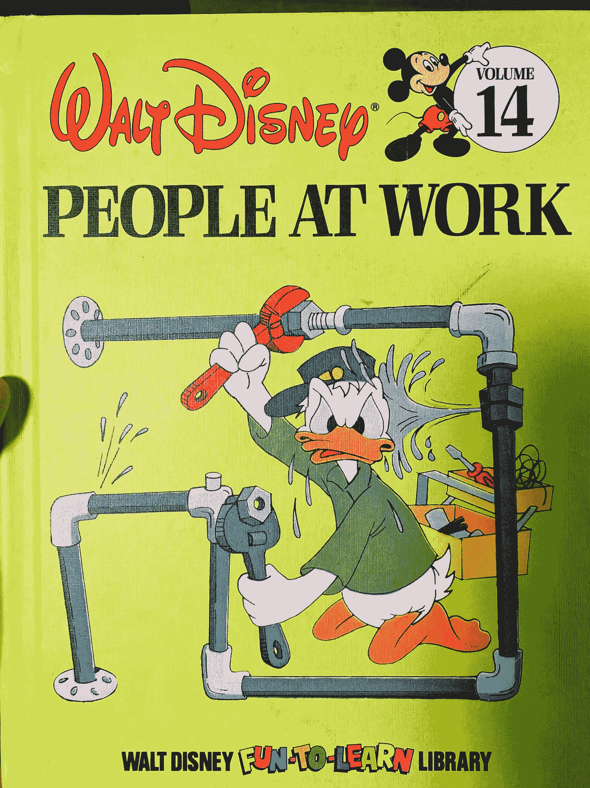
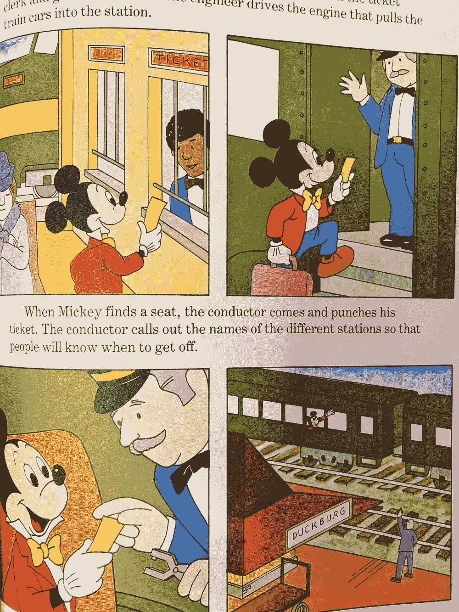
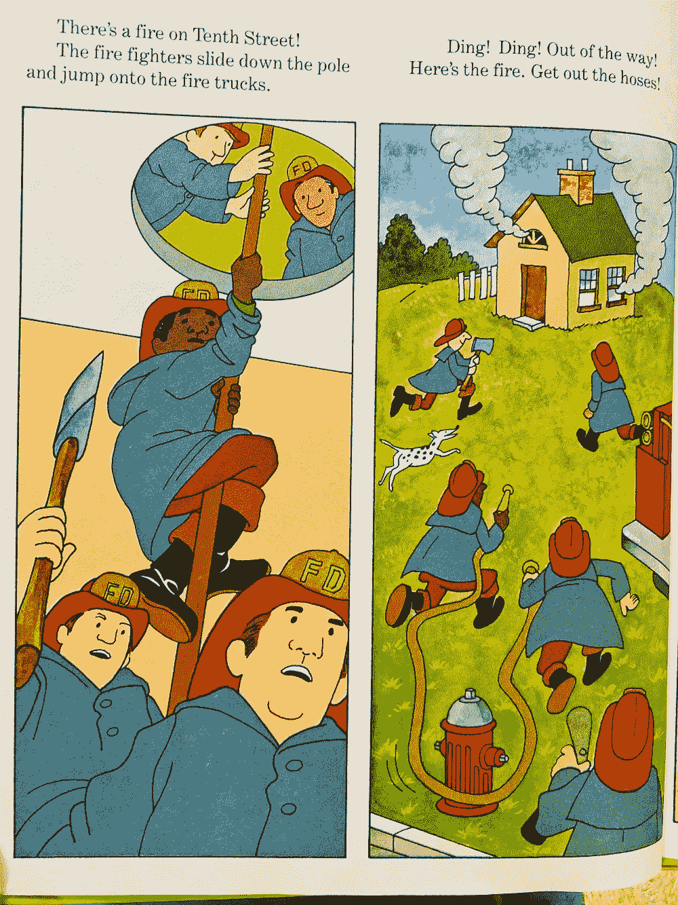
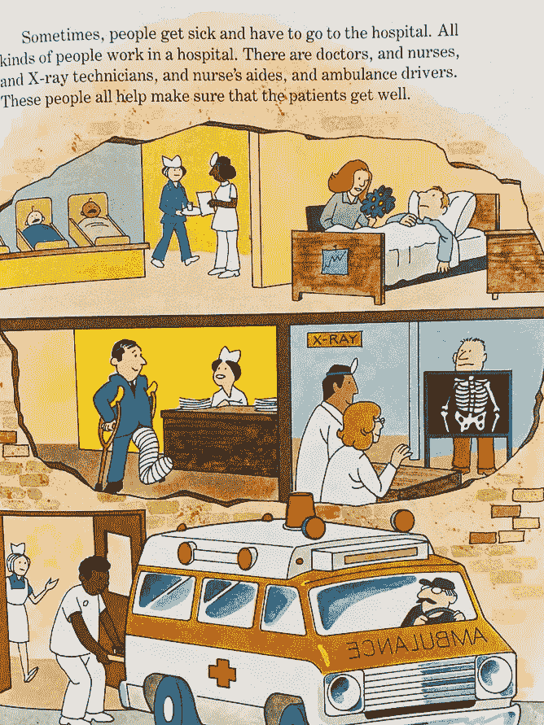
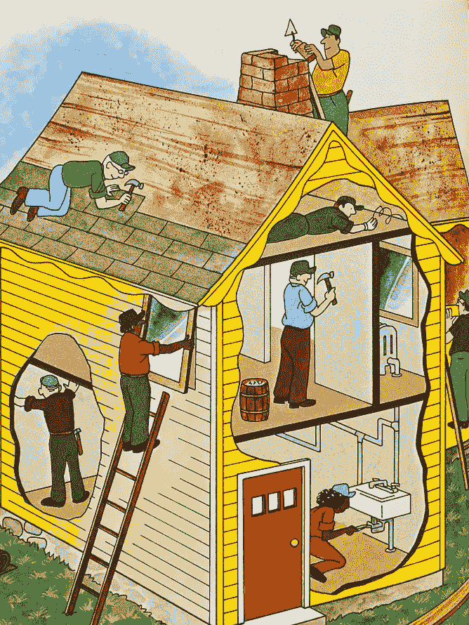
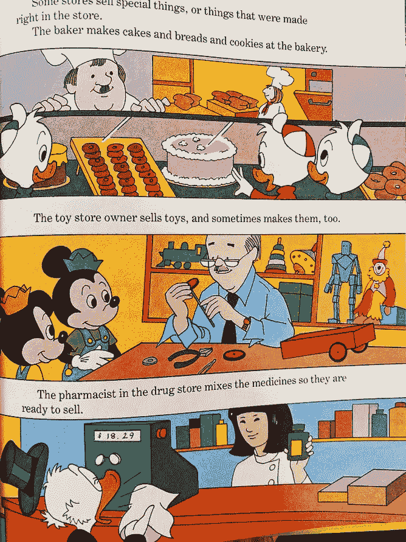
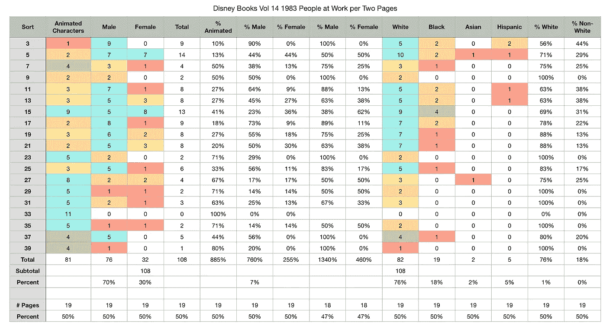
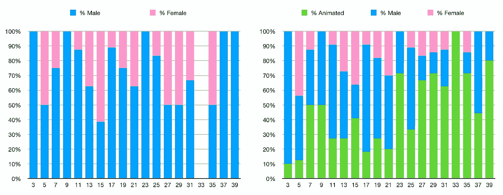
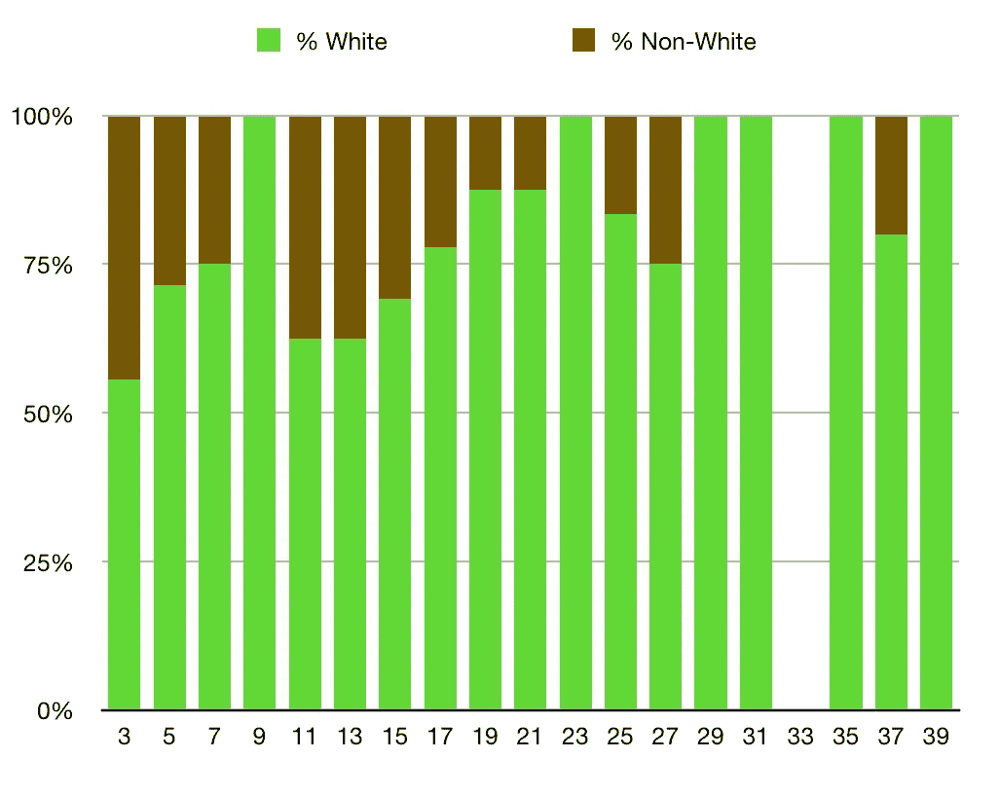

# 1983 年的一部迪士尼书中女性形象的不足

> 原文：<https://towardsdatascience.com/the-under-representation-of-women-in-a-disney-book-from-1983-38d27b9e6ce8?source=collection_archive---------50----------------------->

## 利用旧数据理解性别和种族规范是如何变化的

我偶然发现了这本书，是 20 世纪 80 年代早期的，我的儿子想读这本书。当我们读它的时候，我想到了性别和种族歧视，特别是它是如何系统化的。迪士尼总体上更进步，我认为这本书可能是一个有趣的时间胶囊，因为年轻时读过这本书的人是千禧一代。

图像是作为原始作品的照片拍摄的，这些图像归作者所有。

所以我浏览了每一页，记录了每一页上的人。我用性别、种族和米奇这样的迪斯尼人物来编码。

我没有按工作类型编码，但是看到人们在不同职业中的分布确实很有趣。我认为没有足够的数据来清楚地了解按职位等级划分的人口统计数据。

最终，女性代表性不足可以用书名来概括:工作中的人们。在 20 世纪 80 年代，家庭主妇不被认为是一份工作。在 20 世纪 80 年代，只有 50%的女性加入了劳动力大军。我查看了每页的信息，但随后将其压缩到每两页，因为许多单页缺乏足够好的数据样本。

我们可以看看男性和女性分布的图表，女性只出现在三分之一的时间里。在第 33 页，全是动画角色。

对于多样性，没有太多。在非白种人中，大多数是黑人。即使在那时，页面上 75%的人是白人。然而，人们应该注意到，1980 年白人占美国人口的 83%。因此，这并不太不公平，而且与当时的其他作品相比，这很有可能是进步的。现在肯定不会了。

考虑到当时美国的年份和种族构成，这本书出人意料地代表了有色人种。女性的代表性肯定不足，考虑到当时只有一半的女性在工作，我不确定这是否公平。我想我预料会有更多的种族主义和性别偏见，我很好奇这本书现在会怎么写。

总的来说，这本书是一次有趣的回到过去的冒险。我希望当我的孩子们回头看他们小时候读过的书时，他们能够看到社会取得的进步，就像我从这本书的回顾中看到的一样。

如果你愿意，可以在 Twitter 和 YouTube 上关注我，我会在那里发布不同机器上的浓缩咖啡视频和浓缩咖啡相关的东西。你也可以在 [LinkedIn](https://www.linkedin.com/in/robert-mckeon-aloe-01581595?source=post_page---------------------------) 上找到我。也可以关注我[中](http://medium.com/@rmckeon/follow)。

# 我的进一步阅读:

[做黑人的命也是命？警察暴力的统计分析](/@rmckeon/do-black-lives-matter-do-white-lives-matter-e49948d0ffd3)

我不是种族主义者！我只是受益于种族歧视

[取笑迪克和简的微妙种族歧视](https://link.medium.com/MESP3LZFhbb)