# 艾萨克·牛顿的独特天才

> 原文：<https://towardsdatascience.com/the-unique-genius-of-isaac-newton-c7f7a8ad73a1?source=collection_archive---------9----------------------->

## 一个著名数学结果的漂亮证明

图片来自[维基百科](https://en.wikipedia.org/wiki/Woolsthorpe_Manor)。

艾萨克·牛顿(1642-1727)是有史以来最有影响力的思想家之一。他对科学最重要的贡献是他的书《T2 哲学自然数学原理》，出版于 1687 年，在那里他阐述了著名的三大运动定律和引力定律，统治了科学界 200 多年。用著名天体物理学家、诺贝尔奖获得者[Subrahmanyan**Chandrasekhar**](https://en.wikipedia.org/wiki/Subrahmanyan_Chandrasekhar)**的话说:**

> **只有当我们观察牛顿成就的规模时，有时与其他科学家进行的比较才显得对牛顿和其他人都不合适。**
> 
> **钱德拉塞卡尔**

**在数学方面，牛顿"明显地推进了后来研究的数学的每一个分支"，但是他最著名的两个发现是广义二项式展开和微积分。**

**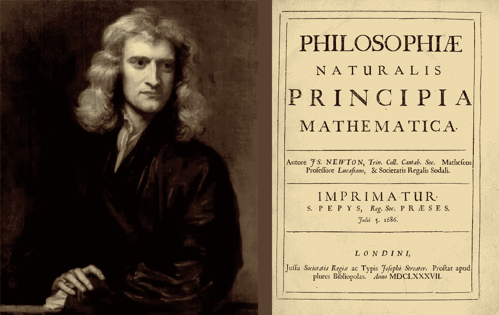**

**图 1:左边是牛顿 46 岁时的肖像，由 17 世纪末 18 世纪初英国主要肖像画家 [Godfrey Kneller](https://en.wikipedia.org/wiki/Godfrey_Kneller) 所作[来源](https://en.wikipedia.org/wiki/Isaac_Newton)。右边是《原理》第一版的扉页([来源](https://en.wikipedia.org/wiki/Philosophi%C3%A6_Naturalis_Principia_Mathematica))。**

**在本文中，我的重点将是牛顿早期的数学成就。我将描述他对广义二项式展开的推导，以及他如何应用它来获得正弦函数的幂级数展开。根据德里克·怀特塞德，[认为](https://arquivo.pt/wayback/20090714064823/http://www.hps.cam.ac.uk/news/whiteside.html)是“他那一代最重要的数学史家”，这是正弦(和余弦)的幂级数第一次出现在欧洲。**

# **牛顿广义二项式展开**

**牛顿的数学创新是多方面的。但可以说，他的起点是所谓的[广义二项式展开](https://en.wikipedia.org/wiki/Binomial_theorem#Newton%27s_generalized_binomial_theorem)(更多细节见 [Dunham](https://books.google.com.br/books?id=Wj9hDwAAQBAJ&dq=calculus+gallery) )的发现，这首次出现(连同牛顿在微积分方面的一些工作)于 1676 年他发给 Gottfried Leibniz 的一封信中。这封信被称为他的 e *pistola prior。***

**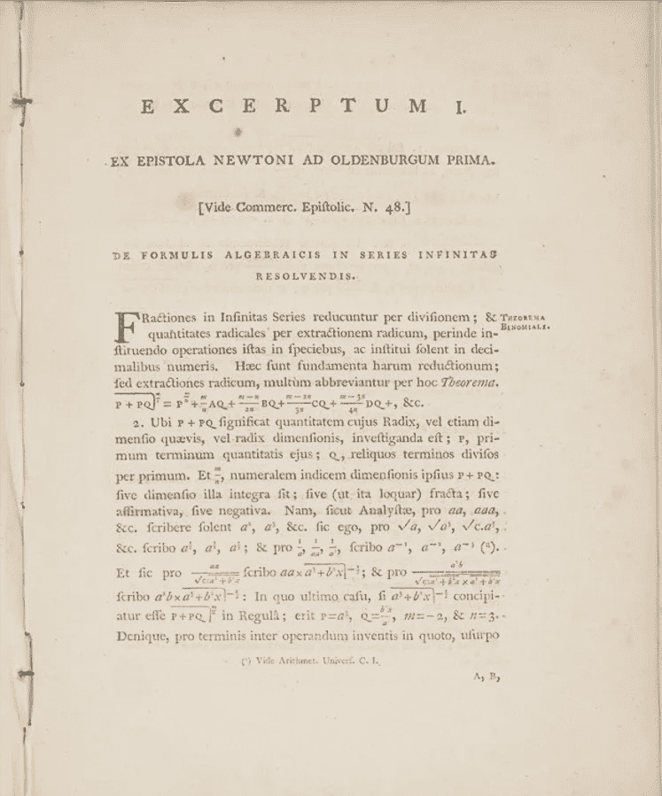**

**图 2:之前的*书信，*牛顿写给莱布尼茨的信，信中描述了他的广义二项式展开的发现，这发生在很多年前([来源](https://www.maa.org/book/export/html/116901))。**

****牛顿原记法中的二项式展开** 在牛顿的记法中，展开式表示为:**

**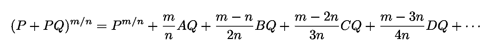**

**等式 1:牛顿使用他的符号的二项式展开。**

**在这个表达式中， *A* 、 *B* 、 *C* 、 *D* 、……代表系列的前几项:**

**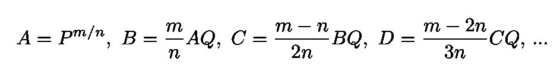**

**等式 2:在牛顿的原记法中， *A* ， *B* ，…代表级数的前几项。**

**牛顿在*书信*中给出的例子是:**

**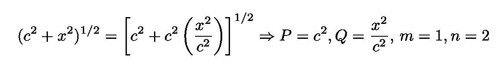**

**等式 3:牛顿在他的书信中给出的例子。**

**扩展的前两项是:**

**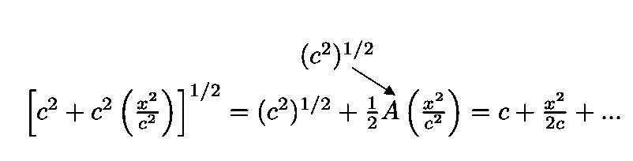**

**依赖于前一项 *B* 的第三项类似地获得:**

**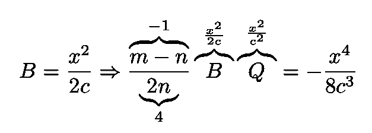**

**该过程然后可以无限地继续*。结果是:***

***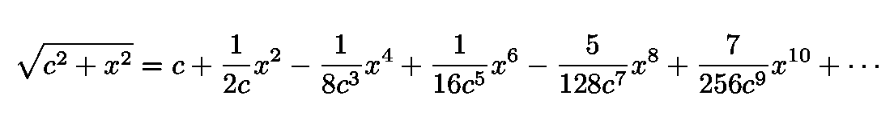***

*****获得现代符号** 我们可以很容易地用现代符号写出二项式展开式。我们首先从等式的左边分解出 *P* 项。1 并将 *A* 、 *B* 、 *C* 、 *D、…* 替换为相应的先前术语(见等式。2):***

***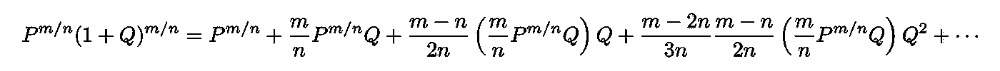***

***取消 *P* 项，并将分子中的系数除以分母中的因子 *n* ，我们得到:***

***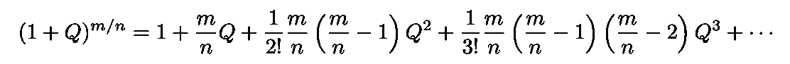***

***我们可以用[二项式系数](https://en.wikipedia.org/wiki/Binomial_coefficient)改写这个表达式。为了方便起见，我们将 *m* / *n* 重命名为 *m* ，并应用阶乘的性质将展开式的系数重写为:***

***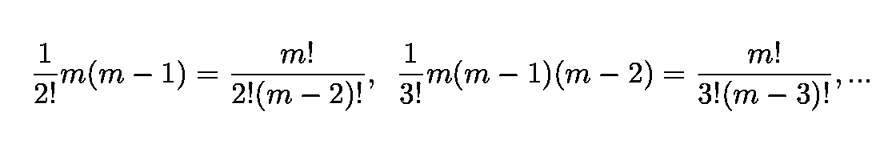***

***使用二项式系数的标准符号:***

***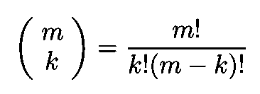***

***我们得到现代形式的二项式展开式:***

***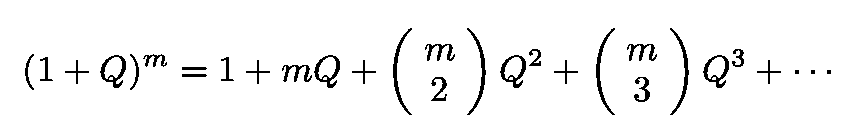***

***等式 4:用现代符号写出的二项式展开。***

# ***牛顿如何导出二项式展开式***

***从英国数学家约翰·沃利斯和其他人之前的工作中，牛顿知道如何对整数指数进行二项式展开:***

******

***等式 5:在牛顿之前已知的整数指数的二项式展开式。***

***这些系数有趣的可视化显示在下面的图 3 中。***

***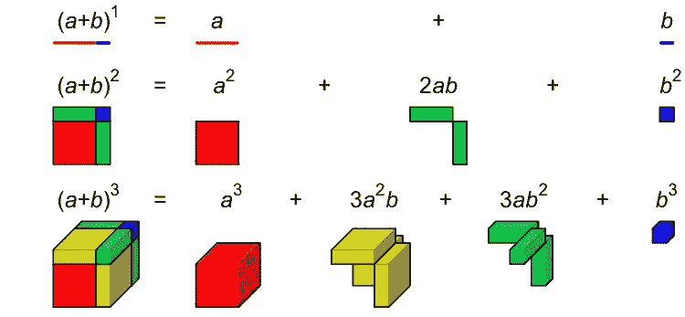***

***图 3:指数 1、2 和 3 的二项式展开的可视化([来源](https://en.wikipedia.org/wiki/Binomial_coefficient))。***

***牛顿的目标是扩展方程式。5 为了包括跟随在 [Bressoud](https://www.macalester.edu/aratra/edition2/chapt2.html) 之后的指数 *m.* 的非整数值，我们可以在一个表中安排系数，包括用于展开具有非整数值 *m* 的空行:***

******

***图 4:牛顿之前已知的二项式展开的系数表。***

***牛顿想让到填充这个表格中的空单元格*。他的推理如下。****

***第一列和第二列不难猜。第一个只包含 1，第二个随着 m 线性增加***

***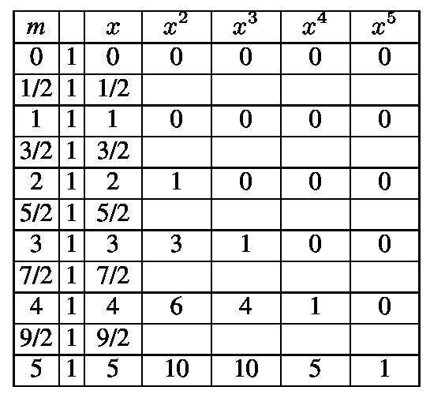***

***图 5:第一列和第二列的空白单元格被填充的二项式展开系数的原始表格。***

***现在让我们考虑第三列。首先，我们注意到它只包含[个三角形数字](https://en.wikipedia.org/wiki/Triangular_number)(见下面的图 6)，这可以使用简单的公式获得:***

***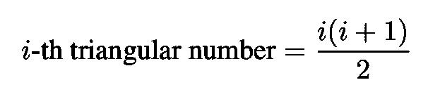***

***等式 6:第 I 个三角数的公式。***

******

***图 6:三角数示例([来源](https://en.wikipedia.org/wiki/Triangular_number))。***

***我们还注意到第 *m* 行总是包含第( *m-* 1)个三角数。更具体地说， *m* =2 行包含第**第**个三角数， *m* =3 行包含第**第二**个三角数， *m* =5 行包含第**第四**个三角数。在等式中代入( *m-* 1)。6 我们得到:***

***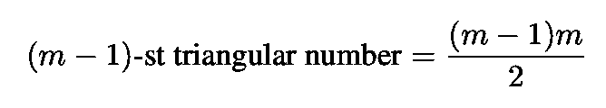***

***等式 7:第三列中的值对 m 的依赖性。***

***然后我们可以完成第三列:***

***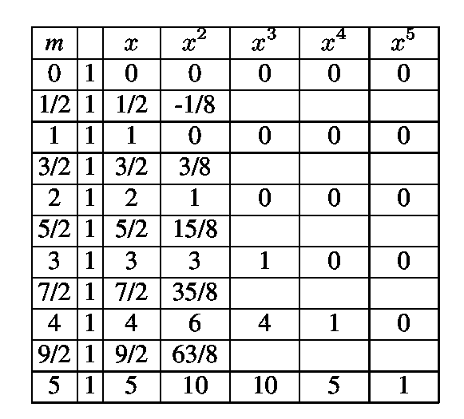***

***图 7:前三列完成的二项式展开的系数表。***

***现在，请注意，对于前三列，值是多项式增加的。***

*   ***第一列是常数(零阶多项式)***
*   ***第二列线性增加(一次多项式)***
*   ***第三列根据等式二次增加。7(二次多项式)***

***基于这种模式，牛顿推断第四列应该作为三次多项式增加。由于这个未知的多项式在 *m* = 0，1 和 2 时消失，所以它必须具有以下形式:***

***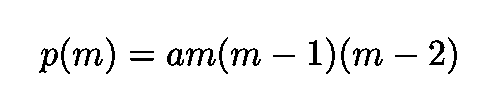***

***其中常数 *a* 可以例如使用表的第七行来获得，根据该表 *p* (3)=1。因此:***

***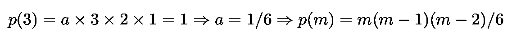***

***然后，我们可以填充第四列的空白单元格:***

******

***图 8:填充了前四列的二项式展开的系数。***

***牛顿的过程现在清楚了。可以快速得到第五列和第六列对 *m* 的依赖关系:***

***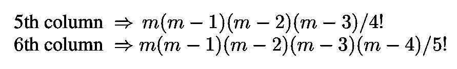***

***我们终于可以填满整张桌子了:***

******

***图 9:包含 x 的五次方二项式展开系数的表格。***

***将军接着表述道:***

******

***等式 7:牛顿二项式展开。***

***(其中使用了之前看到的二项式系数公式)。我们应该注意到，引用[怀特塞德](https://en.wikipedia.org/wiki/Tom_Whiteside)的话:***

> ***自相矛盾的是，这样的沃利斯插值程序，无论多么合理，都不能作为证明，牛顿数学方法的核心原则缺乏任何严格的证明。。。当然，二项式定理非常有效，这对 17 世纪的数学家来说已经足够了。”***
> 
> ***— D .怀特塞德***

# ***推导正弦幂级数的幂级数***

***在他 1669 年的手稿“[中，正弦函数“](http://www.newtonproject.ox.ac.uk/view/texts/normalized/NATP00204)[的幂级数的推导为【牛顿】的精湛表现](https://www.britannica.com/topic/Newton-and-Infinite-Series-1368282)”加冕。***

***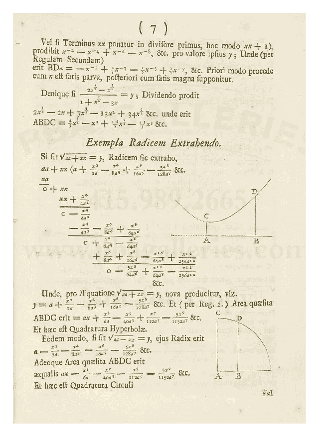***

***图 10:一页牛顿 1669 年的手稿“关于用含有无穷多项的方程进行分析”([来源](https://books.google.com.br/books?id=VTgPAAAAQAAJ&printsec=frontcover&source=gbs_ge_summary_r&redir_esc=y#v=onepage&q&f=false))。***

***理解牛顿推导所需的所有元素都包含在下面的图 10 中(基于[邓纳姆](https://books.google.com.br/books?id=Wj9hDwAAQBAJ&dq=calculus+gallery))，这是一个函数图***

***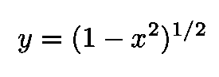***

***方程式 8:单位半径圆的右上象限的方程式。***

***它描绘了半径为单位的圆的(一个[象限](https://en.wikipedia.org/wiki/Circular_sector#Quadrant))。***

***圆弧 *αD* 等于 *z* (圆的半径为 1)，从图 10 中我们得到:***

***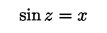***

***等式 9:由于圆有单位半径，所以角度 z 的正弦等于横坐标 x。***

***因此，目标是确定 *x* (作为 *z* 上的幂级数)。***

***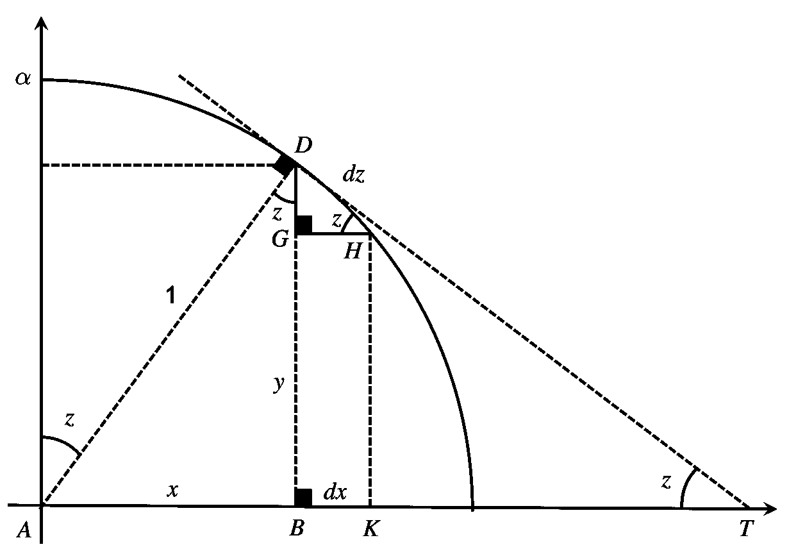***

***图 10:Eq 的绘图。8 包括获得正弦函数的功率扩展所需的所有元素(图改编自 [Dunham](https://books.google.com.br/books?id=Wj9hDwAAQBAJ&dq=calculus+gallery) )。***

***三角形 DGH 和 DBT 是相似的。由于三角形 ABD 和 DBT 也相似，我们得到:***

***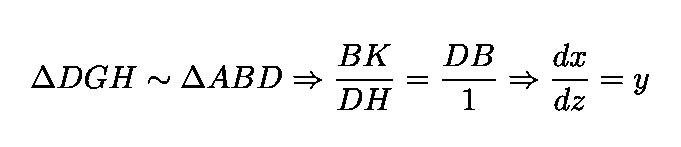***

***为了方便起见，这里使用了[莱布尼兹符号](https://en.wikipedia.org/wiki/Leibniz%27s_notation)。使用 Eq。8 这个表达式变成了:***

***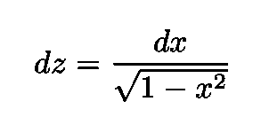***

***牛顿的下一步是将他的二项式展开应用到右边:***

***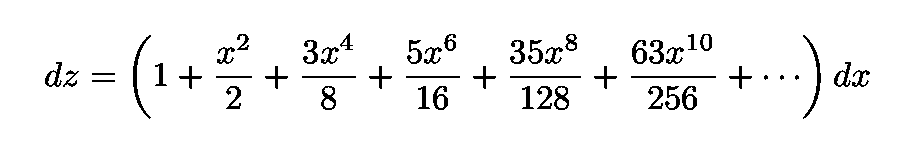***

***现在反转 Eq。9 为了获得*z*=*z*(*x*)= arcsin*x*，并对上面的二项式展开进行积分，得到:***

***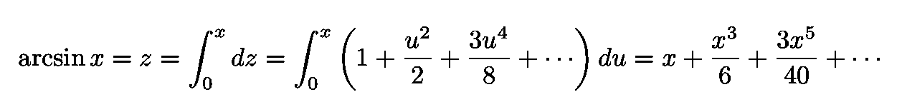***

***等式 10:反正弦级数。***

***注意，牛顿获得该表达式所需的唯一积分是对应于以下[反导数](https://en.wikipedia.org/wiki/Antiderivative)(或不定积分)的[定积分](https://en.wikipedia.org/wiki/Integral):***

***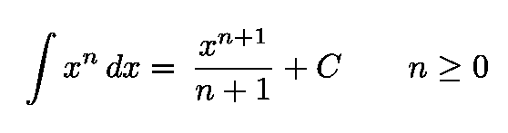***

***其中 *C* 是常数。***

***在他的最后一步，牛顿必须转换(或者更准确地说，反转)Eq。10 转换成正弦函数的展开式(而不是反正弦函数的展开式)。为此，他使用了他以前开发的许多工具中的一种，即他的幂级数求逆技术。***

## ***应用幂级数求逆得到 Sin z***

***待求逆的级数为等式中的 *z* ( *x* )。10，即:***

***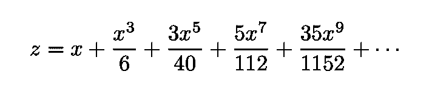***

***等式 11:要展开的系列。***

***换句话说，牛顿追求的是 *x* ( *z* )，就 *z* 而言的 *x* 的幂级数。遵循他的策略，我们从执行以下步骤开始:***

*   ***从第一项开始，在本例中为 *x* = *z****
*   ***将要导出的数列表示为*x*=*z*+*p****
*   ***将*x*=*z*+*p*代入等式。11***
*   ***仅保留 *p* 中的线性项，根据 *z* 对结果进行反演，得到 *p****

*****更具体地应用策略** ，让我们把这个系列写成:***

***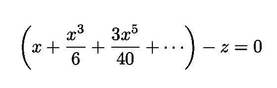***

***等式 12:等式 11 中各项的重新排列。***

***(参见[邓纳姆](https://books.google.com.br/books?id=Wj9hDwAAQBAJ&dq=calculus+gallery))。下一步是只保留 *x:* 中的线性项***

***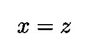***

***方程式 13:膨胀的线性近似。***

***为了说明所有被删除的项，牛顿接着用一个未知的级数 *p* 写出 *x* :***

***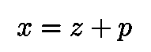***

***等式 14:引入未知的级数 p，以说明线性近似中丢弃的项。***

***并将其代入等式。12:***

***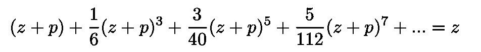***

***等式 15:原始系列设置 x = z+p。***

***扩展这个表达式并将 *p、*的幂分组，他得到:***

***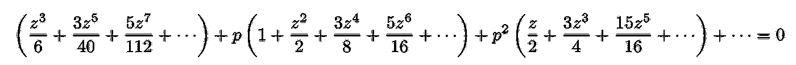***

***等式 16:对扩展等式进行分组。15 的 p 次方。***

***牛顿然后去掉幂大于 1 的项，并求解 p:***

***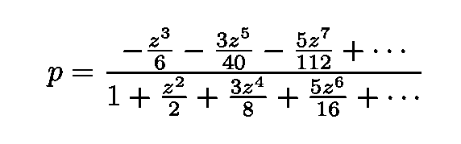***

***等式 17:去掉等式中幂大于 1 的项后得到的表达式。16 和求解 p。***

***牛顿只保留分子的第一项，并考虑到被删除的项，引入了一个新的待定序列 *q* ，定义如下:***

***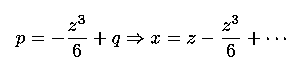***

***为了确定 *q* ，牛顿将这个新的 *p* 代入等式。16，只保留 *q* 和中的线性项，为 *q* 求解。这给出了一个类似于等式的表达式。17(用于 *p* )。然后，他再次只保留分子中度数最低的项，得到:***

***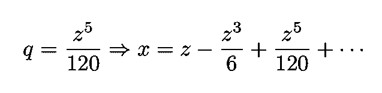***

***该程序可以无限期地执行*。*现在从 Eq。9， *x* = sin *z* ，他最终得出了正弦函数的如下表达式:***

***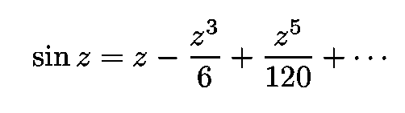***

***等式 18:正弦函数的幂级数展开，最高可达 5 阶。按照牛顿的策略，其他项可以很容易地得到。***

***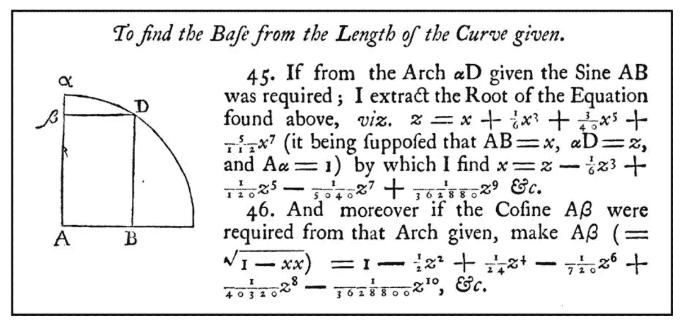***

***图 11:牛顿 1669 年对正弦和余弦函数幂级数的演示。***

***这个结果可以通过[泰勒级数](https://en.wikipedia.org/wiki/Taylor_series)在今天得到。然而，牛顿做这件事的方式完全不同。正如[中提到的，邓纳姆](https://books.google.com.br/books?id=Wj9hDwAAQBAJ&dq=calculus+gallery)的推导“提醒我们，数学不一定以今天教科书的方式进化。相反，它是在断断续续和奇怪的惊喜中发展起来的。”***

***我的 [Github](https://github.com/marcotav) 和个人网站 [www.marcotavora.me](https://marcotavora.me/) 有一些其他有趣的材料，既有关于理论物理的，也有关于数据科学和金融等其他主题的。看看他们！***