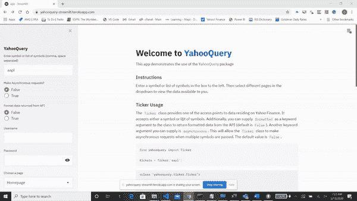

# (非官方的)雅虎财经 API

> 原文：<https://towardsdatascience.com/the-unofficial-yahoo-finance-api-32dcf5d53df?source=collection_archive---------5----------------------->

## 一个 Python 接口，可以处理无限量的数据


肖恩·波洛克在 Unsplash[上的照片](https://unsplash.com?utm_source=medium&utm_medium=referral)

## 背景

我在金融服务行业担任数据分析经理。我的职责是支持我的组织满足任何与数据相关的需求。我们正在做的一个项目是一个非常依赖财务数据的内部应用程序；我的工作是找到提供相关数据的方法。

## 走运了

如果你在互联网上搜索足够长的时间，你将能够找到让你达到(或部分达到)目标的解决方案。我玩了一下 [IEX 云](http://iexcloud.io)、 [Quandl](https://www.quandl.com/) 和其他一些服务，它们都很棒，但不免费。所以，像任何寻找解决方案的开发者一样，我开始搜索 StackOverflow。我经常看到[雅虎财经](http://finance.yahoo.com)作为一个可能的解决方案，尽管下面的注释位于[雅虎财经](https://stackoverflow.com/questions/tagged/yahoo-finance?tab=Newest)搜索结果页面的顶部:

> 请注意:这个 API 已经被雅虎终止。雅虎！金融是雅虎的一项服务！提供金融信息。它是美国顶级的金融新闻和研究网站。

不过，看起来人们仍然在使用这项服务，要么是通过网络抓取，要么是通过你只能通过搜索 XHR 请求才能找到的网址。我知道我不想要网络抓取解决方案，所以我开始在 Chrome 的开发者工具中搜索网络标签，寻找任何类似数据的东西。幸运的是，我偶然发现了一些。

## 包: [YahooQuery](https://github.com/dpguthrie/yahooquery)

```
pip install **yahooquery**
```

该包提供了三个不同的类，可以高效快速地检索您可以通过前端查看的数据。可以检索大部分数据的主类是`Ticker`类。

## 心脏

很简单，对吧？只需传递一个符号或符号列表，就可以通过雅虎财经检索大部分可用数据。不过，在我们继续之前，重要的是要知道您可以提供额外的关键字参数来修改某些行为:

*   `asynchronous, default False, optional`:当设置为`True`时，对雅虎财经的请求将异步进行。*只有在使用多个符号时才有必要。*
*   `backoff_factor, default 0.3, optional`:第二次尝试后，在两次尝试之间应用的系数，以秒为单位。例如，如果补偿因子是 0.1，那么`sleep()`将在重试之间休眠[0.0s，0.2s，0.4s，…]
*   `country, default United States, optional`:更改每个请求用作查询参数的语言、地区和域名。*这个功能还没有经过彻底的测试，但是当使用* `news` *方法时，你会看到不同之处。将返回该国家特定语言的数据。*
*   `formatted, default False, optional`:当`formatted=True`时，来自 API 的大部分数值数据将以字典的形式返回:

```
"totalCash": {
    "raw": 94051000320,
    "fmt": "94.05B",
    "longFmt": "94,051,000,320"
}
```

*   `max_workers, default 8, optional`:定义用于发出异步请求的工作线程数量。*这仅在*和`asynchronous=True`时相关
*   `proxies, default None, optional`:用代理发出每个请求。只需传递一个字典，将 URL 方案映射到代理的 URL。您还可以通过设置环境变量`HTTP_PROXY`和`HTTPS_PROXY`来配置代理。
*   `retry, default 5, optional`:重试失败请求的次数。
*   `status_forcelist, default [429, 500, 502, 503, 504], optional`:我们应该强制重试的一组整数 HTTP 状态码。
*   `timeout, default 5, optional`:给定秒数后停止等待响应。
*   `user_agent, random selection, optional`:浏览器的用户代理字符串，在每个请求的头中发送。
*   `validate, default False, optional`:在实例化过程中验证符号的存在。无效符号将被删除，但您可以通过`invalid_symbols`属性查看它们。
*   `verify, default True, optional`:布尔值，在这种情况下，它控制我们是否验证服务器的 TLS 证书，或者字符串，在这种情况下，它必须是要使用的 CA 包的路径。
*   `username`和`password`:如果你订阅了雅虎财经高级版，通过你的`username`和`password`。您将登录，现在可以访问高级属性/方法。所有高级属性/方法都以`p_`开头。**禁用双因素身份验证以使其工作。**

Ticker 类可以分为几个不同的类别:模块、选项、历史定价和溢价数据。

## 模块

这些模块(通常)对应于 Yahoo Finance 前端的一个选项卡或各个选项卡中的数据。例如，要从“Summary”选项卡中检索数据，可以使用`Ticker`类的`summary_detail`属性。



或者在“Statistics”选项卡中查找数据，可以使用属性`valuation_measures`和`key_stats`。

## 选择

所有选项的到期日期都可以用一个简单的命令行程序检索到:

```
faang = Ticker('fb aapl amzn nflx goog', asynchronous=True)
options = faang.option_chain
```

变量`options`将是一个熊猫数据帧。数据帧将包含由符号、到期日和期权类型(看跌或看涨)组成的多重指数。

## 历史定价


[M. B. M.](https://unsplash.com/@m_b_m?utm_source=medium&utm_medium=referral) 在 [Unsplash](https://unsplash.com?utm_source=medium&utm_medium=referral) 上拍摄的照片

这个非常简单:检索一个符号或符号列表的历史 OHLC 数据:

```
faang = Ticker('fb aapl amzn nflx goog', asynchronous=True)
history = faang.history()
```

上面的代码将返回每日的 YTD 数据。但是，可以向该方法提供其他参数:

```
yahooquery.ticker.**history**(self, period='ytd', interval='1d', start=None, end=None)Historical pricing dataPulls historical pricing data for a given symbol(s)**Parameters** 
---------- 
**period**: str, default ytd, optional
    Length of time**interval**: str, default 1d, optional
    Time between data points**start**: str or datetime.datetime, default None, optional
    Specify a starting point to pull data from.  Can be expressed as           a string with the format YYYY-MM-DD or as a datetime object **end**: str of datetime.datetime, default None, optional
    Specify a ending point to pull data from.  Can be expressed as a         string with the format YYYY-MM-DD or as a datetime object.**adj_timezone:** bool, default True, optional
    Specify whether or not to apply the GMT offset to the timestamp received from the API. If True, the datetimeindex will be adjusted to the specified ticker's timezone.**adj_ohlc:** bool, default False, optional
    Calculates an adjusted open, high, low and close prices according to split and dividend information**Returns** 
-------
pandas.DataFrame
    historical pricing data
```

## 优质数据

还可以为 Yahoo Finance Premium 订户检索数据。这个包利用 Selenium，特别是 chromedriver 登录雅虎财经。登录后，用户将能够利用高级方法和属性来检索数据。

## 与 yfinance 的比较

yahooquery 的另一种选择是 yfinance。这是一个软件包，提供类似的功能，从雅虎财经检索数据。目前，它在 GitHub 上有近 2500 颗星，这是从雅虎财经搜索提供数据检索的 python 包时的最高数量。那么，为什么应该使用 yahooquery 而不是 yfinance 呢？

*   **维护:** yfinance 似乎没有在创建 forks 的外部开发者之外进行维护。
*   **固执己见:**在 yfinance 中，除了一对夫妇，每个属性调用都会调用相同的私有方法，`_get_fundamentals`。这意味着用户必须检索所有可能的数据，即使他们只对一件事感兴趣。但是，另一方面，使用该私有方法的每个后续调用几乎不需要花费时间，因为数据已经存储在 Ticker 实例中。
*   **数据来源** : yfinance 通过抓取每个 Ticker 页面中的一个 javascript 变量来检索大部分数据(历史定价和期权之外的数据)。Yahooquery 为用户可用的每个属性/方法使用 API 端点。
*   **准确性**:损益表、资产负债表和现金流量表使用不同的端点。yahooquery 中使用的方法可以检索更多数据，并且在查看美国以外的公司时是准确的。
*   **简单:**从检索多个符号的历史价格返回的数据帧在 yahooquery 中是长格式，而在 yfinance 中是宽格式。
*   **配置:**关键字参数允许很多不同的配置。此外，异步请求在整个库中都是可用的，而不仅仅是像 yfinance 这样的历史定价。
*   **更快:**不同的例子见下面的 Jupyter 笔记本。

## 更多信息

*   查看文档以深入了解软件包的使用

 [## yahooquery

### 非官方雅虎财经 API 文档的 Python 包装:https://yahooquery.dpguthrie.com 互动演示…

yahooquery.dpguthrie.com](https://yahooquery.dpguthrie.com) 

*   查看 GitHub 上的源代码

[](https://github.com/dpguthrie/yahooquery) [## dpguthrie/yahooquery

### 非官方雅虎财经 API 文档的 Python 包装:https://yahooquery.dpguthrie.com 互动演示…

github.com](https://github.com/dpguthrie/yahooquery) 

*   观看 Heroku 上的互动演示
*   如果您有任何问题、意见或改进方案的方法，请联系我们