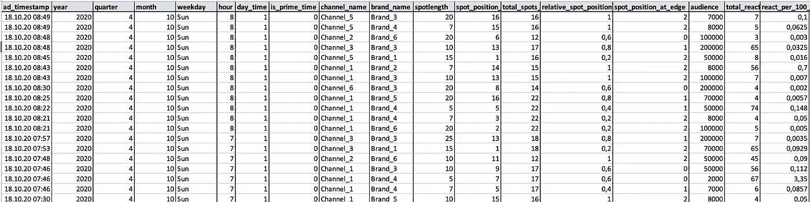
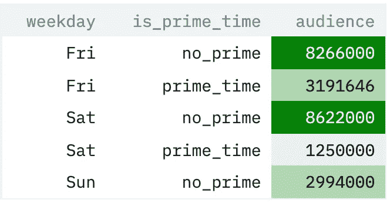
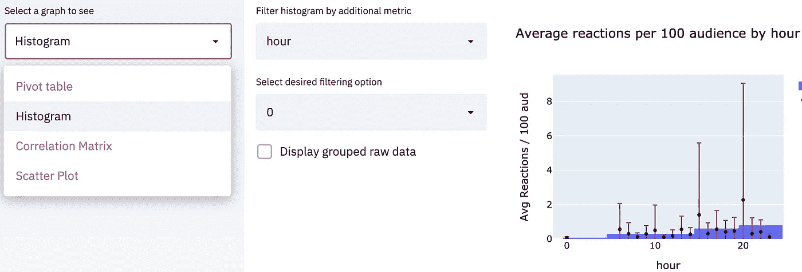
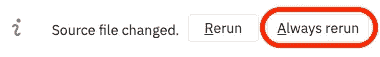

# 令人不快的数据探索工作

> 原文：<https://towardsdatascience.com/the-unpleasant-work-of-data-exploration-e9dde7180f5c?source=collection_archive---------46----------------------->

## 如何使用 streamlit 在最小化工作量的同时最大化效果

作者图片

每个从事数据科学项目的人都知道，在数据被扔进听起来很花哨的算法或产生输出的黑盒模型之前，需要做的工作得不到任何认可是多么艰难。

尽管我们都希望现实生活中的数据科学是将算法和神经网络应用于完美聚合的数据源，但我们都知道这远非事实。

最令人沮丧的是，在收集、清理、探索和丰富原始数据的整个过程中，我们的工作没有得到任何认可。原因如下:一旦你深入挖掘数据中隐藏的宝石，没人知道你办公桌上发生的事情有多复杂。但是，当我们在建立了最初的项目计划之后所分享的只是最终的产出时，我们又有什么资格去责备他们呢？

因此，不要把自己锁在房间里，把第一手的见解留给自己，而是挑战自己，努力与周围的人分享这些见解。不要准备一完成就过时的演示幻灯片，而是让这些见解随时可用。现在最好的部分来了:你不需要学习一门新的语言，获得一个昂贵的执照，或者雇佣一个分析师。您需要的一切触手可及。Python 和易于安装的开源库简化了 it，使您无需成为全栈开发人员即可构建应用程序。

# 深入 streamlit 代码

所以让我们开始吧。

对于所有从未使用过 streamlit 的人:不要害怕！它很容易上手，语法与您已经熟悉的语法没有太大的不同。

所有代码都可以在[*https://github . com/charlottevitner/streamlit _ data _ exploration*](https://github.com/charlotteveitner/streamlit_data_exploration)*资源库中找到。*

*我们使用的是一个样本数据集，其中包含不同品牌在电视上播放的广告片段的信息，这些信息会导致网站访问(这里称为反应)。所提供的数据集包含随机信息，其目的只是为了可视化探索性分析的设置。*

**

*提取包含必要列的原始数据集，以运行 streamlit 应用程序。*

*我们想用这个数据集回答的问题是:*是什么推动了一个电视广告的成功？是播放广告的频道，是一天中播放广告的时间，是不是黄金时间，或者是广告的长度？**

*该项目的最终目标是能够预测特定地点的最佳设置，以最大限度地取得成功。但是，要构建一个可用于进行此类预测分析的模型和设置，我们需要从头到尾了解数据，这就是 streamlit 发挥作用的地方。*

*仅使用 python 脚本来构建仪表板是每个数据科学家的梦想。不需要记住 excel 公式或弄清楚如何使用最新的商务智能工具。通过灵活地对数据进行探索性分析，您不仅使自己的生活变得更加轻松。但是你也要让参与项目的每个人都能看到你的分析。这样你可以让每个人都在同一条船上，并且额外创造一些视觉上足够愉悦的东西，让你的探索工作得到认可。听起来像是双赢。*

*现在让我们看看 streamlit 到底是什么。*

*发布的代码托管在 streamlit 服务器上。您可以通过以下网址访问仪表板:[https://share . streamlit . io/Charlotte veitner/streamlit _ data _ exploration/main/streamlit _ main . py](https://share.streamlit.io/charlotteveitner/streamlit_data_exploration/main/streamlit_main.py)*

*在深入研究代码之前，我将简要介绍一下 streamlit 应用程序的功能。*

*目标是理解我们正在处理的数据，并在我们的数据集中找到相关性和因果关系。我们希望确定目标价值的最重要驱动因素。因此，我们使用一组探索性的图表。Streamlit 可以可视化 plotly 图形和 pandas 数据帧，这意味着没有太多的格式化工作要做。使用数据透视表、直方图、相关矩阵和散点图，我们可以在坚持使用一些最常见的可视化方法(从外部角度来看很容易理解)的同时，即时生成见解。看看下面的例子，看看创建一个数据透视表并在 streamlit 应用程序中显示它是多么容易。*

*代码的输出是应用程序中的数据透视表。*

**

*数据透视表函数的简化输出*

*在 streamlit 应用程序中，用户可以按时间段过滤原始数据集，甚至可以比较两个不同的时间段。通过下拉菜单，用户可以选择所需的可视化方法，然后提示用户对所选方法进行其他设置。*

*尝试样品组和不同的方法。即使有了这个不具代表性的数据集，您也会发现自己在探索该工具拥有的所有不同功能。这些数据没有真正的洞察力，但我仍然给你力量，我给你看原始数据，数据科学中平淡无奇的部分。您有机会建立自己的假设，并在应用程序的帮助下证明它们是错的还是对的。黄金时段播出的电视广告比非黄金时段播出的广告更成功——查看黄金时段的数据透视表，自己看吧。*

*脚本*streamlit _ helper . py*([https://github . com/Charlotte veitner/streamlit _ data _ exploration/blob/main/streamlit _ helper . py](https://github.com/charlotteveitner/streamlit_data_exploration/blob/main/streamlit_helper.py))包括五个重要的函数 *create_histogram、create _ correlation _ to _ target _ value、create_correlation_heatmap、*和 *create_scatter_plot* ，它们包含不同分析的聚合和可视化方法。根据用户在下拉菜单中的选择，调用不同的功能。*

*该代码在侧边栏上创建一个下拉菜单，并在主窗口中生成所选择的分析。*

**

*从下拉菜单中选择透视表时的输出*

**

*从下拉菜单中选择直方图时的输出*

# *成为你的*

*如果您想调整函数或使用您自己的数据进行分析，您必须对原始应用程序进行一些更改。将存储库克隆到您的本地机器，并通过将您的终端定向到该文件夹并输入执行命令"*streamlit run streamlit _ main . py "*来执行 streamlit 应用程序。*

*从在主脚本中更改应用程序的标题开始，检查您是否看到了更改。按下 streamlit 应用程序中的*始终重新运行*按钮，可以立即看到您在代码中所做的更改。*

**

*只要您对代码进行任何更改，应用程序的右上角就会出现一组按钮。*

*现在该应用程序是你的了。我为您提供了一组函数，可以很容易地将其更改为您自己的数据集。该应用程序只是为了概述使用 streamlit 的一些亮点。可视化和转换数据的机会是无限的，这取决于您的具体用例。*

# *探索是迈向最终产品的一步*

*最后 app 应该能贡献给原问题。在我们的例子中:一个成功的电视广告的驱动力是什么。你选择的图表和可视化应该有助于更好地理解原始问题的回答过程。该应用程序使您能够对数据集的构造和不同要素的影响有一个总体的了解，而无需将数据从 python 来回推送到 excel。可视化和数据源都可以很容易地丰富，而不必重建整个探索设置。*

*总的来说，构建一个 streamlit 应用程序有助于您了解您的数据，找到要素之间的因果关系和相关性，使您在数据科学项目中更进一步。*

*我不是想说发表你的数据探索胜过机器学习模型。我试图给你一个视角，告诉你如何让更多的人参与到了解数据的过程中，而不仅仅是你自己和你最亲密的工作伙伴。你不仅可以授权给别人，让他们觉得自己是旅程的一部分。你将创造一定程度的透明度，为他们信任你的工作打下基础。最重要的是，你会让作为数据科学家的不愉快部分——探索、清理和解释你的最终模型——变得更加愉快。*

*合著者:费利克斯·韦默勒，索伦·吕德斯*

*联系人:苏伦。Lueders@seven.one*