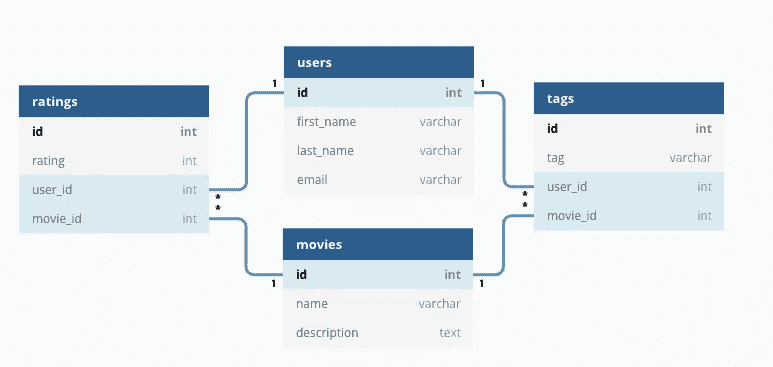
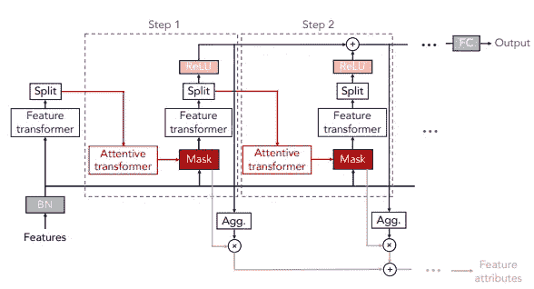
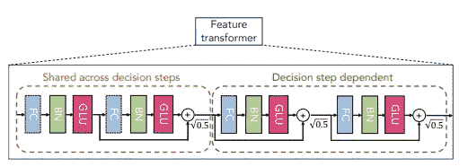
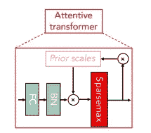
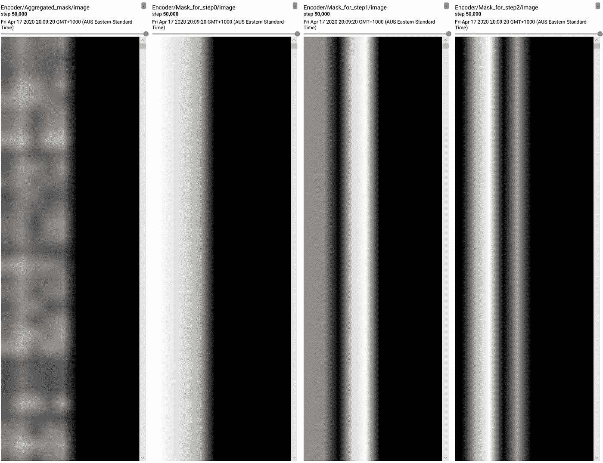
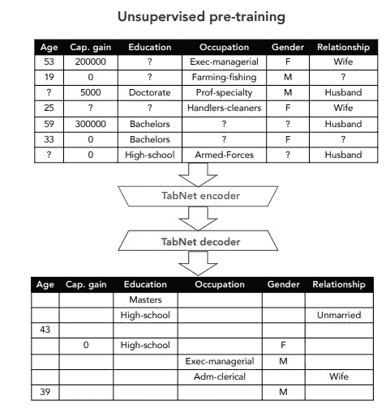
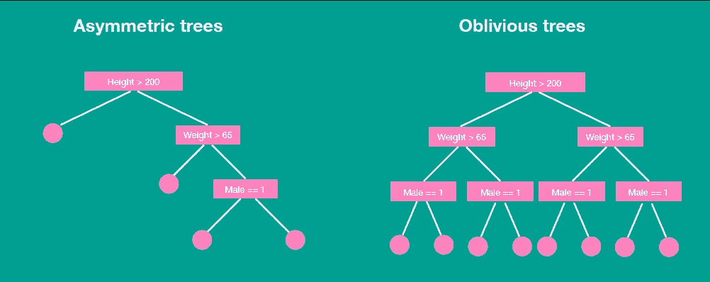
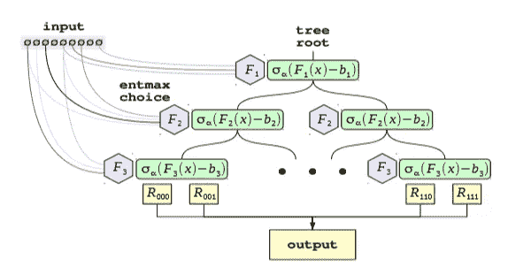
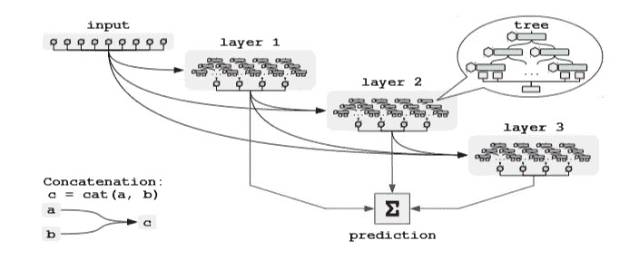

# 表格数据深度学习的不合理无效性

> 原文：<https://towardsdatascience.com/the-unreasonable-ineffectiveness-of-deep-learning-on-tabular-data-fd784ea29c33?source=collection_archive---------8----------------------->

## 深度学习

## 以及最近为解决其在表格数据上的不良性能所做的工作

来源:Alina Grubnyak 在 [Unsplash](https://unsplash.com/s/photos/network?utm_source=unsplash&utm_medium=referral&utm_content=creditCopyText) 上拍摄的照片

eep 神经网络已经在长期以来被认为是一项挑战的各个领域带来了突破。两个显著的例子是计算机视觉和自然语言处理(NLP)。

我们已经看到计算机视觉的快速发展，从 AlexNet 的[突破性发展开始，在 2012 年赢得了](https://qz.com/1307091/the-inside-story-of-how-ai-got-good-enough-to-dominate-silicon-valley/) [ImageNet](http://www.image-net.org/) 挑战赛。我们的 ResNet 在 2015 年首次在 ImageNet 基准数据集上实现了超人的准确性。然后，我们见证了 2014 年生成对抗网络(GANs)的诞生，以及最终导致今天来自 SyleGAN 的[栩栩如生的假人肖像的快速改进。](https://thispersondoesnotexist.com/)

在 NLP 中，深度神经网络模型现在是最先进的，在基准数据集上优于传统的机器学习算法。GPT-2 和 BERT⁴等型号是新的黄金标准。谷歌已经在 2019 年[在其搜索引擎](https://www.blog.google/products/search/search-language-understanding-bert/)中部署了 BERT，这是过去几年中其搜索引擎最大的一次更新。GPT-2 用于聊天机器人应用程序，以及一些有趣的方式，如一个流行的文本冒险游戏称为[人工智能地牢](https://aidungeon.io/)。用不了多久，这些解决方案就会在商业产品中变得司空见惯。

从这些突破中可以明显看出，深度神经网络已经接管了**非结构化**数据的领域。

> 深度学习的成功可以归结为利用这些数据中的 [**归纳偏差**](https://en.wikipedia.org/wiki/Inductive_bias) ，例如卷积神经网络情况下的空间相关性。

然而，似乎没有表格数据的深度学习等价物。

不管你喜不喜欢，除非你在一家从事信号处理应用或自然语言处理的公司工作，否则大多数数据都存在于关系数据库和 Excel 电子表格中。事实上，这种状况不会很快消失！

# 结构数据

来自关系数据库和电子表格的数据是**结构化**数据的例子。结构化数据**以表格结构**高度组织，允许对表列进行高效操作，如搜索和连接。通常为数据定义一个模式:每个属性都是名为的*，并且指定了其值*类型*，例如可以是字符串或整数。在每个模式中还分配了一个唯一的标识符。通常，为了执行一项任务，需要从几个数据库中提取数据，每个数据库都拥有自己的模式。*

考虑一个提供月度订阅的电影流媒体平台。

下图显示了该公司的几个数据库及其相关模式的示例。在这里，我们可以看到有表格存储

*   用户信息，如名字、姓氏、电子邮件，
*   公司电影目录的名称和描述，
*   对用户观看的电影的评级，以及
*   每个用户和电影互动的标签。

来自关系数据库的模式示例。(来源:[链接](https://www.omnisci.com/technical-glossary/relational-database))

关系数据库是一种经过充分研究的相对成熟的技术。它们是存储表格数据的事实上的标准。鉴于世界上有如此多的数据以表格形式存在，例如上面的表格，毫不奇怪，人们有强烈的动机从表格数据中进行预测。

例如，我们可以根据表中的数据预测用户的流失，使用:

*   **在*用户*数据库中找到的人口统计信息**如年龄、性别、来自哪个国家、在哪个登陆页面注册、
*   **他们如何评价每部电影，以及**他们什么时候看的**，**
*   电影的名字和描述，甚至可能是它的类型(动作片、喜剧片等等。)，以及
*   **通过将电影和用户电子邮件域与外部数据库连接，丰富了它们的信息**。

令人惊讶的是，尽管深度神经网络在其他地方取得了成功，但它们在表格数据上的表现不是特别好，并且似乎没有击败浅层神经网络的性能。

# 深度神经网络的案例

为什么要考虑深度神经网络呢？从表格数据中有效学习的深度神经网络有什么优势？

## 自动化特征工程

深度神经网络具有强大的**特征预处理能力**。我们可以通过一层一层地堆叠来构建特征预处理程序，以学习数据的分层表示。此外，当网络在监督设置中从标签学习时，这种特征预处理能力通过反向传播被**微调。相应地，数据科学家的重点从功能工程转移到构建良好的架构。让我们面对现实吧，除了数据清理，特征工程是数据科学家第二不喜欢的活动。**

## 迁移学习

深度学习在计算机视觉和 NLP 中的成功在很大程度上归功于这些模型的非凡能力**将它们所学的知识转移到相邻的任务**。例如，数据科学家可以下载一个计算机视觉模型，在 ImageNet 上进行充分的预训练，并在自己的数据集上对其进行微调，以对农业中的病害作物进行分类。然后，我们能够与其他人共享模型，加速应用程序的开发。类似地，可以想象深度学习模型可以在大组表格数据上进行**预训练，提供一种“预训练”知识库(类似于知识图)的方法，并使用它作为一个模块来加速对相关任务的另一个模型的训练。**

## 在单一模型中桥接结构化和非结构化数据

端到端深度学习模型通过反向传播的魔力提供了一种**链接结构化和非结构化数据的方式，所有这些都在一个模型中。在 [Canva](https://www.canva.com/) (我工作的地方)，一个应用是将用户人口统计信息(比如他们的职业)与他们选择的设计模板和图像的图像特征结合起来。然后，我们可以更好地预测他们喜欢的设计风格，以及他们可能想要使用的模板。用户人口统计信息存在于关系数据库的结构化表格数据中，而后者以非结构化图像数据的形式存在。在深度学习框架中，如 [TensorFlow](https://www.tensorflow.org/) ，可以很容易地将表格数据学习模型与卷积神经网络联系起来。这与梯度增强树形成对比，在梯度增强树中，梯度信息不可用于将其链接到另一个模型。**

# 为什么深度学习表现很差？

毫无疑问，目前从表格中学习的卫冕冠军是基于决策树的算法。**梯度提升树**通常是首选的工具，从它们在 Kaggle 比赛中的受欢迎程度就可以看出，其中 [XGBoost](https://xgboost.readthedocs.io/en/latest/) 、 [CatBoost](https://catboost.ai/) 和 [LightGBM](https://lightgbm.readthedocs.io/en/latest/) 是人群的最爱。

乍一看，令人费解的是为什么深度学习与基于树的算法没有竞争力。毕竟，来自组合数据库的特征确实形成了高维空间，深度学习很好地利用了这一点。

对于从表格数据中有效学习的模型，有几个关键问题必须解决:

*   从表格数据构建的特征通常是相关的，因此一小部分特征负责大部分预测能力，
*   数据库中以`NULL`值形式缺失的数据，以及
*   标签中通常有很强的类别不平衡(在监督设置中)，例如，用户只喜欢电影目录中的一小部分电影。

此外，从商业智能的角度来看，预测不仅是主要目标，而且**在数据中找到预测的不可解释性**也同样重要，如果不是更重要的话。

关系数据库和电子表格中的列之间的相关性很常见。通常有**一小组特征(或特征组合)**有助于任务的预测能力。简而言之，我们的归纳偏差是存在(高度)相关的特征，因此*选择最小的特征集是最佳策略*。

决策树及其更高级的兄弟，随机森林和梯度提升树，通过贪婪的启发式算法很好地选择和组合了这些特征。

然而，与非结构化数据的一个关键区别是，表格数据通常是**异构的**。从表中构建的特征来自各种不相关的来源，每一个都有它们自己的单位(*例如*秒对小时)和相关的数字比例问题。第二个区别是特征本身是**稀疏的**:不像来自图像、音频和语言的数据，在一个表格的一列中几乎没有变化。还有典型的**更多分类特征**，其中特征本身的顺序(和值)并不重要，并且不像数字特征，本质上是离散的。为了解决这个问题，通常通过学习密集嵌入对神经网络进行仔细的预处理。

这些差异导致高维空间中的特征通常不是密集和连续的，使得难以利用典型的深度神经网络。需要做的是以这样的方式预处理该空间，使得该空间对于深度神经网络“更友好”。

幸运的是，注意力和稀疏正则化的最新发展现在为更有效地从结构化数据中学习铺平了道路。

# 最近的一些工作概述

最近，人们关注的焦点是提高深度神经网络对表格数据的性能。自然地，这些工作通过模仿基于树的算法的最佳品质来克服规范深度神经网络的问题。我们涵盖了这一领域的两个最新作品，由于我最近一直在进行实验，所以更侧重于第一个作品。

## **TabNet**

TabNet 是一种深度神经网络，专门用于从表格 data⁵.中学习它的设计不同于其他基于树的混合的修改作品。

TabNet 的关键是输入特征上的**可学习掩码。此外，可学习掩码应该是**稀疏的**，*，即*有利于选择解决预测任务的一小组特征。**

可学习的掩码优于树的一个优点是特征选择不是一个全有或全无的命题。在决策树中，对某个特性的值设置了一个硬阈值，因此，如果该值超过阈值 *T* ，则沿着树的右分支向下，否则向左。有了可学习的掩码，就可以做出软决策，这意味着可以在更大范围的值上做出决策，而不仅仅是单个阈值。

编码器架构(来源: [TabNet 论文](https://arxiv.org/pdf/1908.07442.pdf)，图 4a)

如上图所示，TabNet 编码器由**个连续的决策步骤**组成，通过一个可学习的掩码对特征进行编码和选择。TabNet 对表中的每一行进行训练，使用稀疏可学习掩码选择(关注)每一步中的相关特征，并聚合每一步的预测，以在进行预测时模拟类似系综的效果。编码器中的更多步骤意味着构建更多的系综。

编码器的两个主要组件是:

*   **特征转换器**:特征处理和工程发生的地方。有两个共享特征块，允许在决策步骤之间共享已处理的特征，以及两个决策步骤相关的特征处理器。

特征转换器(来源: [TabNet paper](https://arxiv.org/pdf/1908.07442.pdf) ，图 4c)

*   **注意力转移器:**稀疏掩模的学习发生在这里。稀疏最大 layer⁶用于在可学习掩码学习关注某些特征时促进其稀疏性。反馈*先前尺度*的信息允许 TabNet 学习和控制在先前决策步骤中已经使用了多少特征。可以预先指定超参数来控制决策步骤之间的特征重用量。

细心的变压器(来源: [TabNet paper](https://arxiv.org/pdf/1908.07442.pdf) ，图 4d)

还有一个通过香农熵的稀疏性正则化损失函数来控制训练期间每个决策步骤中掩模的总体稀疏性。

扑克手数据集中可学习面具的特征重要性。从左到右:聚合掩码，步骤 1、2 和 3 的掩码(来源:作者)

我们可以可视化每个决策步骤的特征重要性，以及一个集合版本。在下图中，我们绘制了聚合掩码的掩码，以及扑克手 dataset⁷.的决策步骤 1、2 和 3 的掩码图像的行表示测试样本的数量，而每列表示一个特征。我们可以看到不同步骤之间的一些特性重用，一些测试样本的一些特性被赋予了重要性。

有趣的是，TabNet 可以以**无监督的方式**进行训练。如果将模型修改为编码器-解码器结构，那么 TabNet 将作为表格数据的自动编码器！本文讨论了解码器的一种潜在架构，这是一种由特征变换器组成的相当简单的架构。训练包括故意用*检查表中的*单元格(如下图所示),以便让模型通过预测缺失值来学习单元格和相邻列之间的关系。一旦训练完成，TabNet 可以用作分类和回归任务的预训练模型。

通过故意审查表格中的单元格来强制模型预测缺失的单元格，对 TabNet 进行无监督的预训练(来源: [TabNet 论文](https://arxiv.org/pdf/1908.07442.pdf))

在我自己对 TabNet 的实验中，我观察到:

*   除了指定我的特性是整型、浮点型、布尔型还是字符串值，我不需要执行特性预处理。
*   TabNet 自动处理类不平衡。
*   TabNet 与 XGBoost 具有竞争力，在某些情况下，甚至超越了它。在一次测试中，它的准确率比 XGBoost 高 9%,这是一个巨大的优势！
*   TabNet 在其超参数方面惊人地健壮，并且默认超参数通常提供良好的性能。对超参数高度敏感的一个例子是在扑克手数据集中，论文中陈述的超参数提供了最高的准确性。
*   与原始论文不同，至少在我的数据集上，当特征转换器减少到一个共享块和一个决策步骤依赖块时，性能没有下降。

如果 TabNet 可以用顺序自适应性来增强**将会很有意思，这样就可以按照递归神经 networks⁸.中使用的自适应计算技巧，动态地学习所采取的决策步骤的数量那么模型就有可能自动计算出它需要的决策步骤的数量。**

另一个架构变化是用 EntMax 代替 sparsemax 函数(见下文)。事实证明，在其他应用程序中，EntMax 的性能优于 sparsemax，因此值得一试。

TabNet 无监督模式的另一个应用是允许它**估算表格数据**中的缺失值。当分析收集可能出现问题，导致停机和数据丢失时，这尤其有用。

**更新:**我在这里修改了 TabNet。看看吧！

## 神经遗忘决策集成(节点)

最近在 [ICLR 2020](https://iclr.cc/) 上接受的，节点 module⁹由预先指定数量 *m* 的不经意决策树(ODT)组成，每个 ODT 具有相等的深度 *d* 。与其他基于树的算法相比，这些 ODT 是**可微分的**，因此误差梯度可以通过它们反向传播。就像 TabNet 一样，NODE 是一个**端到端的深度学习模型。**

不对称决策树与遗忘决策树。ODT 总是通过在每一层使用相同的分裂标准来确保树的平衡。(来源:[链接](/introduction-to-gradient-boosting-on-decision-trees-with-catboost-d511a9ccbd14))

让我们先来看看香草 ODT。与上图中的非对称树(是 XGBoost 和 LightGBM 的基本组件)不同，ODT 沿着 *d* 分割特征分割数据，并将每个特征与学习的阈值进行比较。从图中我们可以看到，分割是在一个**硬门槛**上进行的，例如，所有体重在 65 kg 以上的人总是沿着右边的树枝往下走。还要注意的是**在每一层**选择一个特征进行分割，产生一个全有或全无的命题。

实际上，这意味着

*   单个 ODT 的每个输出都是 2 个 *ᵈ* 二进制字符串中的一个，
*   每个 ODT 都有确切的深度 *d、*和
*   每个 ODT 都是平衡的。

具有平衡树的优点是它们在计算上是高效的，因为每个 ODT 可以被表示为**决策表**，并且分割可以被并行计算。在推断过程中，不评估任何`if`语句，因为结果可以从预先计算的决策表中查找。其次，ODT 的深度限制最小化了过度拟合。

每个 ODT 都是**弱学习者**，但是当他们组合在一起使用时，组合就变成了**强学习者**。

另外，ODT 是 CatBoost 中使用的主要组件。毫不奇怪，ODT 是 NODE 的基本组件，因为这篇论文的作者来自开发 CatBoost 的 Yandex。

单节点层架构。在每一层选择要分割的特征，分割函数由 EntMax 控制(来源:[论文](https://arxiv.org/abs/1909.06312)，图 1)

现在，NODE 和 CatBoost 的 ODT 之间的区别在于分裂特征的选择和树中使用的分裂函数。代替这些函数的硬版本，**使用软的、可微分的函数**。NODE 使用 EntMax ⁰而不是 sparsemax 来提高这两个函数的稀疏性。EntMax 是最近的一项发展，它概括了 sparsemax 和 softmax 函数，能够学习比 sparsemax 更稀疏但更平滑的决策规则，从而在稀疏性和决策之间实现更好的平衡。

> 随着训练时间的推移，节点图层将选择一个最小的要素集在每个级别进行分割(而不仅仅是 1 个)，分割阈值将覆盖一系列值(而不仅仅是单个阈值)。

节点架构:每个节点层连接到所有后续的节点层(来源:[论文](https://arxiv.org/abs/1909.06312)，图 2)

架构中的*深度*来自于一层一层地堆叠节点层。每个节点层从原始特征输入和它之前的所有其他节点层获取**输入。这类似于 TabNet 中的顺序决策步骤，因为每个结点图层都与后续结点图层共享已处理的要素。有了这种结构，模型可以捕捉浅层和深层的决策规则。该建筑的灵感来自 DenseNet。**

论文表明，节点算法与其他基于树的算法相比是有竞争力的。它优于大多数梯度提升树算法，包括 CatBoost，但在 6 个公开可用的数据集上测试时，有时会被 XGBoost 击败。

NODE 的一个有趣方向是**在层**中加入非对称树，根据论文中的测试，非对称树在某些数据集上比 ODT 表现得更好。

# 结论

现在人们对开发深度神经网络感兴趣，这有望将基于树的算法从其作为表格数据的最佳学习者的统治地位上拉下来。

虽然这些最近的发展非常令人兴奋，但我还是要以一些实际的考虑来结束:

*   在表格数据上高效学习的深度学习模型允许我们将它们与计算机视觉和 NLP 中最先进的深度学习模型相结合。这是梯度增强树的一个强大优势。
*   梯度增强的树可以在 CPU 上有效地训练，不像它们的深度学习对应物。它们在 CPU 上的推理时间也是有性能的。除非深度学习模型的指标明显优于梯度增强树(例如，F1 分数高 10%)，否则后者可能仍然更可取，因为它们训练和部署起来更便宜。
*   如果您想要优化 GPU 利用率，优化从 CSV 文件到 GPU 的数据馈送是非常重要的。否则，从一个大的 CSV 文件中读取和创建批处理的缓慢 I/O 操作很容易让您的 GPU 挨饿。
*   所有这些算法都有许多要调整的超参数。更实际的做法是从你能找到的最简单的模型开始，然后从那里开始。

[1]，何，，，，，，，[【用于图像识别的深度残差学习】Proc .计算机视觉和模式识别(CVPR)，IEEE (2015)。](https://arxiv.org/abs/1512.03385)

[2]伊恩·古德菲勒，让·普盖-阿巴迪，迈赫迪·米尔扎，徐炳，大卫·沃德-法利，谢尔吉尔·奥泽尔，亚伦·库维尔，约舒阿·本吉奥，[生成对抗网络](https://papers.nips.cc/paper/5423-generative-adversarial-nets.pdf)，《神经信息处理系统国际会议论文集》(NIPS 2014)，第 2672-268 页。

[3]亚历克·拉德福德，杰弗里·吴，雷文·蔡尔德，大卫·栾，达里奥·阿莫代伊，伊利亚·苏茨基弗，[语言模型是无监督的多任务学习者](https://cdn.openai.com/better-language-models/language_models_are_unsupervised_multitask_learners.pdf) (2019)。

[4]雅各布·德夫林(Jacob Devlin)，张明蔚(Ming-Wei Chang)，肯顿·李(Kenton Lee)，克里斯蒂娜·图坦诺娃(Kristina Toutanova)，[伯特:语言理解的深度双向变压器预训练](https://arxiv.org/abs/1810.04805) (2018)。

[5]塞尔詹。ark，Tomas Pfister， [TabNet:专注的可解释表格学习](https://arxiv.org/abs/1908.07442) (2019)。

[6] Andre F. T. Martins，Ramon F. Astudillo，[从 Softmax 到 Sparsemax:注意力和多标签分类的稀疏模型](http://proceedings.mlr.press/v48/martins16.pdf)，Proc .第 33 届机器学习国际会议(ICML '16)，第 48 卷，第 1614–1623 页(2016)。

[7] [扑克手数据集](http://archive.ics.uci.edu/ml/datasets/Poker+Hand)，UCI 机器学习知识库(2007)。

[8] Alex Graves，[递归神经网络的自适应计算时间](https://arxiv.org/abs/1603.08983) (2016)。

[9]塞尔戈·波波夫，斯坦尼斯拉夫·莫罗佐夫，阿尔特姆·巴本科，[基于表格数据的深度学习的神经不经意决策集成](https://arxiv.org/abs/1909.06312)，学习表征国际会议(ICLR) (2020)。

[10] Ben Peters，Vlad Niculae，André F. T. Martins，[稀疏序列间模型](https://www.aclweb.org/anthology/P19-1146/)，ACL 2019，第 1504–1519 页，(2019)。

[11]黄高，刘庄，劳伦斯·范德马腾，基里安·q·温伯格，[密集连接卷积网络](https://arxiv.org/abs/1608.06993) (2017)。