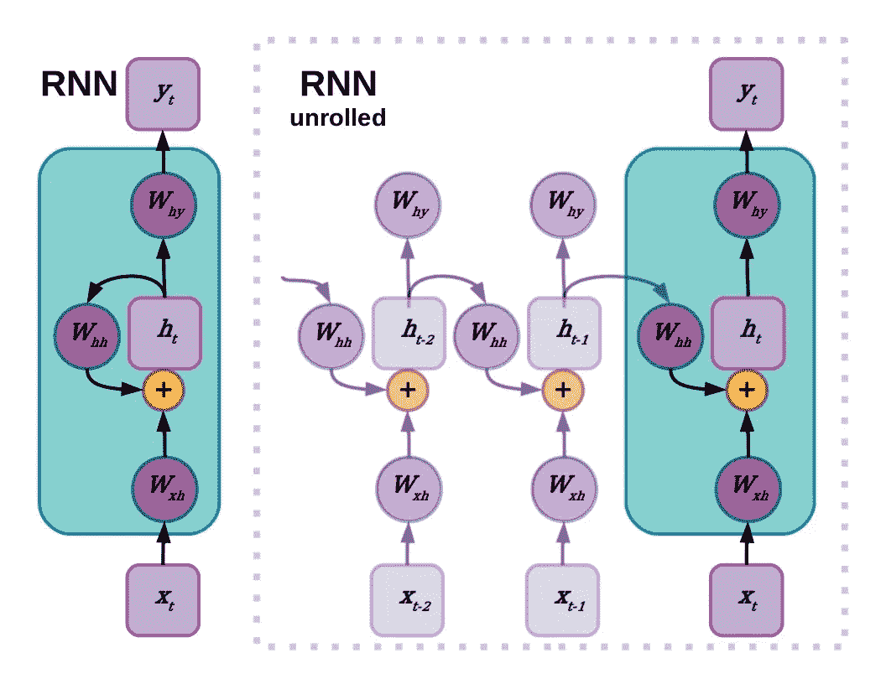
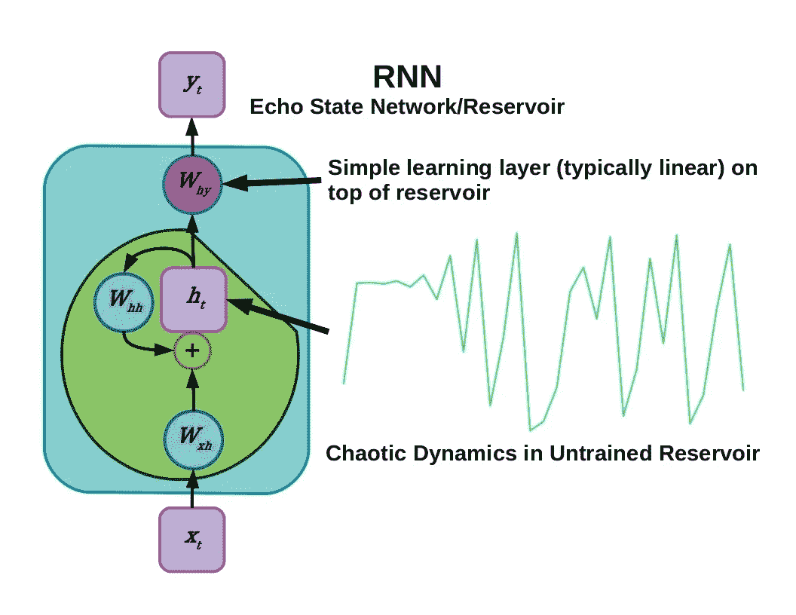
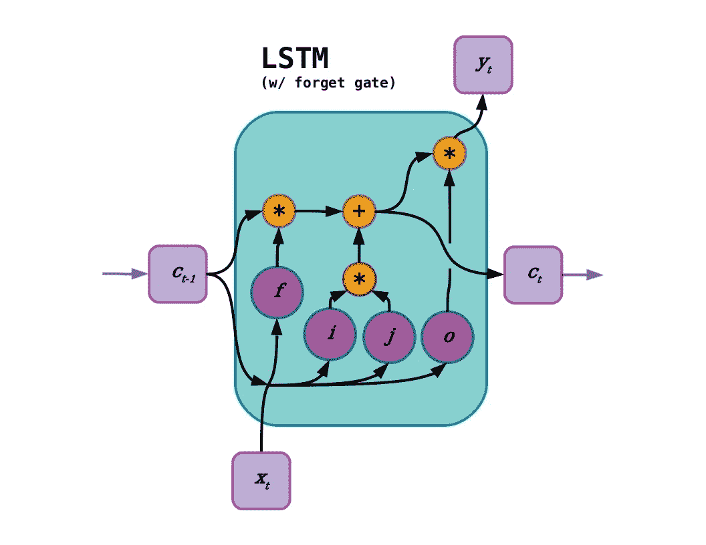
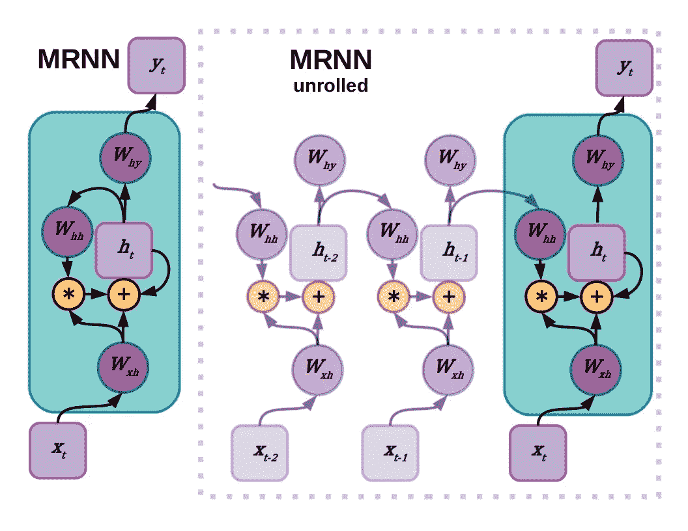
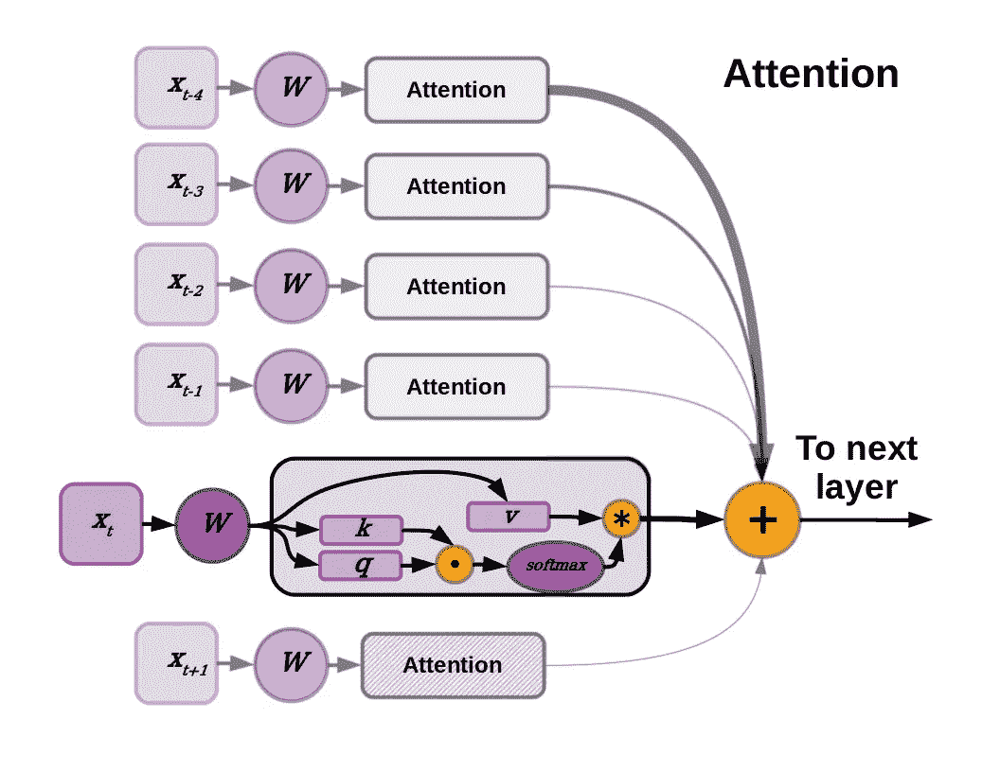

# 深度神经网络在自然语言处理中的不合理进展

> 原文：<https://towardsdatascience.com/the-unreasonable-progress-of-deep-neural-networks-in-natural-language-processing-nlp-374443b21b00?source=collection_archive---------28----------------------->

## 自然语言处理(NLP)的巨大变化源于深度学习

人类有很多感官，然而我们的感官体验通常受视觉支配。考虑到这一点，也许现代机器学习的先锋由计算机视觉任务领导就不足为奇了。同样，当人类想要交流或接收信息时，他们使用的最普遍和最自然的途径是语言。语言可以通过口语和书面语、手势或一些形式的组合来传达，但出于本文的目的，我们将重点关注书面语(尽管这里的许多课程也与口语重叠)。

多年来，我们已经看到带有深度神经网络的自然语言处理(也称为 NLP，不要与*的* [NLP](https://en.wikipedia.org/wiki/NLP_and_science) 混淆)领域紧随计算机视觉的[深度学习](https://blog.exxactcorp.com/category/deep-learning/)的进展。随着预训练通用语言模型的出现，我们现在有了通过大规模预训练模型(如 GPT-2、伯特和 ELMO)将学习转移到新任务的方法。这些和类似的模型在世界上做着真正的工作，都是日常的事情(翻译、转录等)。)，以及科学知识前沿的发现(例如，从出版物文本[【pdf】](https://perssongroup.lbl.gov/papers/dagdelen-2019-word-embeddings.pdf])预测材料科学的进展)。

对外语和母语的掌握长期以来被认为是有学问的人的标志；一个杰出的作家或能流利地理解多种语言的人会受到高度尊重，并被认为在其他方面也很聪明。将任何语言掌握到母语水平的流利程度都是困难的，传授优雅的风格和/或异常的清晰更是如此。但即使是典型的人类熟练程度也表现出令人印象深刻的能力，能够解析复杂的信息，同时破译上下文、俚语、方言和语言理解的不可动摇的混淆因素(讽刺和挖苦)之间的实质性编码差异。

理解语言仍然是一个困难的问题，尽管在许多领域得到了广泛的应用，但用机器理解语言的挑战仍然存在许多未解决的问题。考虑下面的歧义和奇怪的单词或短语对。从表面上看，每一对的成员有相同的意思，但无疑传达了不同的细微差别。对我们中的许多人来说，唯一的细微差别可能是对语法和语言精确性的忽视，但是拒绝承认共同使用的含义通常会使语言模型看起来很愚蠢。

满不在乎=(？)可能不在乎

不顾=(？)不管

字面上=(？)象征性地

动态=(？)动态

# 初级课程:概括和迁移学习

深度学习的现代成功很大程度上归功于迁移学习的效用。迁移学习允许实践者利用模型先前的训练经验来更快地学习新的任务。由于训练现有深度网络的原始参数计数和计算要求，迁移学习对于深度学习在实践中的可访问性和效率是必不可少的。如果你已经熟悉迁移学习的概念，跳到下一节来看看深度 NLP 模型随时间的演变。

迁移学习是一个微调的过程:与其从头开始训练整个模型，不如只重新训练模型中与任务相关的部分，这样可以节省计算和工程资源的时间和精力。这是安德烈·卡帕西、杰瑞米·霍华德和深度学习社区的许多其他人信奉的“不要成为英雄”的心态。

从根本上说，迁移学习包括保留模型的低级、通用组件，而只重新训练模型中那些专门化的部分。有时，在仅重新初始化几个特定于任务的层之后，训练整个预训练模型也是有利的。

作者图片

深度神经网络通常可以分为两个部分:编码器或特征提取器，用于学习识别低级特征，以及解码器，用于将这些特征转换为所需的输出。这个卡通示例基于一个用于处理图像的简化网络，编码器由卷积层组成，解码器由几个完全连接的层组成，但相同的概念也可以很容易地应用于自然语言处理。

在深度学习模型中，编码器(主要学习提取低级特征的一堆层)和解码器(将编码器输出的特征转换为分类、像素分割、下一时间步预测等的模型部分)之间通常存在差异。采用预先训练的模型并初始化和重新训练新的解码器可以在少得多的训练时间内实现最先进的性能。这是因为较低层倾向于学习最普通的特征，如图像中的边缘、点和波纹(即图像模型中的 [Gabor 滤波器](https://en.wikipedia.org/wiki/Gabor_filter))。在实践中，选择编码器和解码器之间的界限更像是艺术而不是科学，但请参见 [Yosinki et al. 2014](http://yosinski.com/transfer) ，研究人员量化了不同层的特征的可转移性。

同样的现象也适用于 NLP。在一般语言建模任务(预测前面给定的文本的下一个单词或字符)上训练的训练有素的 NLP 模型可以被微调到许多更具体的任务。这节省了从零开始训练这些模型中的一个的[大量能量和经济成本](https://arxiv.org/abs/1906.02243)，这也是我们拥有 Janelle Shane 的“[人工智能生成的食谱](https://aiweirdness.com/post/140508739392/the-neural-network-has-weird-ideas-about-what)(顶级食谱包括“巧克力鸡鸡蛋糕”)或基于文本的生成型[地牢游戏](https://play.aidungeon.io/)等杰作的原因。

这两个例子都是建立在 OpenAI 的 GPT-2 之上的，这些和大多数其他的自然语言处理项目比其他任何地方都更适合喜剧。但是像 GPT-2 这样的通用 NLP 转换器的转移学习正在迅速滑下愚蠢的斜坡，滑向恐怖谷。在这之后，我们将处于可信的边缘，由机器学习模型生成的文本可以代替人类书写的副本。谁也说不准我们离实现这些飞跃还有多远，但这可能并不像人们想象的那么重要。NLP 模型不一定要像莎士比亚那样，才能在某些时候为某些应用程序生成足够好的文本。人类操作员可以挑选或编辑输出，以实现期望的输出质量。

自然语言处理(NLP)在过去十年中取得了长足的进步。在这一过程中，出现了许多不同的方法来提高情感分析和机器翻译基准测试等任务的性能。已经尝试了许多不同的架构，其中一些可能更适合给定的任务或硬件限制。在接下来的几个部分中，我们将看看用于语言建模的深度学习 NLP 模型的家谱。

# 递归神经网络

作者图片

*递归神经网络中的一个或多个隐藏层与之前的隐藏层激活有联系*。本文中的这个图表和其他图表的要点如下:

作者图片

语言是一种序列数据。与图像不同，它是按照预先确定的方向一次解析一个数据块。句子开头的文本可能与后面的元素有重要的关系，并且可能需要记住一篇文章中很早以前的概念才能理解后面的信息。语言的机器学习模型应该具有某种记忆，这是有道理的，递归神经网络(RNNs)通过与先前状态的连接来实现记忆。在给定时间状态下，隐藏层中的激活依赖于前一步的激活，而前一步的激活又依赖于前一步的值，依此类推，直到语言序列开始。

由于输入/输出数据之间的相关性可以追溯到一个序列的开始，所以该网络实际上非常深。这可以通过将网络“展开”到其序列深度来可视化，揭示导致给定输出的操作链。这使得[消失渐变问题](http://people.idsia.ch/~juergen/fundamentaldeeplearningproblem.html)成为一个非常[明显的版本](https://arxiv.org/abs/1211.5063)。因为用于分配错误信用的梯度在每个先前的时间步长上被乘以小于 1.0 的数，所以训练信号被连续衰减，并且早期权重的训练信号变得非常小。在 RNNs 中训练长期时间依赖性的困难的一个解决方法就是不要。

# 储层计算和回声状态网络

作者图片

*回声状态网络类似于 RNN，但是具有使用固定的、未经训练的权重的循环连接。网络的这个固定部分通常被称为水库。*

回声状态网络是具有固定循环连接的 rnn 的子类。使用静态循环连接避免了用消失梯度训练它们的困难，并且在 RNNs [的许多早期应用中，回声状态网络](https://en.wikipedia.org/wiki/Echo_state_network)优于用反向传播训练的 RNNs。一个简单的学习层，通常是一个全连接的线性层，解析来自库的动态输出。这使得训练网络更容易，并且有必要初始化油藏以具有复杂且持续但有限的输出。

回声状态网络具有混沌特性，因为早期的输入会对以后的储层状态产生长期的影响。因此，回声状态网络的功效是由于“核技巧”(输入被非线性地转换到高维特征空间，在那里它们可以被线性地分离)和混沌。实际上，这可以通过定义具有随机权重的稀疏递归连接层来实现。

回声状态网络和储层计算已经在很大程度上被其他方法取代，但是它们对消失梯度问题的避免在几个语言建模任务中被证明是有用的，例如[学习语法](https://www.ncbi.nlm.nih.gov/pubmed/17556116)或[语音识别](https://www.sciencedirect.com/science/article/abs/pii/S0893608007000330?via%3Dihub)。然而，储层计算从未对使 NLP 迁移学习成为可能的通用语言建模产生多大影响。

# LSTMs 和门控 rnn

作者图片

*长短期记忆引入了闸门，有选择地将激活保持在所谓的细胞状态。*

LSTMs 由 Sepp Hochreiter 和 jürgen schmid Huber[【pdf】](https://www.bioinf.jku.at/publications/older/2604.pdf)于 1997 年发明，使用“恒定误差转盘”或 CEC 来解决消失梯度问题。CEC 是一种持续的门控细胞状态，由非线性神经层包围，这些神经层打开和关闭“门”(使用类似 sigmoid 激活函数的东西将值压缩在 0 和 1 之间)。这些非线性层选择应该将哪些信息合并到单元状态激活中，并确定将哪些信息传递到输出层。像元状态图层本身没有激活函数，因此当其值以接近 1.0 的门值从一个时间步长传递到另一个时间步长时，梯度可以在输入序列中完整地向后流动很长的距离。LSTMs 已经有了许多发展和[新版本](https://blog.exxactcorp.com/5-types-lstm-recurrent-neural-network/)，用于改进训练、简化参数计数和应用于新领域。这些改进中最有用的一个是 Gers 等人在 2000 年开发的遗忘门(如图所示)，以至于带有遗忘门的 LSTM 被认为是典型的“标准”LSTM。

作者图片

*门控或乘法 RNN 对最后一个隐藏状态的输出使用元素乘法运算，以确定在当前时间步长将什么合并到新的隐藏状态中。*

门控或乘法 RNN (MRNN)是一个非常类似于 LSTM 的构造，尽管没有那么复杂。像 LSTM 一样，MRNN 使用乘法运算来选通网络的最后隐藏状态，选通值由从输入接收数据的神经层来确定。mrnn 由 Sutskever *等人* [ [pdf](https://www.cs.utoronto.ca/~ilya/pubs/2011/LANG-RNN.pdf) 于 2011 年引入用于字符级语言建模，并由 [*Chung 等人*于 2015 年](https://arxiv.org/abs/1502.02367)扩展到更深 mrnn(门控反馈 RNNs)中的跨深度门控。也许因为它们更简单，MRNNs 和门控反馈 RNNs 在一些语言建模场景中可以胜过 LSTMs，这取决于谁在处理它们。

带遗忘门的 LSTMs 一直是各种各样备受瞩目的自然语言处理模型的基础，包括 OpenAI 的"[无监督情感神经元](https://openai.com/blog/unsupervised-sentiment-neuron/) " ( [论文](https://arxiv.org/abs/1704.01444))和 2016 年谷歌的神经机器翻译 [模型的性能大幅跃升。接着从无监督的情感神经元模型演示迁移学习。塞巴斯蒂安·鲁德和杰瑞米·霍华德开发了用于文本分类的无监督语言模型微调](https://arxiv.org/abs/1609.08144) [(ULM-FiT)](https://arxiv.org/abs/1801.06146) ，它利用预训练在六个特定的文本分类数据集上实现了最先进的性能。

虽然没有 ULM-FiT 和无监督情绪神经元，但谷歌位于 LSTM 的翻译网络的一个关键改进是注意力的自由应用，不仅仅是工程注意力，而是学习处理输入数据特定部分的特定机器学习概念。应用于 NLP 模型的注意力是一个如此强大的想法，以至于它导致了下一代语言模型，并且它可以说是 NLP 中[迁移学习的当前功效的原因。](https://thegradient.pub/nlp-imagenet)

# 进入变压器

作者图片

*对“注意力是你所需要的全部”中变压器模型中使用的注意力机制概念的图形描述在序列中的给定点，对于每个数据向量，权重矩阵生成键、查询和值张量。注意机制使用键和查询向量来加权值向量，该值向量将与所有其他键、查询、值集一起受到 softmax 激活，并被求和以产生下一层的输入。*

像[谷歌 2016 年 NMT](https://ai.googleblog.com/2016/09/a-neural-network-for-machine.html) 网络这样的语言模型中使用的注意力机制工作得足够好，在机器学习硬件加速器变得足够强大的时候，让开发人员想到这样一个问题:“如果我们只是单独使用注意力会怎么样？”正如我们现在所知，答案是注意力是你实现最先进的 NLP 模型所需要的全部(这是[介绍只关注模型架构的论文](https://arxiv.org/abs/1706.03762))的名字)。

这些模型被称为变压器，与 LSTMs 和其他 rnn 不同，变压器同时考虑整个序列。他们学会用注意力来衡量输入文本序列中每个点的影响。上图简单解释了最初的 Transformer 模型所使用的注意力机制，但更深入的解释可以从论文或 Jay Alammar 的博客文章中获得。

同时考虑整个序列可能看起来像是它将模型限制为解析它被训练的相同固定长度的序列，不像具有递归连接的模型。然而，转换器利用位置编码(在原始转换器中，它是基于正弦嵌入向量的),这可以促进具有可变输入序列长度的前向传递。变压器架构的一次性方法确实会产生严格的内存要求，但在高端现代硬件上进行训练是有效的，简化变压器的内存和计算要求是该领域当前和[最新发展的前沿](https://lilianweng.github.io/lil-log/2020/04/07/the-transformer-family.html)。

# 自然语言处理(NLP)中深度神经网络的结论和注意事项

在过去的两到三年里，深度自然语言处理无疑已经获得了自己的地位，并且它开始有效地扩展到机器翻译和愚蠢的文本生成这些高度可见的领域之外的应用程序中。NLP 的发展继续跟随计算机视觉的脚步，不幸的是，这包括许多我们以前见过的相同的错误步骤、失误和障碍。

最紧迫的挑战之一是“聪明的汉斯效应”，它是以 20 世纪早期一匹著名的表演马命名的。简而言之，[汉斯](https://en.wikipedia.org/wiki/Clever_Hans)是一匹德国马，作为一匹算术天才马向公众展示，能够回答涉及日期和计数的问题。事实上，他是解读他的教练威廉·冯·奥斯坦给出的潜意识暗示的专家。在机器学习中，聪明的汉斯效应指的是模型通过学习训练数据集中的虚假相关性来实现令人印象深刻但最终无用的性能。

例子包括根据[识别医院使用的机器](https://journals.plos.org/plosmedicine/article?id=10.1371/journal.pmed.1002683)的类型对 x 射线中的肺炎进行分类，通过[重复最后提到的名字](https://www.aclweb.org/anthology/D17-1215/)来回答文本中描述的人的问题，以及[现代](https://callingbullshit.org/case_studies/case_study_criminal_machine_learning.html) [颅相学](https://medium.com/@blaisea/do-algorithms-reveal-sexual-orientation-or-just-expose-our-stereotypes-d998fafdf477)。虽然大多数 NLP 项目在不能正常工作时只会产生错误的喜剧(例如上面提到的食谱和地牢生成器)，但对 NLP 和其他机器学习模型如何崩溃的缺乏理解为现代伪科学和相应的糟糕政策的辩护铺平了道路。这对生意也不好。想象一下，花费数千或数百万美元为一家服装店开发支持 NLP 的搜索，该服装店返回对无带衬衫的搜索查询结果，就像那些在[Shirt without Stripes](https://github.com/elsamuko/Shirt-without-Stripes)Github repo 中的结果。

很明显，虽然最近的进展已经使深度 NLP 更加有效和容易理解，但在展示任何接近人类理解或合成的东西之前，该领域还有很长的路要走。尽管有缺点(没有 Cortana，没有人希望你在 Edge 浏览器上将每一句话都输入到互联网搜索中)，NLP 仍然是当今广泛使用的许多产品和工具的基础。与 NLP 的缺点直接对应的是，在评估语言模型时，对系统严密性的需求从未如此清晰。显然，不仅在改进模型和数据集方面，而且在以信息方式打破这些模型方面，都有重要的工作要做。