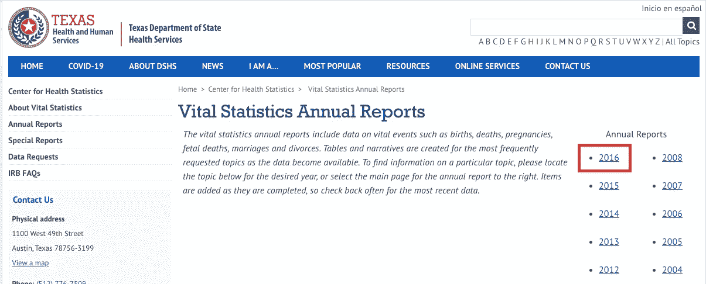

# 数据不合理的不可用性

> 原文：<https://towardsdatascience.com/the-unreasonable-unavailability-of-data-b00271440b1b?source=collection_archive---------95----------------------->

基本政府职能的衡量标准可能多年都不会公布

## 2019 年 6 月美国有多少人死亡？

你可能认为这是一个很容易回答的问题。事实证明并非如此。探索它揭示了我们如何收集和发布数据的基本问题。我们认为基于数据做出决策的价值是理所当然的，并期望我们可以将这种做法扩展到公共政策中——但目前这可能是不可能的。

死亡似乎是最容易衡量的统计数据。几乎所有国家都有死亡率记录。美国有一个相对复杂的多级政府结构，但即使如此，每个州都有一个生命统计部门，记录死亡人数，签发死亡证明，并将统计数据转发给联邦政府。疾病控制中心的国家健康统计中心公布了死亡数字。但是它最近的数据简报，2020 年 1 月发布的第 355 号简报，只涵盖了 2018 年的死亡人数。

整理一个完美的数据集和结果平均需要 15 个月。完整的数据集有许多对研究有用的维度:按年龄、死因等细分。对于回答基本问题来说，这种详细程度是不必要的，因此 CDC 有一个早期发布项目——但这需要提交申请和机构审查，这些障碍不适合回答基本问题，并且仍然只能在一年结束后的 6 个月提供数据。由于这仍然不够，疾病控制中心提供[州和国家临时统计](https://www.cdc.gov/nchs/nvss/vsrr/provisional-tables.htm)。在撰写本报告时(2020 年 5 月 17 日)，临时数据涵盖 2018 年至 2019 年 3 月(落后 14 个月)。而历史档案[覆盖到 2015 年](https://www.cdc.gov/nchs/products/nvsr/monthly_provisional_notice.htm)(2016 年和 2017 年的数据在哪里)？

现在，由于对新冠肺炎疫情的密切关注，我们实际上可以找到一些更好、更详细的(非 COVID)2 月至 5 月的死亡报告，作为 [COVID 报告](https://www.cdc.gov/nchs/nvss/vsrr/covid19/index.htm)的一部分。但将该数据与 2019 年的前期进行比较仍然遥不可及。

也许在美国统计死亡人数是一个太难的问题。让我们转向一个更简单的问题——统计一个州的死亡人数。既然州签发死亡证明，你可能会认为，一个州应该能够很容易地回答在给定的时间范围内发生了多少起死亡，或者至少在这段时间内签发了多少死亡证明——这是一个足够接近的代理。我住在德克萨斯州，所以我咨询了德克萨斯州卫生和人类服务部，他们的生命统计部门在容易访问的网络记录中维护这些数据，直到 2016 年。

我辞去工作，用传统的方式询问数据，给国家生命统计部门发了一封电子邮件，收到了这样的回复:

*下午好，罗斯克先生*

*感谢您关于德克萨斯死亡率数据的请求。由于资源和 COVID19 响应有限，目前我们无法处理您的请求。我们可以将您的请求放在等候名单上，或者欢迎您稍后再与我们联系。此外，我们可以提供的最近一年的最终数据是 2017 年的月度统计数据。我们能提供的最近一年的非最终数据是 2018 年。*

如果您有任何问题，请告诉我们。
谢谢，
人口动态事件数据管理团队
德克萨斯州健康服务部门
健康统计中心

[请注意，尽管他们指出德克萨斯州自己的权威健康统计中心可以提供的最新数据是截至 2018 年的数据，但 CDC 的[州和国家临时统计数据](https://www.cdc.gov/nchs/nvss/vsrr/provisional-tables.htm)拥有德克萨斯州截至 2019 年 3 月的数据。还要注意的是，德克萨斯州实际上是美国管理效率最高的州之一。]

在工业界，我们习惯于根据数据做出决策。首席执行官、首席运营官和首席财务官定期跟踪库存、销售和客户渠道等关键指标。至少对美国而言，上述经验表明，关键政府职能的基本指标不容易获得，或者至少不公开。如果我们要寻找其他公民职能的关键指标，如驾照或公园游客的数量，我们会找到更好或更透明的数据吗？如果我们找不到数据来回答一些极其简单的问题，比如“两个月前死亡的人比去年同月死亡的人多吗？”我们能合理地期望能够回答更复杂的问题吗，比如“这种公共卫生干预有效吗？”即使在我们认为高度透明的社会中，在极端的审查下，关键指标——如纽约州和科罗拉多州的新冠肺炎死亡人数——也会被大幅上调(T1)和下调(T3)。我们可能只是缺乏在公共政策中及时做出基于数据的决策所需的基本数据基础设施。

对此我们能做些什么？我想到了一些想法:

*   当前美国政府的数据政策似乎专注于原始、完美的数据集，而不是及时的基本运营指标。对于后者，我们需要一场运动。或许围绕这一问题展开一场热烈的互联网讨论最终会影响政策的制定。
*   如果我们希望我们的公共机构以不同的方式处理数据，我们需要开始与我们的公共机构合作。在美国，前美国首席数据科学家 DJ Patil 主张参与 usdigitalresponse.org 的[活动，作为行业志愿者与政府机构直接联系并帮助注入新思想的一种手段。](https://www.usdigitalresponse.org/)
*   虽然数据科学界拥有强大的工具来解决问题，但我们在对公共政策发表意见时仍应注意自身的局限性。如果没有可信和及时的数据，我们的工具将无法有效工作，并且这些数据可能无法获得。

对于如何影响政府基本运营指标的可用性，您有其他想法吗？如果有，请在下面评论。

*感谢 Aaron Baker 和 Shelby Williams 帮助探索这个问题。*