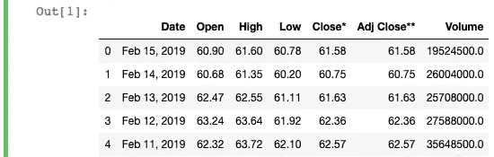
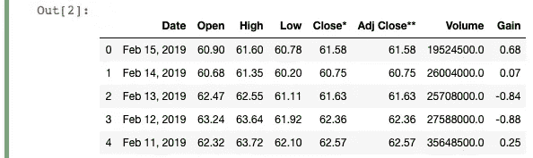
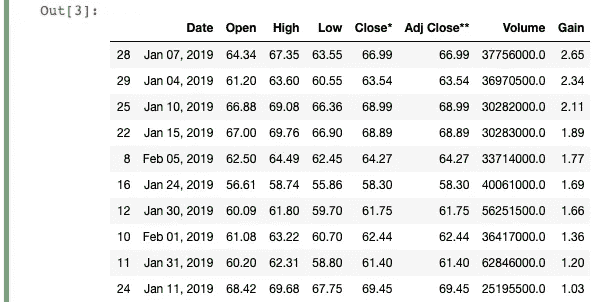
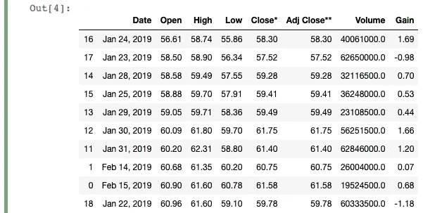
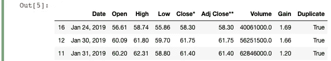
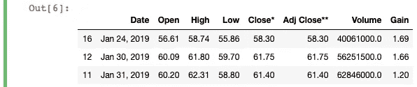

# 升级后的“前 N 名”分析你还没见过熊猫

> 原文：<https://towardsdatascience.com/the-upgraded-top-n-analysis-you-havent-seen-yet-with-pandas-47e6fdc67130?source=collection_archive---------39----------------------->

## thePYTHON

## 这是一个巧妙的技巧，可以添加到你的熊猫技能中，从数据中获取新的见解


图片由 [softie__arts](https://www.instagram.com/softie__arts/)

您知道在 Pandas 中可以基于多个列进行前 N 名分析吗？

前 N 名分析有助于选择符合特定条件的数据子集。例如，如果你拥有一家餐馆，想看看哪些顾客对你的总销售额贡献最大，那该怎么办？最简单的方法是查看所有客户的总销售额，然后从高到低对列表进行排序。

另一个值得关注的子集可能是利润贡献最低(或为负)的客户。然后，您可以用类似的方式完成这项工作，根据利润贡献获得所有客户的列表，然后只选取最低的成员。

但是，如果您想找出是否有客户同时出现在两个列表中，该怎么办呢？

这可以帮助你确定哪些领域你实际上在赔钱，即使看起来总销售额非常高。例如，如果你有一道菜的利润率非常低，那么单单重复点这道菜可能对你的底线没有好处。

让我们来看看你如何结合内置的熊猫函数来做这种分析！

这篇文章中使用的数据来自雅虎财经。我们将使用特斯拉股票价格数据的子集。如果您想继续，请运行下面的代码。(如果你对我用来获取数据的函数感到好奇，请滚动到最底部，点击第一个链接。)

```
import pandas as pddf = pd.read_html("[https://finance.yahoo.com/quote/TSLA/history?period1=1546300800&period2=1550275200&interval=1d&filter=history&frequency=1d](https://finance.yahoo.com/quote/TSLA/history?period1=1546300800&period2=1550275200&interval=1d&filter=history&frequency=1d)")[0]
df = df.head(30)
df = df.astype({"Open":'float',
                "High":'float',
                "Low":'float',
                "Close*":'float',
                "Adj Close**":'float',
                "Volume":'float'})
```



来自[雅虎财经](https://finance.yahoo.com/quote/TSLA/history?period1=1546300800&period2=1550275200&interval=1d&filter=history&frequency=1d)的特斯拉股价样本

# 组合顶部 N 和底部 N 与熊猫

为了演示如何将前 N 名和后 N 名分析结合起来，我们将回答以下问题:

> 《T4 》:在数据集中，哪几天的股价涨幅最高，同时开盘价最低？

首先，我们需要计算股票价格在一天之内变化了多少。这可以通过简单的计算来实现:

```
df['Gain'] = df['Close*'] - df['Open']
```



具有新“增益”栏的数据

我们已经将“Close*”和“Open”列之间的差异存储到一个名为“Gain”的新列中。正如您在上表中看到的，并不是所有的列值都是正的，因为有些日子股票价格下降了。

接下来，我们将创建两个新的数据帧:一个包含前 10 个最高“增益”值，另一个包含前 10 个最低“开放”值。

## 条件 1:增益的顶部 N

在这里，我们将在熊猫身上使用`nlargest`方法。该方法接受要保留的元素数量、要对数据帧进行排序的列，以及输出的数据帧中应该出现哪些重复值(如果有)。默认情况下，`nlargest`将只保留第一个副本，其余的将从返回的数据帧中排除。

这个方法将返回与`df.sort_values(columns, ascending=false).head(n)`相同的结果。这段代码非常容易理解，也可以工作，但是根据文档显示，`nlargest`方法更具性能。

获取具有最高“增益”值的 10 行的代码如下:

```
df_top = df.nlargest(10, 'Gain')
```



按“增益”排名前 N

返回的数据帧现在只给出原始数据帧中具有最高 10 个“增益”值的值。这个新的数据帧也已经按降序排序。

## 条件 2:底部开口

接下来，我们将在数据帧上使用`nsmallest`方法来获取具有最低“打开”值的行。这种方法的工作方式与前一种方法完全一样，只是它将按升序对值进行排序和切片。

实现这一点的代码如下:

```
df_bottom = df.nsmallest(10, 'Open')
```



底部 N 由“打开”

## 创建顶部和底部 N 个值的“组合集”

我们现在准备组合这两个数据帧来创建一个**组合集**。我从一个内置的 Tableau 函数中借用了这个术语，但它所指的只是基于两个或更多列匹配多个条件的数据子集。在这种情况下，我们寻找只存在于“增益”前 10 名和“开放”后 10 名的数据。

要获得我们的组合集，有两个主要步骤:

1.  连接顶部 N 个和底部 N 个数据帧
2.  删除除重复行之外的所有行。

实现这一点的代码如下:

```
df_combined = pd.concat([df_top, df_bottom])
df_combined['Duplicate'] = df_combined.duplicated(subset=['Date'])
df_combined = df_combined.loc[df_combined['Duplicate']==True]
```



组合顶部 N 和底部 N v1

首先，我们简单地调用`pd.concat`并将两个数据帧粘在一起。由于顶部的 N 个和底部的 N 个数据帧来自完全相同的源，我们不需要担心重命名任何列或指定索引。

接下来，为了创建“Duplicate”列，我们使用了`duplicated`方法。该函数返回一个布尔序列，如果一行是重复的，则将该行标记为“真”，否则标记为“假”。您可以在 DataFrame 上调用这个函数，并通过将列名写成一个参数来指定在哪个列中搜索重复项(在本例中为`subset=['Date']`)。为了进行演示，我创建了一个新列“Duplicate”来存储新的布尔值。

我不会深入讨论`loc[]`函数是如何工作的，但是如果你以前没有使用过它，快速浏览一下[这个介绍](/you-dont-always-have-to-loop-through-rows-in-pandas-22a970b347ac)，这样你就能理解如何使用它以各种方式过滤你的数据帧。我们在这里所做的只是取“重复”列中为真的值，因为这些值出现在两个数据帧中。

我们甚至不需要创建一个新的列来标记重复的值。上面代码的一个稍微精简(和等效)的版本如下所示:

```
combined = pd.concat([df_top, df_bottom])
combined = combined.loc[combined.duplicated()==True]
```



组合顶部 N 和底部 N v2

瞧啊。现在，我们可以看到在整个数据集中“开放”程度最低的一天中有高“收益”的行。

仅此而已！

我希望这种快速查看前 N 名(和后 N 名)的分析对您有所帮助。组合多个条件可以让您以新的方式过滤和处理数据，这有助于您从数据集中提取有价值的信息。

祝你的熊猫工作好运！

```
**More Pandas stuff by me:** - [2 Easy Ways to Get Tables From a Website with Pandas](/2-easy-ways-to-get-tables-from-a-website-with-pandas-b92fc835e741?source=friends_link&sk=9981ddaf0785a79be893b5a1dd3e03dd)
- [How to Quickly Create and Unpack Lists with Pandas](/how-to-quickly-create-and-unpack-lists-with-pandas-d0e78e487c75?source=friends_link&sk=32ea67b35fe90382dc719c1c78c5900c)
- [Top 4 Repositories on GitHub to Learn Pandas](/top-4-repositories-on-github-to-learn-pandas-1008cb769f77?source=friends_link&sk=d3acc38062490a86ecb46875342224e6)
- [A Quick Way to Reformat Columns in a Pandas DataFrame](/a-quick-way-to-reformat-columns-in-a-pandas-dataframe-80d0b70de026?source=friends_link&sk=e54f86ec079fb17d5824bac6d1e93919)
```