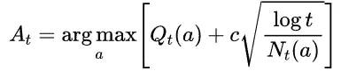
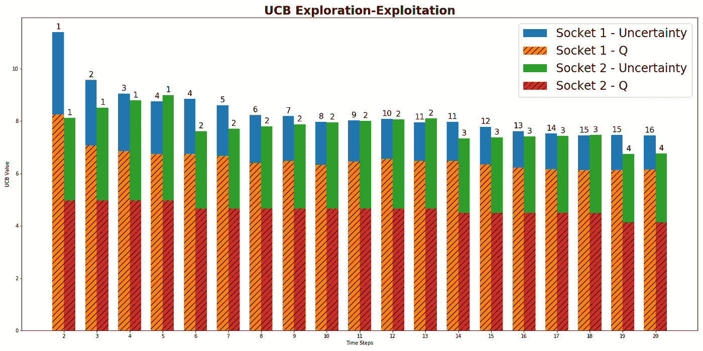
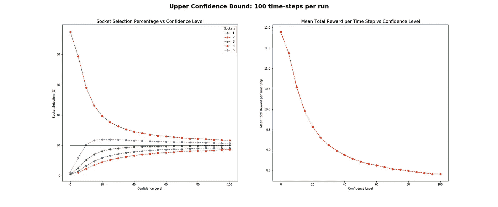
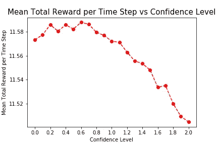
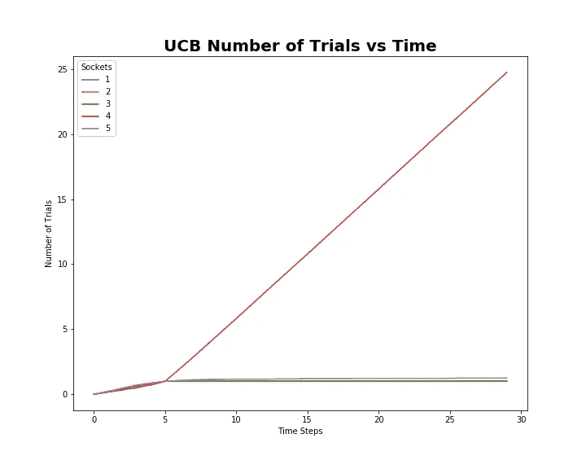
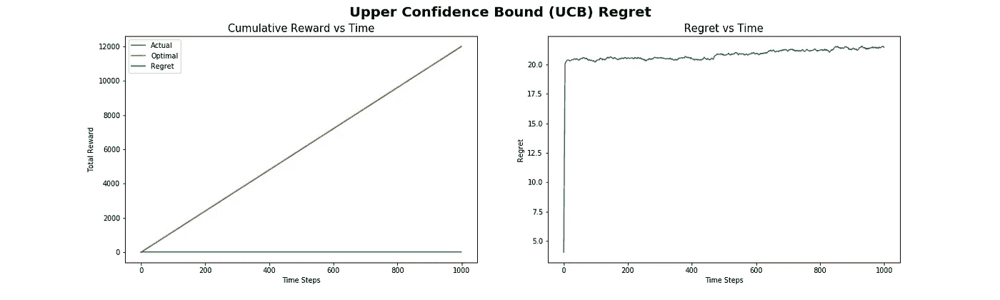

# 置信上限(UCB) Bandit 算法

> 原文：<https://towardsdatascience.com/the-upper-confidence-bound-ucb-bandit-algorithm-c05c2bf4c13f?source=collection_archive---------3----------------------->

## [入门](https://towardsdatascience.com/tagged/getting-started)，[一个婴儿机器人的强化学习指南](https://towardsdatascience.com/tagged/baby-robot-guide)

## 多武装匪徒:第 4 部分


照片由[阿图尔·马托斯扬](https://unsplash.com/@artmatters?utm_source=medium&utm_medium=referral)在 [Unsplash](https://unsplash.com?utm_source=medium&utm_medium=referral) 拍摄


# 概观

这是我们关于多股武装匪徒系列的第四部分，我们将看看可以用来解决匪徒问题的置信上限(UCB)算法。

如果您还不熟悉 bandit 问题及其术语，您可能想先看看本系列的前几部分，如下所示:

*   [**第 1 部分:数学框架和术语**](/multi-armed-bandits-part-1-b8d33ab80697)——入门所需的全部基础信息
*   [**第二部分:Bandit 框架**](/multi-armed-bandits-part-2-5834cb7aba4b)
    *-* 代码和测试框架的描述
*   [**第三部分:土匪算法**](/bandit-algorithms-34fd7890cb18)
    *-*[*贪婪算法*](/bandit-algorithms-34fd7890cb18#d7a7) *-*[*乐观-贪婪算法*](/bandit-algorithms-34fd7890cb18#1519) *-*[*ε-贪婪算法(ε-贪婪)*](/bandit-algorithms-34fd7890cb18#0145) *-*[](/bandit-algorithms-34fd7890cb18#b390)

*bandit 算法和测试框架的所有代码都可以在 github 上找到: [Multi_Armed_Bandits](https://github.com/WhatIThinkAbout/BabyRobot/tree/master/Multi_Armed_Bandits)*

# *概述*

> *机器人宝宝在商场走失。利用强化学习，我们想帮助他找到回到妈妈身边的路。然而，在他开始寻找她之前，他需要从一组电源插座充电，每个插座的电量略有不同。*
> 
> *使用多臂强盗问题中的策略，我们需要在最短的时间内找到最好的插座，让机器人宝宝充电上路。*

**

> *机器人宝宝进入了一个充电室，里面有 5 个不同的电源插座。每个插座返回的电荷数量略有不同。我们希望在最短的时间内给机器人宝宝充电，所以我们需要找到最好的插座，然后使用它，直到充电完成。*
> 
> *这和多臂强盗问题是一样的，除了我们不是在找一个能给出最好回报的吃角子老虎机，而是在找一个能给出最多电量的电源插座。*

**

# *介绍*

*在电源插座问题中，我们试图在最短的时间内获得最多的电量，我们已经看到，在探索、寻找最佳插座所花费的时间和利用目前回报最佳的插座所花费的时间之间存在权衡。如果我们花太长时间探索，那么我们可能会错过使用已经显示出高回报的插座。或者，如果我们只是利用性能良好的套接字，那么我们可能找不到最佳套接字，并可能错过获得最大可能回报的机会。*

*显然，最好的方法是每次都选择最好的插座，这就是所谓的*最优策略*。同样显而易见的是，这种方法实际上并不实用，因为您最初并不知道哪个插座是最好的。如果你要找到最好的一个，就必须花一些时间去研究套接字的性能，因此不可能总是选择最好的动作。*

*最优策略虽然只是理论上的，但可以用来评估其他策略，看它们有多接近最优。最优策略所能获得的回报与测试中的策略实际获得的回报之间的差额被称为 ***后悔*** 。在这种情况下，回报是来自插座的电量，策略是用于选择要尝试的插座的方法或策略。*

*正如我们已经看到的，[ε-贪婪有线性后悔](/bandit-algorithms-34fd7890cb18#19ae)。它会继续探索所有动作的集合，即使它已经获得了足够的知识来知道这些动作中哪些是不好的动作。*

*从最大化总回报的角度来看，更好的方法是将一段时间内的抽样限制在表现最佳的行动上。这正是置信上限(UCB)策略所采用的方法。*

# *置信上限(UCB)算法*

*UCB 算法不是通过简单地选择任意动作来执行探索，而是随着它收集更多的环境知识来改变它的探索-利用平衡。它从主要集中于探索，当尝试最少的行动是首选时，转向集中于开发，选择估计回报最高的行动。*

*对于 UCB， *Aₜ'，*在时间步长 *t* 选择的动作由下式给出:*

**

*哪里；*

*   **Qₜ(a)是在时间步“t”的动作“a”的估计值。**
*   **Nₜ(a)是在时间‘t’之前已经选择动作‘a’的次数。**
*   **‘c’是控制探索水平的置信度值。**

*UCB 公式可以认为是由两个不同的部分组成的:*

****剥削:****

*   **Qₜ(a)* 代表等式中的剥削部分。UCB 基于“ ***对不确定的事实保持乐观*** ”的原则，这基本上意味着如果你不知道哪个行动是最好的，那么选择一个目前看起来是最好的。单独考虑这一半的等式将会做到这一点:目前具有最高估计回报的行动将是所选择的行动。*

****探索:****

*   *等式的后半部分增加了探索，探索的程度由超参数' *c* '控制。实际上，等式的这一部分为行动的回报估计提供了不确定性的度量。*
*   *如果一个动作没有经常尝试，或者根本没有尝试过，那么 *Nₜ(a)* 就会变小。因此，不确定项将会很大，使得这个动作更有可能被选择。每当采取一项行动时，我们对它的估计就变得更有信心。在这种情况下， *Nₜ(a)* 增加，因此不确定项减少，使得该动作不太可能被选择作为探索的结果(尽管由于开发项，它仍可能被选择为具有最高值的动作)。*
*   *当没有选择动作时，由于分子中的对数函数，不确定性项将缓慢增长。然而，每次选择该动作时，由于*【nₜ(a】*呈线性增加，不确定性将迅速缩小。因此，对于不经常选择的行动，探索期会更长，因为对其回报的估计存在不确定性。*
*   *随着时间的推移，探索项逐渐减少(因为 as ' *n* '趋于无穷大 *log n/n* 趋于零)，直到最终仅基于开发项选择动作。*

# *UCB 实施*

*为了研究 UCB 算法的性能，我们将在测试系统中添加另一个套接字类。这个测试系统的全部细节在本系列的第 2 部分中有描述，所有的代码都可以在 t 2 的 github 库中找到。*

*UCB 插座需要稍微修改基本的电源插座类，以增加它用来评估插座的度量的不确定性。因此' *sample* '函数现在返回估计的平均回报和不确定性值之和，这是作为套接字被尝试的次数和当前时间步长的函数来计算的。*

*套接字测试器类恢复为标准套接字测试器，仅基于从其样本函数返回最大值的套接字来选择套接字(即，不再需要ε-贪婪算法的随机采样)。*

# *UCB 分析*

*使用我们的测试系统，我们可以分析 UCB 算法的性能。为了简化比较，我们只从我们的标准套件中选取了前 2 个插座。这两个插座的平均奖励值分别为 6 秒和 4 秒。在下图中可以清楚地看到每个勘探和开采术语的相对贡献。*

*这里需要注意的主要事项是:*

*   *每个条形的总高度代表总 UCB 值。因此，由于在每个时间步，我们都在选择给出最大 UCB 值的插座(这就是公式中的 *argmax* 所做的)，具有最高条的插座将是被选择的插座。
    每个条形顶部给出的数字是该插座被选择的次数。因此，您可以看到，如果该插座在前一时间步中具有最高的杆，该值将会增加。*
*   *条形的阴影部分表示每个插座的实际输出的估计值(其 *Q* 值)。随着时间的推移，这个估计收敛于每个插座的真实平均输出。因此，socket 1 的 *Q* 值(黄色阴影条)趋向于其真实输出 6，socket 2 的 *Q* 值趋向于其真实平均值 4。*
*   *每个条形的实线部分代表等式的探索部分。当一个插座被使用时，我们对它的真实输出变得更加确定，因此棒的实心部分将减小尺寸。另一方面，当一个套接字没有被测试时，我们变得不太确定它的输出，因此探索价值将开始增加。
    因此，在下图中，我们可以看到当 socket 2 未被选中时，socket 2 的探索期限(由条形的绿色实线部分表示)如何逐渐增加，直到最终导致条形的总大小大于 socket 1 的总大小，此时，socket 2 被选中。*

**

> ***对 UCB 图表的深入分析***
> 
> *从 UCB 图表中进一步观察到的一些情况如下:*
> 
> **如果尚未尝试套接字，则将套接字不确定性值设置为无穷大，导致执行初始启动回合，其中每个动作尝试一次以获得其初始值。当还没有尝试动作并且 Nₜ(a 等于零时，这就避免了探索项中被零除的错误。显然，这只适用于当可能的动作“k”比时间步长“ *t* ”少时，否则就没有足够的时间去尝试每一个动作。*
> 
> **由于启动循环，图表从时间步长 2 开始。每个插座被选择的次数由每个栏顶部的数字显示。因此，在时间步骤 2，可以看到每个插座已经被选择了一次。因为每个插座被尝试了相同的次数，所以不确定项的贡献对于每个插座是相同的。然而，由于其较大的回报估计“Q”，套接字 1 具有最大的总 UCB 值，因此被 *argmax* 函数选择。*
> 
> **在时间步长 3，socket 1 是在前一时间步长选择的 socket，因此它被尝试的次数计数增加到 2。结果，这个插座的不确定性项缩小了，所以可以看到蓝色实线的尺寸减小了。阴影黄色条也减少了，这是因为该插座已经被采样，并且形成了对真实插座回报的更好估计。
> 另一方面，socket 2 没有被选中，所以它的奖励估计值保持不变。它被选择的次数也保持不变，而时间步长的数量增加，因此其不确定项的大小增加，因此可以看到绿色实线变大。
> 然而，套接字 1 的 UCB 项的总大小仍然大于套接字 2 的大小，因此再次选择了套接字。*
> 
> **最终，在时间步骤 5，套接字 2 的不确定性项增加到足以使其总 UCB 值大于套接字 1 的值，因此套接字被选中。一旦发生这种情况，它的估计回报值更接近真实的平均回报，它的不确定性项缩小，整个过程重新开始。*

# *置信度值“c”*

*UCB 算法在一定置信值范围内的行为如下所示。置信度参数控制探索的级别。在我们简单的电源插座实验中，实际上可以看到，探索程度越高，平均总回报越低。这是因为每个套接字具有不同的值和有限范围的可能值，使得其他套接字不太可能生成相同范围内的值。*

*结果，在我们的简单实验中，看起来探索实际上是不必要的。在初始启动步骤之后，UCB 算法已经锁定了最佳插座，并且当它能够利用这一知识时产生最佳结果。增加置信度参数的值会急剧降低平均总回报，并且这种降低会持续下去，直到算法变得不比随机搜索更好。*

**

*随着置信水平的增加，对平均总报酬的变化的更仔细的检查如下所示。这里可以看出，平均总报酬确实略有增加，从置信参数为零到大约 0.6 的值，之后迅速下降。所以需要少量的探索来获得最好的结果。*

**

*在置信度参数设置为 0.6(给出最大平均总回报的值，如上所示)的情况下，分析每个插座被选择的频率，给出如下图。这里可以看出，在初始启动期间，如果还没有尝试，当插座的不确定性被设置为无穷大时，在前 5 个时间步长期间，每个插座恰好被选择一次。在这一点之后，最佳插座(插座 4)已经被识别为最佳插座，因此被选择用于几乎所有剩余的试验。*

**

# *UCB 后悔了*

*由于最佳行动被迅速确定，并且仅在其他行动具有高度不确定性时才尝试，UCB 方法显示出比ε-贪婪方法低得多的后悔水平。*

*从下面的图表中可以看出，最佳回报和实际回报几乎是一样的(以至于实际回报被最佳回报所掩盖)，而遗憾几乎是持平的。*

*绝大多数的遗憾发生在最初的启动过程中，每个套接字都被尝试一次以得到它的第一个估计值。事实上，已经表明 UCB 的预期累积遗憾在总时间步数中是对数的。*

**

*要深入了解 UCB 的遗憾和 UCB 的总体情况，请查阅以下资源:*

*   *Tor Lattimore 和 Csaba Szepesvari 的关于强盗算法的 [*书籍和网站*](https://banditalgs.com/2016/09/18/the-upper-confidence-bound-algorithm/)*
*   **赖和 Robbins 关于算法的开创性论文:* [*渐近有效的自适应分配规则*](http://dx.doi.org/10.1016/0196-8858(85)90002-8) *。**

# *摘要*

*在诸如插座选择或多臂强盗的问题中，当面临如何在寻找给出最佳回报的动作和利用已经发现的动作之间取得平衡的困境时，使用可以修改探索和利用水平的方法是重要的。*

*正如我们看到的ε-贪婪算法，它只是保持一个恒定的探索水平，随着时间的推移继续探索所有动作的集合。因此，它有线性遗憾。它所获得的回报与最大可能回报之间的差异会随着时间的推移而不断增加。*

*另一方面，置信上限(UCB)算法修改了它的探索和开发级别。最初，当它对可用的动作知之甚少，并且对要采取的最佳动作的信心较低时，它的等式的探索部分使它搜索所有可能动作的集合。*

*随着探索的进展，对每个行动所给予的回报会有更好的估计。因此，探索的程度可以降低，已经发现的好的行动的使用可以增加。算法的焦点逐渐从探索转向有利于开发。随着时间的推移，通过改变这种平衡，UCB 算法减少了它的遗憾，因此，能够实现比ε-贪婪算法低得多的遗憾水平。*

*在下一部分中，我们将研究汤普森取样，这是一种平衡勘探和开发的更复杂的方法。使用这个，我们将得到婴儿机器人充电，并准备在几乎没有时间！*

**

```
***< Part 3:** [**Bandit Algorithms**](/bandit-algorithms-34fd7890cb18) **Part 5:** [**Thompson Sampling**](/thompson-sampling-fc28817eacb8) **>***
```