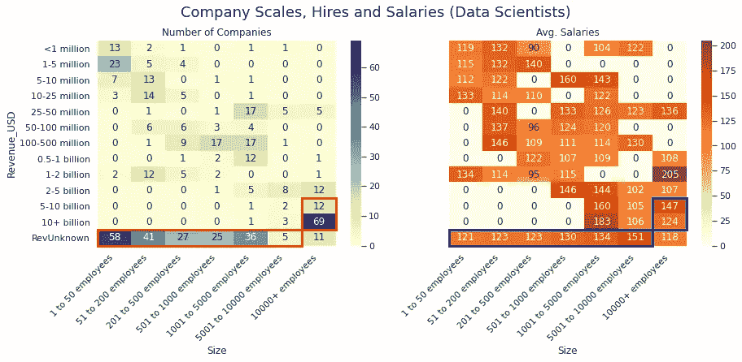

# 用数据科学预测数据科学工资

> 原文：<https://towardsdatascience.com/the-us-data-science-job-market-in-2020-463520a9d5a?source=collection_archive---------44----------------------->

## 用 Python 中的探索性分析和机器学习算法剖析 2020 年美国数据科学就业市场和薪酬

在 [Unsplash](https://unsplash.com?utm_source=medium&utm_medium=referral) 上由 [Carlos Muza](https://unsplash.com/@kmuza?utm_source=medium&utm_medium=referral) 拍摄的照片

这篇文章总结了[我的 Kaggle 笔记本](https://www.kaggle.com/gawainlai/us-data-science-job-salary-regression-w-visuals)中的关键见解，用 Python 中的探索性分析和机器学习算法(主要是[反向逐步回归](https://www.kaggle.com/gawainlai/backward-stepwise-regression-v1-0))分析美国数据科学就业市场和薪酬。

# **市场需要更多分析师，但对数据科学家更慷慨**

在这项研究的 12，360 个数据科学职位招聘中(数据来源: [picklesueat](https://github.com/picklesueat/data_jobs_data) 和 Glassdoor)，数据分析师的招聘比例最高，为 27%。数据工程师是第二大群体，占所有职位的 23%。只有 17%是业务分析师，10%是数据科学家。其他分析师(系统分析师、质量分析师、报告分析师等)。)占 22.7%。所有分析师类型的聘用合计占总聘用数的 67%。

然而，从下面的图表中，我们看到数据科学家的总体薪酬分布比数据工程师和分析师更偏右，显示数据科学家的薪酬明显更高。

总的来说，所有数据科学工作的平均年薪是 89，000 美元，但方差相当高。以中位数(80，000 美元)为中心的中间 50%可以从 60，000 美元到 110，000 美元不等。

# 工作地点比什么都重要

虽然许多工作都是暂时的偏远地区，但大多数公司仍然计划在经济重新开放后回到他们的物理办公室，并在招聘时指定工作地点。然而，由于许多公司根据候选人当前的居住地点支付不同的工资，因此在疫情期间与每个候选人的最终交易在该数据集中是未知的。

(右侧的点阵图:95%置信区间的点估计值)

毫不奇怪，加州的工作收入更高(110，000 美元以上)，但加州和佛罗里达等地之间高达 50，000 美元的年薪差距仍然令人震惊。此外，不考虑生活成本，鉴于如此高的需求，德克萨斯州的数据科学专业人员肯定被低估了。

(右侧的点阵图:95%置信区间的点估计值)

有些人会将薪资差异归因于当地的生活成本。如果是这样的话，纽约和旧金山应该是数据科学专业人员薪资最高的地方。然而，硅谷中生活成本中等偏高的城市，如圣克拉拉、桑尼维尔和圣何塞，实际上表现要好得多。因此，[硅谷繁荣的其他一些因素](https://www.thebalance.com/what-is-silicon-valley-3305808#:~:text=Five%20Reasons%20for%20Silicon%20Valley's,Personal%20loyalties%20override%20corporate%20ones.)可能才是那些高薪的真正原因。

这是工作地点对薪水有很大影响的另一个观点。之前我们看到了数据科学家的工资(平均。12.3 万美元)明显高于数据工程师和分析师，但请注意下面分布左侧的第二个峰值(起薪低于 9 万美元)？他们看起来就像是一群分析师的薪水被放错了“数据科学家”的头衔。

事实证明，由于职位描述被证实是相似的，加州作为高薪群体(≥9 万美元)工作地点的出现率要高得多。另一方面，薪酬过低的群体(

Also, from [回归分析](https://www.kaggle.com/gawainlai/us-data-science-job-salary-regression-w-visuals)，最终模型中近[一半的变量与工作地点有关，这超过了资历、行业和部门等其他因素。](https://www.kaggleusercontent.com/kf/44539290/eyJhbGciOiJkaXIiLCJlbmMiOiJBMTI4Q0JDLUhTMjU2In0..Ya2V-1dOwhq-rlgQ6ZmtnQ.YqobCeARXaSvphLuIS7DvaXUqogwFqOvqyIkocDy3fyrP8JWesKl7-DJv2yLp5O9vrrTPKG-lHpVXGt-WRlW0zhZ-RoE8kSz7_LZeSc28JGUulyn481_kGM4JnZ7TYxKw0k273NMLGzIsCFeh8XqpB3IMNhSafL3UDybisjxSCANL5xkfU7dcVkbzNnZk2GPvjDW6sdIdC1f0njvb3R3upXkz3YP_J-zfNsue6CSj1Mi4tliVSrhOJDiQn2VF4Gv6szjacz-nXZfsK0u94dKlxWJzRV1hvmk7tFcUk8S3Flilo3NcHVWNHjIdHfEhW1MHiC9SXePiyJ1aGSoi9BSKu-sQP2Xh4TZpP-EM9MEhvWx4_JSyYfhjAdodv6iri1W4CodTmmWD02yMr068xsVtN1UdGJKgEjxuXnjtzcZM-92O495vaKSBBLsnUsbuDu4826VHCKX7yJxOxQb_Eyw8MP3blrkStXkxJPIsiWppFLEwe6wx6dZPDwOzbMgdsY6YQc6VlETnRhqUoLX-zx0IyegT5J-cHgZNc6fb-ff9cQdGJf8abGI0dBl4FeJFn4a0RCKcX9TsePhmrbaZihLKzZSwSxJQO_JMhp1m7lQJPUT8_B00lCz4uecegVn-2gyfl_YdqDuInXxn3GXFebU4KuuHmBgofqTSqW9_3R6NPg.DV4hEnAaFk3ltUHnnBnW8w/__results___files/__results___103_0.png)

# 在与大公司的竞争中，中小企业通常提供更好的服务

大公司并不总是追求高薪的首选。虽然一般来说，大公司(拥有 10，000 多名员工，收入超过 50 亿美元)往往支付更高的薪酬，但财务上不公开的中小企业(SMB)也会提供有竞争力的薪酬。

在下面的热图中，左侧显示了雇用数据科学专业人员的公司数量及其规模，而右侧显示了他们提供的平均工资。一些工资极高但样本量低的公司被认为是极端值(例如，只有三家公司拥有 10，000 多名员工，收入 10-20 亿美元。他们出价 15.2 万美元将被视为罕见情况)。

从下一个数据科学家的工资热图和即将到来的业务分析师、数据分析师和数据工程师的工资热图中，我们将逐渐意识到**大公司只向数据科学家支付高得多的工资，**这些数据科学家也需要更高的资格，但对于其他类型的职位，高薪集群都是中小型企业。

# “机器学习”大热，数据科学家是瑞士刀

职位上的一些关键词也会对薪水产生影响。最明显的就是“机器学习”(有时是“ML”)。数据显示，写在职位名称上的“机器学习”将使这份工作的薪水增加 10%以上。然而，经常配对的短语“人工智能”并没有可比的效果，“机器学习”很少出现在分析师的头衔上。

同样，“机器学习”在数据科学家和数据工程师的工作描述中比在分析师的工作描述中出现得更频繁。另一方面，数据科学家需要或更倾向于拥有更广泛的资格，包括博士学位，而其他职位则更关注较少的技能，只需要/更倾向于硕士或更低的学位。

对于数据工程师来说，除了 Python、SQL 等常用技能之外，Hadoop、Spark、AWS、ETL 等数据基础设施词汇出现的频率要比其他岗位高得多。

数据分析师和业务分析师都有类似的资格，如 EXCEL、SQL 和硕士学位。然而，数据分析师倾向于使用更多的 Python，在统计上更加密集，有趣的是，商业分析师雇佣的人更喜欢计算机科学学位，而不是 MBA 学位。

# 结论

我们已经了解了数据科学工作的特点、组成和薪资分布。我们也澄清了，进入巨头公司并不是高薪保障。虽然工作地点是工资差异的首要因素，但我们仍然可以发现一些关键词，如“机器学习”，以及其他因素也会产生重大影响。正在分析的数据集是在 2020 年 7 月发布的，而不是时间序列数据，因此没有监控随着时间的变化，更不用说疫情对工资的影响了。与此同时，似乎大多数公司仍然在指定的地点招聘，而不是直接宣布是远程的。