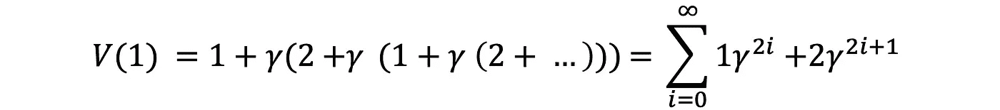
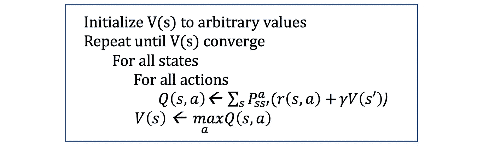

# 值迭代算法

> 原文：<https://towardsdatascience.com/the-value-iteration-algorithm-4714f113f7c5?source=collection_archive---------7----------------------->

## [深度强化学习讲解— 09](https://towardsdatascience.com/tagged/deep-r-l-explained)

## 从代理人的经历中评估过渡和奖励

在[的上一篇文章](/the-bellman-equation-59258a0d3fa7)中，我们介绍了基于价值的代理，并回顾了贝尔曼方程，这是许多强化学习算法的核心要素之一。在本帖中，我们将介绍**价值迭代**方法来计算基于价值的代理所需的 V 值和 Q 值。

> [本出版物的西班牙语版本](https://medium.com/aprendizaje-por-refuerzo/4-programaci%C3%B3n-din%C3%A1mica-924c5abf3bfc)

 [## 4.数字电视节目

### 请访问第 4 页的自由介绍

medium.com](https://medium.com/aprendizaje-por-refuerzo/4-programaci%C3%B3n-din%C3%A1mica-924c5abf3bfc) 

# 使用循环计算 V 值

在前一篇文章中给出的简单例子中，我们在转换中没有循环，并且清楚如何计算状态的值:我们可以从终端状态开始，计算它们的值，然后继续到中心状态。然而，只有环境中存在循环才阻止了这种建议的方法。

让我们看看如何用一个具有两种状态(状态 1 和状态 2)的简单环境来解决这些情况，该环境呈现了下面的状态转换图:

我们只有两种可能的转换:从状态 1，我们只能采取一个带着+1 的奖励进入状态 2 的动作，从状态 2，我们只能采取一个带着+2 的奖励回到状态 1 的动作。因此，由于两种状态之间的无限循环，我们的代理人的生命在无限的状态序列中移动。两种状态的价值是什么？

假设我们有一个贴现因子 *γ* < 1，假设是 0，9，从上一篇文章中记住，状态的最优值等于给我们最大可能预期即时回报的动作的值，加上下一个状态的贴现长期回报:

在我们的示例中，由于每个状态中只有一个可用的操作，我们的代理没有其他选择，因此我们可以将前面的公式简化为:

例如，如果我们从状态 1 开始，状态的顺序将是[1，2，1，2，1，2，…]，由于从状态 1 到状态 2 的每次转换都给我们+1 的奖励，并且每次返回转换都给我们+2 的奖励，奖励的顺序将是[+1，+2，+1，+2，+1，+2，…]。因此，状态 1 的先前公式变为:

严格来说，不可能计算出我们状态的精确值，但是用一个贴现因子 *γ* = 0，9，一个新动作的贡献随着时间的推移而减少。例如，对于扫描 *i* =37，公式的结果是 14.7307838，对于扫描 *i* =50，结果是 14.7365250，对于扫描 *i* =100，结果是 14.7368420。这意味着我们可以在某个点停止计算(例如在 *i* =50)，但仍然可以获得 V 值的良好估计，在这种情况下 *V* (1) = 14.736。

# 值迭代算法

前面的例子可以用来获得一个更一般的过程的要点，这个过程叫做**值迭代算法(VI)** 。这允许我们用已知的转移概率和回报来数值计算马尔可夫决策过程**的状态值。**

值迭代算法背后的思想是将截断的策略评估步骤(如前面的示例所示)和策略改进合并到同一个算法中。

基本上，值迭代算法通过迭代改进 *V* (s)的估计来计算最佳状态值函数。该算法将 *V* (s)初始化为任意随机值。它重复更新 *Q(s，a)* 和 *V* (s)值，直到它们收敛。保证数值迭代[收敛到最优值](http://www.incompleteideas.net/book/first/ebook/node44.html)。下面的伪代码表达了这个建议的算法:

# 过渡和奖励的评估

在实践中，这种值迭代方法有几个局限性。首先，状态空间应该是离散的，足够小，以便对所有状态进行多次迭代。对于我们的冰湖环境来说，这不是一个问题，但在一般的强化学习问题中，情况并非如此。我们将在本系列的后续文章中解决这个问题。

另一个重要的实际问题来自于这样一个事实，即为了更新贝尔曼方程，算法需要知道环境的转移概率和每次转移的回报。

请记住，在我们的冰湖例子中，我们观察状态，决定行动，只有这样我们才能获得下一次观察和转换的奖励，但我们事先不知道这些信息。我们能做些什么来得到它们？

幸运的是，我们能得到的是代理与环境相互作用的历史。所以，前一个问题的答案是用我们代理人的经验作为对两个未知数的估计。下面我们来看看如何实现。

## 报酬估算

评估奖励是最简单的部分，因为奖励可以直接使用。我们只需要记住在从 ***s*** 到***s’***使用动作 ***a.*** 的过渡中我们得到了什么奖励

## 转移估计

估计转换也很容易，例如通过维护代理的经验中每个元组的计数器( ***s*** ， ***a，******s’***)并使它们正常化。

例如，我们可以创建一个简单的表来保存所经历的转换的计数器。表的关键字可以是复合的“状态”+“动作”，( ***s*** ， ***a*** )，每个条目的值都有关于目标状态、 ***s、*** 的信息，以及我们已经看到的每个目标状态、***【c***的次数。

让我们看一个例子。想象一下，在代理的体验过程中，在给定的状态 ***s0*** 中，它已经执行了一个动作*若干次，并最终在状态 **s1** 中执行了 ***c1*** 次，在状态 s ***2*** 中执行了 ***c2*** 次。我们转换到这些状态的次数存储在我们的转换表中。即，表内容{s1: c1，s2: c2}中的条目(s，a)。也许在视觉上，您可以更容易地看到本例表格中包含的信息:*

**

*然后，很容易用这个表来估计我们转换的概率。动作将我们从状态 0 带到状态 1 的概率是 c1 / (c1 + c2)，并且动作将我们从状态 0 带到状态 2 的概率是 c2 / (c1 + c2)。*

*例如，想象一下，从状态 0 开始，我们执行动作 1 十次，4 次之后，它将把我们带到状态 1，6 次之后，它将把我们带到状态 2。对于这个特定的例子，这个表中带有关键字(0，1)的条目内容为{1: 4，2: 6}。这表示从状态 0 转换到状态 1 的概率是 4/10，即 0.4，从状态 0 转换到状态 2 的概率是 6/10，即 0.6。*

*利用从代理的经验中估计的信息，我们已经拥有了能够应用价值迭代算法的所有必要信息。*

# *下一步是什么？*

*按照本系列的实践方法，在接下来的两篇文章中，您将通过解决冰湖环境看到价值迭代方法的实践。*

*下一篇见[！。](/value-iteration-for-v-function-d7bcccc1ec24)*

# *深度强化学习讲解系列*

***由** [**UPC 巴塞罗那理工**](https://www.upc.edu/en) **和** [**巴塞罗那超级计算中心**](https://www.bsc.es/)*

*一个轻松的介绍性[系列](https://torres.ai/deep-reinforcement-learning-explained-series/)以一种实用的方式逐渐向读者介绍这项令人兴奋的技术，它是人工智能领域最新突破性进展的真正推动者。*

* [## 深度强化学习解释-乔迪托雷斯。人工智能

### 本系列的内容](https://torres.ai/deep-reinforcement-learning-explained-series/) 

# 关于这个系列

我在五月份开始写这个系列，那是在巴塞罗那的封锁期。老实说，由于封锁，在业余时间写这些帖子帮助了我 [**#StayAtHome**](https://twitter.com/hashtag/StayAtHome?src=hashtag_click) 。感谢您当年阅读这份刊物；它证明了我所做的努力。

**免责声明** —这些帖子是在巴塞罗纳被封锁期间写的，目的是分散个人注意力和传播科学知识，以防对某人有所帮助，但不是为了成为 DRL 地区的学术参考文献。如果读者需要更严谨的文档，本系列的最后一篇文章提供了大量的学术资源和书籍供读者参考。作者意识到这一系列的帖子可能包含一些错误，如果目的是一个学术文件，则需要对英文文本进行修订以改进它。但是，尽管作者想提高内容的数量和质量，他的职业承诺并没有留给他这样做的自由时间。然而，作者同意提炼所有那些读者可以尽快报告的错误。*