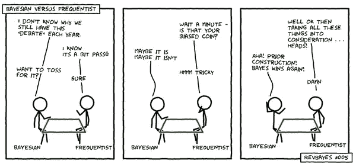
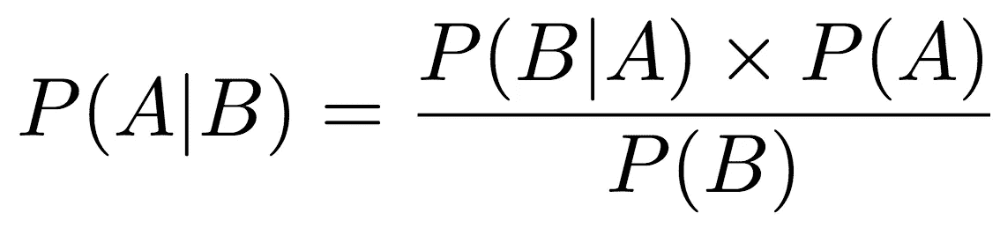

# A/B 测试的价值

> 原文：<https://towardsdatascience.com/the-value-of-a-b-testing-b5b3a58e5df7?source=collection_archive---------52----------------------->

## A/B 测试通常是人们优化广告活动设置的首选。有了 A/B 测试，你可以根据更科学的数据做出选择，而不是依靠猜测。

杰森·登特在 [Unsplash](https://unsplash.com/s/photos/ab-testing?utm_source=unsplash&utm_medium=referral&utm_content=creditCopyText) 上拍摄的照片

**A/B 测试值**

A/B 测试，也称为桶测试或分割运行测试，是一个随机实验，涉及两个变量(A 和 B)。它是一种比较单个变量的两个版本的方法，以确定两个版本中哪一个更有效。

**我们 A/B 测试我们能测试的一切！**

我们 A/B 测试什么？一切和一切！以下是一些例子:

*   **算法。我们的媒体购买是通过复杂的算法架构完成的。系统中的每一个组成部分都在不断地对照备选方案进行评估。这就是我们如何随着时间的推移而改进的。**
*   **创意人员。**我们在 A/B 测试类型的实验中不断测试不同的创意，因为不同的受众对不同的事物有不同的反应。这是实现最佳性能的关键。
*   **观众。**我们对我们的目标受众进行 A/B 测试，以衡量不同特征的影响，并帮助我们调整谁是最佳目标。
*   **特性。**在新特性出现在我们的全球架构中之前，它会在受控实验中单独进行测量。

**A/B 测试步骤**

这里概述的五个步骤提供了一个基本的指导方针，当你想执行 A/B 测试时，可以全面地应用。

1.  ‍决定测试什么。
    你想考什么？在开始 A/B 测试之前，你需要清楚这一点。从单个元素开始，确保它与您想要改进的指标相关。例如，如果您有兴趣从第 7 天 ROI(安装前 7 天内的投资回报)的角度提高目标受众的质量，可以考虑在给定的受众中测试不同的功能。这将帮助你在给定的受众中只保留高质量的用户，从而提高你的整体投资回报率。
2.  ‍ **设定要衡量的目标或 KPI。**
    在你开始 A/B 测试之前，你也需要清楚你的目标是什么。上面的例子旨在提高第 7 天的投资回报率。你可能对任何事情感兴趣，从提高点击率到增加购买率等等。你的 A/B 测试的成功很大程度上依赖于清晰地设定 KPI 或目标，因为这将有助于确保你生成更清晰的数据。再次强调，关注单个指标，记住你可以在以后用其他指标做额外的 A/B 测试。
3.  ‍ **设计你的测试。‍现在我们开始变得有创意了。当你设计你的 A/B 测试时，你需要创建你的 A 组和 B 组。这样做时，确保这些组除了您正在测量的度量的之外都是相同的*。此外，一定要避免任何可能扭曲你的结果的偏见。***
4.  ‍ **积累数据。‍让你的测试运行起来。确保你记录了所有可能与你以后分析结果相关的数据。此外，确保给你的 A/B 测试足够的时间来运行，以便它生成大量的代表性数据。**
5.  ‍ **分析结果。** 在下面，你会找到关于如何根据哪组“赢得”测试得出结论的信息。

**频率主义者还是贝叶斯主义者？**

频率主义方法和贝叶斯方法是两种统计方法，每种方法都有自己独特的观点，其中包括分析 A/B 测试的结果。每种方法都有自己的优点。

来源:[xkcd.com](https://xkcd.com/)

**frequent ist 方法** 该方法涉及使用 p 值在两个假设之间进行选择。第一个假设是零假设(A 和 B 没有区别)。第二种是替代假设(即 A！=B，A > B 或 A < B 等。).

p 值衡量观察到 A 和 B 之间的差异的可能性，这种差异至少与我们实际观察到的差异一样极端。一旦该值达到统计学显著性，实验就完成了。

**贝叶斯方法** 我的团队(大部分)更喜欢贝叶斯方法，在 A/B 测试方法论中也是如此。这包括将每个变量的度量建模为具有某种概率分布的随机变量。

来源:作家

在贝叶斯 A/B 测试中，我们将每个参数建模为具有某种概率分布的随机变量。基于以前的经验，我们可能会认为某个创意对于某个受众的点击率有一定范围的可能值，这种信念在我们以前的分布中有所体现。在观察了来自两个变量的数据后，我们更新了关于每个变量最可能值的先前信念。下面，我展示了一个观察数据后后验分布的例子。

通过计算每个变量的后验分布，我们可以通过概率陈述来表达我们信念的不确定性。例如，我们可以问“在其他条件相同的情况下，对于相同的受众，创意 B 的点击率大于创意 A 的点击率的概率是多少？”。

**结论**

A/B 测试是收集信息和做出基于数据的决策的最流行和最有效的方法之一。我的团队在我们可以测量的任何东西上经常使用 A/B 测试。毕竟，数据驱动的决策总是比基于直觉的决策更可取。

当你开始执行 A/B 测试时，考虑一下上面描述的哪种方法更适合你，并确保遵循我们列出的执行测试的五个步骤。