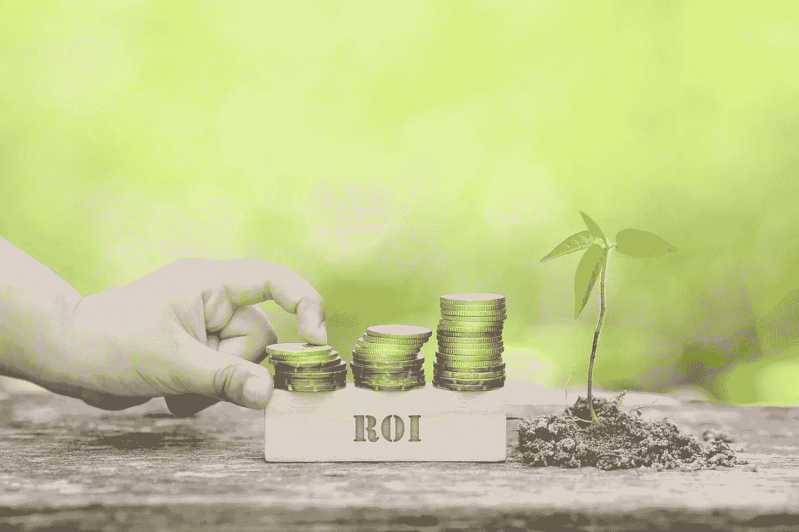

# 数据组织的价值:两个轴心的故事

> 原文：<https://towardsdatascience.com/the-value-of-a-data-organization-a-tale-of-two-axes-3aeae450ae71?source=collection_archive---------73----------------------->

## 衡量数据团队投资回报率的实用方法

> ***作者:*** [***巴尔哈·萨克塞纳***](https://www.linkedin.com/in/barkhasaxena/) ***，Poshmark 首席数据官，*** [***巴尔·摩西***](https://www.linkedin.com/in/barrmoses/) ***，蒙特卡洛首席执行官。本文首发于*** [***福布斯***](https://www.forbes.com/sites/forbestechcouncil/2020/01/03/quantifying-the-value-of-a-data-organization-a-tale-of-two-axes/#489e5a40376a) ***。***

由[从](https://www.shutterstock.com/g/nelzaj)[梭托](https://www.shutterstock.com/image-photo/roi-word-golden-coin-stacked-wooden-568454614)上取下

*“数据组织的价值是什么？数据领导者应该如何考虑他们团队的投资回报率？”*

随着数据专业人员(数据科学家、分析师和工程师)数量的快速增长，以及数据角色之间的界限变得模糊，衡量和传达数据团队的投资回报率绝非易事。但是考虑到这一领域的巨大投资，理解这一价值对整个数据行业来说是一个存在的问题。在这篇博客文章中，我们想建议一个实用的框架，根据对各种业务成果的贡献来衡量数据团队的投资回报率。

# **数据团队在整个企业中扮演的角色**

数据团队通常以多种方式在业务中扮演重要角色:

*   *提高各种业务职能的日常运营计划的投资回报率，例如营销活动分析、新功能的 A/B 测试*
*   *推动新的战略计划，例如，发现发展新用户群的机会*
*   *发现并推动新的机会，例如，识别导致新产品功能或营销理念的用户行为*
*   *推动扩展计划，例如构建新的实验平台*
*   *建立新的能力，例如开发推荐系统*

换句话说，数据团队与其他业务职能部门协同工作。因此，要全面了解数据组织的 ROI，我们必须从公司每个职能部门的角度来审视它。一个数据团队最好能让每一项业务职能——最终是整个公司——都由数据驱动。

让我们通过一个营销中的**示例来说明数据团队如何让营销更加数据化。数据团队通过以下方式帮助他们的营销同行:**

*   **提高日常业务运营的投资回报率:**数据团队持续分析不同渠道的完整营销渠道，并与营销经理密切合作，亲自为不同类型的活动提供日常指导，并推荐有助于提高绩效和实现最佳结果的战术变化。
*   **推动新的战略增长计划**:数据团队与营销团队合作，全面评估新渠道或新营销战略，例如，在进一步投资这些新计划之前，通过创建一些模拟场景来更好地了解预期结果。这使得营销团队能够确保在更有可能产生更强劲增长的领域进行投资。
*   **发现并推动新的机会:**在与营销部门的日常运营合作过程中，或者在探索新的增长计划时，数据团队发现了一些新的东西——一个特定的客户群、不断变化的沟通偏好或营销组件的组合——这些东西以前没有经过明确的测试，但似乎显示出很高的投资回报率。
*   **推动扩展计划:**数据团队投资构建一系列工具，从自动化分析洞察到更高效的实验能力，再到能够更快提供更多关键信息的新数据管道。
*   **构建新功能:**数据团队构建多点接触归因模型，以更好地优化多渠道支出，或者构建竞价优化模型，在扩大支出的同时提高投资回报率。

现在，这些定性的贡献已经很明显了。但是怎么衡量呢？我们建议使用二维测量框架来测量数据团队的 ROI，如下表所示。

# 引入衡量数据团队投资回报的框架

为了理解数据团队的价值，我们可以根据业务功能(这里是营销，通过行表示)和工作性质(通过列表示)将团队的当前和未来计划映射到一个单元中。

在此基础上，我们可以使用以下两种方法之一来计算数据团队的 ROI:

# **方法 1:影响记分卡**

在这种方法中，我们使用如下所述的评分系统来衡量数据团队的影响:

*   上面的每一列最多有 20 分。
*   作为起点，我们可以使用线性标度来分配点。这意味着每个业务职能都有 2.5 分。例如，如果数据团队参与了给定列中 50%的功能，我们给 10 分；或者，如果数据团队参与了给定列中 100%的功能，我们给 20 分。
*   为了说明不同职能对公司的重要性，可以用 20 点的加权分布来代替。根据公司所处的阶段和行业性质，这可能是一个很好的选择。我们将在以后的文章中解开这个框架。
*   然后，我们将所有列和行的分数相加，得出一个“数据团队影响”分数，范围为 0 到 100。

# **方法 2: ROI 分配**

在这种方法中，我们将不同业务职能的投资回报率的%分配给数据团队:

*   因为数据团队通过其对不同业务功能的影响为组织创造价值，我们假设数据团队的投资回报率可以通过将每个功能的投资回报率的%分配给数据团队来衡量。
*   在这种方法中，我们将着眼于数据团队的聚合价值(跨越上表中的所有列),而不是针对不同类别的增值单独进行衡量。
*   这一百分比分配将取决于数据团队参与特定职能的程度以及组织文化。例如，一个非常严重的数据驱动型组织，其中包括首席执行官在内的执行领导层真正相信数据提供的价值，与可能没有相同数据文化和执行支持的组织相比，他们总是给予更高的%价值。

在我们的营销示例场景中，数据团队的价值可以按如下方式衡量:

**方法 1:** 如果数据团队参与了上述所有营销角色，他们将得到 2.5 分，总分为 12.5 分，这是数据团队参与业务职能的最高分，体现了他们对营销职能的贡献。

**方法 2:** 如果营销团队在给定时期内通过所有增长、扩展和效率计划为企业带来了 1 亿美元的价值，我们可以将其中的 25%到 35%归功于数据团队，这取决于团队的参与程度。

因此，这个 ROI 框架为数据团队所做的贡献赋予了切实的价值。它也是高度可视化的，这是向领导者和其他团队展示数据团队的价值的另一种有用的方式，以及它一直在做的事情，一目了然。这样，除了衡量 ROI 之外，该框架还可以成为数据团队优先考虑和评估未来机会的有用工具。

与任何其他衡量方法一样，以适当的节奏衡量数据团队的影响非常重要，这样可以发现改进的机会，并根据具体情况确定绩效。我们建议每季度进行一次轻量级测量，每年进行一次更彻底的测量。季度检查允许进行必要的年中过程修正，以确保组织从其数据投资中获得最佳价值，而年度检查将确保制定长期战略，以继续加速价值创造。

以这种方式衡量和交流我们的数据团队的投资回报率，使我们能够将我们团队的工作与推动我们的客户和业务向前发展的有意义的价值结合起来。我们努力确保我们始终致力于公司的最高优先级—句号。如果您现在使用这个框架来衡量您的数据团队的投资回报率，您会学到什么？

**联系** [***巴尔卡萨克塞纳***](https://www.linkedin.com/in/barkhasaxena/) ***或*** [***巴尔摩西***](https://www.linkedin.com/in/barrmoses/) **如有任何问题、意见或建议。**