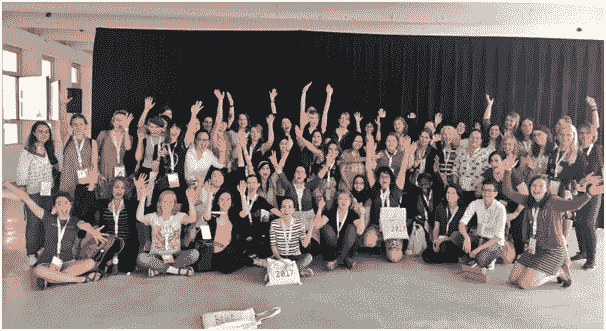
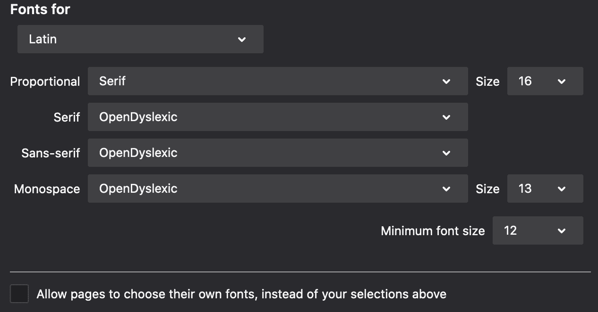
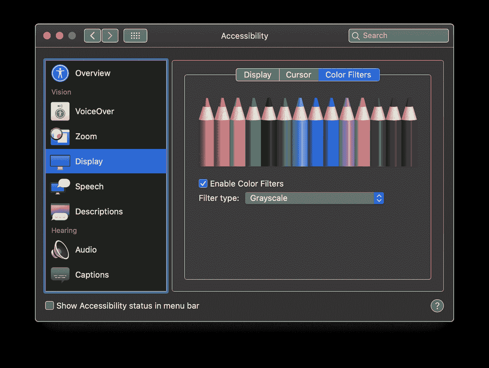

# 快乐在数据科学中的价值

> 原文：<https://towardsdatascience.com/the-value-of-happiness-in-data-science-965950a446f3?source=collection_archive---------78----------------------->

## 如何通过看似微小的行为来实现一点点社会变革

照片由[野生禅艺](https://medium.com/u/dcd64b4aafe1?source=post_page-----965950a446f3--------------------------------)拍摄

你可能会觉得你的工作与我们社会面临的社会问题不太相关。你工作场所的结构性问题可能看起来如此之大，以至于你感到无力做出改变。如果有一种方法可以影响一些小的变化，而这些变化却能产生巨大的影响，那会怎么样？

数据科学家花了很多时间来定义作为一名数据科学家意味着什么。[文章](https://venturebeat.com/2017/11/30/what-ibm-looks-for-in-a-data-scientist/)、[在线课程](https://www.coursera.org/professional-certificates/ibm-data-science)和[学位项目](https://www.mastersindatascience.org/schools/data-science-degrees-online/)设定行业预期。我们被告知如何设计团队和工作流程[到最小的流程](https://www.coursera.org/learn/build-data-science-team)。纵观这些无数的定义，有一个共同的线索:“数据科学”是一项发明。定义作为一名数据科学家意味着什么并不会让作为一名数据科学家工作变得更有意义。事实上，我们越是试图定义难以捉摸的数据科学家角色，我们就越是限制这个定义所包含的人。

“数据科学家”角色排除了哪些人？( [R-Ladies](https://rladies.org/) 组拍摄于[用户 2017](https://user2017.brussels/) ，作者图为前排右下第二，经由 [R-Ladies Global](https://rladies.org/about-us/history/) )

我们在简历上积累经验，以展示我们的能力和信誉。我们微调我们精心制作的社交媒体档案，以最大限度地扩大我们的影响力和参与度。最终，人们看重的不是我们的头衔、奖项或学位。这是我们做事的方式。工作要求很少列出成为一个好的队友。在我参加的几乎每一轮面试中，“团队配合”都是招聘决定中最关键的部分。

IBM 的《数据科学家的一天》(IBM 职业生涯截图)

[可访问性](https://developer.mozilla.org/en-US/docs/Learn/Accessibility/What_is_accessibility)是为残疾人设计软件的领域，其中残疾被定义为[在参与社会](https://arxiv.org/vc/arxiv/papers/1908/1908.08939v1.pdf)时遇到障碍。任何曾经参与过求职过程的人都切身体会到，你不必有身体上的障碍[经历上的障碍](https://www.businessinsider.com/gabriela-de-queiroz-ibm-manager-r-ladies-meetup-2019-8)。这就是为什么我更喜欢“包容性”一词，而不是“可及性”。包容性来自梵语单词 *upekkha* 。Upekkha 的意思是以一种不歧视的精神去包容一切事物和每个人的“好”和“坏”。

实践包容性意味着接受各种人必须提供的价值，包括神经有分歧的人、具有不同学习和解决问题风格的人、来自不同种族背景的人，他们的语言也可能不同，以及使用计算机方式不同的人。

“如果你的团队中没有以某种方式使用工具的人，或者你的团队没有包含一系列的观点，那么当你构建一个工具并考虑工具的用户时，就很难记住这些，”IBM 的易访问性领导团队的成员 Shari Trewin 说。根据 Trewin 的说法，从不同的角度考虑您的解决方案通常会揭示您的设计中更大的局限性，尤其是在早期。IBM 人工智能交互研究员迈克尔·穆勒(Michael Muller)表示:“如果我们能够从自己的经验或任何与生俱来的东西中互相学习，我们会把每件事做得更好。”。

# 将包容性付诸实践

当每个人都有责任实践包容性时，包含不同的观点是最容易的。

> “我们没有一个人像我们所有人一样聪明……我们不知道的东西太多了。与我一起工作的人的经历或个性的任何种类的增加都将教会我一些东西，并将使我变得更好、更强、更善良，甚至更聪明。”
> 
> 迈克尔穆勒，IBM 人工智能交互研究员。

## 什么对你来说很难？

许多从事电脑工作的人都患有身体疾病，包括重复性劳损(RSI)和眼疲劳。我们还可能会因为不良姿势而感到背痛，或者因为不良饮食习惯和缺乏锻炼而出现其他健康问题，这些都是长时间工作的可能结果。

> 根据 OSHA，与工作相关的肌肉骨骼疾病，包括 RSI 损伤，雇主每年损失超过 600，000 个工作日，并支付超过 200 亿美元的工人赔偿。
> 
> 国家职业安全和健康研究所显示，每天使用电脑超过 2 小时的 7500 万人中有 91%患有某种视力问题，通常导致眼睛疲劳或头痛。
> 
> via [健康日](https://consumer.healthday.com/encyclopedia/work-and-health-41/occupational-health-news-507/software-engineers-646385.html)

除了身体紧张，认知紧张也会影响我们的工作表现。如果我们花费大量的认知能量来调整[我们解决问题的方式](https://en.wikipedia.org/wiki/Kinesthetic_learning)以适应一个设计糟糕的软件工具或网站，我们花费在实际工作上的整体精神能量就会减少。据 [Gendermag 项目](https://gendermag.org/gendermag.php)称，这类工具甚至可能会加剧社会人口代表性不足人群所经历的职业障碍。

## 还有谁有这种经历？

我们很多人都喜欢解决问题，尤其是为自己解决问题。当我们热情地向他人推销我们的解决方案时，当他们不像我们认为的那样感激我们的帮助时，我们可能会感到沮丧。在[设计-思考](https://en.wikipedia.org/wiki/Design_thinking)你自己的解决方案之前，看看还有谁也觉得这件事很难。用这个问题作为开始谈话的方式。我们可以学到很多东西，不仅仅是通过分享自己的经历，还可以通过倾听他人的经历。

当我开始经历长时间使用电脑导致的周期性头痛时，我了解到许多像我一样被诊断患有多动症的人通常属于诵读困难症谱系的 T2。我联系了一位患有诵读困难症的同事，向他学习更多的工具和技巧。[这些对我很有帮助](https://sensory-processing.middletownautism.com/sensory-strategies/strategies-according-to-sense/visual/over-responsive/)，所以我打开了一个工作空闲频道，以方便访问。我不仅帮助了另一个患有多动症的人，还从他们身上学到了新的东西。我甚至能够用我所学的新东西来帮助我有阅读障碍的同事。

随着这些便利成为我工作流程的一部分，我遇到了许多网站和应用程序无法为他们的用户提供阅读障碍便利。结果，我成了一个更有效的可访问性倡导者。

开放式阅读障碍是一种免费字体，它让我的大脑(和我的眼睛)感到快乐，即使我没有被诊断为阅读障碍。([开放性阅读障碍](https://opendyslexic.org/)截图)

[Mozilla Firefox](https://www.mozilla.org/en-US/firefox/new/) 提供了对浏览器中字体呈现方式的完全控制(但苹果不让我自定义系统字体)。(截图来自作者电脑)

虽然[苹果的辅助功能](https://www.apple.com/accessibility/mac/)不允许自定义系统字体，但灰度过滤器是一个我觉得非常有用的功能。(截图来自作者电脑)

我们的目标不仅仅是为自己解决问题。我们也想让其他人的事情变得更容易。我们能够做到这一点的唯一方法是努力去理解对方正在经历的事情，这才是真正令人满意和有意义的。

华盛顿大学保罗·g·艾伦计算机科学工程学院负责多样性和包容性的教授兼副主任詹妮弗·曼克夫非常关心选择正确的问题。她鼓励她的学生不要回避难做的事情。她甚至建议，研究那些使任务变得困难的工具的局限性，可以揭示出那些对解决问题有很大价值的事情。

Emily Shea 展示了她如何使用语音听写来适应 RSI 程序员的工作(来源:Youtube)

许多人可能没有意识到他们正在经历障碍，因为他们已经习惯了适应。通过探索替代工作模式，我们可以防止大量的工作场所伤害和可能的歧视。

# 实践包容性的另一种方式

提高对工作条件的认识鼓励我们优先考虑个人福祉。帮助彼此健康也延伸到我们的情感健康。

心、星星和喜欢是孩子们表达和接受感激的早餐麦片。它们会让我们在一瞬间感觉很棒，但是它们会让我们渴望更多。我们甚至会付出很多努力来满足这种渴望。

人们喜欢数 Github 明星，虽然[不清楚他们的价值是多少](https://opensource.stackexchange.com/questions/5110/github-stars-is-a-very-useful-metric-but-for-what)([Gitstar 排名](https://gitstar-ranking.com/IBM)截图)

分享感激之情的更健康的方式是写一封贴心的感谢信。很多人只有在出问题的时候才会得到反馈。除了正式的审核过程，我们很少有人听说我们做对了什么。花些时间向同事表达你的感激之情，以书面形式，感谢他们对你的帮助，不管是多么小的帮助。如果合适，一定要抄送给他们的经理。这样做对于团结那些不太符合工作角色“理想”形象的同事尤为重要。

如果你的公司没有正式的赏识程序，可以考虑倡导一个(针对现任/前任员工的 [IBM 认可中心](https://ibmrr.performnet.com/ibmrr/login.do)的截图)

当我们的生活让我们感到身体紧张和情绪枯竭时，寻找幸福是困难的。与其通过升职和荣誉来寻求解脱，不如通过互相帮助来感受与同事的联系，培养工作中的成就感。通过提高我们的集体生活质量，我们加强了我们的相互联系和我们对社会的整体价值。一起，我们可以把我们的“日常琐事”变成“日常琐事”。

照片由[野生禅艺](https://medium.com/u/dcd64b4aafe1?source=post_page-----965950a446f3--------------------------------)拍摄

## 信用

*   感谢我的 IBM 同事[沙里·特里文](https://www.linkedin.com/in/shari-trewin-1a40a24/)和[迈克尔·穆勒](https://www.linkedin.com/in/michael-muller-a3a3476/)分享他们的专业见解。
*   感谢[教授詹妮弗·曼科夫](https://make4all.org/portfolio/jennifer-mankoff/)分享她无价的学术研究智慧金块。
*   虽然我在文章中没有引用[迦娜·基梅尔](https://www.linkedin.com/in/jckimel/)的话，但我还是要感谢她在[波特兰无障碍会议](https://www.meetup.com/Portland-Accessibility-and-User-Experience-Meetup/)后令人鼓舞的对话。她的准确问题激发了这篇文章的主题。
*   感谢 [IBM CODAIT](https://medium.com/codait) 团队花时间阅读本文并提供有用的反馈。

## 额外资源

*   [IBM Equal Access Toolkit](https://www.ibm.com/able/)——一个易于使用的 Firefox 增强工具，可以让您测试网站的可访问性。甚至[数据科学家](https://medium.com/codait/im-a-data-scientist-not-a-ui-designer-d407b3ba5c24)可能也会觉得有用！
*   [make 4 all](https://make4all.org/)——通过数据科学以及 3D 打印和其他制造技术，让我们的数字未来更加包容。
*   [gender mag 项目](https://gendermag.org/) —帮助您找到并修复包含“bug”的软件功能的工具。