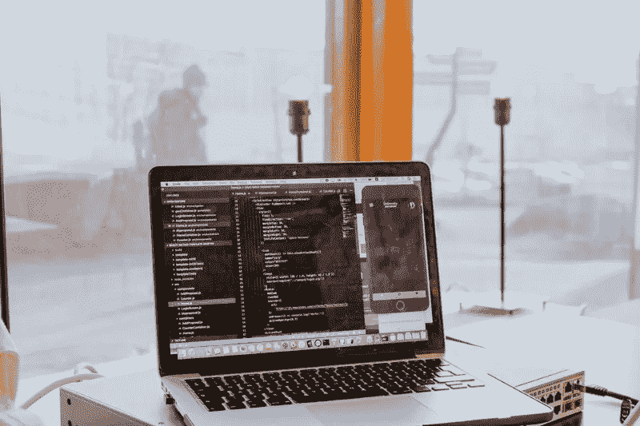

# 数据科学家的头衔正在出售

> 原文：<https://towardsdatascience.com/the-value-of-the-title-of-data-scientist-devalued-1ddf3dc4459b?source=collection_archive---------69----------------------->

## 意见

## 数据科学行业的新“美元树”业务正在蓬勃发展。但也很让人失望。

[https://unsplash.com/photos/njcCsp58sDc](https://unsplash.com/photos/njcCsp58sDc)

# 浮躁的时代

> “我现在是数据科学家了！请查看我的数据分析认证……”

前几天有人在我的一个社交 app 上贴了这个带认证的图片。在过去的三个月里，这大概是我第十次看到这样的帖子了。我几乎不认识写这个帖子的人，但我知道他是体育管理专业的，他甚至连处理 Excel 表格都有问题。

现在人们自称为 ***数据科学家*** ，或者 ***数据工程师*** 似乎很容易。

在我继续讲下去之前，我必须在这里澄清一下。我喜欢看到人们享受学习的过程，分享他们一路走来的收获。但是最近一段时间，我可以从字面上感受到，学术氛围已经比以往更加浮躁。人们更喜欢参加短期课程，获得一些看似可信的证书，在简历上有花哨的头衔，而不是花数年时间真正获得学位，进行深入研究，获得一些有意义的经验。这让我很困扰。

# 知识是廉价的，但经验不是

unsplash.com

在过去的几年里，最热门的大学专业已经从计算机科学转向了商业分析。社交媒体一直在谈论商业分析或数据分析。各行各业的人都赶在天气变冷之前开始流行起来。

尤其是新冠肺炎疫情爆发后，人们开始在家学习和工作。越来越多的企业涉足在线学习，因为这个市场比以往任何时候都大。我每天至少能看到三次标题为“在……内学习数据科学”的广告。为了吸引更多的用户，这些机构往往会给予相当大的折扣。据我所知，只要一美元，人们就可以开始学习 python 编程。

我尊重那些乐于分享知识的人。但是正如我上面提到的，参加这些课程的人可能会有不同的想法。我们生活在历史上最好的时代。每个人都可以无限制地获取资源，这些资源可以帮助我们提高和增长特定的知识。但是一门 20 小时、50 美元的在线课程不可能让任何人成为数据科学家。

贬低数据科学家的头衔对于那些在数据科学领域花费多年时间来发展基础和推动行业更上一层楼的人来说也不公平。图片一个人刚从维基百科学了一些行话就自称艺术家，你是什么感受？想象一下，当一个人刚学会做意大利面条时，他自称是意大利菜的首席厨师，你会怎么想？

> “站在喜马拉雅山脚下不等于征服珠穆朗玛峰。”

# 实践是王道

> 我曾经听过一个传言:无论你多么擅长编程，你都会输给擅长演示的人。

大约九个月前，我开始学习商业分析。然而，我学得越多，就越发现自己无知。我做得越多，我就越会在工作中小心谨慎，因为我总是知道，任何时候骄傲自大都可能让我不知不觉地误入歧途。

我喜欢编码。我从编程中学到的是，激情不会产生任何东西，除非我把能量付诸行动。而且，重复练习才是王道。

我仍然清楚地记得，我的第一个中级 SQL 作业花了我五个小时来解决 12 个问题。我研究了我写的每一行代码，尽我所能去理解它们的逻辑。从 where 子句到 inner join，从 case 子句到 pivot table，从 with 子句到堆叠条形图，我阅读了大量的堆栈溢出帖子。在成功执行代码之前，我失败了一百次。我只花了我的努力和时间来提高我的 SQL 技能。

今年一月，我获得了研究助理的职位。我的第一个任务是计算样板文件(在这里查看)。我在“for 循环”代码上困了一个星期。我从午夜到早上花了几个小时在谷歌上搜索和阅读研究论文。直到我得到教授一丝不苟的指导，我还是无法解决这个问题。我并不为自己如此低效而自豪。然而，我从这项任务中学到的比我在学校几个月学到的还要多。

调试可能是数据科学中最乏味的工作。你有一个伟大的想法，但你不能把它付诸实施。多么令人沮丧啊！如果你有这种感觉，说明你遇到了你的瓶颈。接受你不够好的事实，继续做更多的研究，读更多的论文，做更多的锻炼。编码和投篮没有区别。想想在你连续投中两个三分之前，你投失了多少次。

我仍然鼓励每个人在网上分享他们的发现，因为这是我们进化的方式。而且我个人也上过很多网络课程。但是知识不是被授予的。人不会神奇地掌握任何东西。想在数据科学领域开始职业生涯吗？我的建议是，要有耐心，向比你优秀的人学习，分析你犯的错误，把你的知识运用到真实的案例中。

我可能永远不会成为最伟大的数据科学家之一。但是我知道我每天都在进步。