# 范德蒙行列式，一种新的证明

> 原文：<https://towardsdatascience.com/the-vandermonde-determinant-a-novel-proof-851d107bd728?source=collection_archive---------7----------------------->

## 范德蒙矩阵的应用和行列式的一个原始证明

几乎所有学习线性代数的学生都会在整个学习过程中的某个时候学习范德蒙矩阵。这种类型的矩阵在数学和科学中有着广泛的应用，而且非常容易获取，这使得它成为你的数学工具箱中非常有用的工具。在本文中，我们将看看范德蒙矩阵在插值中的一个简单应用，然后以范德蒙矩阵的著名行列式的原始证明结束。首先让我们从一个简单的定义开始。

**定义:**范德蒙矩阵是以下形式的方阵

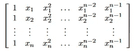

也许范德蒙矩阵最常见的应用是在插值领域。假设我们在平面上有 n 个*点的集合*

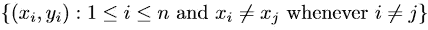

我们可以用一条平滑的曲线连接这些点，特别是用一个次数为 *n-1:* 的多项式

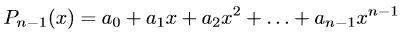

为此，我们将我们的点插入生成系统的多项式中

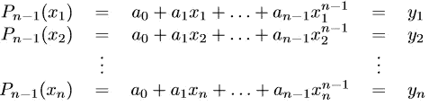

但是请注意，这相当于矩阵方程

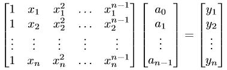

我们应该很高兴看到左边的范德蒙矩阵。因此，我们把它简化为求解上面的矩阵方程。唉，不是所有的矩阵方程都有解。我们怎么知道上面的方程是可解的？一种方法是验证范德蒙矩阵将具有非零行列式。

碰巧范德蒙行列式是线性代数中的名人。行列式的表达式出奇的优雅，我们马上就会看到，似乎每个人都有自己的证明方法。这正是我们在这里要做的，我们要写一个原始的证明——尽可能地接近——范德蒙矩阵的行列式。

**定理**如果 *A* 是范德蒙矩阵，则

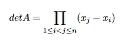

**证明(通过归纳)**我们根据矩阵的顺序 *n* 进行归纳。如果 *n=1* 则无显示内容。本着验证的精神，设 *n=2。*那么

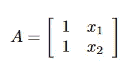

一般的 2×2 范德蒙矩阵

现在，在这种特殊情况下，行列式的公式使用起来很简单，并产生

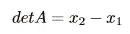

如你所愿。现在假设这个说法适用于第 n-1 个 T21。设 *A* 为 *n* 阶范德蒙矩阵。通过行操作，我们得到

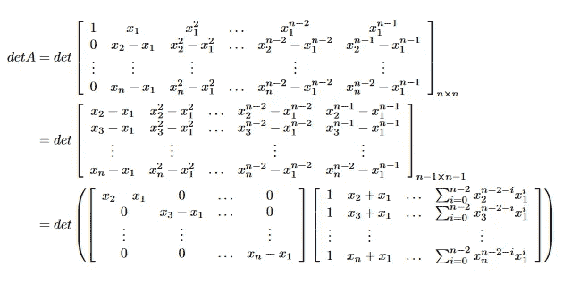

根据柯西定理，我们得到

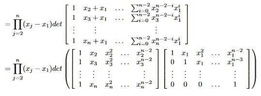

同样，由柯西，我们有

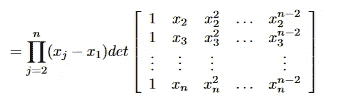

通过归纳假设，我们得到

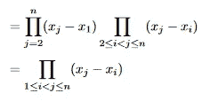

如你所愿。

现在，有了行列式的表达式，很容易看出上面的原始矩阵方程是否有解。事实上，我们可以展示的是，由于我们点的所有 x 值都是不同的，所以确实会有解。这只是范德蒙矩阵的众多用途之一。