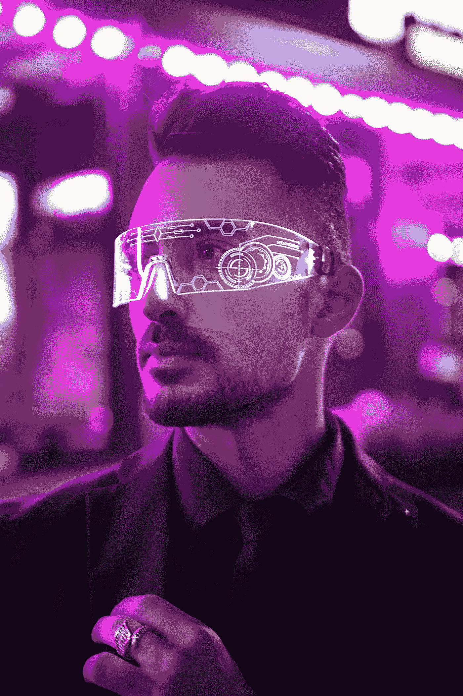
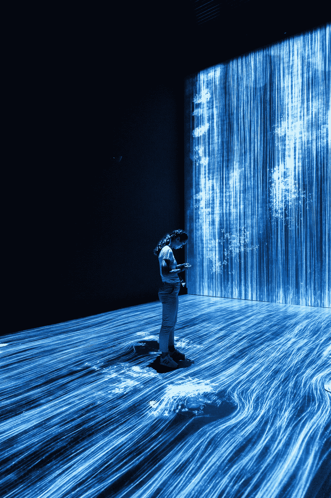
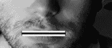
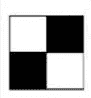
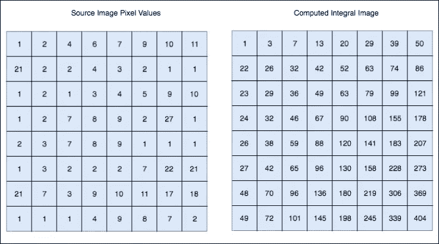

# 维奥拉-琼斯算法

> 原文：<https://towardsdatascience.com/the-viola-jones-algorithm-7357c07d8356?source=collection_archive---------45----------------------->

照片由 Ameer Basheer 在 Unsplash 上拍摄

使计算机或手机等机器看到周围环境的现象被称为计算机视觉。它是计算机科学的一个领域，专注于复制人类视觉系统的部分复杂性，并使计算机能够像人类一样识别和处理图像和视频中的对象。

计算机视觉的一些应用包括:

*   目标检测
*   人脸检测
*   人脸识别
*   自动驾驶汽车
*   自主无人机

人脸检测并不完美，但它已经达到了在我们的日常生活中被接受的阶段，从解锁手机到汇款。

# 维奥拉-琼斯算法

该算法是 OpenCV 库的基础。它是由保罗·维奥拉和迈克尔·琼斯在 2001 年开发的。它允许实时检测图像。

# 它是如何工作的

这个算法有两个阶段

1.  培养
2.  侦查

我们将首先讨论检测

## **检测**

这种算法被设计用来寻找**正面人脸。**检测侧向、向上或向下时，性能会很差。图像首先被转换为灰度，因为它更容易处理，需要处理的数据更少。该算法首先在灰度图像中找到人脸，然后在彩色图像中找到人脸的位置。

它勾勒出一个矩形框，并从左上角搜索人脸。它寻找类似 haar 的特征，我们将在本博客后面讨论。在瓷砖上每走一步后的矩形方块右侧。

mahdis mousavi 在 Unsplash 上拍摄的照片

# 类哈尔特征

它是以发展了哈尔小波概念的匈牙利数学家阿尔弗雷德·哈尔的名字命名的。下面的特征显示了一个有亮侧和暗侧的盒子，这是机器如何确定特征是什么的。

维奥拉和琼斯发现了三种类型的哈尔特征，它们是

1.  边缘特征
2.  线特征
3.  四个矩形特征/四边特征

**边缘特征**

例如，您想要检测眉毛。图像中眉毛上的像素的阴影将变暗，并突然变亮(皮肤)。边缘特征非常有助于找到这一点。

边缘特征

## 线特征

自然地，你的嘴唇在脸上的区域从亮变暗，然后又变亮。这个特征最好找

线特征

## 四个侧面特征

四矩形特征

这些特征帮助机器理解图像是什么。当检查图像时，每个特征都有自己的值。这很容易计算:从黑色区域减去白色区域

# 整体图像

随着像素数量的增加，即在更大的图像中，计算一个特征的值将变得非常复杂。积分图像概念有助于快速执行密集计算，因此我们可以了解多个特征中的一个特征是否符合标准。

让我们解释一下它是如何工作的。考虑下图

**积分图像中的每一个点都是源图像**中相应像素上方和左侧像素的总和。我们使用这个是因为我们不是对所有特征的每个像素值做加法，而是利用一些减法来得到相同的结果。

# 训练分类器

在训练中，我们给它输入信息，训练分类器从预测信息中学习。因此，最终，该算法将设置一个最小阈值来确定某个事物是否可以被归类为一个特征。

在训练阶段，图像缩小为 24*24 像素，并在图像中搜索特征。我们需要大量的图像数据来训练算法。Viola 和 Jones 向他们的算法输入了 4960 张手动标记的图像。我们还应该向分类器提供非面部图像，以便它能够分类和理解。Viola 和 Jones 为他们的算法提供了 9544 张非面部图像。

# 自适应增压

当我们观察所有可能的位置和这些特征的组合时，我们得到了一个精确的模型。训练在计算上可能是昂贵的，以检查每个图像中的每一种可能性和组合，这需要很多时间。

这里我们有一个以 f1，f2，f3 为特征，以 a1，a1，a3 为各自权重的方程。F(x)称为强分类器。单个分类器将是弱的，当我们有两个或三个弱分类器的组合时，我们得到一个强分类器。这个过程被称为**合奏。**

# 级联

这是另一种提高模型精度和速度的方法。在这里，我们首先选取一个子窗口，然后选取最佳特征，检查它是否出现在图像中。如果不是，我们拒绝该子窗口，并继续到另一个子窗口。如果它存在，我们看第二个特征，如果它不存在，我们拒绝它，并转移到另一个特征。级联加速了这一过程，并且机器更快地传递结果。

就这些了，希望你喜欢我关于计算机视觉的博客！。在我的下一篇博客中，我们将讨论使用 OpenCV 的人脸识别。