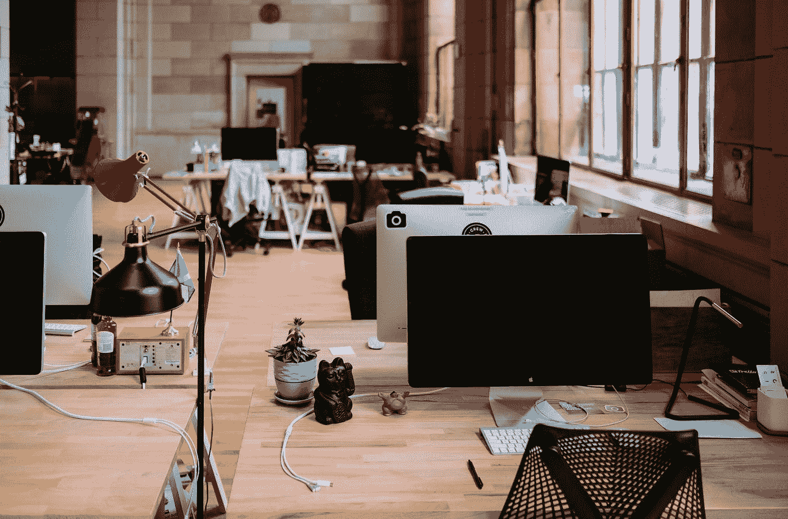
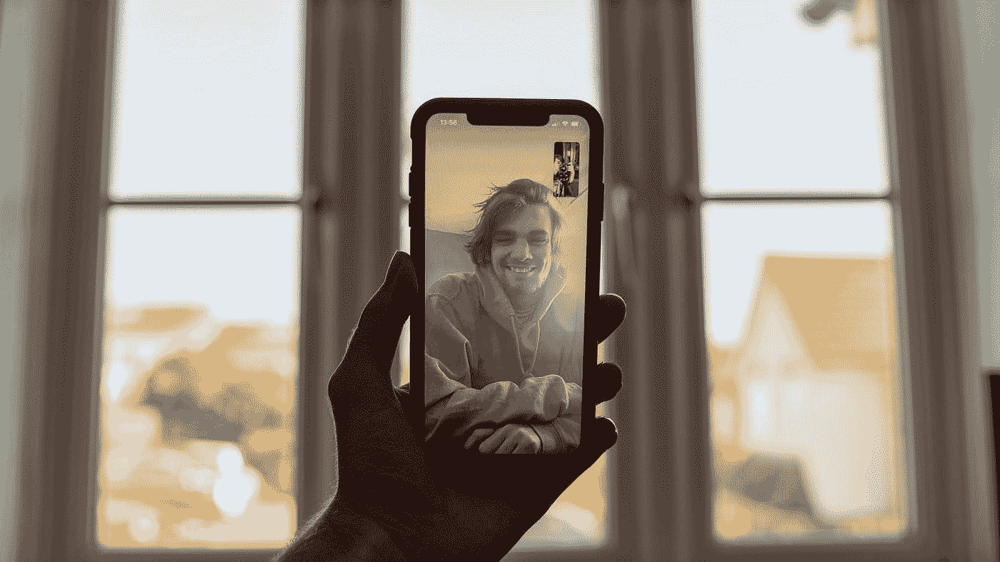
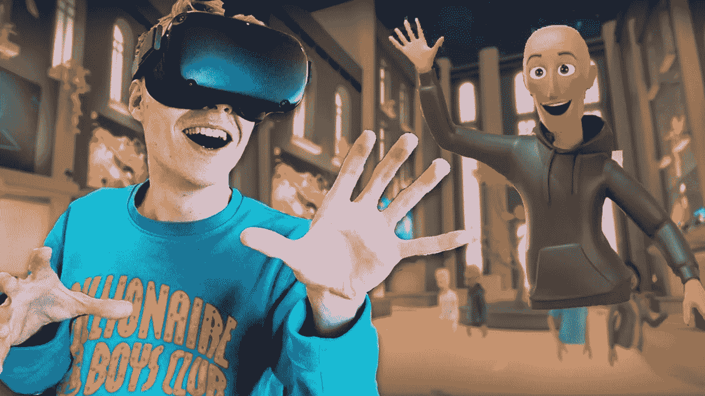
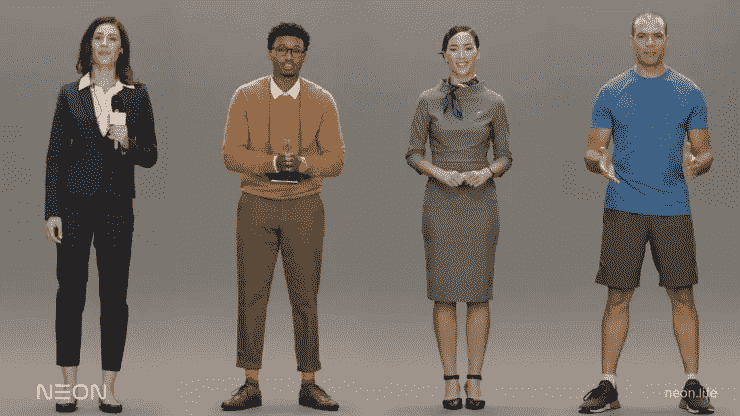
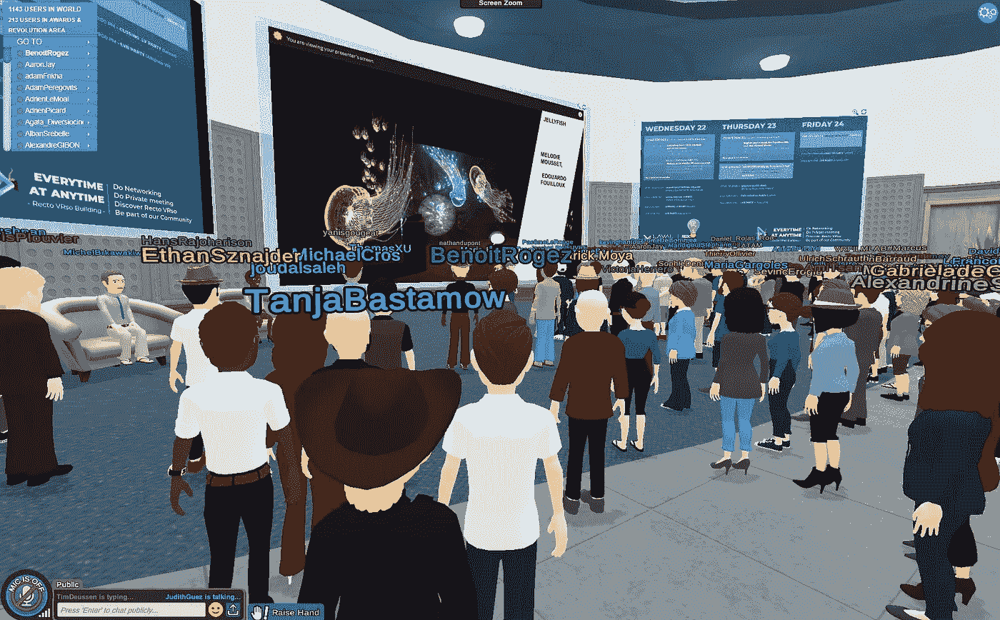
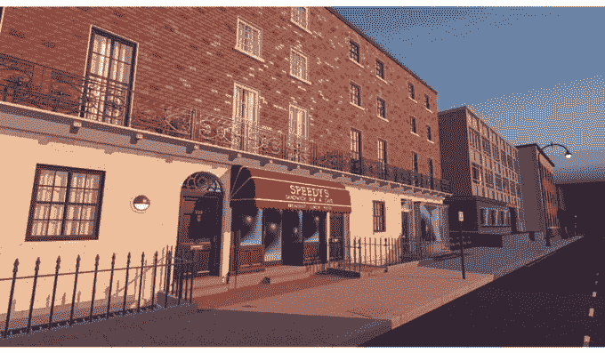

# 虚拟工作空间

> 原文：<https://towardsdatascience.com/the-virtual-workspace-how-ai-is-shaping-the-future-of-remote-work-5e8934c28313?source=collection_archive---------44----------------------->

## 人工智能如何塑造远程工作的未来？

自从疫情开始以来，许多人一直在办公室外工作，对他们中的一些人来说，这是他们第一次经历这么长时间的工作。

毫无疑问，这是有史以来进行的最大规模的远程工作实验，由于除了成功之外别无选择，许多公司都尽了最大努力来深入了解业务的真正需求以及员工保持高效工作的条件。

安妮·斯普拉特 / [Unsplash](https://unsplash.com/?utm_source=ghost&utm_medium=referral&utm_campaign=api-credit) 摄影

其中一个重要的需求是在不同的员工之间保持健康的关系，无论是那些必须密切合作的员工，还是那些恰好在同一个业务组工作的员工。

毫无疑问，许多团队仍然能够如此有效地工作的一个重要原因是，我们依赖于我们在前 covid 时期建立的长期关系。

现在，最大的问题是我们如何弥补人们之间缺少的真实生活互动，当每个人都远程工作时，这种互动通常会消失。

对于一些公司来说，解决方案是建立一个混合模式，团队可以不时地在办公室或者通过[组织的郊游](https://m.signalvnoise.com/how-to-build-social-connection-in-a-remote-team/)会面，但在我看来，这不是最终的解决方案。

早些时候[我写过为什么我认为 COVID 是世界通过技术解决所有远程工作挑战的绝佳时机](http://blog.ahmedkamal.me/the-remote-work-wave/)，我仍然对此深信不疑。

我们需要解决的第一个问题是用 face 2 face 视频聊天取代所有这些语音对话。归根结底，我们都是人，所以通过观察对方的脸可以了解很多事情。这就是我们相互信任和感受的方式。

因此，第一步应该是让每个人都在镜头前，聚焦在他们的脸上，绝对不是一个从坏角度展示一群人的低质量视频流。

照片由本·柯林斯[/](https://unsplash.com/@bencollins?utm_source=ghost&utm_medium=referral&utm_campaign=api-credit)[Unsplash](https://unsplash.com/?utm_source=ghost&utm_medium=referral&utm_campaign=api-credit)拍摄

 [## 来自专业人士的变焦会议礼仪的七个规则

### 视频会议应用已经成长起来——现在用户也需要。Zoom 见证了每日会议参与者飙升至 300 人的峰值…

www.wsj.com](https://www.wsj.com/articles/seven-rules-of-zoom-meeting-etiquette-from-the-pros-11594551601) 

这里的挑战是我们的网络速度的可靠性，有时会成为一个障碍，头部姿势，背景和闪电也是一个挑战。

照片来自[https://blog.zoom.us/zoom-virtual-background/](https://blog.zoom.us/zoom-virtual-background/)

我们很多人都听说过 zoom 发布的虚拟背景功能，该功能可以通过[深度学习](https://medium.com/ai-in-plain-english/heres-how-zoom-s-virtual-background-feature-works-ca5cdcad15ac)用虚拟背景平滑地替换你的背景。

 [## 以下是 Zoom 的虚拟背景功能的工作原理

### 革命性特征背后的机器学习

medium.com](https://medium.com/ai-in-plain-english/heres-how-zoom-s-virtual-background-feature-works-ca5cdcad15ac) 

但真正的创新来自 Nvidia，它通过使用 GANs 解决了最后三个问题。它不是发送整个庞大的视频流，而是发送关于关键面部点(眼睛、鼻子、鼠标)的数据。多亏了 GANs，在给定少量信息的情况下，接收器可以轻松地以更高的质量重建相同的面部实况视频，同时消耗更少的带宽。此外，新制作的视频将很容易调整，以提供完美的姿势，确保参与者之间的自然眼神交流。

# 从虚拟会议到虚拟工作空间

长久以来，人们一直对创造一个[虚拟世界](https://en.wikipedia.org/wiki/Virtual_world)感到兴奋。一个计算机模拟的环境，每个人都可以拥有自己的虚拟角色，同时独立地探索虚拟世界，参与活动，并与他人交流。虽然大多数虚拟世界环境都是为了娱乐、社交和教育目的而创建的，如 SecondLife，但仍然有一个很好的机会来利用和适应我们对虚拟工作空间的需求，在虚拟工作空间中，每个人都可以与他人见面和互动。

来自 https://youtu.be/brd0jPjYPU0[的脸书地平线](https://youtu.be/brd0jPjYPU0)

虚拟现实工作空间甚至可以推动我们离开办公桌，四处移动，同时完全沉浸在基于 VR 的世界中。脸书已经开发了 Horizon 作为 VR 游戏环境，但谁说我们不能借用同样的想法来工作？

# 如果我们可以混合深度学习和 VR 世界会怎么样？

在我看来，很快，我们就可以开始看到一个虚拟的工作空间，在那里我们这些远程工作者可以拥有[栩栩如生的数字化身](https://www.fastcompany.com/90456164/silicon-valleys-hot-new-commodity-creepy-ai-powered-avatars)，以一种前所未有的方式表现我们的情绪、互动和面部表情。

来源:霓虹( [https://www.neon.life](https://www.neon.life/) )

# 仍然不相信这是可行的？

这一部分已经是现实了！三星 NEON，一个旨在建立一个人工人类化身的项目，其外观和行为完全像它模拟的原始角色，最近在 CES 2020 上展示。

另一部分已经在用了。一旦我有了这些想法，我很好奇是否有人在研究类似的解决方案，我很幸运也很惊讶地发现，VirBELA，一个基于支持“堡垒之夜”的相同游戏引擎的面向工作的虚拟环境，已经举办了一次有 200 多人参加的会议活动！

此外，公司开始使用著名的虚拟世界游戏 RecRoom 来举行一些会议、虚拟郊游和团队活动。

图片来自@Judith_ARTVR 推特账号

照片来自@ recroom twitter 账户

在虚拟世界中，除了更多地参与会议、培训和密切协作之外，无论你是想去茶水间吃午饭时聊聊天，还是只是喝咖啡时随便聊聊天，你都将能够拥有和以前一样的办公室日常事务。

这样我们就能把办公室搬到云上了！我们将基本上把办公室的所有功能都带到家里，而不是在办公室或家里做出选择。

就我个人而言，我非常兴奋地看到人工智能和虚拟现实将如何使我们在工作和生活之间取得平衡。这个时代将如何彻底改变人们对工作和生产力的看法！

# 你喜欢你读的东西吗？

在 Twitter [@_ahmdkamal_](http://twitter.com/@_ahmdkamal_) 上找到我，获取关于#AI 和#tech 的有趣更新。

***你知道你最多可以放弃 50 个*👏*到此贴*** 😉 ***？！***

*鼓掌让其他人看到&鼓励我在 medium 上发布更多高质量的内容！*

*原载于*[*blog . Ahmed Kamal . me*](http://blog.ahmedkamal.me/the-future-of-remote-work/)*。*