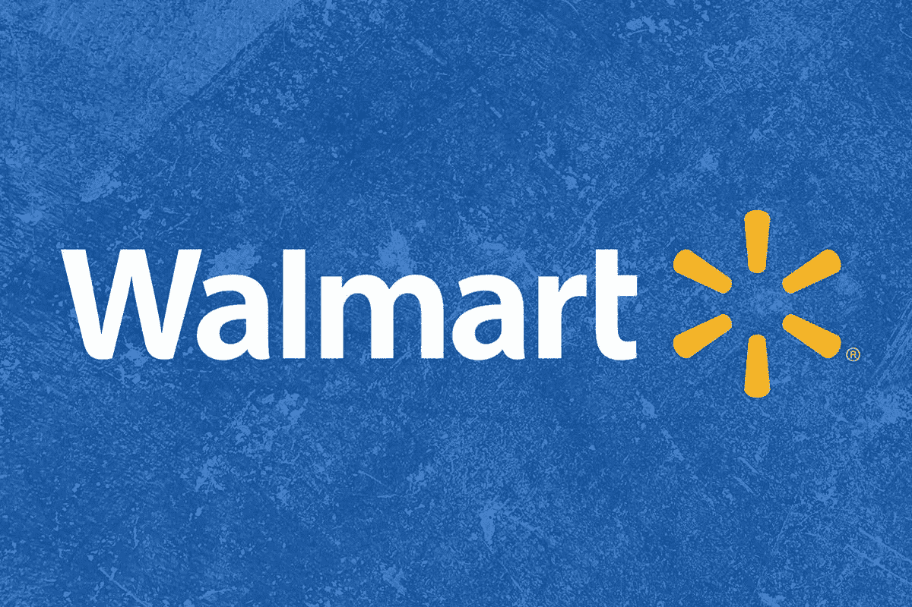
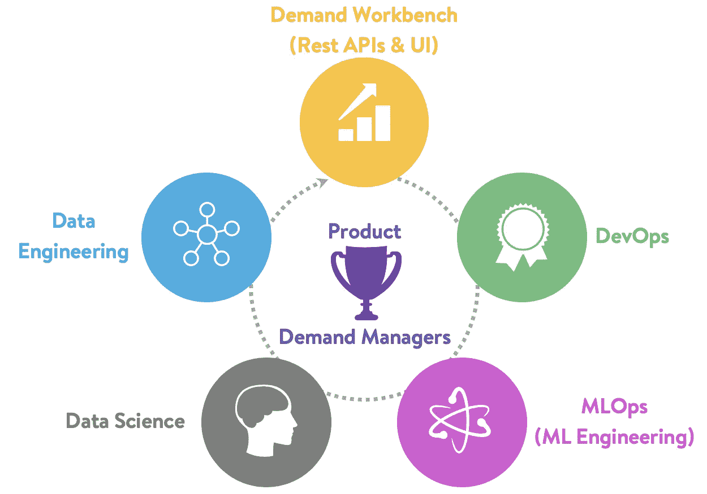

# 沃尔玛数据科学家访谈

> 原文：<https://towardsdatascience.com/the-walmart-data-scientist-interview-419425ddd89b?source=collection_archive---------14----------------------->

## 沃尔玛数据科学面试问题

沃尔玛的图像标志

沃尔玛公司是一家美国跨国零售公司，也是世界上最大的零售商，在全球超过 28 个国家拥有 20，000 多家商店和俱乐部。该公司成立于 1962 年，总部位于阿肯色州本顿维尔，在世界各地经营连锁超市、折扣百货商店和杂货店以及山姆会员店零售仓库。根据 2019 年的统计数据，沃尔玛是全球营收最大的公司，达到 5144.05 亿美元，也是全球最大的私营雇主，员工超过 220 万人。

沃尔玛也是一家数据驱动的公司。沃尔玛销售超过 7000 万种不同的产品，每周有超过 2.75 亿名顾客，沃尔玛每天都会在全球各地的商店产生大量的销售数据。为了理解这些数据，沃尔玛推出了数据咖啡馆分析中心，这是一个最先进的分析中心，每小时可以处理 2.5 的数据[1]。在这个数据咖啡馆中有 200 多个内部和外部数据流，可以对这些数据流进行操作和可视化，以生成业务影响洞察。

> ***查看这些关于数据科学面试问题的指南来自*** [***【脸书】***](https://www.interviewquery.com/blog-facebook-data-science-interview-questions-and-solutions/)*[***谷歌***](https://www.interviewquery.com/blog-google-data-science-interview-questions-and-solutions/) ***，以及***[***Snapchat***](https://www.interviewquery.com/blog-snapchat-data-science-interview-questions-and-tips/)***。****

# *数据科学在沃尔玛的角色*

*沃尔玛有一个数据科学和分析部门，在其不同的产品团队中有许多角色，如**数据科学家、数据分析师、大数据工程师和技术架构师**。技术团队隶属于名为[沃尔玛实验室](https://www.walmartlabs.com/)的团队，包括:*

*   *客户技术*
*   *商业技术*
*   *供应链技术*
*   *业务参与和战略*
*   *全球云*
*   *全球数据和分析平台*

*沃尔玛的一般数据科学家角色涵盖业务分析、统计建模、大数据分析、机器学习和深度学习实施，其技能组合和工具从简单的数据分析/商业智能工具到机器学习实施。*

# *所需技能*

*尽管沃尔玛的招聘要求可能在某种程度上取决于特定团队的需求，但沃尔玛通常对数据科学家职位有一般的招聘要求。沃尔玛数据科学职位的最低要求是本科学位和至少三年的工作经验。*

*其他相关要求包括:*

*   *4 年 SQL 和关系数据库(例如 DB2、Oracle、SQL Server 等)经验。).*
*   *4 年的统计和数值编程语言经验(例如，SAS、R、Python 和 SQL)*
*   *能够处理大型数据集，将算法扩展到大型数据集，并对大数据技术体系有充分的了解。*
*   *优秀的统计学、数学和机器学习算法的工作知识。*
*   *了解云计算平台和大规模数据库*
*   *自动化和脚本技术方面的经验*
*   *在分布式计算、数据仓库、ETL 开发和大规模数据处理方面有丰富的经验*

> *[**试着在我们的 interactive SQL 编辑器**](https://www.interviewquery.com/questions/upsell-transactions) **上解决这个问题。***

# *面试过程*

**

*图片来自[沃尔玛实验室的培养基](https://medium.com/walmartlabs/pillars-of-walmarts-demand-forecasting-f6722de86e1a)*

*像大多数大型科技公司一样，沃尔玛也有类似的面试流程。一般来说，面试过程从 30 分钟的招聘电话开始，然后是带回家的挑战或与团队经理的技术面试。通过课后和技术面试后，您将进入现场面试，包括与团队各成员进行 4 到 5 次一对一的面试。*

# *初始屏幕*

*沃尔玛最初的电话筛选是通过与招聘人员进行 30 分钟的电话交谈完成的。最常见的是，这种面试本质上是非技术性的，可能包括对你简历的简要介绍，对与你申请的团队相关的过去项目的讨论，以及你将会见的潜在团队成员。还要注意，面试中可能会有一些基本的技术元素，以确保你的简历与你的经历相符。*

# *技术筛选和带回家的挑战*

*一般来说，根据职位的资历，沃尔玛可能会在招聘人员打电话后发出一份带回家的挑战，以确保你能通过技术基线。这个挑战最有可能在 Hackerrank 中完成，将涉及编写 Pandas 和 Python 代码来操作数据集。*

**想练习带回家挑战吗？查看* [***面试查询带回家的挑战***](https://www.interviewquery.com/) ***。****

*沃尔玛的技术筛选是通过 Hackerrank 以及一名数据科学家通过视频聊天完成的。面试通常持续一个小时，围绕面试的问题包括数据结构和算法问题以及 SQL，最后可能还会讨论机器学习。*

*准备在一个共享的环境中练习编码，并大声思考如何解决每个问题。*

***例题:***

*   **打印二叉树的所有分支。**
*   **什么是多重共线性，在回归模型中如何解决？**
*   **解释袋装和增压车型的区别？**
*   **样本量和误差幅度有什么关系？**

# *现场面试*

*现场面试是沃尔玛数据科学招聘流程中的最后一次面试。这次面试包括与数据科学家和招聘经理的 4 到 5 轮面试，所有面试持续大约 45 分钟，中间有午餐休息时间。这几轮的面试问题围绕概率统计、SQL 和数据分析、机器学习概念、产品感和一般文化契合度。然而，大多数情况下，现场面试是为满足团队需求而量身定制的。*

*然而，总的来说，沃尔玛的现场数据科学家面试是这样的:*

*   *与一名团队成员的技术访谈，涉及基于 SQL 的案例研究问题。*
*   *围绕回归分析的概率和统计问题。*
*   *与招聘经理的一轮技术面试，包括回答关于机器学习算法和设计基础的问题(例如，你将如何设计一个推荐系统？)*
*   *与产品经理就与你面试的团队相关的过去项目以及文化、价值观和产品指标进行面谈。*

# *注意事项和提示*

*请记住，面试旨在评估您如何将各种数据科学概念应用于公司。在这种情况下，对于沃尔玛来说，他们最大的问题在于改善服务交付和顾客购物体验。*

*沃尔玛往往是一家大公司，允许不同的数据科学角色有很大的灵活性。因为沃尔玛拥有如此庞大的多企业集团业务，你可以找到许多机会在职业阶梯上移动或提升。*

*最后，虽然沃尔玛的办公室总部设在阿肯色州，但沃尔玛实验室的总部设在圣布鲁诺，就在硅谷中心的北部。沃尔玛的报价在更大范围内仍然具有竞争力，因为他们需要吸引人才。**薪酬待遇可与 RSUs 高基本薪酬协商。***

# *沃尔玛数据科学面试问题*

*   **说说有监督和无监督学习的区别。**
*   **描述一下 DBSCAN 算法的作用？**
*   **什么是 ROC 曲线？混淆矩阵对模型评估有什么作用？**
*   **渐变增强和随机森林有什么区别？**
*   **一个使用搜索引擎的人需要找到一些东西。你如何想出一种算法，在用户只输入几个字母后就能预测他们需要什么？**
*   *线性回归的一般假设是什么？*

# *感谢阅读！*

*   *报名 [**面试查询**](https://www.interviewquery.com/) 每周在你的收件箱里获得几个数据科学面试问题。*
*   ***订阅 Youtube 上的** [**我的频道**](https://www.youtube.com/channel/UCcQx1UnmorvmSEZef4X7-6g/) 获取数据科学[模拟面试](https://www.youtube.com/watch?v=e2LJ-6NagpE)，指南，以及技巧和窍门。*
*   *在面试查询博客上找到更多数据科学面试指南，如 [**谷歌数据科学家面试**](https://www.interviewquery.com/blog-the-google-data-scientist-interview/) 和[**DoorDash 数据科学家面试**](https://www.interviewquery.com/blog-doordash-data-science-interview-questions/) 。*

***参考资料**[【1】沃尔玛的真正大数据](https://www.forbes.com/sites/bernardmarr/2017/01/23/really-big-data-at-walmart-real-time-insights-from-their-40-petabyte-data-cloud/#9862ae56c105)*

**原载于 2020 年 4 月 9 日 https://www.interviewquery.com**[*。*](https://www.interviewquery.com/blog-walmart-data-scientist-interview/)**