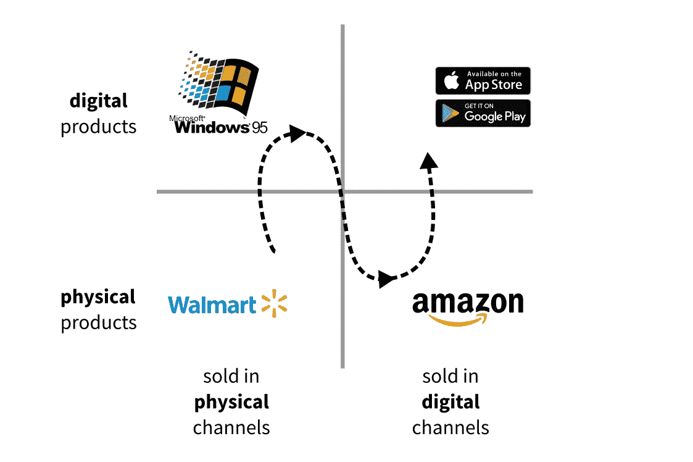
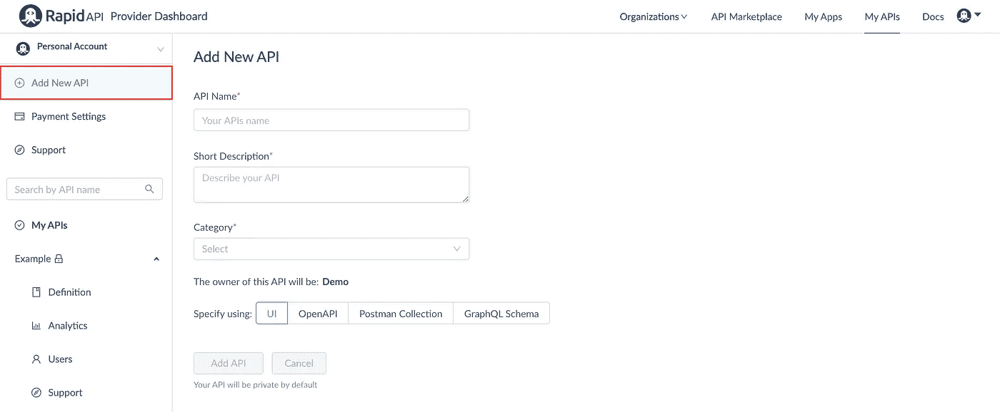
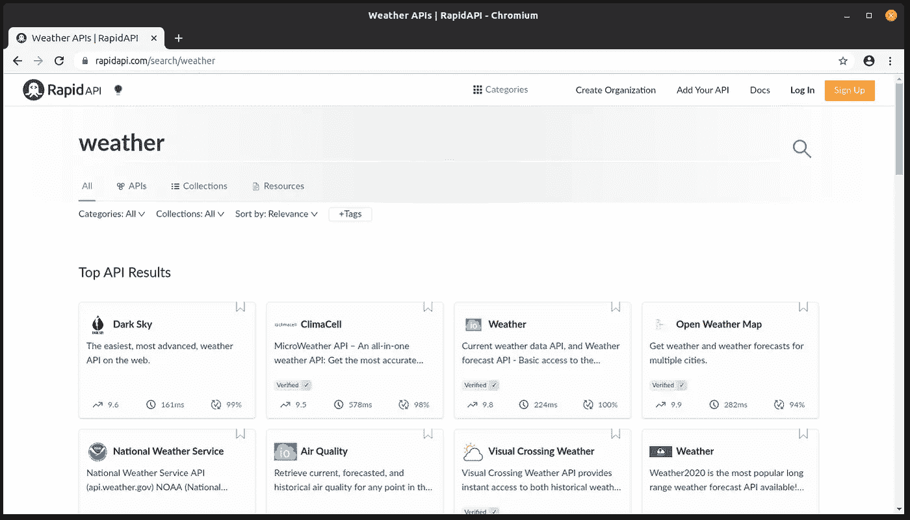
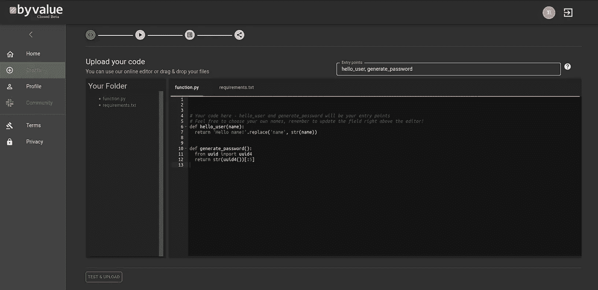

# 代码货币化的方式正在改变

> 原文：<https://towardsdatascience.com/the-way-of-monetizing-your-code-is-changing-5b8709a6e96c?source=collection_archive---------44----------------------->

罗曼·辛克维奇在 [Unsplash](https://unsplash.com/s/photos/code?utm_source=unsplash&utm_medium=referral&utm_content=creditCopyText) 上拍摄的照片

## 使用 API 市场把你的代码变成一个生意

***来自《走向数据科学》编辑的提示:*** *虽然我们允许独立作者根据我们的* [*规则和指导方针*](/questions-96667b06af5) *发表文章，但我们并不认可每个作者的贡献。你不应该在没有寻求专业建议的情况下依赖一个作者的作品。详见我们的* [*读者术语*](/readers-terms-b5d780a700a4) *。*

对于开发者来说，时代在快速变化。

几年前，如果你想用代码赚钱，你有两种解决方案。传统的低风险低回报方法是找一份朝九晚五的工作。然而，如果你想要更多的控制权，唯一的另一种方法就是去做个体经营者，承担更高的风险。

现在情况不再是这样了。随着在线生态系统的发展，越来越多的公司意识到，他们宁愿付费使用一个适当开发和维护的外部解决方案，而不是以数百倍的成本在内部开发。

在供应方面，这为开发者创造了大量的机会，将他们的工具转化为全面的服务，并向用户收取订阅费。Twitter 或脸书等数字渠道是为了销售数字产品而建立的，这让具有企业家精神的程序员的工作变得更简单。从你的卧室创建一个应用程序从未如此简单，SaaS 模式(软件即服务)正在蓬勃发展。

产品和分销渠道的演变

因此，创业成了许多人的愿望。然而，仅仅构建一个优秀的产品是不够的。随着产品分销渠道变得人人可及，竞争加剧了。编码、开发、产品开发、销售、营销、品牌:他们都需要不同的技能。要想在一个饱和的市场中取得成功，一切都必须是非凡的。

SaaS 的建立是为了满足非技术公司使用高级软件解决方案的需求，而不必构建它们。最重要的是，打算开发 SaaS 产品的开发者创造了一个新的需求:建立和货币化他们的产品的服务，允许创作者专注于软件。

输入 API 市场。

# 什么是 API 市场？

作为一个成功的 SaaS 企业，有几件事必须注意。举个例子，

*   产品开发，
*   托管和开发，
*   文档，
*   客户支持，
*   营销，
*   销售，
*   品牌化，
*   市场调查，
*   定价和货币化。

这提高了进入门槛，因为做所有这些需要一个更大的团队，而不是几个编码员。为了让事情变得更简单，企业家和黑客注意到了两个显著改变平衡的关键因素。

首先，*大多数服务可以以 API* 的形式交付。举个例子，我们来考虑一个来自金融的例子。如果你进行算法交易，你需要一个神奇的函数，你可以调用它来返回数据并进行定量分析，而不是根据原始数据自己去做。或者，如果你想在 Twitter 上进行社交网络分析，并获得对正在发生的事情的见解，你不会想爬取网站来创建一个推文数据库。相反，您希望直接访问以编程方式搜索和分析数据。

第二，*开发者需要快速建立一个服务，除了编码之外不需要担心以上所有的事情。*这导致了 API 市场的兴起，为建造者解决了大部分负担。开发者只需要专注于提供尽可能好的服务，而不用担心如何利用他们的 API 赚钱。

那么，这些 API 市场是如何工作的，它们能提供什么呢？

# 如何使用 API 市场将你的代码货币化

简单地说，一个 API 市场负责两个问题:*货币化*和*分配*。

假设您已经构建了自己的服务，并且有了一个托管解决方案。为了从您的代码中获益，您必须实现一个解决方案来验证用户并接受订阅费用。然而，你写的代码越少，你需要维护的就越少，所以你有更多的时间专注于产品。

API 市场，如 [RapidAPI](https://rapidapi.com/) 负责这一点。例如，你可以在那里注册你的 API，并很容易地建立一个支付计划。用户通过 RapidAPI 调用你的 API，RapidAPI 负责认证。

将您的服务添加到 RapidAPI。来源: [RapidAPI 文档](https://docs.rapidapi.com/docs/getting-started)

对于用户来说，调用您的服务尽可能简单。API 密钥是在订阅时发布的，用于对调用者进行身份验证，而无需您做任何额外的工作。

为了演示这对用户来说有多简单，这里有一个示例代码片段，直接来自 RapidAPI 的天气预报 API 之一 [Dark Sky](https://rapidapi.com/darkskyapis/api/dark-sky/endpoints) 的文档。

此外，您的服务会在市场中列出，因此潜在用户可以搜索和发现它。

另一方面，RapidAPI 对所有通过它进行的支付收取 20%的费用。在制定定价计划时，应该考虑到这一点，尤其是因为你还必须支付托管费用。

RapidAPI 市场上的 API 列表

这里有几个额外的案例研究和实践教程，如果你利用这些平台直接用你的代码赚钱，它们会很有用。

 [## API 作为一种产品。当你只知道一个后端时，如何销售你的作品

### 关于如何在不管理网站、服务器、用户和支付的情况下发布和销售代码的指南。预付 0 美元…

towardsdatascience.com](/api-as-a-product-how-to-sell-your-work-when-all-you-know-is-a-back-end-bd78b1449119)  [## 开发和销售 Python API —从头到尾教程

### 本文从头到尾描述了开发 Python API 的过程，并在更困难的领域提供了帮助。

towardsdatascience.com](/develop-and-sell-a-python-api-from-start-to-end-tutorial-9a038e433966) 

# 下一代 API 市场

尽管 API 市场提供了显著的改进，但事情仍然没有完全解决。就目前情况来看，开发托管解决方案的责任仍然在于开发者。根据 API 需要扩展的程度，这可能需要非常专业的知识。(如果 API 成功，它*将*需要扩展。)

此外，即使你的申请不成功，你也必须预先支付托管费。在某些情况下，例如，当服务需要运行 GPU 实例时，这些成本可能会很高。

最近，一个新的竞争者来了，把 API 市场带到了一个新的高度。[即将推出的 NoOps 平台 Byvalue](https://byvalue.org/) ，承诺简化你的代码货币化的整个过程，而不需要你优化主机和支付任何前期费用。

通过值创建带有[的 API](https://byvalue.org/)

目前，他们正处于测试阶段，他们正在寻找早期采用者加入他们的社区，并帮助建立他们的市场。如果你对开发人员如何将代码货币化的未来感兴趣，你绝对应该去看看！

 [## 使用 Byvalue 创建您自己的 API 业务

### 不使用 Flask，Heroku，AWS，FastAPI，Zappa…

medium.com](https://medium.com/byvalue/use-byvalue-to-create-your-own-api-business-99f71f8d15fd) 

# 结论

我们生活在一个充满机遇的时代。随着数字产品分销渠道的发展，通过构建软件并将其作为服务出售来赚钱逐渐成为每个拥有编码技能的人的能力。通过 API 交付服务已经成为一种经过检验和测试的商业模式，对于小型和大型企业都是如此。

最初，所需的技术专长远远超出了要解决的问题的领域知识。产品的部署和货币化既耗时又困难。

因此，API marketplaces 就是为了满足这种需求并为开发人员完成这项工作而创建的。如果你正在寻找从你的代码中获利的方法，API 市场如 [RapidAPI](https://rapidapi.com/) 绝对是你要走的路。

然而，问题远未解决。像 [Byvalue](https://www.byvalue.org/) 这样的新创公司挑战当前市场的实施方式，并着手为所有想要将代码转化为利润的人提供一站式体验。

如果你想使你的收入来源多样化，或者甚至成为个体经营者，通过 API 提供服务是一个很好的方法。

[***如果你喜欢把机器学习概念拆开，理解是什么让它们运转，我们有很多共同点。看看我的博客，我经常在那里发表这样的技术文章！***](https://www.tivadardanka.com/blog)