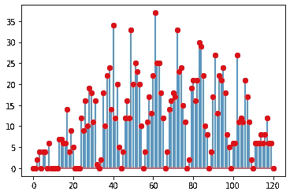

# 我们学习卷积的方式

> 原文：<https://towardsdatascience.com/the-way-we-learn-convolution-7c2ecdeddac?source=collection_archive---------26----------------------->

## 一篇关于如何理解卷积的短文

## 卷积是每个通信工程专业的学生首先学习的概念之一。它对于信号和系统的研究是如此的基础，然而，它是以一个方程的形式给出的，其解释集中于如何卷积而不是为什么卷积。


我们教和学卷积的方式是错综复杂的:)

还记得我们是怎么学的吗？如果 LTI 系统的输入中的 x[n]具有脉冲响应 h[n]，则输出 y[n]由卷积运算给出:

**y[n] = ∑ₖ h[k] x[n-k]**

哎呀，很好的等式，但是它意味着什么，我们问。我们得到了视觉翻转，滑动和乘法积累！

假设我给你两个序列:

```
x1 = [1, 2, 1, 0, 0, 2, 1, 2]
x2 = [3, 0, 0, 3, 0, 0, 1]
```

我问你卷积输出。你会怎么做？尤其是如果你没有 Matlab 或者 Octave 或者 Python。你会评价上面两个序列的 **y[n] = ∑ₖ h[k] x[n-k]** 方程吗？

相反，只要启动你的常规计算器。将两个数字相乘(通过从右到左的顺序得到): **21200121** x **1003003** 。你得到的结果( **21263784963363** )就是卷积输出！没错，卷积来自普通的乘法运算。不相信我？试试吧！

为了交叉检查答案是否正确，下面是使用 Python 的 scipy 的卷积输出。信号:

```
from scipy import signal
yc = signal.convolve(x1, x2)
print(yc)[3 6 3 3 6 9 4 8 7 3 6 2 1 2]
```

我再举一个例子:x1 =[2，1，1，0，0，0，2，2]，x2 =[1，0，0，0，2，0，2]。乘以**22000112**x**22020001**=**48442488240112**，从右向左读取，即为卷积输出。

当然，对于那些理解卷积到底是什么的人来说，这并不奇怪。毕竟，我们对于 1 序列的乘法模式已经暗示了这一点:
**11**x**11**=**121
111 x 111 = 12321**
**1111 x 1111 = 1234321**
等等。认出模式了吗？两个方波的卷积产生一个三角形。

对于幼徒来说，上面的技巧并不适用于所有的场景。你可以看到，即使是只有数字 1 的数字，这种模式在长度为 10 时也会中断:**1111111111111**x**1111111111**=**123456789*00*987654321**。不再是三角形了——注意中间的两个零。

那么，为什么这个乘法技巧行得通，为什么不是对所有序列都行得通呢？它之所以有效，是因为卷积运算就像两个序列相乘一样基本。我们如何将两个序列相乘？当然是把它们变成多项式的系数！假设我们有两个序列[a0，a1，a2]和[b0，b1，b2]。创建多项式
*(A0+a1x+a2x)
(B0+b1x+b2x)*

乘法和分组项:
*(a0b 0)+(a0b 1+a1b 0)* x+(a0b 2+a1 B1+a2 b 0)* x+(a1 B2+a2 B1)* x+(a2b2)*x⁴*

现在，您可以将卷积输出作为结果多项式的系数读出。

乘法口诀什么时候不起作用？当输出多项式的任何系数大于 10 时。因为卷积不像十进制表示那样“携带”数字。

另一个检查:长度为 m 的序列和长度为 n 的序列的卷积，输出长度为 **m+n-1** 。长度为 m 的序列是 m-1 次多项式，因此高阶项将是 x⁽ⁿ⁻ ⁾ * x⁽ᵐ⁻ ⁾= x⁽ⁿ⁺ᵐ⁻ ⁾.如果一个多项式有次数(m+n-2)，它有 m + n — 1 个系数。

这给了我们直觉。毕竟，我们在学校学的是代数，而在工程课程中，我们只在信号与系统 101 中学习卷积。为什么不在我们已经学过的和熟悉的基础上发展呢？

这并不是说翻转和相乘没有用。当你看 2D 卷积时，这种解释是非常有用的。您可以将它想象为翻转(水平和垂直)您的 2D 核，将其重叠在您的 2D 数据的第一个样本(左上角)上，然后简单地向下拖动核，直到您到达第一列的最后一行，重置为第二列的顶行，向下拖动。冲洗并重复，直到到达最后一列最后一行的样品。下面是一个快速而复杂的 Python 代码，它将一个 8×8 的输入与一个 4×4 的内核进行卷积:

```
import numpy as np
import matplotlib.pyplot as plt
from scipy import signal

hker = np.random.randint(low=0, high=4, size=(4,4))
hkerf = hker[::-1,:]
hkerf = hkerf[:,::-1]
x2d = np.random.randint(low=0, high=4, size=(8,8))
x2dpad = np.zeros((14,14))
x2dpad[3:3+8,3:3+8]=x2d
y2d = np.zeros((11,11))

for row in range(11):
  for col in range(11):
    y2d[row,col]=np.dot(hkerf.flatten(),x2dpad[row:row+4,col:col+4].flatten())

y2dc = signal.convolve2d(hker,x2d)

plt.stem(y2d.flatten(), use_line_collection=True)
plt.plot(y2dc.flatten(),'ro')
```



方程 **y[n] = ∑ₖ h[k]x[n-k]** 的建立方式也是理解数字滤波器和利用离散傅里叶变换进行计算的重要基础。然而，虽然我们必须接受严格的训练，但我们不能在这个过程中失去直觉。

对了，我本来可以一段话把这个帖子写完，说卷积和多项式乘法一样。但是这有什么意思呢？！