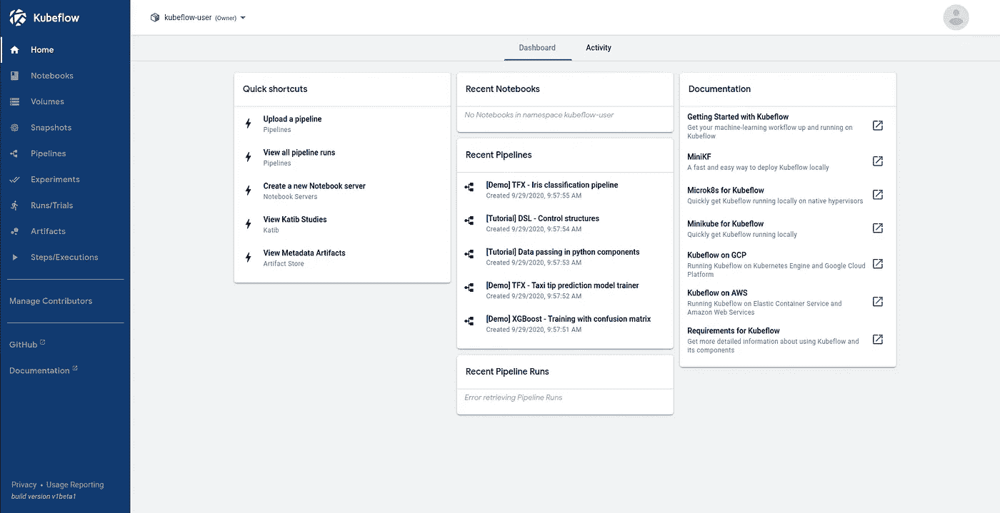
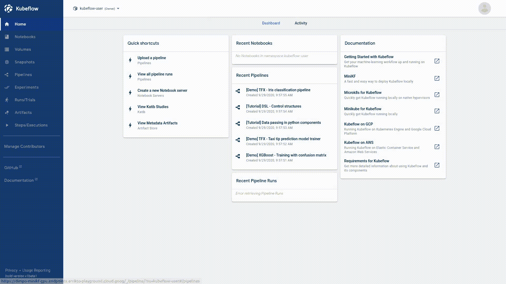
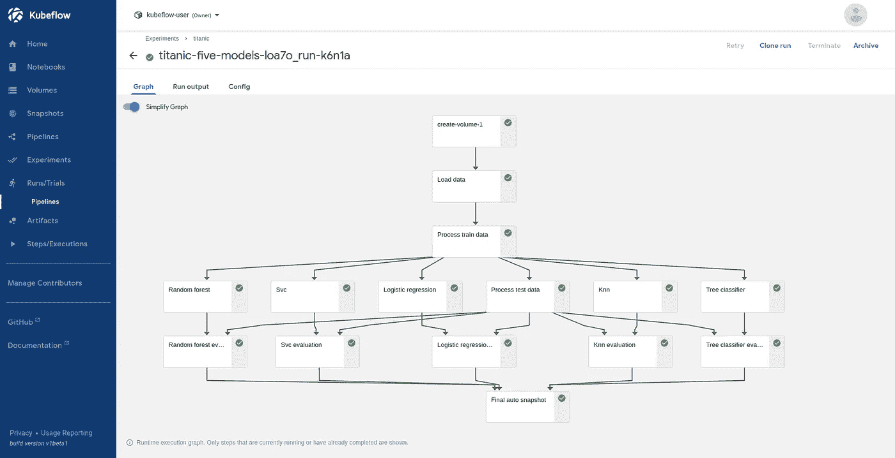
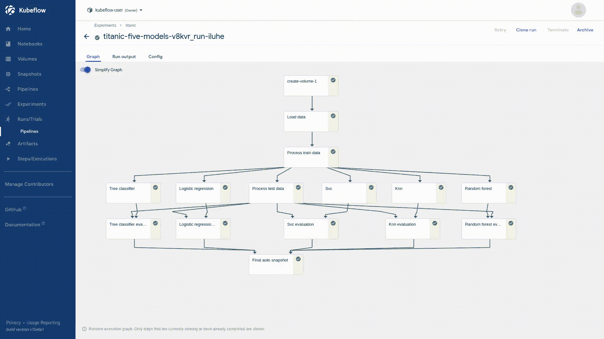
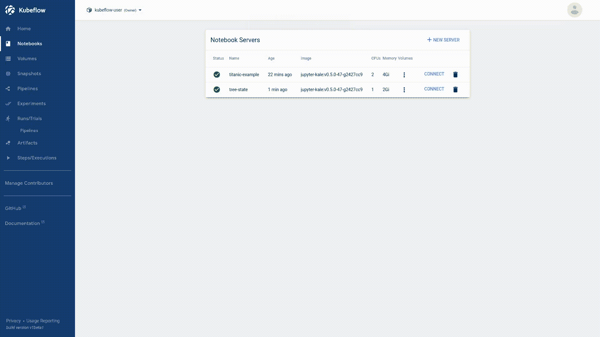

# 你控制 ML 项目版本的方式是错误的

> 原文：<https://towardsdatascience.com/the-way-you-version-control-your-ml-projects-is-wrong-42910cba9bd9?source=collection_archive---------27----------------------->

## 当您可以拥有更多时，是否在寻找一种类似 git 的数据版本控制方法？是时候跳出框框思考了


抓拍您的数据—照片由[阿德里安·奥利琼](https://unsplash.com/@adrienolichon?utm_source=unsplash&utm_medium=referral&utm_content=creditCopyText)在 [Unsplash](https://unsplash.com/s/photos/polaroid?utm_source=unsplash&utm_medium=referral&utm_content=creditCopyText) 上拍摄

数据科学家和机器学习工程师倾向于像管道这样的预测分析项目；接受明确定义的输入以产生特定输出的生产线。这些相互关联的步骤(例如，数据采集、数据处理、数据建模等。)一起朝着最终目标努力，但它们也可以是独立的过程，以自己的节奏运行。

> 如果有一种方法可以自动对每个 ML 管道步骤的结果进行版本控制，这不是很好吗？

ML 管道中的步骤通常输出转换后的数据集，我们手动对其进行版本控制，并将其移动到对象存储桶。但是它们也可以产生各种其他工件，从原始变量到训练好的 ML 模型。那么，我们如何将所有这些事情版本化呢？腌制一切？饭桶？也许是 LFS？如果有一种方法能够自动将所有这些结果版本化不是很好吗？

在这个故事中，我们向你展示了如何自动地将你在项目中所做的最微小的改变版本化，而无需思考。咱们开始吧！

> [学习率](https://mailchi.mp/d2d2d4a109b5/learning-rate-newsletter)是为那些对 AI 和 MLOps 的世界感到好奇的人准备的时事通讯。你会在每周五收到我关于最新人工智能新闻和文章的更新和想法。在这里订阅！

# ML 的版本控制

数据科学家大部分时间都在 Jupyter 笔记本中探索数据和起草想法。通常，当我们试图对我们的工作进行版本化时，我们最终会得到一堆重复的`ipynb`文件，采用不同的命名方案。

> 在 ML 管道的每一步之前和之后，我们能有自动拍摄我们工作的东西吗？此外，我们能在不需要大量配置的情况下开始使用它吗？只要打开一个笔记本，做我们的事情，并确保其他事情会照顾自己。

另一方面，众所周知，使用 Git 很难跟踪笔记本，而使用流行的 VCS 进行数据集版本控制是不可能的。Git 大文件存储(LFS)用 Git 内部的文本指针替换音频样本、视频、数据集和图形等大文件，并将文件内容存储在远程服务器上；不理想。

有人也可以尝试 [DVC](https://dvc.org/) ，但这只是一种类似 Git 的数据版本控制方法。这通常会让数据科学家更加头疼，他们不想学习另一种工具来完成工作。

我们能不能在 ML 流水线的每一步之前和之后都有自动抓拍我们工作的东西？此外，我们能在不需要大量配置的情况下开始使用它吗？只要打开一个笔记本，做我们的事情，并确保其他事情会照顾自己。是的，我们可以！让我们看看怎么做。

# 设置工作空间

因此，对我们在项目中所做的一切进行自动版本控制似乎有些极端，对吗？如果你对 GCP 使用 MiniKF 就不会了。安装 MiniKF 非常简单；我们需要的只是一个 GCP 帐户和从市场部署应用程序的能力。


MiniKF 部署—作者图片

1.  访问 GCP 页面上的[MiniKF](https://console.cloud.google.com/marketplace/details/arrikto-public/minikf)
2.  选择*启动，设置虚拟机配置并点击部署*

> 为了获得最佳性能，建议保留默认的虚拟机配置

就是这样！部署最多需要十分钟，您可以按照屏幕上的说明观看进度；ssh 进入机器，在终端上运行`minikf`,等待直到您的端点和凭证准备好。


MiniKF 的提供已完成—图片由作者提供

现在，我们准备访问 Kubeflow 仪表板。点击网址，输入你的凭证，你就可以开始了！



Kubeflow 仪表板—按作者分类的图像

## 运行 Jupyter 服务器

那么，还剩下什么？我们需要一个 Jupyter 笔记本实例。使用提供的 Jupyter Web 应用程序，在 MiniKF 中创建 Jupyter 笔记本相对容易:

1.  从左侧面板中选择笔记本
2.  选择`New Server`按钮
3.  填写服务器名称，请求您需要的 CPU 和 RAM 数量，然后点击`LAUNCH`

> 按照本教程，保持 Jupyter 笔记本图像不变(`*jupyter-kale:v0.5.0-47-g2427cc9*` —注意图像标签可能不同)



创建 Jupyter 服务器—作者图片

完成这四个步骤后，等待笔记本服务器准备好并连接。你将被转移到你熟悉的 JupyterLab 工作区。

# 这是一种魔法

在下面的故事中，我们看到了如何将 Jupyter 笔记本转换成 Kubeflow 管道，而无需编写任何代码。

[](/jupyter-is-ready-for-production-as-is-b36f1d1ca8f8) [## Jupyter 准备生产；原样

### 无需编写一行代码，即可将您的笔记本草稿转化为生产就绪的 Kubeflow 管道。

towardsdatascience.com](/jupyter-is-ready-for-production-as-is-b36f1d1ca8f8) 

简而言之，要使用当前的示例，您应该首先在 JupyterLab 环境中打开一个终端并克隆 repo:

```
git clone [https://github.com/dpoulopoulos/medium.git](https://github.com/dpoulopoulos/medium.git)
```

将目录更改为`medium > minikf`并启动`titanic.ipynb`笔记本。取消对第一个代码单元的注释，然后运行它，将必要的依赖项安装到您的环境中。然后，让 **Kale** 接手！

检查笔记本的左侧面板，您会看到一个紫色图标。这是有趣的开始…按下它来启用羽衣甘蓝扩展。你会自动看到每个单元格都被标注了。


启用 Kale 扩展-按作者分类的图像

你可以看到笔记本是分节的；导入、数据加载部分、数据处理、模型训练和评估等。这正是我们用羽衣甘蓝注释的。现在，这个笔记本是预先注释好的，但是你可以随意使用。您可以创建新的管道步骤，但是不要忘记添加它们的依赖项。

在任何情况下，你都可以点击位于羽衣甘蓝部署面板底部的`COMPILE AND RUN`按钮。无需编写一行代码，您的笔记本将被转换为 Kubeflow 管道，该管道将作为新实验的一部分执行。


从 Jupyter 笔记本到 Kubeflow 管道——作者图片

按照 Kale 提供的链接观看跑步实验。几分钟后，管道将成功完成其任务。这是图表的最终视图(不要忘记切换左上角的`Simplify Graph`选项):



泰坦尼克号管道——作者图片

然而，如果你仔细观察，Kale 做的第二件事是使用 [Rok](https://www.kubeflow.org/docs/other-guides/integrations/data-management/) 给笔记本拍快照。此外，在管道的每一步之前和之后，它都会这样做。因此，我们可以在任何时候回到我们环境的状态。我们如何做到这一点？

## 韩国快照

Rok 是一个数据管理产品，允许您对您的**完整环境及其数据**进行快照、版本化、打包、分发和克隆。它作为其支持的平台之一与 Kubernetes 进行了本机集成，并在几分钟内部署到现有集群、本地或云上。

它预装在 MiniKF 中，所以让我们使用它！假设您想在运行 SVM 分类器之前返回您的环境状态。

1.  点击`smv`步骤并选择`Visualizations`选项卡
2.  跟随`Rok autosnapshot`卡内的链接
3.  复制页面顶部的韩国网址
4.  创建一个新的笔记本服务器，并在顶部粘贴复制的网址
5.  配置虚拟机资源，并为工作区指定一个有效的名称
6.  点击`LAUNCH`按钮



与韩国同行——作者图片

**当笔记本服务器准备好了，连接上它，一个新的 JupyterLab 环境将会准确地在你请求的点打开。到目前为止的所有单元格都已为您执行。**您可以从该单元格继续工作；探索变量状态、数据集并训练模型。这下好了。



继续你的 JupyterLab 状态——作者图片

# 结论

在这个故事中，我们看到了如何在 Jupyter 笔记本上修改我们的作品，甚至不用去想它。我们在 MiniKF 上运行的每个实验都是分步进行的，我们可以使用 Rok 在任何时间点返回。

继续使用 MiniKF 在 Kubeflow 中运行您的实验。您的工作流将保持不变，但在许多方面进行了扩展，没有任何样板代码。

## 关于作者

我的名字是[迪米特里斯·波罗普洛斯](https://www.linkedin.com/in/dpoulopoulos/)，我是一名为[阿里克托](https://www.arrikto.com/)工作的机器学习工程师。我曾为欧洲委员会、欧盟统计局、国际货币基金组织、欧洲中央银行、经合组织和宜家等主要客户设计和实施人工智能和软件解决方案。

如果你有兴趣阅读更多关于机器学习、深度学习、数据科学和数据操作的帖子，请在 twitter 上关注我的 [Medium](https://medium.com/@dpoulopoulos) 、 [LinkedIn](https://www.linkedin.com/in/dpoulopoulos/) 或 [@james2pl](https://twitter.com/james2pl) 。

所表达的观点仅代表我个人，并不代表我的雇主的观点或意见。