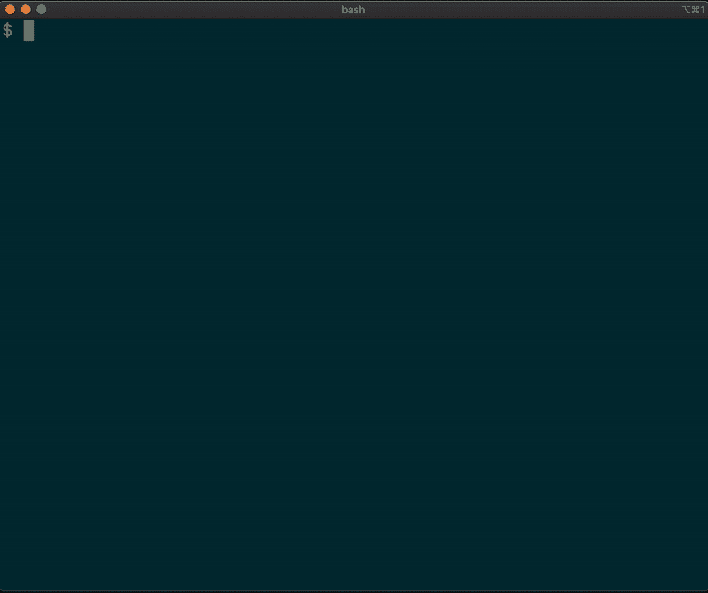
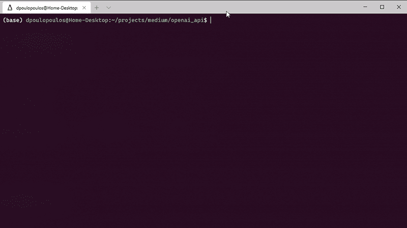

# 您编写代码的方式即将改变:加入等待列表

> 原文：<https://towardsdatascience.com/the-way-you-write-code-is-about-to-change-join-the-waiting-list-8c9e544e5de0?source=collection_archive---------29----------------------->

## OpenAI API 将会带来编码的革命。



你能给我一个 shell 命令来打印你当前所在文件夹的名字吗？这很简单。应该是`pwd`。如果您想导航到`/tmp`文件夹呢？简单:`cd /tmp`。

现在，在你的脑海中，计算当前文件夹中 python 文件数量的命令是什么？那就有点棘手了:`find . -type f -name '*.py' | wc -l`。这并不难，也可以用其他方式来做，但有时我们会忘记。

> **如果我告诉你，你可以编写一个脚本，你可以用自然语言查询并得到你正在寻找的 shell 命令，那会怎么样？**

了解复杂的 shell 命令有一定的吸引力。我明白，这也能提升自尊。**然而，如果我告诉你，你可以编写一个脚本，你可以用自然语言查询并得到你正在寻找的 shell 命令，那会怎么样？**比如，假设你有一个*自然语言外壳* (nlsh)，你想得到今天是星期几。它可能看起来像这样:

```
nlsh> What day is it?
>>> Would you like to run: date +%A [Y/n]: _
```

第一行是 shell 的输入，而第二行展示了可能的输出。那会很酷，对吧？**现在，如果我告诉你，你现在就可以使用 python，用不到 30 行代码做到这一点，会怎么样？**在我看来，这是革命性的！**在这个故事中，我们谈论 OpenAI 的 API，一种访问 OpenAI 开发的新人工智能模型的方法。**而*自然语言外壳*只是冰山一角。

> [学习率](https://www.dimpo.me/newsletter)是我每周给那些对 AI 和 MLOps 世界好奇的人发的简讯。你会在每周五收到我关于最新人工智能新闻、研究、回购和书籍的更新和想法。在这里订阅！

# OpenAI API

OpenAI API 是一种访问 OpenAI 开发的新 AI 模型的方法。它提供了一个通用的接口，你可以指定你想要它做什么，只有少数例子。你可以把它集成到你的产品中，对它进行微调，开发一个全新的应用程序，或者只是探索它的极限。API 还没有对公众开放，但是，你可以加入[等待名单](https://forms.office.com/Pages/ResponsePage.aspx?id=VsqMpNrmTkioFJyEllK8sx3ELsv0PEhHphhNz30FttVUNkYwTlNPMVI1V0lXNjExMlExUlc4SE5YSS4u)。

## 它是如何工作的？

想象一下，你想创建一个文本补全应用程序，像*自然语言外壳*(有人可能会说这也可以看作是一个 Q & A 应用程序)。首先，你应该通过展示一些你想做的例子来“编程”API。越多越好，尤其是任务复杂的时候:

```
Input: Print the current directory
Output: pwdInput: List files
Output: ls -lInput: Change directory to /tmp
Output: cd /tmpInput: Count files
Output: ls -l | wc -l...
```

嗯，就这样吧！没有第二步。第一天的结果可能并不完美，但是您可以通过在更大的数据集上训练它，或者通过从用户提供的人类反馈中学习来磨练它的性能。

**open ai 的研究人员设计了足够灵活的 API，以使机器学习团队更具生产力。同时，它非常简单，任何人都可以使用。**在后台，API 运行来自 [GPT-3](https://arxiv.org/abs/2005.14165) 系列的权重模型，这些模型在速度和吞吐量方面都得到了改进，使这种应用程序变得切实可行。

**什么是 GPT-3？**

GPT-3 是 OpenAI 的 GPT-2 的演变，它标志着自然语言处理的一个新的里程碑。GPT 代表生成式预训练变压器，引用了 2017 年谷歌的一项创新，名为变压器。它的主要目的是计算出特定单词在给定上下文中出现的可能性。在此基础上，我们现在可以创建完成文本、回答问题、总结文档等等的应用程序。

# 自然语言外壳示例

在这一节中，我们将使用 python 和几行代码来编写我们在序言中看到的*自然语言外壳*。首先，python 文件:

在 python 脚本的开始，我们为 API 提供了一些我们希望它做什么的例子。然后，我们创建一个`Completion`任务并使用`davinci`模型。我们将`max_tokens`设置为`100`以获得足够的缓冲，将`temperature`设置为`0`。每当我们遇到只有一个正确答案的问题时，将`temperature`设置为`0`是一个很好的做法。一般来说，温度越高，模特的创作自由度就越大。

最后，我们执行`python nlsh.py`来测试应用程序。



自然语言外壳

# 更多示例

与 OpenAI 密切合作的组织已经在使用 OpenAI API。让我们看几个非常聪明的例子。

## 闲谈

AI Channels 是一个面向人和人工智能代理的社交网络。人工智能频道让你与人工智能代理互动，这些代理可以帮助你产生想法，推荐书籍和电影，讲述互动故事，或者与你的朋友和历史上最伟大的头脑一起参加圆桌讨论，你可以请虚拟的阿尔伯特·爱因斯坦解释相对论，或者从简·奥斯汀那里获得写作技巧。

## 代码完成

有了 OpenAI API，我们可以生成有用的、上下文感知的代码建议。在使用来自数千个开源 GitHub 仓库的代码进行微调后，API 根据函数名和注释完成代码。

## 摘要

通过其模式识别和生成功能，API 可以将密集的文本转换为简化的摘要。在这里，我们展示了将 NDA 总结为二年级阅读水平可以理解的内容的 API。

# 结论

在这个故事中，我们看到了 OpenAI API 的潜力和一些用例，它们重新定义了这种自然语言理解工具的可能性。语义搜索、客户支持、聊天机器人、文本处理应用程序和生产力工具将永远改变！

> [学习率](https://www.dimpo.me/newsletter)是我每周给那些对 AI 和 MLOps 世界好奇的人发的简讯。你会在每周五收到我关于最新人工智能新闻、研究、回购和书籍的更新和想法。订阅[这里](https://www.dimpo.me/newsletter)！

## 关于作者

我的名字是 [Dimitris Poulopoulos](https://www.linkedin.com/in/dpoulopoulos/) ，我是一名为 [BigDataStack](https://bigdatastack.eu/) 工作的机器学习研究员。我也是希腊比雷埃夫斯大学的博士生。我曾为欧洲委员会、欧盟统计局、国际货币基金组织、欧洲中央银行、经合组织和宜家等主要客户设计和实施人工智能和软件解决方案。

如果你有兴趣阅读更多关于机器学习、深度学习、数据科学和数据操作的帖子，请在 twitter 上关注我的 [Medium](https://medium.com/@dpoulopoulos) 、 [LinkedIn](https://www.linkedin.com/in/dpoulopoulos/) 或 [@james2pl](https://twitter.com/james2pl) 。