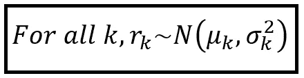

# 白噪声模型

> 原文：<https://towardsdatascience.com/the-white-noise-model-1388dbd0a7d?source=collection_archive---------10----------------------->


这肯定不仅仅是一个随机的过程！或者是？(图片由[作者](https://sachin-date.medium.com/)提供)

## 最重要的统计模型

白噪声是任何回归模型都无法解释的数据变化。

然而，恰好有一个白噪声的统计模型。时间序列数据是这样的:


加性白噪声模型(图片由[作者](https://sachin-date.medium.com/)提供)

时间步 *i* 处的观测值 *Y_i* 是当前电平 *L_i* 和当前电平周围的随机分量 *N_i* 的和。

如果随机变化的程度与当前水平成比例，则我们有相同模型的以下乘法版本:


乘法白噪声模型(图片由[作者](https://sachin-date.medium.com/)提供)

如果当前电平 *L_i* 对于所有 *i* 都是恒定的，即 *L_i = L* 对于所有 *i* 都是恒定的，那么将会看到噪声在固定电平附近波动。

很容易生成一个白噪声数据集。下面是在 Excel 中的操作方法:


如何在 Excel 中生成加性白噪声数据集(图片由[作者](https://sachin-date.medium.com/)提供)

这是在恒定水平 100 附近波动的噪声输出图:


水平=100 附近的加性白噪声(图片由[作者](https://sachin-date.medium.com/)提供)

电流水平经常随着现实世界的因素而变化。例如，如果 *L_i* 响应于一组回归变量 ***X*** 而线性变化，那么我们得到以下线性回归模型:


回归变量加噪声的时间序列(图片由[作者](https://sachin-date.medium.com/)提供)

上式中， ***β*** 是回归系数的向量， ***X_i*** 是回归变量的向量。

# 为什么研究白噪声模型很重要？

原因有三:

1.  如果你发现使用一些我将很快描述的技术，你的数据基本上是围绕一个固定水平的白噪声，那么你能做的最好的事情就是围绕这个固定水平拟合一个模型。试图做得更好是浪费时间。
2.  假设您已经为数据集拟合了回归模型。如果你能够证明拟合模型的残差是白噪声，这意味着你的模型在解释因变量的方差方面做得很好。在信息的道路上已经没有什么可以提取的了，剩下的都是噪音。你可以为自己出色的工作而感到自豪！
3.  第三，白噪声模型恰好是统计学中另一个重要而著名的模型的垫脚石，这个模型叫做随机游走模型，我将在下一节解释它。

# 随机漫步模型

让我们再次看看白噪声模型的等式:


(图片由[作者](https://sachin-date.medium.com/)提供)

如果我们使时间步长 *i* 的 level level *L_i* 成为前一时间步长 *(i-1)* 的模型输出值，我们就得到**随机漫步模型，**因伯顿·马尔基尔的[A Random Walk Down Wall Street](https://www.amazon.com/dp/0393330338)而在通俗文学中出名。


随机漫步模型(图片由[作者](https://sachin-date.medium.com/)提供)

随机漫步模型就像数据科学甜点中的海市蜃楼。它诱使许多追逐利润的投资者赌上(并输掉)所有的钱，幻想股价走势，而这种走势实际上只不过是随机游走。

这是使用随机漫步模型生成的数据图:


随机漫步(图片由[作者](https://sachin-date.medium.com/)提供)

告诉我你在这个情节中看不到任何趋势！

如果您不完全相信上述数据可以通过纯粹的随机过程生成，那么让我们通过演示如何在 Excel 中生成这些数据来打消任何残存的幻想:


如何在 Excel 中生成随机行走数据(图片由[作者](https://sachin-date.medium.com/)提供)

让我们看看如何利用我们对白噪声和随机游走的了解来尝试检测它们在时间序列数据中的存在。

# 如何检测时间序列数据集中的白噪声

我们将通过 3 个测试来确定你的时间序列是否真实，只是白噪音:

1.  自相关图
2.  盒子-皮尔斯试验
3.  永盒试验

# 使用自相关图测试白噪声

当两个变量同时上升或下降时(或者如果一个值上升，另一个值下降)，它们被称为正(或负)相关。相关系数可以用来衡量两个变量之间的线性相关程度:


皮尔逊相关系数，用于衡量两个随机变量 **X** 和 **Y** 之间的线性相关性(图片由[作者](https://sachin-date.medium.com/)提供)

上式中，*E(****X****)*和*E(****Y****)*为***X******Y***的预期(即均值)。 *σ_X* 和 *σ_Y* 是 ***X*** 和 ***Y*** 的标准差。

在时间序列数据中，当前值与比当前值早 1 个时间步长或更长时间的值之间经常存在相关性，即 *Y_i* 与 *Y_(i-1)* 之间、 *Y_i* 与 *Y_(i-2)* 之间等等。股票价格的变化经常显示这种正相关和负相关的模式(注意，包含随机游走的数据也是如此！).


纽约证券交易所安进股票价格。蓝框显示正相关的价格变动。图表由[StockCharts.com](https://stockcharts.com/)根据[使用条款](https://support.stockcharts.com/doku.php?id=policies:terms_of_service)提供

因为这些值与它们自身的过去版本相关，我们称它们为 auto，意思是自相关的。

下面是计算 *Y_i* 和 *Y_(i-k)* 之间自相关系数的公式:


滞后 k 处的自相关系数(图片由[作者](https://sachin-date.medium.com/)提供)

在我们展示如何使用这个自相关系数 *r_k* 来检测白噪声之前，我们需要对随机变量进行一次短暂而愉快的补充考察。我会解释为什么 *r_k* 是一个正态分布的随机变量，以及 *r_k* 的这个性质如何被用来检测白噪声。

## *LAG-k 自相关系数的分布* r_k

> 对于任何滞后 *k* ， *r_k* 是具有某种均值_k 和方差 *σ* _k 的正态分布随机变量。

要理解为什么，考虑一下这个思维实验:

1.  取一个包含 100，000 个时间点的时间序列数据集。
2.  从这个数据集中随机抽取 5000 个样本。假设每个样本长度为 100 个*连续的*时间点。
3.  对于每个样本，使用上述公式为 *r_k* 计算 LAG-1 自相关系数 *r_1* 。
4.  可以看到，每次，对于 100 个时间点的每个样本来说，*R1*将是 0 和 1 之间的某个值。所以我们得到了 5000 个 R1 值，每个值都是 0 到 1 之间的一个数。因此*R1*是一个随机变量，我们已经测量了它的 5000 个值。
5.  借助于统计学的极限定理，*可以证明 R1 是一个正态分布的随机变量，*和*R1*的分布集中于某个总体均值，我们称之为 *_1，*和某个方差，我们称之为 *σ _1* 。实际上，观察到的*R1*的平均值和方差将接近我们测量的*R1*的 5000 个值的平均值。
6.  通过对所有滞后 *k* 重复上述实验，可以看出，所有滞后的*自相关系数是正态分布的随机变量*，其均值为 *_k* ，方差为*σ_ k*

*象征性地:*



对于所有滞后 k，r_k 是正态分布的随机变量(图片由[作者](https://sachin-date.medium.com/)提供)

## 检测白噪声的意义

如果时间序列是白噪声，那么理论上，其当前值 *T_i* 根本不应该与过去值 *T_(i-1)、T_(i-2)* 等以及相应的自相关系数 *r_1、r_2、…* 等相关。将为零或接近于零。

即当时间序列为白噪声时， *r_k 为 0* 对于所有 *k = 1，2，3，…*

但是我们刚刚看到 *r_k* 是一个 *N( _k，σ _k)* 随机变量。

将以上两个事实放在一起，我们得出以下第一个重要的结论:

如果时间序列是白噪声，那么所有滞后 k 的自相关系数 *r_k* 将具有**零均值**和一些方差 *σ _k.*

*象征性地:*


对于所有滞后 k，r_k 在白噪声条件下具有零均值(图片由[作者](https://sachin-date.medium.com/)提供)

但是系数 *r_k* 的方差 *σ _k* 呢？

[Anderson](https://projecteuclid.org/euclid.aoms/1177731638) 、 [Bartlett](https://www.jstor.org/stable/pdf/2983611.pdf?seq=1) 和 [Quenouille](https://www.jstor.org/stable/2236311?seq=1) 已经表明，在白噪声条件下，标准差 *σ_k* 如下:

*σ_k = 1/sqrt(n)*

其中 *n* 大小相同。回想一下，在我们的思想实验中， *n* 是 100。

由此可知，白噪声条件下的 *r_k* 具有如下分布:


数据集为纯白噪声时自相关系数的分布(图片由[作者](https://sachin-date.medium.com/)提供)

正态分布的一个重要特性是，它的大约 95%位于平均值的 1.96 倍标准差之内。在我们的例子中，平均值为 0，标准偏差为 *1/sqrt(n)* ，因此我们得到自相关系数的 95%置信区间如下:


(图片由[作者](https://sachin-date.medium.com/))

这些结果产生使用自相关系数 *r_k* 进行白噪声测试的以下程序:

1.  计算第一个 *k* 自相关系数 *r_k* 。 *k* 可以根据时间序列数据集的长度 *n* 设置为足够高的值。
2.  计算 95%置信区间*[-1.96/sqrt(n)，+1.96/sqrt(n)]。*
3.  如果对于所有的 *k* ，如果 r_k 位于上述置信区间内，则在 95%的置信水平下断定该时间序列是真实的，*可能*只是白噪声。我们说*可能是*，因为如果我们用更大的样本量进行实验，即更大的 *n* ，置信区间的大小将会缩小，并且之前在 95%界限内的 *r_k* 的值现在将位于 95%界限之外。
4.  如果任何一个 *r_k* 位于置信区间之外，那么时间序列*可能*中有信息。

## 示例:使用 Python 进行白噪声检测

让我们使用使用[谷歌科学杂志](https://sciencejournal.withgoogle.com/)应用程序在一家餐馆进行的 5000 分贝水平测量的真实世界时间序列来说明上述程序。

数据集可以从这里下载[。](https://gist.github.com/sachinsdate/65f560fae449f1f6da87e338fcd52859)

我们将使用 pandas 库从 csv 文件加载数据集并绘制它:

```
**import** pandas **as** pd
**import** numpy **as** np
**from** matplotlib **import** pyplot **as** pltdf = pd.**read_csv**('restaurant_decibel_level.csv', **header**=0, **index_col**=[0])
```

让我们打印前 10 行:

```
df.**head**(10) Decibel
TimeIndex
0          55.931323
40         57.779260
80         62.956952
140        65.158100
180        60.325242
220        45.411725
262        55.958807
300        62.021807
340        62.222563
380        56.156684
```

让我们绘制系列中的所有 5000 个值:


餐馆的分贝水平(图片由[作者](https://sachin-date.medium.com/)提供)

让我们获取并绘制前 40 个滞后的自相关系数。我们将使用 statsmodels 库来完成这项工作。

```
**import** statsmodels.graphics.tsaplots **as** tsatsa.**plot_acf**(df['Decibel'], **lags**=40, **alpha**=0.05, **title**='Auto-correlation coefficients for lags 1 through 40')
```

alpha=0.05 告诉 statsmodels 也绘制 95%置信区间区域。我们得到如下的情节:


分贝水平时间序列的自相关图(图片由[作者](https://sachin-date.medium.com/)提供)

正如我们所看到的，时间序列包含显著的自相关，直到滞后 17。顺便说一下，滞后 0 处的自相关始终为 1.0，因为某个值始终与其自身完全相关。

在自相关图中有类似波浪的图形，表明数据中可能包含一些季节性。我们可以通过将时间序列分解为趋势、季节性和噪声成分来识别和隔离季节性。

```
Related read: [**What is time series decomposition and how does it work**](/what-is-time-series-decomposition-and-how-does-it-work-9b67e007ae90)
```

现在，我们将重点放在噪声部分。底线是，这个时间序列，以其目前的形式，似乎不是纯粹的白噪音。

接下来，我们将对时间序列进行两次测试来证实这一点。

# 白噪声检测的卡方检验

卡方检验就是基于统计学中这个强大的结果:k 个*相同的标准正态随机变量的平方和是一个自由度为 *k 个*的卡方分布随机变量。*


具有 1 到 9 个自由度的卡方分布。来源:[维基媒体](https://commons.wikimedia.org/wiki/File:Chi-square_pdf.svg)下 [CC BY 3.0](https://creativecommons.org/licenses/by/3.0)

实际的测试称为**盒-皮尔斯**测试，其测试统计量称为 Q 统计量。其公式如下:


Box-Pierce 测试统计(图片由[作者](https://sachin-date.medium.com/)提供)

可以看出，如果基础数据集是白噪声，则 Q 统计的期望值为零。

对于任何给定的时间序列，通过在卡方表中查找自由度 *k* 的检验统计的 p 值，可以检查 Q 值是否以统计显著的方式偏离零。通常，小于 0.05 的 p 值表示显著的自相关，不能归因于偶然。

# 白噪声检测的容格盒试验

Ljung-Box 检验对 Box-Pierce 检验进行了改进，以获得具有比 Q 统计更接近卡方分布的分布的检验统计。Ljung-Box 检验的检验统计量计算如下，并且也是卡方(k)分布:


永盒检验统计(图片由[作者](https://sachin-date.medium.com/)提供)

这里， *n* 是时间序列中数据点的数量， *k* 是要考虑的时滞的数量。与 Box-Pierce 测试一样，如果基础数据集是白噪声，则该卡方分布随机变量的期望值为零。同样，小于 0.05 的 p 值表示显著的自相关，不能归因于偶然。

## 示例:使用 Python 中的 Ljung-Box 测试测试白噪声

让我们在餐馆分贝级别数据集上运行 Ljung-Box 测试。我们将测试多达 40 个滞后，我们将要求测试也运行盒-皮尔斯测试。

```
**import** statsmodels.stats.diagnostic **as** diag
diag.**acorr_ljungbox**(*df['Decibel']*, *lags=*[40], *boxpierce=True*, *model_df=0*, *period=None*, *return_df=None*)
```

我们得到以下输出:

```
(array([**13172.80554476**]), array([**0.**]), array([**13156.42074648**]), array([**0.**]))
```

根据卡方(k=40)表，值 **13172.80554476** 是 Ljung-Box 检验的检验统计值， **0.0** 是其 p 值。

根据卡方(k=40)表，值 **13156.42074648** 是 Box-Pierce 测试的测试统计值，0.0 是其 p 值。

正如我们所看到的，两个 p 值都小于 0.01，因此我们可以 99%的信心说，餐馆分贝水平时间序列不是纯粹的白噪声。

早些时候，我们介绍了随机游走作为白噪声模型的特例，并指出人们很容易将它们误认为是可以预测的模式或趋势。

我们将看看如何通过应用一种技术来避免犯这种错误，这种技术将揭示随机行走的真正随机性质。

# 检测随机漫步

随机漫步通常是高度相关的。其实都是自相关白噪声！

上面介绍的白噪声检测测试将利用这些自相关，使它们得出时间序列不是白噪声的结论。

补救方法是取怀疑是随机游走的时间序列的第一个差值，并对差值序列进行白噪声测试。

> 如果原始时间序列是随机游走，那么它的第一个区别就是纯粹的白噪声。

让我们来举例说明:

我们将从加载一个被怀疑是随机游走的数据集开始。数据集可以从这里下载[。](https://gist.github.com/sachinsdate/8084300ac596241b06d2b78a12f480a2)

```
df = pd.**read_csv**('random_walk.csv', header=0, index_col=[0])
```

让我们把它画出来，看看它是什么样子:

```
df.**plot**()
plt.**show**()
```


(图片由[作者](https://sachin-date.medium.com/)提供)

让我们对这些数据进行 Ljung-Box 白噪声测试:

```
diag.**acorr_ljungbox**(df['Y_i'], **lags**=[40], **boxpierce**=True)
```

我们得到以下结果:

```
(array([**393833.91252517**]), array([**0.**]), array([**392952.07675659**]), array([**0.**]))
```

p 值为 0.0 表明我们必须强烈拒绝数据是白噪声的零假设。*Ljung-Box 和 Box-Pierce 测试都认为这个数据集是由* ***而不是*** *纯随机过程产生的。*

这显然是一个错误的结果。

让我们看看在我们对数据进行第一次差分后，情况是否会发生变化，即我们创建一个新的数据集，其中 *Y = Y_i —Y_(i-1)* :

```
diff_Y_i = df['Y_i'].**diff**()
**#drop the NAN in the first row** diff_Y_i = diff_Y_i.**dropna**()
```

让我们绘制不同的数据集:

```
diff_Y_i.plot()
plt.show()
```

我们现在看到了一幅截然不同的画面:


差异数据集(图片由[作者](https://sachin-date.medium.com/)提供)

这是放大的视图:


差异数据集的放大视图(图片由[作者](https://sachin-date.medium.com/)提供)

让我们在差异数据集上运行 Ljung-Box 测试:

```
diag.**acorr_ljungbox**(diff_Y_i, **lags**=[40], **boxpierce**=True)
```

我们得到以下输出:

```
(array([**32.93405364**]), array([**0.77822417**]), array([**32.85051846**]), array([**0.78137548**]))
```

请注意，这一次由 Ljung-Box 报告的测试统计值 **32.934** 和由 Box-Pierce 测试报告的 **32.850** 要小得多。并且在卡方(k=40)表上检测到的对应 p 值分别为 **0.778** 和**0.781**，均远高于 0.05。这足以支持数据(即差分时间序列)是纯白噪声的零假设。

*从本练习中得出的结论是，除了白噪声模型之外，不应对此数据进行任何拟合。*

# 摘要

*   白噪声模型可以用来表示数据集中噪声的性质。
*   测试白噪声是数据科学家应该做的第一件事，以避免花费时间在数据集上拟合模型，这些数据集不能提供有意义的可提取信息。
*   如果数据集不是白噪声，那么在将模型拟合到数据后，应该对残差进行白噪声测试，以了解模型能够从数据中提取多少信息。
*   对于时间序列数据，自相关图和 Ljung-Box 检验提供了两种有用的技术来确定时间序列实际上是否只是白噪声。

# 参考文献、引文和版权

## 数据集

餐厅分贝等级数据的版权 [Sachin 日期](https://www.linkedin.com/in/sachindate/)在 [CC-BY-NC-SA](https://creativecommons.org/licenses/by-nc-sa/4.0/) 下。

安进股价图来自[stockcharts.com](https://stockcharts.com/h-sc/ui)下[这些使用条款](https://support.stockcharts.com/doku.php?id=policies:terms_of_service)。

## 报纸

Anderson，R. L .，[序列相关系数的分布](https://projecteuclid.org/euclid.aoms/1177731638)，*数理统计年鉴，第 13 卷，第 1 号(1942)，1–13*。

Bartlett，M. S,“自相关时间序列的理论规范和抽样特性”，*《皇家统计学会杂志》增刊，第 8 卷，第 1 期(1946 年)，第 27-41 页。*

论文链接:Quenouille，M. H .，[序列相关系数的联合分布](https://www.jstor.org/stable/2236311?seq=1)，*《数理统计年鉴》第 20 卷第 4 期(1949 年 12 月)，第 561–571 页*

## 书

Hyndman，R. J .，Athanasopoulos，g .，[预测:原理与实践【T5， *OTexts*](https://otexts.com/fpp2/)

## 形象

本文中的所有图片版权归 [CC-BY-NC-SA](https://creativecommons.org/licenses/by-nc-sa/4.0/) 所有，除非图片下方提到了不同的来源和版权。

*感谢阅读！如果您喜欢这篇文章，请* [***关注我***](https://timeseriesreasoning.medium.com/) *获取关于回归和时间序列分析的提示、操作方法和编程建议。*