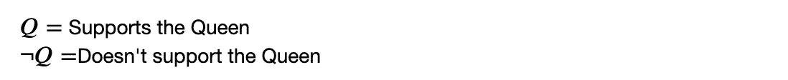
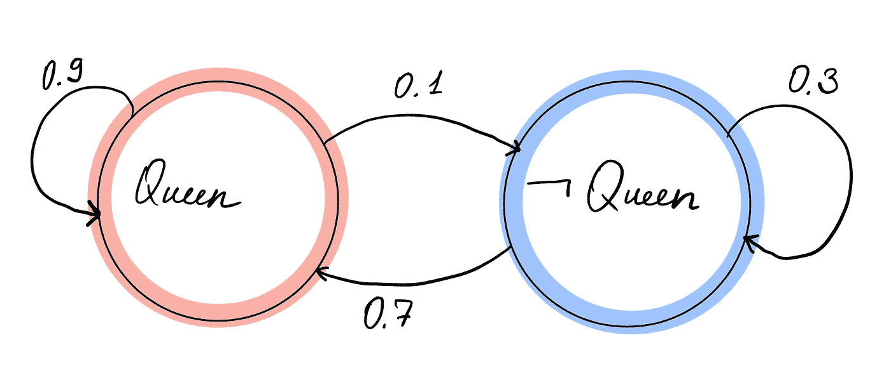
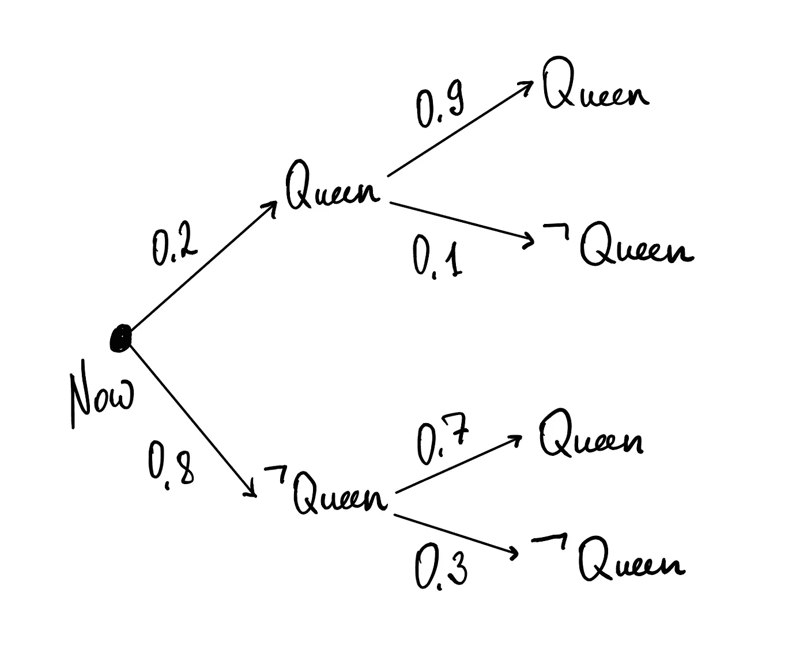
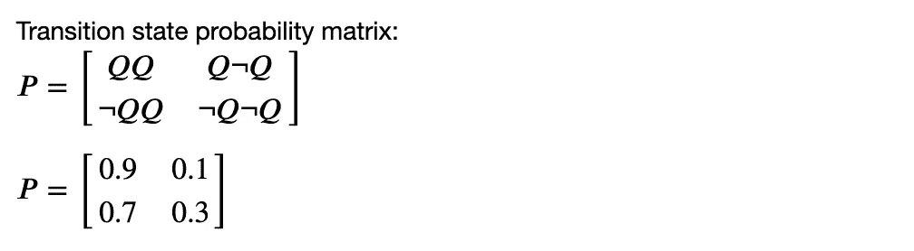
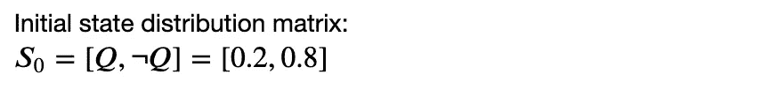
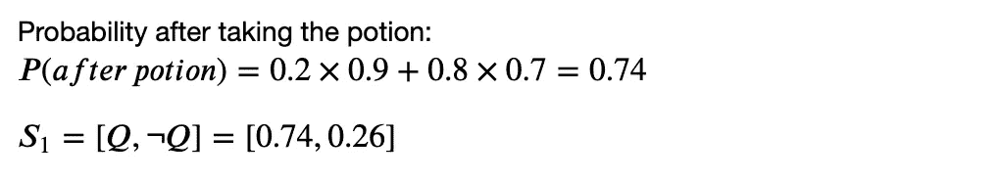

# 女巫、女王和马尔可夫链

> 原文：<https://towardsdatascience.com/the-witch-the-queen-and-the-markov-chain-55997163c6a?source=collection_archive---------44----------------------->

## 马尔可夫过程并不无聊。这太有趣了！

根据引用牛津词典的维基百科，马尔可夫链是描述一系列可能事件的随机模型，其中每个事件的概率仅取决于前一个事件达到的状态。人们可能会被这个定义吓倒，甚至更糟，感到无聊，但自从我开始发现数学和统计建模中的马尔可夫过程后，我除了乐趣什么也没有。在这篇文章中，我将尝试用一个例子来解释马尔可夫过程，并给出一些有趣的句子，这些句子是由使用马尔可夫链的自然语言生成器生成的。

## 一个说明这一过程的故事

很久很久以前，在一个神奇的王国里住着一位王后。她聪明、强大，但不受欢迎。她的王国很大，但只有 20%的人支持她和她的政治，80%的臣民不喜欢或支持女王。但是，正如我所说的，女王很聪明，所以她决定采取行动。她去了魔法森林，那里住着一个森林女巫，她能预知未来并配制药剂来改变它。王后带来了黄金和钻石，并对女巫说:“救救我，强大的女巫。只有 20%的受试者尊重和支持我。我需要一种能让更多人爱我的药水”。女巫一句话也没说，离开了房间，一小时后拿着药水回来了。她说“在这里。拿着这个，它会帮助你。我的水晶球告诉我，在你服用这种药剂后，90%的支持者会继续支持你，70%的不支持者会从现在开始支持你。”

根据女王的说法，情况看起来是这样的:



而且据女巫说，服用药剂后的情况会是这样的:



从这个图中，我们可以计算一个过渡态概率矩阵:



因为我们记得最初的情形是怎样的:



我们现在可以执行矩阵乘法来计算女王服用魔法药水后的追随者数量:



从只有 20%跃升到 74%……这个魔女配得上很多黄金！

## 简单的代码来玩文本

从上面的例子中我们可以看到，马尔可夫过程用于计算一个事件发生在另一个事件之后的概率。如果女巫有一个水晶球来告诉她在女王服用她的药剂后会发生什么，我们就有数学和代码来计算概率。这个过程非常有用，可以应用到很多东西上。马尔可夫过程的一个我最喜欢的应用是自然语言生成器。

当处理文本数据和使用高级 NLP 技术时，为什么不试着找点乐子呢？通过使用马尔可夫过程，模型可以在整个文本数据集上进行训练，并计算一个单词跟随另一个单词的概率。最简单的例子是短信中的建议:当你输入“我的”，它会提供“朋友”、“父母”、“狗”等。，因为这是我们自然语言的工作方式。NLG 的作品从不完美，这使得和他们一起工作很有趣。有时他们会给你有意义的建议，但有时不会，我个人觉得这很有趣。

以下是 NLG 根据丝芙兰网站的用户评论进行训练后得出的一些评论:

```
“AMAZING I originally purchased the Balance and Clarify set which contained a 2 step peel and I broke out”“The only thing it seemed to work because I’m self conscious of the work getting rid of it”“It smells like bad BO and I love the gel cream”“If your eyes it remove makeup i love it but the more expensive items in my midlate 20s normal skin”
```

这里有一些食谱(来自 BBC Food 和 Allrecipes 的食谱培训):

```
‘2 loins of lamb or mutton neck fillet, diced, 3 tbsp tomato purée, 1 tbsp dill seeds, 1 tsp sea salt, plus extra leaves to serve, salt and pepper’‘2 tbsp crème fraîche, 300g/10½ oz fettucine or tagliatelle, cooked according to packet instructions’‘200g/7oz white sweet potatoes, 12–10 inch flour tortillas, 9 ounces shredded Cheddar cheese’‘2 Japanese aubergine cut into very small florets, 1 garlic clove roughly chopped to garnish’
```

最后，看看泰勒·斯威夫特(Taylor Swift)歌词训练后写的一首歌:

```
Asking you to roll your eyes are like a best friend
 Are we in the dress cried the whole scene
 Im just a classroom
 Ill be usin for the first Old Fashioned we were dancing
 Didnt you flash your green eyes baby as the water rushes in The moon like a necklaceThe whole place was a masterpiece And I stare at the back door
 Cause you know you
 I hope you remember it all too well She said I doEnchanting to meet you where you first met me
 Im the one who makes you come in my head
 Oh never grow up just stay this simple
 Cause Im still trying to change your mind trying to know
```

代码非常简单。首先导入 Markovify 库和字符串进行预处理:

```
import markovify
import string
```

接下来，去掉文本中的所有标点符号，并将其应用于所有文本数据:

```
def no_punct(string):
 no_punct_string = re.sub(r’[^\w\s]’, ‘’, string)
 return no_punct_stringdf['Text'] = df.apply(lambda row: no_punct(row['Text']), axis=1)
```

训练模型:

```
text_model = markovify.NewlineText(df.Text, state_size = 2)
```

并生成文本:

```
for i in range(5):
 print(text_model.make_sentence())
```

资源:

[维基百科](https://en.wikipedia.org/wiki/Markov_chain)

[帕特里克杰姆特](https://www.youtube.com/watch?v=uvYTGEZQTEs)

[马克维奇](https://github.com/jsvine/markovify)